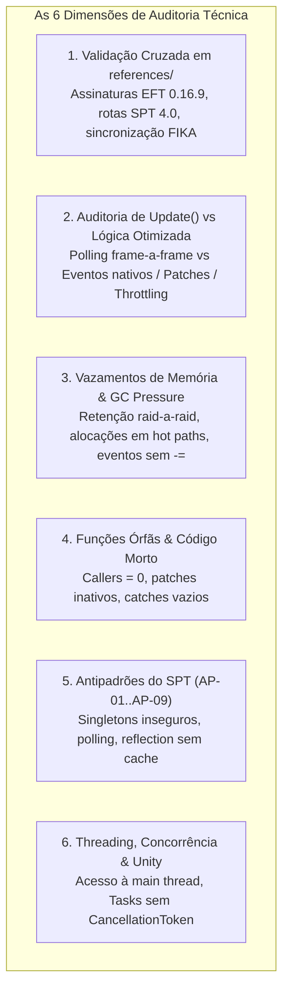
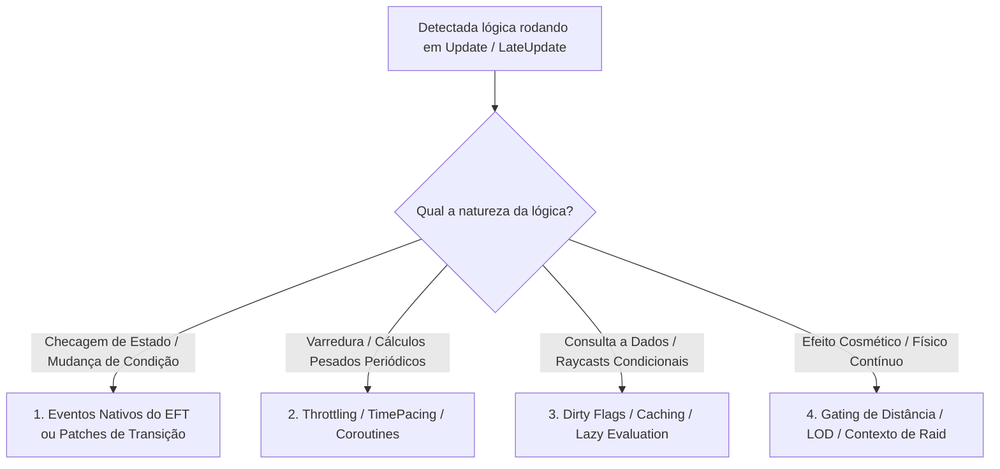

# /audit-mod-code

Executa uma **auditoria técnica estática profunda, rigorosa e minuciosa** de todo o código-fonte de um mod (classes, métodos, estruturas de dados, algoritmos e patches Harmony). Valida a integridade e conformidade cruzando obrigatoriamente as referências em `references/` (`eft-decompiled` / `Assembly-CSharp`, `spt-source` e `fika-*`), caça vazamentos de memória (RAM leaks / GC pressure), avalia a necessidade de rotinas rodando em `Update()`, identifica funções órfãs/código morto e emite um relatório técnico acionável com classificação de severidade, alternativas de melhor lógica e código de correção.

---

## Uso

```bash
/audit-mod-code <mod-ou-caminho> [--scope <subpasta>] [--target-ref <all|eft|spt|fika>] [--strict]
```

- `<mod-ou-caminho>` — Nome da pasta do mod em `mods/` (ex.: `ORBIT`, `VisceralCombat`, `TRL-ActionPOV`).
- `--scope <subpasta>` (Opcional) — Limita a auditoria a um submódulo específico (ex.: `--scope modded/Orbit/Looting`). Padrão: todo o código em `modded/` (ou `original/`).
- `--target-ref <all|eft|spt|fika>` (Opcional) — Foco das checagens cruzadas de referência (padrão: `all`).
- `--strict` (Opcional) — Ativa verificação com nível máximo de rigor contra tolerâncias de GC, polling em loops e suposições de singleplayer.

---

## Pré-condições

1. A pasta `mods/<NomeDoMod>/` deve existir com código-fonte (`.cs` client ou `.ts`/`.js` server).
2. As referências vendorizadas em `references/` devem estar acessíveis:
   - `references/eft-decompiled/` (e `types-index.json` para conferência de tipos/métodos do EFT).
   - `references/spt-source/` (servidor SPT 4.0).
   - `references/fika-plugin/` (`Fika.Core`), `references/fika-server/`, `references/fika-headless/` (suporte multiplayer coop).
3. Consultar [docs/technical/spt-antipatterns.md](file:///d:/Projetos/GITHUB%20TARKOV/tarkov-spt-4.0/docs/technical/spt-antipatterns.md) (AP-01 a AP-09).

---

## As 6 Dimensões Críticas de Auditoria



---

### Dimensão 1: Validação Cruzada contra `references/`

Para cada classe, método chamado e patch Harmony do mod, cruzar obrigatoriamente com as referências canônicas:

1. **EFT Decompiled (`references/eft-decompiled/` / `Assembly-CSharp`):**
   - **Assinaturas de Patches:** Verificar se a classe-alvo (`[HarmonyPatch(typeof(X), nameof(X.Method))]`) e seus tipos de argumentos existem no EFT `0.16.9` / SPT `4.0.13`.
   - **Tipos Obfuscados:** Consultar `references/eft-decompiled/types-index.json` para confirmar equivalências (`GClass...` vs nomes de domínio).
   - **Comportamento Original:** Inspecionar o corpo do método descompilado para garantir que um `Prefix` que retorna `false` não quebre lógicas internas vitais do EFT (ex.: registro de eventos de áudio, cálculos de balística, chamadas de animação).
2. **Servidor SPT (`references/spt-source/`):**
   - Verificar se rotas HTTP/WebSocket, handlers de pacotes e chamadas ao banco de dados (`tables.templates.items`, `locales`, etc.) seguem a arquitetura do SPT 4.0.
3. **FIKA Coop (`references/fika-plugin/` - `Fika.Core`, `fika-server/`):**
   - **Detecção de Suposições "Singleplayer-Only":**
     - O código usa `Camera.main` sem checar se a câmera ativa pertence ao jogador local ou a um espectador?
     - O código assume `Singleton<GameWorld>.Instance.MainPlayer` sem iterar sobre outros jogadores remotos no coop?
     - Ações que alteram estado de inventário ou mundo emitem pacotes de sincronização (`Fika.Core.Networking`) ou quebram a sincronia com outros jogadores?

---

### Dimensão 2: Auditoria de Necessidade de `Update()` vs Arquitetura Reativa Otimizada

> **Regra de Ouro:** A auditoria deve avaliar criteriosamente se uma lógica executada a cada frame em `Update()`, `LateUpdate()` ou `FixedUpdate()` é estritamente necessária nessa frequência ou se pode ser substituída por uma abordagem mais inteligente e otimizada **sem perder a funcionalidade proposta**.



#### Matriz de Soluções Otimizadas:

| Abordagem Atual em `Update()` | Diagnóstico da Auditoria | Solução Alternativa Recomendada | Ganho Técnico |
|---|---|---|---|
| **Polling de Mudança de Estado**<br>(Ex.: Checar a cada frame se o player trocou de arma, se mirou, se a vida mudou, se abriu porta) | Ineficiente. Gasta 60 a 144 execuções/segundo verificando uma variável que raramente muda. | **Arquitetura Orientada a Eventos / Harmony Postfix:**<br>Substituir por inscrição em eventos nativos (`Player.OnHandsControllerChanged`, `HealthController.ApplyDamage`, etc.) ou aplicar um patch cirúrgico no método que altera o estado. | Redução de 99% de overhead de CPU. Zero chamadas no frame. |
| **Cálculo Periódico sem Urgência de Frame**<br>(Ex.: Checar bots próximos, escanear corpos, recalcular rotas, verificar inventário) | Desperdício de ciclos de renderização com lógica que não afeta a interpolação visual do frame. | **Cadência Controlada (Throttling / TimePacing):**<br>Executar em intervalos controlados (ex.: a cada `0.2s`, `0.5s` via `TimePacing` ou Coroutine `WaitForSeconds`), mantendo a exata percepção para o jogador. | Queda de 90% a 95% no consumo de CPU da rotina. |
| **Consultas e Raycasts Repetitivos**<br>(Ex.: Raycasts de visibilidade, varredura de contêineres, transformações geométricas) | Execução redundante de operações caras de física e busca. | **Dirty Flags & Caching:**<br>Armazenar o último resultado em cache e só recalcular quando um gatilho relevante for ativado (`_isDirty = true`). | Elimina raycasts e chamadas desnecessárias no NavMesh/Física. |
| **Lógica Ativa Fora de Contexto**<br>(Ex.: Rodando nos menus, em tela de carregamento ou para bots distantes a 400m) | Falta de controle de ciclo de vida e LOD. | **Gating Condicional & LOD:**<br>Desativar o script quando fora de raid (`GameWorld == null`), quando o player estiver morto ou usar distância de corte (*Degraded Tickrate*). | Previne NREs em transições e economiza CPU com entidades distantes. |

---

### Dimensão 3: Vazamentos de Memória (RAM Leaks) e Pressão de GC

Varre sistematicamente o código procurando padrões de retenção não liberada e alocações de Heap:

1. **Retenção de Ciclo de Vida de Raid (Raid Lifecycle Leaks):**
   - **Eventos:** Toda inscrição com `+=` (`SettingChanged`, `OnGameStarted`, `OnDoorStateChanged`, eventos de inventário) possui o correspondente `-=` no teardown (`OnDestroy` / `OnGameEnded`)?
   - **Campos Estáticos:** Coleções estáticas (`static List<...>`, `static Dictionary<...>`) acumulam instâncias de `BotOwner`, `Player`, `GameObject`, `Item` ou `Transform` sem serem limpas com `.Clear()` ao final da partida?
   - **Coroutines & Tasks:** Há coroutines iniciadas sem `StopCoroutine()` ou `Task.Run`/Tasks assíncronas sem `CancellationToken` amarrado ao ciclo de vida da raid?
2. **Alocações em Loops Quentes (Hot Paths):**
   - Inspecione métodos chamados com alta frequência (`Update()`, ticks de IA, callbacks de física):
     - Há `new List<...>()`, `new Dictionary<...>()` ou `new Vector3[]` sendo instanciados no corpo do método em vez de reutilizar buffers/coleções estáticas recicladas?
     - Há uso de **LINQ** (`.Where()`, `.Select()`, `.ToList()`, `.FirstOrDefault()`) em hot paths? (LINQ aloca iteradores e closures no Heap, gerando pressão massiva no Garbage Collector).
     - Há interpolação contínua de strings ou `string.Format` em métodos executados a cada frame?
     - Há *boxing* desnecessário de structs (`Vector3`, enums, `int`) passados como `object`?
3. **Recursos Nativos e Unity:**
   - Instanciação dinâmica de materiais (`renderer.material` cria uma cópia nova no Heap a cada chamada — usar `renderer.sharedMaterial` ou `MaterialPropertyBlock`).
   - Texturas, Meshes dinâmicas e `AssetBundle` sem o devido `Destroy()` ou `Unload(true)`.

---

### Dimensão 4: Funções Órfãs, Código Morto e Lógicas Incompletas

1. **Métodos e Campos Órfãos:** Métodos privados/internos sem nenhum chamador no grafo do projeto.
2. **Patches Inativos/Mortos:** Patches Harmony cujo método-alvo não é mais invocado pelo fluxo do EFT 0.16.9.
3. **Tratamento de Exceção Silencioso:** Blocos `try { ... } catch { }` vazios que engolem exceções sem log, mascarando falhas críticas de estado ou `NullReferenceException`.
4. **Variáveis e Branches Mortos:** Cálculos caros cujos resultados são descartados sem uso, ou condições `if (false)` / flags estáticas inalcançáveis.

---

### Dimensão 5: Conformidade com Antipadrões do SPT

Verificação sistemática contra a base [docs/technical/spt-antipatterns.md](file:///d:/Projetos/GITHUB%20TARKOV/tarkov-spt-4.0/docs/technical/spt-antipatterns.md):

- **AP-01:** Falta de teardown entre raids.
- **AP-02:** Acesso não defensivo a Singletons (`Singleton<GameWorld>.Instance` sem validação de nulo).
- **AP-03:** Polling manual em `Update()` para checar estados que possuem eventos nativos do EFT.
- **AP-04:** Uso de Reflection em hot paths sem cache prévio de `MethodInfo` / `FieldInfo` / `PropertyInfo`.
- **AP-05:** Caminhos absolutos hardcoded.
- **AP-07:** Incompatibilidade entre padrões arquiteturais do SPT 3.x e SPT 4.0.

---

### Dimensão 6: Threading e Segurança de Execução

- **Main Thread Safety:** Garantir que nenhuma thread secundária (`Task.Run`, `Thread`, `BackgroundWorker`) tente instanciar `UnityEngine.Object`, chamar `GameObject.GetComponent` ou acessar APIs do Unity sem despachar para a main thread.

---

## Estrutura do Relatório de Auditoria

O relatório gerado deve ser salvo em:
`mods/<NomeDoMod>/docs/relatorio-auditoria-codigo-NN.md` (onde `NN` é incremental, ex.: `01`).

### Formato Obrigatório do Relatório:

```markdown
---
title: "Relatório de Auditoria Técnica de Código — NomeDoMod (Review NN)"
date: YYYY-MM-DD
status: 🟢 Vivo
authors: Antigravity
---

# Relatório de Auditoria Técnica de Código — NomeDoMod (Review NN)

## 1. Resumo Executivo da Auditoria

| Severidade | Quantidade | Descrição |
|---|---|---|
| 🔴 **Crítico** | N | Crashes, corrupção de save, memory leak massivo descontrolado |
| 🟠 **Alto** | N | Leaks entre raids, patches quebrados contra EFT 0.16.9, quebra de coop FIKA |
| 🟡 **Médio** | N | Polling desnecessário em Update, pressão de GC, reflection sem cache |
| 🔵 **Baixo** | N | Melhorias de tipagem, manutenibilidade, comentários desatualizados |
| 💡 **Otimização** | N | Propostas de arquitetura reativa, pooling e eliminação de polling |

---

## 2. Tabela de Achados

| ID | Severidade | Arquivo / Linha | Categoria | Descrição Resumida |
|---|---|---|---|---|
| `AUD-NN-01` | 🔴 Crítico | `Caminho/Arquivo.cs:L45` | Memory Leak | Evento sem unsubscribe retém GameWorld entre raids |
| `AUD-NN-02` | 🟡 Médio | `Caminho/Laser.cs:L80` | Polling em Update | Checagem de mira rodando a 144 FPS em vez de evento |
| `AUD-NN-03` | 🟡 Médio | `Caminho/Outro.cs:L120` | GC Pressure | `new List` e LINQ dentro de `Update()` a cada frame |

---

## 3. Detalhamento dos Achados

### AUD-NN-01 · [Título Resumido do Problema]
- **Severidade:** 🔴 Crítico / 🟠 Alto / 🟡 Médio / 🔵 Baixo / 💡 Otimização
- **Localização no Mod:** [Arquivo.cs:L45](file:///d:/Projetos/GITHUB%20TARKOV/tarkov-spt-4.0/mods/<Mod>/modded/Caminho/Arquivo.cs#L45)
- **Referência Cruzada:** [Assembly-CSharp/ClasseAlvo.cs:L120](file:///d:/Projetos/GITHUB%20TARKOV/tarkov-spt-4.0/references/eft-decompiled/Assembly-CSharp/ClasseAlvo.cs#L120)
- **Causa Raiz:** [Explicação técnica detalhada do porquê o código atual falha ou gera problema.]
- **Impacto Técnico Real:** [Ex.: Vazamento de 80MB por raid no Fika Headless / Queda de 12 FPS por micro-travamentos de GC.]
- **Alternativa de Melhor Lógica / Proposta de Correção:**
  - *Abordagem Atual:* [Ex.: Polling contínuo no Update a 144 FPS]
  - *Abordagem Otimizada:* [Ex.: Inscrição no evento `Player.OnAimChanged` ou Throttling de 0.2s]
  - *Código Refatorado:*

```csharp
// Código refatorado demonstrando a solução viável e otimizada
```

---

## 4. Plano de Ação e Recomendações

1. Priorizar a resolução imediata dos itens 🔴 e 🟠.
2. Migrar rotinas de polling identificadas em 🟡 para arquitetura de eventos nativos ou cadência controlada.
3. Aplicar refatorações de zero-alloc e GC pooling.
```

---

## Validação Automática

Após gerar o relatório, valide os cabeçalhos executando:
```bash
bash .agents/hooks/validate-doc-header.sh mods/<NomeDoMod>/docs/relatorio-auditoria-codigo-NN.md
```
