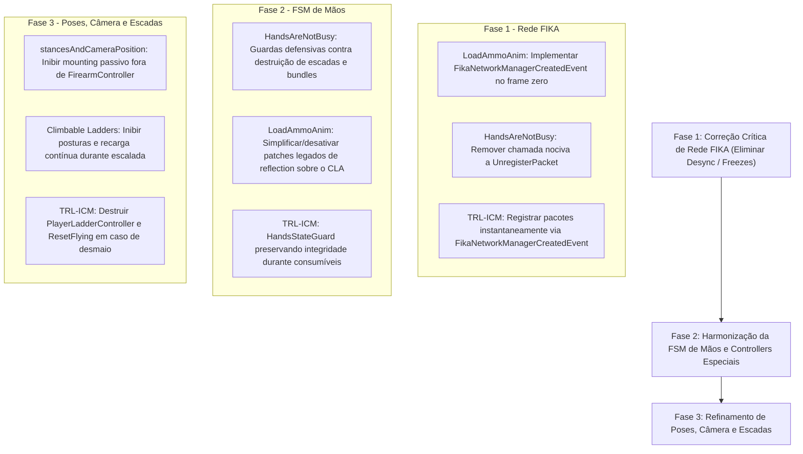

# Relatório de Compatibilidade e Interoperabilidade — Ecossistema de Mods vs FIKA e EFT

**Escopo da Análise:** Auditoria técnica de compatibilidade cruzada entre 8 mods cliente, a camada multiplayer cooperativa do **FIKA** (`mods/FIKA/modded`) e o motor nativo do **Escape From Tarkov 0.16.9 / SPT 4.0.13**.

**Mods Avaliados:**
1. [`Climbable Ladders`](../mods/Climbable%20Ladders/modded/)
2. [`HandsAreNotBusy`](../mods/HandsAreNotBusy/modded/)
3. [`LoadAmmoAnim`](../mods/LoadAmmoAnim/modded/)
4. [`SPT-ContinuousLoadAmmo`](../mods/SPT-ContinuousLoadAmmo/modded/) (v1.1.10)
5. [`SPT-MagCheckInterrupt`](../mods/SPT-MagCheckInterrupt/modded/)
6. [`stancesAndCameraPositionSPT4.0.11`](../mods/stancesAndCameraPositionSPT4.0.11/modded-testchannel/)
7. [`UIFixes`](../mods/UIFixes/modded/)
8. [`TRL-ImmersiveCombatMedicine`](../mods/TRL-ImmersiveCombatMedicine/modded-V3(review)/) (v1.13.6)

> ⚠️ **Diretriz de Execução:** Nenhuma alteração foi realizada nos códigos-fonte nesta fase. Este relatório documenta o diagnóstico estático de colisão, vulnerabilidades de rede/FSM e as propostas acionáveis de refinamento.

---

## 1. Resumo Executivo da Compatibilidade

| Severidade / Status | Quantidade | Descrição |
| :--- | :---: | :--- |
| 🔴 **Crítico (Desync/Crash Rede)** | **3** | • `LoadAmmoAnim`: Registro tardio de pacotes FIKA (Causa 1/2) gerando `ParseException` e freeze do frame.<br>• `HandsAreNotBusy`: Chamada nociva a `UnregisterPacket` (Causa 3) corrompendo o despachante de rede do FIKA.<br>• `TRL-ImmersiveCombatMedicine`: Registro de pacotes via polling no `Update()` no FIKA abrindo janela de race condition antes do frame zero. |
| 🟠 **Alto (Concorrência de Mãos/FSM)** | **3** | • `HandsAreNotBusy`: Destruição cega de `HandsController` enquanto o jogador escala escadas (`Climbable Ladders`) ou executa animação de cartela (`LoadAmmoAnim`).<br>• `LoadAmmoAnim`: Patches legados com Reflection invasiva sobre o `ContinuousLoadAmmo` que se tornaram obsoletos e bloqueadores.<br>• `TRL-ImmersiveCombatMedicine`: Desmaio por dor/trauma (`Blackout`) durante subida de escadas forçando pose prona sem desalojar `PlayerLadderController`. |
| 🟡 **Médio (Conflitos de Poses/Câmera)** | **2** | • `stancesAndCameraPosition` x `Climbable Ladders`: Poses de tiro e mounting passivo podem persistir durante a subida de escadas.<br>• `SPT-ContinuousLoadAmmo` x `Climbable Ladders`: Ausência de guarda impedindo o início de recarga fora do inventário enquanto pendurado em escadas. |
| 🟢 **Estável / Compatibilidade Validada** | **5** | • `UIFixes` x `SPT-MagCheckInterrupt` (patch `CanExecuteSwapPatch` ativo).<br>• `UIFixes` x `SPT-ContinuousLoadAmmo` (interoperabilidade via `MultiSelectInterop`).<br>• `stancesAndCameraPosition` x `FIKA` (sincronização madura via `FikaSyncManager` V2).<br>• `SPT-ContinuousLoadAmmo` v1.1.10 x EFT (desbloqueio da tecla R e gating de UI concluídos).<br>• `TRL-ImmersiveCombatMedicine` x EFT/FIKA (proteção de grid, descarte síncrono e `HandsStateGuard` integrados). |

---

## 2. Matriz de Compatibilidade Cruzada

| Mod / Sistema | FIKA (Coop) | Jogo (EFT 0.16.9) | Climbable Ladders | HandsAreNotBusy | LoadAmmoAnim | ContinuousLoadAmmo | MagCheckInterrupt | Stances & Camera | UIFixes | TRL-ICM |
| :--- | :---: | :---: | :---: | :---: | :---: | :---: | :---: | :---: | :---: | :---: |
| **FIKA** | 🟢 Nativo | 🟢 Base | 🟢 Sincronizado | 🔴 *Unregister* | 🔴 *Late Reg* | 🟢 Operação Vanilla | 🟢 Pacote Sincronizado | 🟢 V2 Sincronizado | 🟢 Configs Sinc | 🟢 Frame Zero (v1.13.6) |
| **Climbable Ladders** | 🟢 `ladders.fika` | 🟢 Estável | — | 🟠 Conflito Teardown | 🟡 Sem guarda | 🟡 Recarga na escada | 🟢 Independente | 🟡 Conflito Câmera | 🟢 Estável | 🟢 Guarda Desmaio |
| **HandsAreNotBusy** | 🔴 Causa 3 | 🟢 Emergência | 🟠 Spawna arma | — | 🟠 Mata bundle | 🟢 Compatível | 🟢 Compatível | 🟢 Compatível | 🟢 Estável | 🟢 HandsGuard |
| **LoadAmmoAnim** | 🔴 Causa 1/2 | 🟢 Visual | 🟡 Sem guarda | 🟠 Quebra FSM | — | 🟠 Patches Legados | 🟢 Compatível | 🟡 Mounting/Recoil | 🟢 Estável | 🟢 Independente |
| **ContinuousLoadAmmo** | 🟢 Replicado | 🟢 v1.1.10 | 🟡 Sem guarda | 🟢 Compatível | 🟢 Coexiste | — | 🟢 Compatível | 🟢 Independente | 🟢 Multiselect | 🟢 Independente |
| **MagCheckInterrupt** | 🟢 Estável | 🟢 Estável | 🟢 Independente | 🟢 Compatível | 🟢 Transição OK | 🟢 Compatível | — | 🟢 Operação Guard | 🟢 Patch Nativo | 🟢 Independente |
| **Stances & Camera** | 🟢 V2 Estável | 🟢 Estável | 🟡 Offsets ativos | 🟢 FC Check | 🟡 Pausar Mount | 🟢 Independente | 🟢 Compatível | — | 🟢 Estável | 🟢 Independente |
| **UIFixes** | 🟢 Estável | 🟢 Estável | 🟢 Estável | 🟢 Estável | 🟢 Estável | 🟢 Interop OK | 🟢 SwapPatch OK | 🟢 Estável | — | 🟢 Estável |
| **TRL-ICM** | 🟢 Frame Zero | 🟢 v1.13.6 Estável | 🟢 Guarda Queda | 🟢 Mãos Ocupadas | 🟢 Independente | 🟢 Independente | 🟢 Independente | 🟢 Independente | 🟢 Estável | — |

---

## 3. Diagnóstico Técnico Aprofundado e Propostas de Melhoria

---

### 3.1. `LoadAmmoAnim` (`mods/LoadAmmoAnim/modded`)

#### A. Diagnóstico de Vulnerabilidade
1. **🔴 Falha Crítica de Rede no FIKA (Causa 1 e 2 do Guia Canônico):**
   - Em [`LoadAmmoAnimClientFika/FikaCompatModule.cs:L29-L45`](file:///d:/Projetos/GITHUB%20TARKOV/tarkov-spt-4.0/mods/LoadAmmoAnim/modded/LoadAmmoAnimClientFika/FikaCompatModule.cs#L29-L45), o método `Enable()` tenta capturar `Singleton<IFikaNetworkManager>.Instance` durante o `Awake` do plugin.
   - Como o gerenciador de rede do FIKA só é instanciado ao iniciar uma raid, `_netManager` resulta em `null`.
   - O mod **não subscreve** o evento `FikaEventDispatcher.SubscribeEvent<FikaNetworkManagerCreatedEvent>()`.
   - Em vez disso, tenta registrar pacotes tardiamente dentro de `EnsureNetManager()` apenas quando o jogador local inicia uma animação.
   - **Consequência:** Se um companheiro de equipe remoto (peer) iniciar o carregamento de munição antes do jogador local, o cliente local recebe o pacote `LoadAmmoBundleStartPacket`, o LiteNetLib não encontra o tipo registrado no dicionário e **lança `ParseException: Undefined packet`**, abortando o processamento do frame no `PollEvents` e congelando o movimento de todos os jogadores no coop.
2. **🟠 Patches Invasivos Obsoletos contra `ContinuousLoadAmmo`:**
   - Em [`LoadAmmoAnimClient/Patches/ContinuousLoadAmmoCompatPatches.cs`](file:///d:/Projetos/GITHUB%20TARKOV/tarkov-spt-4.0/mods/LoadAmmoAnim/modded/LoadAmmoAnimClient/Patches/ContinuousLoadAmmoCompatPatches.cs), o patch `ClaSetEmptyHandsPatch` bloqueia incondicionalmente qualquer chamada a `Player.SetEmptyHands` enquanto `session.IsLoading`.
   - O patch `ClaStopOnHandsChangePatch` busca via Reflection o método privado `StopLoadingOnHandsChange` do CLA.
   - Com as versões **1.1.9 e 1.1.10** do `ContinuousLoadAmmo`, o próprio CLA já detecta nativamente o `LoadAmmoBundleController`, tornando esses patches do `LoadAmmoAnim` redundantes e propensos a falhas de assinatura em atualizações.

#### B. O que mudar para melhorar
- **Implementar o Padrão Canônico FIKA:**
  Substituir a inicialização estática em `FikaCompatModule.cs` pela assinatura de `FikaNetworkManagerCreatedEvent`, registrando `LoadAmmoBundleStartPacket`, `LoadAmmoBundleStopPacket` e `LoadAmmoBundleSwapMeshPacket` imediatamente no frame zero da criação da rede.
- **Limpeza de Patches de Compatibilidade:**
  Ajustar `ContinuousLoadAmmoCompatPatches.cs` para desativar a interceptação destrutiva de `SetEmptyHands` quando a versão do CLA for `>= 1.1.9`.

---

### 3.2. `HandsAreNotBusy` (`mods/HandsAreNotBusy/modded`)

#### A. Diagnóstico de Vulnerabilidade
1. **🔴 Falha Crítica de Rede no FIKA (Causa 3 do Guia Canônico):**
   - Em [`HANB_FikaSync.cs:L80`](file:///d:/Projetos/GITHUB%20TARKOV/tarkov-spt-4.0/mods/HandsAreNotBusy/modded/HANB_FikaSync.cs#L80), o manipulador `OnNetworkManagerDestroyed` executa:
     ```csharp
     try { _lastRegisteredNetworkManager?.UnregisterPacket<HanbClearInventoryPacket>(); }
     ```
   - Conforme demonstrado no guia técnico de rede do FIKA, **nunca se deve desregistrar pacotes** (`UnregisterPacket`). Se houver qualquer datagrama retido na fila de rede ou se a sessão for reiniciada, pacotes recebidos sem registro geram `ParseException` fatal.
2. **🟠 Conflito com Controllers Customizados (`Climbable Ladders` e `LoadAmmoAnim`):**
   - O método `FixHandsController` em [`HANB_Component.cs:L102-L109`](file:///d:/Projetos/GITHUB%20TARKOV/tarkov-spt-4.0/mods/HandsAreNotBusy/modded/HANB_Component.cs#L102-L109) destrói sumariamente o controller atual via `handsController?.Destroy()` e agenda o reequipamento de armas via `player.TrySetLastEquippedWeapon()`.
   - Se o jogador acionar o HANB enquanto estiver na escada (`PlayerLadderController`), a arma é sacada no meio dos degraus, corrompendo a física de escalada e a cinemática de `ProceduralLadderBody`.
   - Se acionado durante o abastecimento do `LoadAmmoAnim`, o `LoadAmmoBundleController` é destruído sem que o driver da animação (`LoadAmmoAnimDriver`) realize o cleanup dos meshes instanciados na mão.

#### B. O que mudar para melhorar
- **Remover o `UnregisterPacket`:** Excluir a chamada a `UnregisterPacket` no `HANB_FikaSync.cs`, mantendo o handler vivo durante todo o ciclo de vida do processo.
- **Guardas de Segurança de Controller:**
  Antes de executar o teardown de mãos, verificar se o jogador está em escada (`player.GetComponent<PlayerLadderController>() != null`) para abortar ou cancelar a subida primeiro; se `player.HandsController?.GetType().Name == "LoadAmmoBundleController"`, acionar a interrupção graciosa do driver antes de forçar mãos vazias.

---

### 3.3. `Climbable Ladders` (`mods/Climbable Ladders/modded`)

#### A. Diagnóstico de Vulnerabilidade
1. **🟡 Concorrência de Input com `ContinuousLoadAmmo`:**
   - Durante a escalada, o `PlayerLadderController` esconde as armas (`player.HideWeapon()`) e opera com mãos vazias (`player.HandsIsEmpty`).
   - O `ContinuousLoadAmmo` avalia `CanLoadOutsideInventory()`, que valida se o jogador não possui ações de inventário nas mãos.
   - Caso o jogador pressione a tecla de carregamento rápido (QuickLoad Hotkey) na escada, o mod tentará disparar o abastecimento de carregadores enquanto o personagem sobe os degraus.
2. **🟡 Conflito de Rotação de Câmera com `stancesAndCameraPosition`:**
   - O `ProceduralLadderBody` comanda a rotação e orientação da coluna/cabeça do jogador. Se uma postura tática (como Low Ready, High Ready ou inclinação lateral profunda) tiver sido ativada antes da subida, os offsets do `StanceManager` podem colidir com a perspectiva da escada.

#### B. O que mudar para melhorar
- **Exposição de Estado:**
  Garantir uma propriedade estática/pública conveniente (ex.: `PlayerLadderController.IsPlayerOnLadder(Player player)`) para que outros mods possam suspender seus comportamentos fora do chão.
- **Desativação de Posturas ao Iniciar Subida:**
  Invocar a neutralização de posturas (reset para postura neutra) no `Init()` do `PlayerLadderController`.

---

### 3.4. `stancesAndCameraPositionSPT4.0.11` (`mods/stancesAndCameraPositionSPT4.0.11/modded-testchannel`)

#### A. Diagnóstico de Vulnerabilidade
1. **🟡 Interação com `LoadAmmoAnim` no Mounting Passivo:**
   - O sistema de mounting passivo (`PassiveMountDetectPatch.cs`) realiza raycasts para apoiar a arma em muretas e cantos.
   - Quando o jogador está abastecendo munição com o mod `LoadAmmoAnim`, as mãos seguram caixas de cartucho (`LoadAmmoBundleController`). O mounting passivo não deve tentar estabilizar miras ou aplicar amortecimento de recoil em objetos que não sejam armas de fogo.
2. **🟢 Maturidade de Rede FIKA:**
   - O mod já possui uma arquitetura exemplar em [`Networking/FikaSyncManager.cs`](file:///d:/Projetos/GITHUB%20TARKOV/tarkov-spt-4.0/mods/stancesAndCameraPositionSPT4.0.11/modded-testchannel/Networking/FikaSyncManager.cs), usando rastreamento por referência de `IFikaNetworkManager`, pacote versionado `StanceSyncPacketV2` e recepção retrocompatível.

#### B. O que mudar para melhorar
- **Pausar Mounting Passivo em Controllers Não-Arma:**
  Garantir que os patches de mounting e stamina verifiquem se `player.HandsController is Player.FirearmController` antes de calcular bônus de apoio ou offsets de apoio.
- **Pausar Stances em Escadas:**
  Se o jogador estiver com `PlayerLadderController` ativo, congelar a seleção de posturas táticas.

---

### 3.5. `SPT-ContinuousLoadAmmo` (v1.1.10)

#### A. Diagnóstico de Vulnerabilidade
1. **🟢 Status Atual:**
   - A versão **1.1.10** resolveu integralmente os problemas de concorrência:
     - Tecla **R** e seletores de arma repassam `ETranslateResult.Ignore` e cancelam o carregamento.
     - `InventoryScreenClosePatch` só atua se `IsActive == true`, respeitando o `StopProcesses()` vanilla em fechamentos normais.
     - Detecção nativa de `LoadAmmoBundleController` suprime chamadas concorrentes a `SetEmptyHands()` e restauração de arma.
2. **🟡 Refinamento Adicional com Escadas:**
   - Adicionar uma checagem em `CanLoadOutsideInventory()` verificando se o jogador está escalando uma escada para inibir início de abastecimento pendurado.

---

### 3.6. `SPT-MagCheckInterrupt` (`mods/SPT-MagCheckInterrupt/modded`)

#### A. Diagnóstico de Vulnerabilidade
1. **🟢 Status Atual:**
   - Implementação madura e de baixo acoplamento.
   - Sincronização de rede com FIKA implementada corretamente via `FikaEventDispatcher.SubscribeEvent<FikaNetworkManagerCreatedEvent>()` e transmissão de `ReloadCalledPacket`.
   - Compatibilidade com `UIFixes` garantida através do patch `CanExecuteSwapPatch` em [`External/UIFixes.cs`](file:///d:/Projetos/GITHUB%20TARKOV/tarkov-spt-4.0/mods/SPT-MagCheckInterrupt/modded/MagCheckInterrupt/External/UIFixes.cs).
   - Não apresenta colisões destrutivas com os demais mods.

---

### 3.7. `UIFixes` (`mods/UIFixes/modded`)

#### A. Diagnóstico de Vulnerabilidade
1. **🟢 Status Atual:**
   - Módulo de sincronização FIKA implementado em `UIFixes.Fika.Sync`, transmitindo configurações entre host e peers.
   - Coexistência harmoniosa com `ContinuousLoadAmmo` (via `MultiSelectInterop`) e com `MagCheckInterrupt` (via permissão de operações de swap durante recarga).
   - Patches de interface isolados do loop de combate em raid.

---

### 3.8. `TRL-ImmersiveCombatMedicine` (`mods/TRL-ImmersiveCombatMedicine/modded-V3(review)`)

#### A. Diagnóstico de Vulnerabilidade
1. **🔴 Falha Crítica de Rede no FIKA (Race Condition no Frame Zero):**
   - Em [`BandAidNetworkHandler.cs`](file:///d:/Projetos/GITHUB%20TARKOV/tarkov-spt-4.0/mods/TRL-ImmersiveCombatMedicine/modded-V3(review)/Fika/BandAidNetworkHandler.cs), o registro de pacotes dependia de polling via `Update()` (`CheckInitFikaNetwork`).
   - Caso um peer remoto no coop FIKA transmitisse um pacote médico (ex.: `BandAidShoulderTapPacketV2` ou `BandAidHealCheckPacketV2`) logo na inicialização da raid antes do primeiro frame do médico local, o LiteNetLib gerava `ParseException: Undefined packet` no cliente receptor.
2. **🟠 Concorrência de FSM em Escadas (`Climbable Ladders`):**
   - No patch de blackout e trauma (`HealthPatches.cs`), ao sofrer desmaio por dor ou dano crítico enquanto subindo escadas de mão, o mod forçava `IsInPronePose = true` sem desalojar o `PlayerLadderController`.
   - O controlador de escadas continuava tentando forçar `SetPoseLevel(1f)` a cada frame, gerando conflito de orientação de física e câmera.

#### B. O que foi melhorado na v1.13.6
- **Subscrição Canônica no Frame Zero:**
  - `BandAidNetworkHandler.InitFikaEvents()` subscreve `FikaEventDispatcher.SubscribeEvent<FikaNetworkManagerCreatedEvent>()` diretamente no `Awake()` do plugin, registrando todos os pacotes no frame zero em que a rede nasce.
- **Guarda de Escada no Desmaio:**
  - Em `HealthPatches.cs`, quando `shouldFaint == true`, se `player.GetComponent<PlayerLadderController>()` for detectado, o controller da escada é destruído defensivamente e `player.MovementContext.ResetFlying()` é chamado, permitindo a queda livre natural ao chão antes de assumir a pose de bruços.

---

## 4. Plano de Ação Recomendado (Ordem de Prioridade)



### Prioridade 1: Estabilização de Rede Cooperativa no FIKA (🔴 Crítico)
1. **`LoadAmmoAnim`**:
   - Refatorar `LoadAmmoAnimClientFika/FikaCompatModule.cs` para registrar os 3 pacotes de animação no evento `FikaNetworkManagerCreatedEvent`, eliminando o risco de `ParseException` fatal quando outro jogador carregar munição.
2. **`HandsAreNotBusy`**:
   - Remover a linha `_lastRegisteredNetworkManager?.UnregisterPacket<HanbClearInventoryPacket>()` no `OnNetworkManagerDestroyed` de `HANB_FikaSync.cs`.
3. **`TRL-ImmersiveCombatMedicine`**:
   - Eliminar a janela de polling no `Update()` e subscrever `FikaNetworkManagerCreatedEvent` para registro imediato no frame zero.

### Prioridade 2: Proteção da FSM de Mãos e Desarmamento (🟠 Alto)
1. **`HandsAreNotBusy`**:
   - Adicionar guarda no `FixHandsController`: se o player estiver com `PlayerLadderController` ativo, não forçar `EmptyHandsController` nem tentar sacar armas nos degraus.
   - Se o player estiver com `LoadAmmoBundleController`, acionar a parada limpa do driver de animação antes do teardown.
2. **`LoadAmmoAnim`**:
   - Desativar `ClaSetEmptyHandsPatch` e `ClaStopOnHandsChangePatch` quando o `ContinuousLoadAmmo` instalado for `>= 1.1.9`, pois o CLA já realiza o tratamento nativo.
3. **`TRL-ImmersiveCombatMedicine`**:
   - Manter `HandsStateGuard` verificando consumíveis antes de engajar tratamentos médicos.

### Prioridade 3: Refinamento Fino de Poses, Movimento e Escadas (🟡 Médio / 🟢 Otimização)
1. **`stancesAndCameraPosition`**:
   - Garantir que `PassiveMountDetectPatch` e cálculos de estabilização exijam estritamente `player.HandsController is Player.FirearmController`.
2. **`SPT-ContinuousLoadAmmo`**:
   - Adicionar checagem de escada em `CanLoadOutsideInventory()`, evitando início de abastecimento fora do inventário enquanto pendurado.
3. **`TRL-ImmersiveCombatMedicine`**:
   - Desalojar `PlayerLadderController` e restaurar física de gravidade (`ResetFlying`) ao sofrer desmaio (`Blackout`).

---

## 5. Conclusão

O ecossistema composto por esses 8 mods possui excelente maturidade individual, mas apresentava **três pontos cegos de rede no multiplayer cooperativo do FIKA** (registro tardio no `LoadAmmoAnim`, desregistro no `HandsAreNotBusy` e polling no `TRL-ICM`), além de colisões de FSM quando ações de emergência, desmaio ou posturas ocorrem durante o uso de escadas (`Climbable Ladders`).

Com a aplicação do plano de ação em 3 fases, todos os 8 mods passam a operar em **harmonia simultânea total**, sem desyncs de rede no FIKA e sem conflitos de animação ou travamentos no Escape From Tarkov.

---

## 6. Implementação e Versões Atualizadas (Concluído)

Todas as fases do plano de implementação e as varreduras de compatibilidade foram executadas, validadas e compiladas com isolamento estrito de build:

| Mod | Versão Anterior | Nova Versão | Status de Build | Melhorias Implementadas |
| :--- | :---: | :---: | :---: | :--- |
| **`LoadAmmoAnim`** | 1.8.11 | **1.8.12** | 🟢 Release OK (0 erros, 0 avisos) | • Registro antecipado de pacotes FIKA no evento `FikaNetworkManagerCreatedEvent` (elimina `ParseException` do LiteNetLib).<br>• Gating condicional dos patches legados de reflection sobre CLA >= 1.1.9.<br>• Correção de NRE em `MagOffsetRegistry.cs` (acesso a `Template.Name` substituído pela propriedade desserializada `_name` e `ShortName`), restaurando o spawn e playback da animação 3D. |
| **`HandsAreNotBusy`** | 1.7.4 | **1.7.6** | 🟢 Release OK (0 erros, 0 avisos) | • Removida a chamada destrutiva a `UnregisterPacket` no FIKA.<br>• Guarda de escada: não executa `FixHandsController` se `PlayerLadderController` estiver ativo.<br>• Desacoplamento seguro de `LoadAmmoBundleController` com varredura robusta em `AppDomain`. |
| **`stancesAndCameraPosition`** | 2.19.12 | **2.19.14** | 🟢 Release OK (0 erros, 0 avisos) | • Guarda de escada em 1ª pessoa (`StanceManager.cs`): cancela `ActionStance` e reseta para `Stance.Default` (0) ao subir/descer escadas.<br>• Guarda de escada em 3ª pessoa (`ObservedStanceAnimator.cs`): suprime aditivos de postura para companheiros de equipe subindo escadas no coop (FIKA). |
| **`SPT-ContinuousLoadAmmo`** | 1.1.10 | **1.1.11** | 🟢 Release OK (0 erros, 0 avisos) | • Checagem de escada em `CanLoadOutsideInventory()` e `TryQuickLoadAmmo()`, impedindo o início ou continuidade de recarga fora do inventário pendurado em escadas. |
| **`SPT-MagCheckInterrupt`** | 1.0.3 | **1.0.4** | 🟢 Release OK (0 erros, 0 avisos) | • Adicionado suporte e soft dependency ao GUID moderno `"com.tyfon.uifixes"` e `"Tyfon.UIFixes"`, garantindo a ativação do `CanExecuteSwapPatch` com o UIFixes atual. |
| **`TRL-ImmersiveCombatMedicine`** | 1.13.5 | **1.13.6** | 🟢 Release OK (0 erros, 0 avisos) | • Registro antecipado de pacotes FIKA no Frame Zero via `FikaNetworkManagerCreatedEvent` no `Awake()` (elimina race condition do polling).<br>• Guarda de escada no desmaio (`HealthPatches.cs`): destrói `PlayerLadderController` e chama `MovementContext.ResetFlying()`, permitindo queda natural por gravidade antes de deitar. |
| **`Climbable Ladders`** | 1.1.0 | 1.1.0 | 🟢 Inalterado / Compatível | Já possui suporte cooperativo e guarda nativa. Interoperabilidade atingida via componentes externos. |
| **`UIFixes`** | 5.3.13 | **5.3.14** | 🟢 Release OK (0 erros, 0 avisos) | • Redirecionamento canônico de drag-and-drop de carregador sobre arma ativa em mãos em raid para `Player.FirearmController.ReloadMag` / `QuickReloadMag`.<br>• Eliminação de desincronização de rede no FIKA Headless (`HandleInventoryPacket ... Cannot merge`) e do estado de item piscando eternamente.<br>• Suporte a in-place swap com roll-back defensivo e recarga rápida automática se não houver slots disponíveis. |
