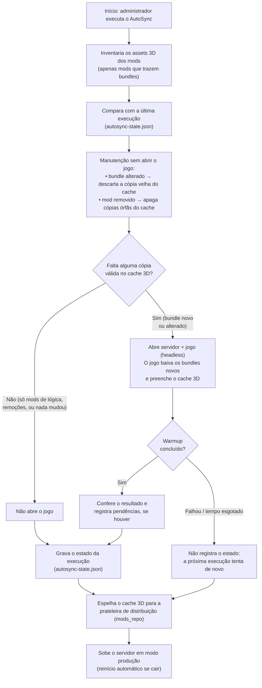
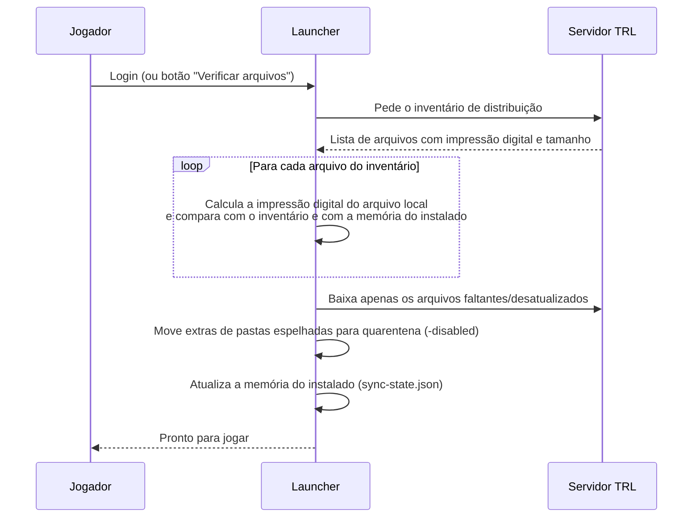
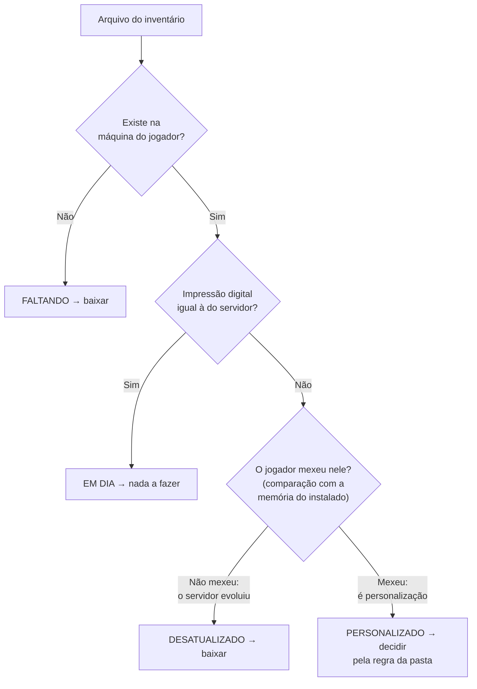

# Fluxo do AutoSync (servidor) e do "Verificar arquivos" (launcher)

> **Data:** 2026-07-25 
> **Status:** 🟢 Vivo 
> **Responsáveis:** Guilherme 
> **Referências:** — 

---

## 1. Para que servem os dois fluxos

O objetivo do ecossistema TRL é simples de enunciar: **todo jogador deve ter exatamente os mesmos arquivos que o servidor, sem trabalho manual** — e com o menor tempo de espera possível, tanto para o administrador quanto para o jogador.

Dois fluxos cooperam para isso:

| Fluxo | Onde roda | Papel |
|---|---|---|
| **AutoSync** | Na máquina do servidor | Prepara o "pacote" de distribuição: mantém o cache 3D coerente com os mods instalados e o publica na prateleira de distribuição. Só abre o jogo (operação demorada) quando é realmente necessário. |
| **Verificar arquivos** | No launcher de cada jogador | Consome o pacote: compara o que o jogador tem com o que o servidor publicou e corrige as diferenças — baixando o que falta, preservando o que o jogador personalizou. |

## 2. Conceitos-chave

- **Bundle** — arquivo de assets 3D (roupas, armas, capacetes, texturas) que alguns mods trazem. Dos ~44 mods do servidor, só ~13 têm bundles; os demais são apenas lógica/configuração.
- **Cache 3D** (`SPT\user\cache\bundles\`) — cópias prontas dos bundles, geradas quando um cliente do jogo os carrega pela primeira vez. Distribuir esse cache pronto evita que cada jogador baixe gigabytes *dentro* do jogo, na tela de carregamento.
- **Prateleira de distribuição** (`Launcher-Updater\mods_repo\`) — a pasta no servidor cujo conteúdo é oferecido aos launchers. Tudo que está nela chega ao jogador.
- **Inventário de distribuição** — a lista `arquivo → impressão digital → tamanho` que o servidor monta a partir da prateleira e entrega ao launcher. Não é um arquivo em disco: é montado em memória a cada reinício do servidor.
- **Impressão digital (hash)** — resumo único do conteúdo de um arquivo. Se dois arquivos têm a mesma impressão digital, são idênticos; se diferem, algo mudou.
- **Memória do instalado** (`SPT\user\launcher\sync-state.json`, na máquina do jogador) — registro do que o launcher instalou da última vez. É o que permite distinguir "o servidor atualizou este arquivo" de "o jogador personalizou este arquivo".

## 3. Fluxo 1 — AutoSync (no servidor)

Roda quando o administrador inicia o servidor. A pergunta central que ele responde é: **"algum asset 3D está sem cópia pronta no cache?"** — e só abre o jogo se a resposta for sim.

Pontos de negócio importantes:

- **Atualizar mods de lógica/configuração (a grande maioria) não abre mais o jogo.** A verificação considera apenas os arquivos de assets 3D (`bundles.json` e `*.bundle` de cada mod).
- **Remover um mod também não abre o jogo**: a limpeza do cache é feita diretamente — e o que sai do cache sai também da prateleira, reduzindo o que os jogadores precisam manter.
- **O servidor de produção sempre sobe ao final**, mesmo que o aquecimento do cache tenha falhado. Uma falha adia a atualização do cache, nunca derruba o serviço.
- Existe um **modo simulação** (`-CheckOnly`): mostra tudo o que o fluxo faria — o que limparia, o que baixaria, se abriria o jogo — sem alterar nada.

## 4. Fluxo 2 — "Verificar arquivos" (no launcher do jogador)

Roda automaticamente no login e também pelo botão de verificação manual. A pergunta central: **"o que este jogador tem de diferente do que o servidor publicou — e essa diferença é atualização pendente ou personalização dele?"**

Cada arquivo cai em uma de quatro situações:

A decisão final para arquivos personalizados e extras depende do **tipo de pasta** (regra de produto, não exceção técnica):

| Tipo de conteúdo | Comportamento |
|---|---|
| Configurações do jogador (configs de mods) | Personalização é **preservada** — o launcher nunca desfaz ajuste do jogador. |
| Configurações controladas pelo servidor | Entregues na primeira vez e mantidas **iguais ao servidor** a partir daí. |
| Configurações forçadas | Sempre a versão do servidor, sem exceção. |
| Mods e plugins (pastas espelhadas) | Sempre iguais ao servidor. Arquivos extras vão para uma pasta de **quarentena `-disabled`** — nada é apagado do jogador. |
| Conteúdo opcional | Só é baixado se o jogador ativou o grupo opcional correspondente. |
| **Dev Mode** ligado | Builds e arquivos de trabalho local **nunca** são sobrescritos ou movidos — modo de proteção para desenvolvimento. |

Nota de produto: o launcher grava um resumo do último inventário (`manifest_hash.txt`), que permitiria pular a verificação quando nada mudou — esse atalho está **desativado por decisão**: a verificação completa roda sempre, priorizando integridade sobre velocidade.

## 5. Arquivos gerados e mantidos pelos fluxos

| Arquivo/pasta | Onde vive | Quem cria/atualiza | O que representa |
|---|---|---|---|
| `autosync-state.json` | Raiz do servidor | AutoSync | Fotografia dos assets 3D dos mods na última execução + pendências conhecidas (bundles que o warmup não conseguiu gerar). |
| `SPT\user\cache\bundles\` | Servidor | Cliente do jogo (durante o warmup) e limpeza do AutoSync | O cache 3D pronto para distribuição. |
| `SPT\user\cache\bundleHashCache.json` | Servidor | Servidor SPT, a cada reinício | Registro interno do servidor sobre os bundles dos mods; não depende do jogo abrir. |
| `Launcher-Updater\mods_repo\` | Servidor | AutoSync (espelho do cache) + administrador (mods/configs) | A prateleira de distribuição — tudo que está aqui chega aos jogadores. |
| `SPT\user\launcher\sync-state.json` | Máquina do jogador | Launcher, após cada verificação | A memória do instalado — base para distinguir atualização de personalização. |
| `SPT\user\launcher\manifest_hash.txt` | Máquina do jogador | Launcher | Resumo do último inventário recebido (atalho de verificação, hoje desativado). |
| `ultimo_mod_hash.txt` | Raiz do servidor | **Extinto** | Mecanismo antigo de detecção do AutoSync; é removido automaticamente na primeira execução da versão atual. |

## 6. Critérios de aceite

CA = critério de aceite. **CA-A** = AutoSync (servidor) · **CA-L** = "Verificar arquivos" (launcher).

| ID | Critério |
|---|---|
| CA-A1 | O jogo (headless) só é aberto se existir asset 3D sem cópia válida no cache. |
| CA-A2 | Atualizar mod sem bundles (lógica/configuração) nunca abre o jogo. |
| CA-A3 | Remover um mod limpa as cópias órfãs do cache sem abrir o jogo, e a remoção se propaga à prateleira. |
| CA-A4 | Se o warmup falhar (queda ou tempo esgotado), nada é registrado e a próxima execução tenta de novo. |
| CA-A5 | Na primeira execução da versão atual com cache já completo, o jogo não abre (migração sem custo). |
| CA-A6 | O servidor de produção sempre sobe ao final do fluxo, com ou sem falha nas etapas anteriores. |
| CA-A7 | O modo simulação (`-CheckOnly`) não altera nenhum arquivo e não sobe o servidor. |
| CA-L1 | Arquivo idêntico ao do servidor nunca é baixado de novo. |
| CA-L2 | Arquivo faltante ou desatualizado (sem personalização do jogador) é baixado. |
| CA-L3 | Configuração personalizada pelo jogador é preservada nas pastas de configuração de jogador. |
| CA-L4 | Arquivo extra em pasta espelhada vai para quarentena `-disabled` — nunca é apagado. |
| CA-L5 | Com Dev Mode ligado, nenhum arquivo local de trabalho é sobrescrito ou movido. |
| CA-L6 | O cache 3D distribuído pelo launcher evita o download de bundles dentro do jogo para conteúdo já publicado. |

## Histórico de Alterações

| Data | Autor | Alteração |
|---|---|---|
| 2026-07-25 | Guilherme | Criação — fluxos AutoSync v2 e "Verificar arquivos" em visão de produto, com diagramas e critérios de aceite. |
