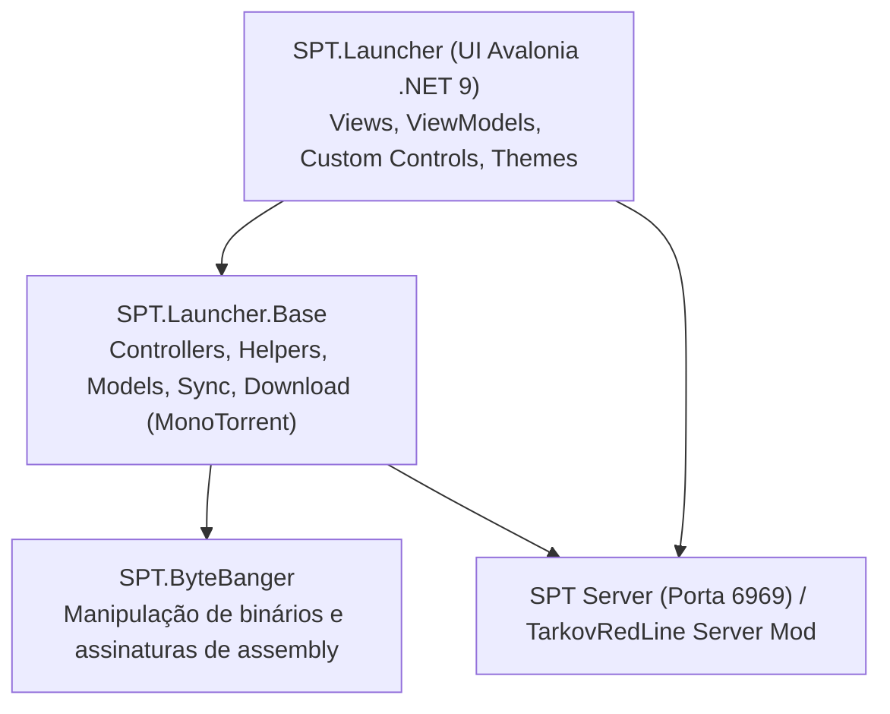
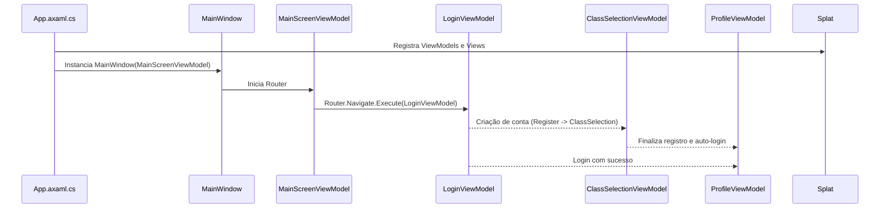
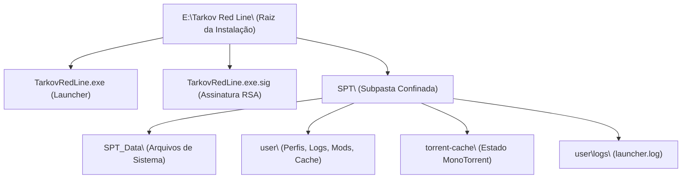

# Tarkov Red Line Launcher — Visão Geral e Arquitetura

O **Tarkov Red Line Launcher** é o cliente oficial de inicialização, autenticação, sincronização de mods e gerenciamento de downloads para o ecossistema SPT 4.0 do servidor Tarkov Red Line. Desenvolvido em **C# / .NET 9.0**, utiliza o framework multiplataforma **Avalonia UI** associado ao padrão **MVVM (ReactiveUI)** e ao **TRL Design System**.

---

## 1. Arquitetura em Camadas

O projeto é modularizado em três bibliotecas/aplicações principais:

| Camada | Projeto / Pasta | Responsabilidades |
|---|---|---|
| **Apresentação (UI)** | `SPT.Launcher/` | Telas Avalonia (`Views/`), ViewModels reativos (`ViewModels/`), Controles TRL (`CustomControls/`), Estilos (`Assets/Theme/`) |
| **Núcleo de Negócio** | `SPT.Launcher.Base/` | Gerenciamento de contas (`AccountManager`), Requisições HTTP (`RequestHandler`), Motor de Sync (`SyncEngine`), Download MonoTorrent (`BaseGameTorrentDownloader`), Confinamento de caminhos (`SptPathHelper`) |
| **Utilitários de Baixo Nível** | `SPT.ByteBanger/` | Análise e injeção de dados de assembly e manipulação binária |

---

## 2. Ciclo de Vida da Aplicação e Navegação

A navegação entre telas utiliza o padrão **ReactiveUI `RoutingState`** e o controle `RoutedViewHost`. O ponto de entrada configura o contêiner de injeção de dependência (`Splat.Locator`), registra as Views e inicia a navegação pela tela de conexão ao servidor.

### Principais ViewModels e Telas:
- [MainWindowViewModel.cs](../project/SPT.Launcher/ViewModels/MainWindowViewModel.cs) — Casca principal com barra de título e controle de janela.
- [ConnectServerViewModel.cs](../project/SPT.Launcher/ViewModels/ConnectServerViewModel.cs) — Verificação inicial de conectividade e handshake de versão.
- [LoginViewModel.cs](../project/SPT.Launcher/ViewModels/LoginViewModel.cs) — Autenticação de usuários existentes.
- [RegisterViewModel.cs](../project/SPT.Launcher/ViewModels/RegisterViewModel.cs) — Validação de credenciais para novo cadastro.
- [ClassSelectionViewModel.cs](../project/SPT.Launcher/ViewModels/ClassSelectionViewModel.cs) — Seleção visual da classe inicial e buffs/drawbacks.
- [ProfileViewModel.cs](../project/SPT.Launcher/ViewModels/ProfileViewModel.cs) — Dashboard do jogador, download do jogo, sincronização e play.
- [ModsConfigsViewModel.cs](../project/SPT.Launcher/ViewModels/ModsConfigsViewModel.cs) — Gestão de mods opcionais.
- [SettingsViewModel.cs](../project/SPT.Launcher/ViewModels/SettingsViewModel.cs) — Configurações locais, áudio, resoluções e caminhos.

---

## 3. Confinamento de Pastas e Estrutura de Diretórios

Para evitar poluição na raiz da instalação e garantir compatibilidade com o instalador e desinstalador, o Launcher aplica confinamento estrito de caminhos através do [SptPathHelper.cs](../project/SPT.Launcher.Base/Helpers/SptPathHelper.cs):

### Regras Canônicas de Caminho:
1. `SptPathHelper.SptRootPath` sempre resolve para `Path.Combine(AppContext.BaseDirectory, "SPT")`.
2. Pastas como `SPT_Data`, `user/profiles`, `user/mods` e `user/cache` residem exclusivamente dentro de `SPT\`.
3. O executável principal e seus utilitários diretos residem na raiz (`AppContext.BaseDirectory`).

---

## 4. Tecnologias e Bibliotecas Utilizadas

| Biblioteca / Framework | Versão | Propósito |
|---|---|---|
| **.NET** | `9.0.15 (win-x64)` | Runtime de execução moderno e de alta performance |
| **Avalonia UI** | `11.0.x` | Framework XAML multiplataforma e acelerado por GPU |
| **ReactiveUI** | `19.x` | Programação funcional reativa e padrão MVVM |
| **MonoTorrent** | `2.0.x (.NET 9)` | Motor de download BitTorrent e WebSeeds para o jogo base |
| **Newtonsoft.Json / System.Text.Json** | `13.x` | Serialização e desserialização de DTOs e estados locais |
| **Splat** | `14.x` | Service locator e logging cross-platform |
