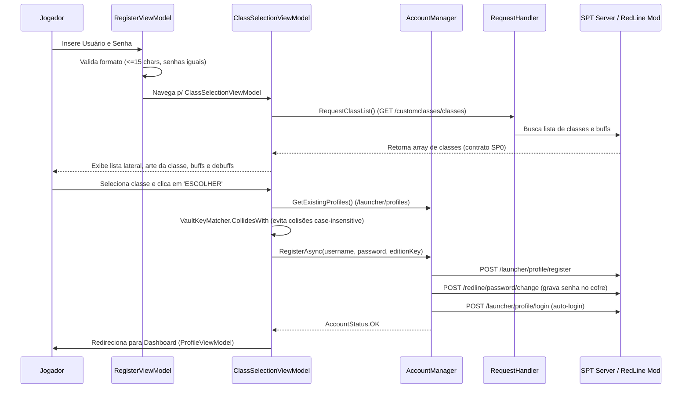

# Tarkov Red Line Launcher — Sistema de Autenticação e Seleção de Classes

Este documento descreve a esteira de autenticação, registro de jogadores, gerenciamento de cofre de senhas e a integração com o seletor visual de classes customizadas do servidor SPT 4.0.

---

## 1. Fluxo Completo de Registro e Seleção de Classes

O processo de criação de conta é dividido em duas etapas para garantir que o jogador escolha sua classe inicial (com visualização rica de atributos e multiplicadores de XP) antes do envio final dos dados:

---

## 2. Componentes de Autenticação

### AccountManager ([AccountManager.cs](../project/SPT.Launcher.Base/Controllers/AccountManager.cs))
Concentra o estado da sessão ativa (`SelectedAccount`, `SelectedProfileInfo`) e expõe métodos assíncronos para:
- `LoginAsync(LoginModel)` — Realiza a sequência de login e carregamento do perfil.
- `RegisterAsync(username, password, edition)` — Cria a conta no SPT e inicia a sessão.
- `ChangePasswordAsync(password)` — Altera a senha e persiste no cofre do servidor.
- `DeleteVaultEntryAsync(username)` — Limpa entradas órfãs ao deletar o perfil.

### Cofre de Senhas Case-Insensitive ([VaultKeyMatcher.cs](../project/SPT.Launcher.Base/Helpers/VaultKeyMatcher.cs))
Para evitar que nomes como `Bob` e `bob` colidam no arquivo de cofre do servidor (`redline_passwords.json`), o Launcher valida antecipadamente todas as contas existentes contra a chave canônica normalizada (*lowercase invariant*).

---

## 3. Contrato de Classes Customizadas (`/customclasses/classes`)

O Launcher consome o endpoint público `GET /customclasses/classes` servido pelo mod `CustomClasses` no servidor, mapeado pelo DTO [ClassInfo.cs](../project/SPT.Launcher.Base/Models/TRL/ClassInfo.cs):

| Propriedade DTO | Tipo | Descrição |
|---|---|---|
| `fileName` | `string` | Nome do arquivo de definição da classe (ex: `tanque.jsonc`) |
| `editionKey` | `string` | Chave exata registrada no `ProfileTemplates` do SPT Core |
| `displayName` | `Dictionary<string, string>` | Nomes localizados (`pt`, `en`) |
| `description` | `Dictionary<string, string>` | Descrição detalhada da classe |
| `nameColor` | `string` | Cor HEX para renderização do nome na UI |
| `effects` | `ClassEffectDto[]` | Lista de buffs e debuffs (*Perks & Drawbacks*) |
| `multipliers` | `Dictionary<string, double>` | Multiplicadores de taxa de XP por habilidade |

---

## 4. Tratamento de Fallbacks e Casos de Falha

| Cenário de Falha | Comportamento do Launcher | Feedback ao Usuário |
|---|---|---|
| Servidor sem mod `CustomClasses` | `LoadClassesAsync` ativa `BuildFromEditionsFallback()` | Exibe edições padrão do SPT (Edge of Darkness, Standard, etc.) |
| Username já em uso no servidor | `VaultKeyMatcher.CollidesWith == true` | Mensagem em vermelho: *"Nome de usuário já cadastrado"* |
| Falha temporária de rede | Bloqueio *Fail-Closed* antes de enviar credenciais | Mensagem: *"Falha ao verificar disponibilidade do nome de usuário"* |
| Falha no cadastro do SPT Core | Status `RegisterFailed` retornado pelo servidor | Mensagem: *"Erro ao criar conta: RegisterFailed"* |
