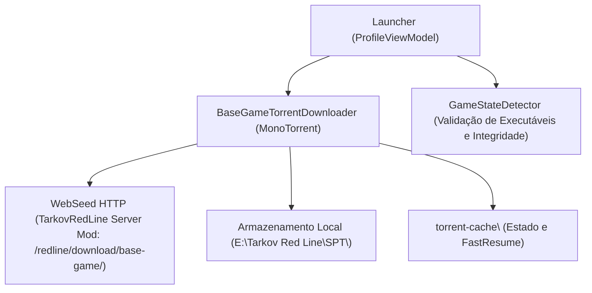
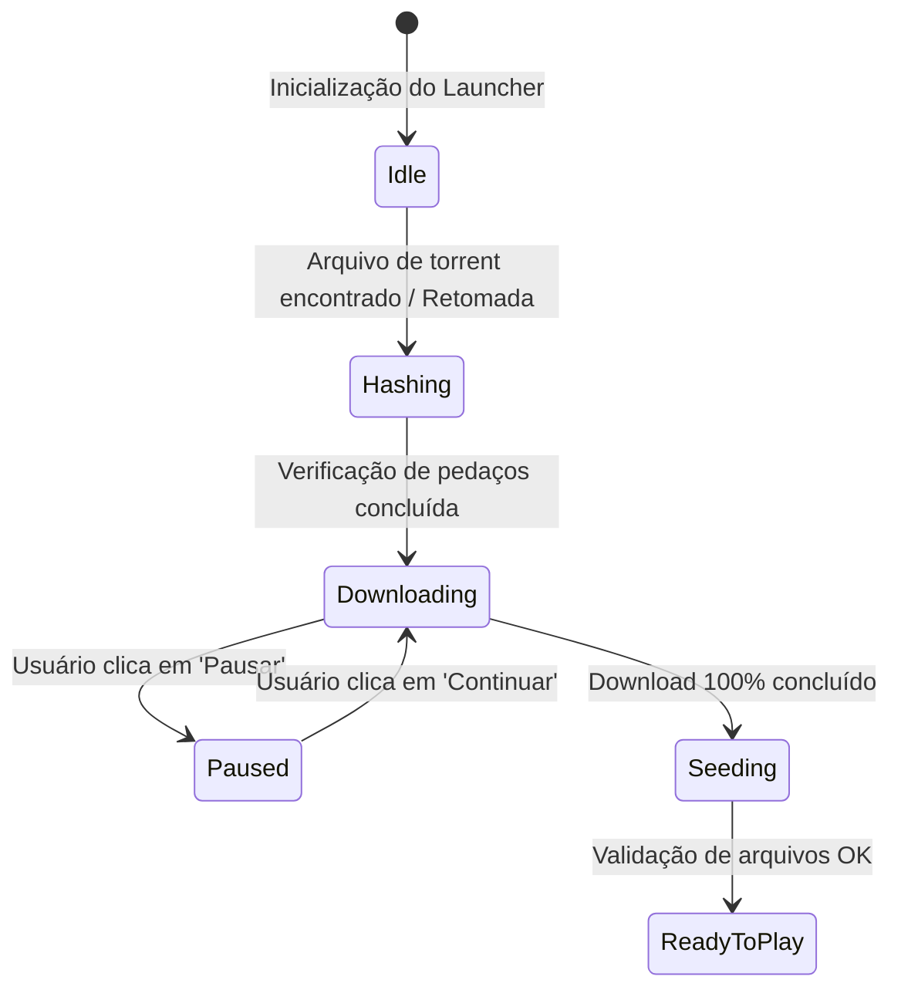

# Tarkov Red Line Launcher — Sistema de Download do Jogo Base

Para garantir que o jogador obtenha os arquivos de instalação do jogo (~56 GB) com alta velocidade, integridade ponto a ponto e capacidade de retomada resiliente, o Launcher integra o motor **MonoTorrent (.NET 9)** com suporte a **WebSeeds HTTP**.

---

## 1. Arquitetura do Download

---

## 2. Componentes Principais

### BaseGameTorrentDownloader ([BaseGameTorrentDownloader.cs](../project/SPT.Launcher.Base/Download/BaseGameTorrentDownloader.cs))
- **Gerenciamento do ClientEngine:** Instancia o motor MonoTorrent configurado para conexões rápidas.
- **Injeção de WebSeeds:** Adiciona URLs de WebSeed dinâmicas baseadas no endereço do servidor conectado (`http://<server-ip>:6969/redline/download/base-game/`).
- **Retomada Rápida (FastResume):** Salva o progresso dos pedaços baixados em `torrent-cache/` para permitir que o usuário pause e feche o Launcher sem perder dados.
- **Eventos Reativos:** Emite métricas de progresso (`ProgressUpdated`), mudança de estado (`TorrentStateChanged`) e estatísticas de transferência em tempo real (MB/s, ETA, Peers).

### GameStateDetector ([GameStateDetector.cs](../project/SPT.Launcher.Base/Download/GameStateDetector.cs))
Monitora o disco para determinar o status do cliente:
- `IsBaseGameInstalled()` — Verifica a presença de executáveis essenciais como `EscapeFromTarkov.exe`, `UnityPlayer.dll` e pastas `EscapeFromTarkov_Data/`.
- `ReadState()` / `SaveState()` — Persiste o estado da transferência em `user/launcher/base-game-state.json`.

---

## 3. Estados de Execução do Download

| Estado MonoTorrent | Ação da UI | Descrição |
|---|---|---|
| `Hashing` | Barra com animação pulsante | Varre o disco conferindo SHA-1 de partes já existentes |
| `Downloading` | Exibe velocidade (MB/s), baixado/total e tempo restante | Baixa chunks via HTTP WebSeed do servidor |
| `Paused` | Botão muda para 'CONTINUAR' | Pausa requisições preservando o progresso no cache |
| `Seeding` / `Complete` | Botão muda para 'JOGAR' | Libera a inicialização do jogo |

---

## 4. Otimizações de Rede e Performance

1. **Chunks Pipelined:** Requisições paralelas com buffer otimizado para atingir a taxa máxima da conexão do usuário (ex: 10 a 50+ MB/s).
2. **Confinamento em `SPT\`:** Todos os 56 GB são extraídos/alocados diretamente na pasta `SPT\`, mantendo a raiz do jogo limpa.
3. **Tratamento de Queda do Servidor:** Se o servidor reiniciar durante o download, o Launcher retém o estado, aguarda o evento de reconexão do Heartbeat e retoma as WebSeeds automaticamente.
