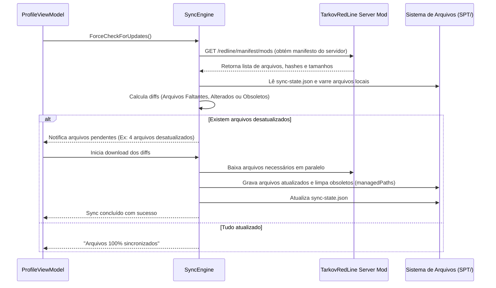

# Tarkov Red Line Launcher — Motor de Sincronização de Mods e Configurações

O motor de sincronização garante que todos os jogadores estejam com os mesmos plugins (`BepInEx/plugins`), mods de servidor e configurações atualizadas em relação ao servidor Tarkov Red Line, sem exigir cópias manuais de arquivos.

---

## 1. Fluxo de Verificação e Sincronização ("Verificar Arquivos")



---

## 2. Componentes de Sincronização

### SyncEngine ([SyncEngine.cs](../project/SPT.Launcher.Base/Sync/SyncEngine.cs))
- **Comparação de Impressão Digital:** Compara o hash MD5/SHA-256 e o timestamp de cada arquivo local com o manifesto publicado pelo servidor.
- **Download em Chunks Paralelos:** Transfere apenas os arquivos que sofreram alteração real.
- **Cancelamento e Reentrância:** Protegido por `Interlocked` e `CancellationToken` para evitar múltiplas execuções simultâneas.

### DownloadRateMeter ([DownloadRateMeter.cs](../project/SPT.Launcher.Base/Sync/DownloadRateMeter.cs))
- **Média Móvel de Velocidade:** Calcula a velocidade de download (MB/s) em intervalos de ~500ms desacoplados dos eventos de I/O de rede.
- **Formatação PT-BR:** Apresenta valores com precisão decimal adequada (`12,4 MB/s`).

---

## 3. Diretórios Gerenciados e Limpeza de Arquivos Obsoletos

O servidor define no manifesto duas diretrizes de proteção e limpeza que o Launcher respeita:

```json
{
  "managedPaths": [
    "BepInEx/plugins",
    "user/cache"
  ],
  "deleteFiles": [
    "SPT.Launcher.exe",
    "SPT.Server.exe",
    "Register.bat"
  ]
}
```

| Diretriz | Comportamento no Launcher |
|---|---|
| **`managedPaths`** | O Launcher audita o diretório: se houver arquivos nessa pasta que **não** estão no manifesto do servidor, eles são excluídos para evitar incompatibilidade entre versões de plugins |
| **`deleteFiles`** | Arquivos legados ou desnecessários especificados explicitamente são deletados no pós-sync |
| **Preservação de Configs** | Arquivos de configuração personalizados do jogador (fora de `managedPaths`) não são sobrescritos |
