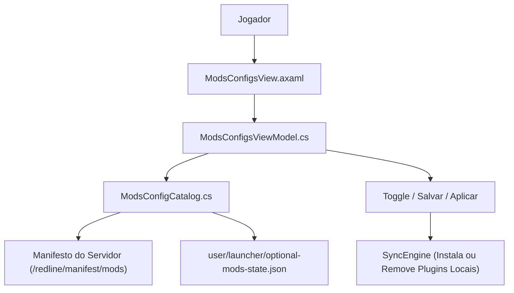

# Tarkov Red Line Launcher — Gerenciamento de Mods e Configurações Opcionais

O subsistema de **Mods e Configurações Opcionais** permite que o jogador ative ou desative recursos extras disponibilizados pelo servidor (como pacotes gráficos, shaders, ajustes sonoros ou mods de conveniência) de forma individual ou por categorias.

---

## 1. Tela de Mods e Configurações (`ModsConfigsView`)

A tela é acessada pela barra lateral de navegação e oferece um painel modular categorizado:



---

## 2. Componentes e Estrutura de Dados

### ModsConfigsViewModel ([ModsConfigsViewModel.cs](../project/SPT.Launcher/ViewModels/ModsConfigsViewModel.cs))
- **Agrupamento por Categorias:** Organiza os itens opcionais em grupos lógicos (ex: *Gráficos*, *Áudio*, *QoL*).
- **Controle em Lote:** Permite ativar ou desativar todos os itens opcionais de uma vez (*"Marcar Todos" / "Desmarcar Todos"*).
- **Indicador de Novidade (`IsNew`):** Destaca visualmente com badge dourada os mods recém-adicionados pelo servidor.
- **Detecção de Mudanças Pendentes:** Alerta o usuário caso tente sair da tela sem salvar as alterações feitas.

### Persistência Local do Estado ([optional-mods-state.json])
O estado selecionado pelo jogador é salvo localmente em `SPT/user/launcher/optional-mods-state.json`:

```json
{
  "enabledOptionalMods": [
    "AmandsGraphics",
    "Fontaine-FOV-Fix",
    "DynamicWeatherSound"
  ],
  "lastUpdated": "2026-08-29T21:00:00Z"
}
```

---

## 3. Resumo na Tela Principal (`ProfileView`)

Na tela principal do jogador, um painel compacto exibe o resumo do estado atual:
- Quantidade de mods opcionais ativados / total disponível.
- Acesso rápido para abrir a tela de personalização.
