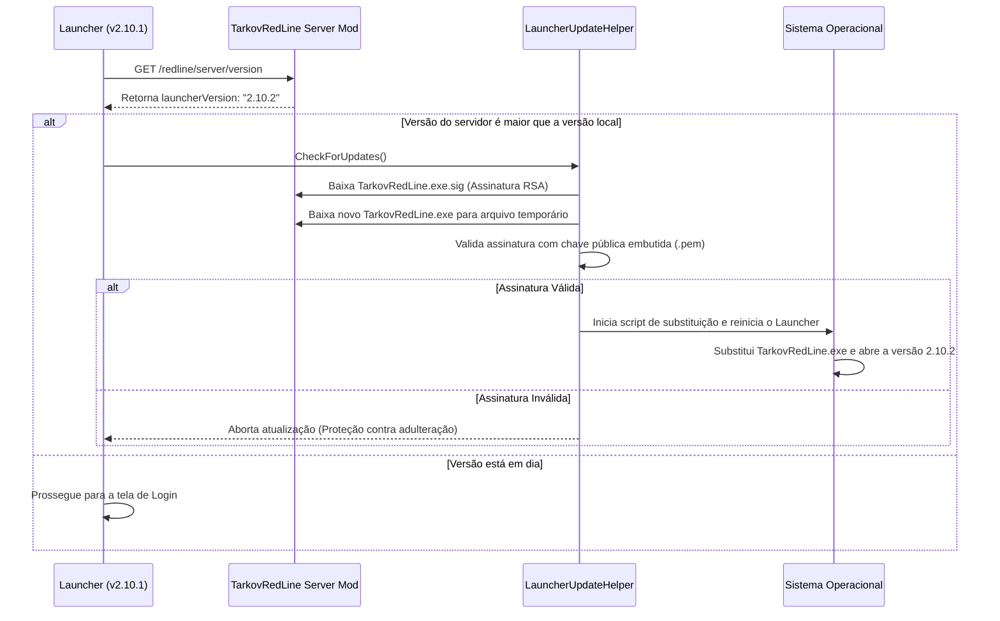

# Tarkov Red Line Launcher — Auto-Atualização e Segurança

Este documento detalha os mecanismos de atualização automática do executável do Launcher, validação de integridade por assinatura criptográfica RSA SHA-256 e segurança de hardware (HWID).

---

## 1. Fluxo de Auto-Atualização no Boot

Ao abrir, o Launcher conecta ao servidor e verifica se há uma versão mais recente publicada:

---

## 2. Segurança e Assinatura Criptográfica

Para impedir que binários corrompidos ou maliciosos sejam executados pelos clientes, toda compilação oficial é assinada:

| Elemento | Arquivo / Ferramenta | Papel |
|---|---|---|
| **Chave Privada** | `.keys/launcher-update-dev-private.pem` | Utilizada no script de build para assinar o executável gerado |
| **Chave Pública** | `.keys/launcher-update-dev-public.pem` | Embutida no código-fonte do Launcher para validação no cliente |
| **Script de Assinatura** | [sign-launcher.ps1](../tools/sign-launcher.ps1) | Gera o arquivo `.sig` contendo a assinatura RSA-2048 SHA-256 do binário |
| **Helper de Validação** | [LauncherUpdateHelper.cs](../project/SPT.Launcher/Helpers/LauncherUpdateHelper.cs) | Valida `RSA.VerifyData` antes de aplicar qualquer arquivo baixado |

---

## 3. Gestão de Identidade de Hardware (HWID)

Para coibir o uso não autorizado e proteger contas contra acessos indevidos em servidores fechados:
- **[HwidHelper.cs](../project/SPT.Launcher.Base/Helpers/HwidHelper.cs):** Coleta hashes únicos de componentes físicos da máquina (placa-mãe, processador, BIOS).
- **Validação no Login:** O HWID é enviado ao servidor no login; tentativas de acesso a partir de hardware não cadastrado exigem reset ou autorização administrativa.
