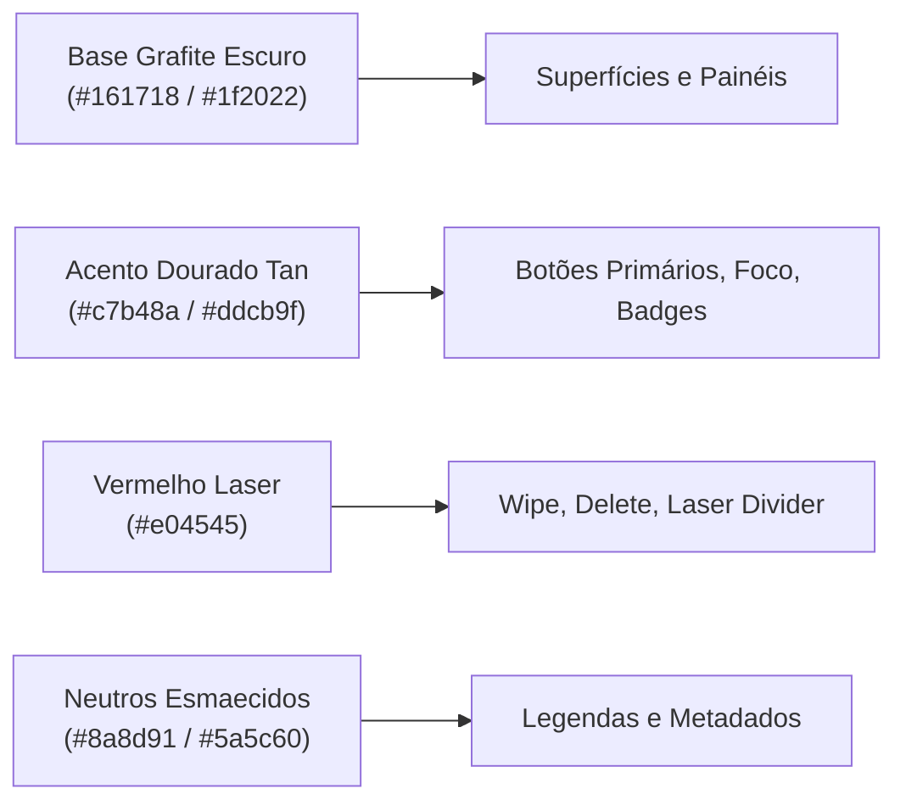
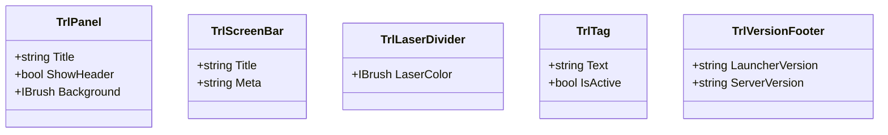

# Tarkov Red Line Launcher — TRL Design System e Custom Controls

A interface gráfica do Launcher é construída sobre o **TRL Design System (v1.0.0)**, padronizando uma estética militar-tática refinada (*Graphite/Tan/Laser*) com alta densidade de informação e microinterações reativas.

---

## 1. Paleta de Cores e Tokens Semânticos

Definidos em [Tokens.axaml](../project/SPT.Launcher/Assets/Theme/Tokens.axaml) e [Trl.axaml](../project/SPT.Launcher/Assets/Theme/Trl.axaml):

| Token / Brush | Valor / Propósito | Aplicação |
|---|---|---|
| `TrlBgWashBrush` | `#161718` (Grafite neutro) | Fundo dos painéis e janelas |
| `TrlAccentBrush` | `#c7b48a` (Tan militar) | Botão `primary`, bordas douradas, highlights |
| `TrlLaserBrush` | `#e04545` (Vermelho laser) | Divisores laser e ações destrutivas |
| `TrlFgBrush` | `#e2e4e8` (Branco tático) | Texto principal de alta legibilidade |
| `TrlFgMutedBrush` | `#8a8d91` | Descrições e rótulos secundários |

---

## 2. Controles Customizados TRL (`CustomControls/`)

O projeto implementa controles XAML reutilizáveis para manter a consistência visual em todas as telas:

- **[TrlPanel.cs](../project/SPT.Launcher/CustomControls/TrlPanel.cs):** Painel modular com moldura refinada e cabeçalho tático.
- **[TrlScreenBar.cs](../project/SPT.Launcher/CustomControls/TrlScreenBar.cs):** Barra superior de título e contexto de tela com metadados.
- **[TrlLaserDivider.cs](../project/SPT.Launcher/CustomControls/TrlLaserDivider.cs):** Divisor com brilho laser característico da identidade Red Line.
- **[TrlSidebarNav.cs](../project/SPT.Launcher/CustomControls/TrlSidebarNav.cs):** Barra lateral de navegação com estados ativos e hover estilizados.
- **[TrlVersionFooter.cs](../project/SPT.Launcher/CustomControls/TrlVersionFooter.cs):** Rodapé padronizado com exibição das versões do Launcher e do Servidor.

---

## 3. Tipografia e Carrossel Dinâmico

- **Tipografia Bender:** Fontes `Bender-Regular.ttf` e `Bender-Bold.ttf` embutidas para títulos táticos e numerais militares.
- **[BackgroundCarousel.cs](../project/SPT.Launcher/Models/BackgroundCarousel.cs):** Gerencia a transição suave de imagens de fundo no dashboard principal, consumindo artes diretamente da pasta de cache servida pelo servidor.
