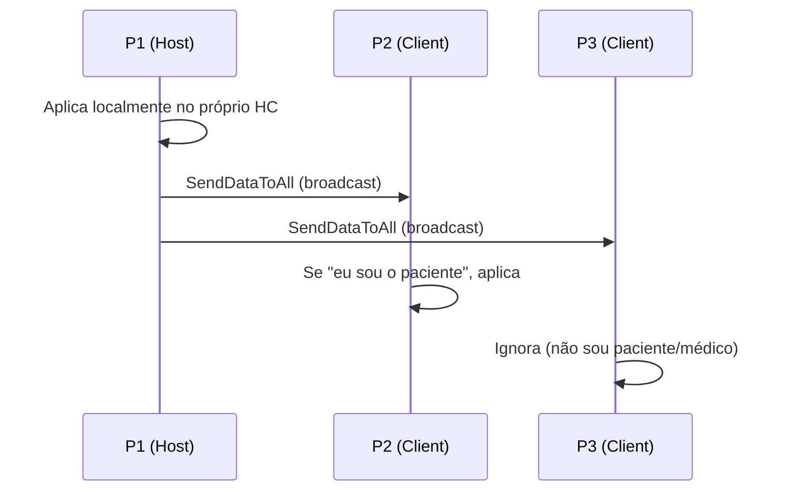
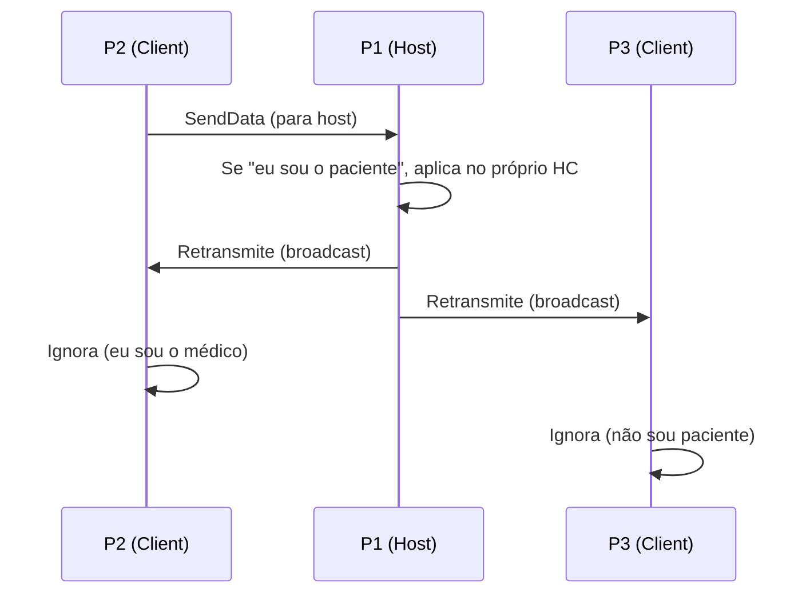
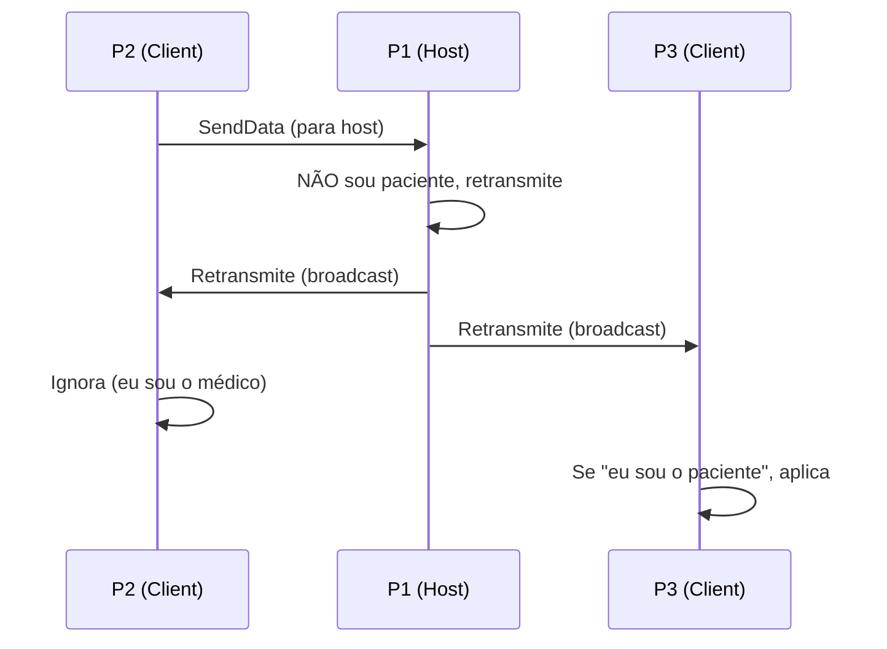
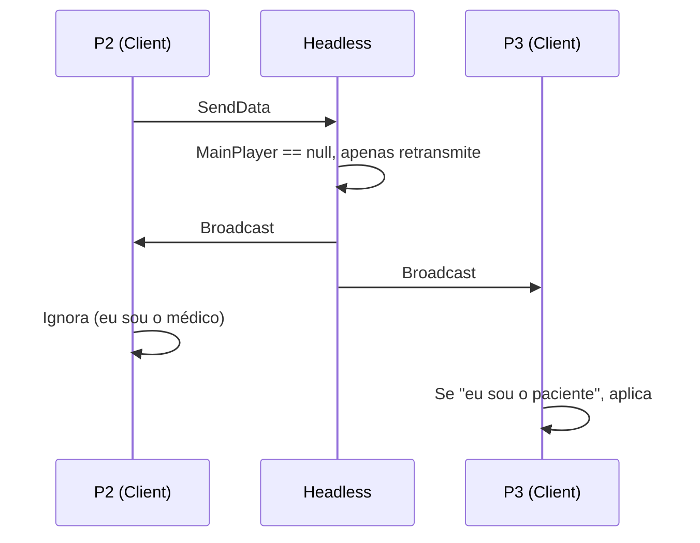

# Fika Coop Networking — Referência Técnica para Mods

> **Objetivo**: Documentar como informações trafegam entre jogadores no Fika, para servir de referência em todos os mods que envolvem interações cooperativas.

---

## Arquitetura de Rede do Fika

O Fika usa um modelo **Cliente-Servidor**:

| Componente | Classe | Papel |
|---|---|---|
| **Host (Server)** | `FikaServer` | Recebe de clients, broadcast para todos |
| **Client** | `FikaClient` | Envia APENAS para o Host |
| **Headless** | `FikaServer` sem `MainPlayer` | Relay puro — sem jogador local |

> [!IMPORTANT]
> **Clients NUNCA se comunicam diretamente.** Todo pacote Client→Client passa pelo Host como relay.

---

## Tipos de HealthController

| Contexto do Jogador | HealthController | Classe-Pai | `ChangeHealth` | `DoMedEffect` | `FindActiveEffect` |
|---|---|---|---|---|---|
| Jogador LOCAL (eu) | `CoopClientHealthController` | `ActiveHealthController` | ✅ direto | ✅ direto | ✅ direto |
| Bots (no host) | `CoopBotHealthController` | `ActiveHealthController` | ✅ direto | ✅ direto | ✅ direto |
| Jogador REMOTO | `ObservedHealthController` | `NetworkHealthControllerAbstractClass` | ❌ | ❌ | ⚠️ via interface |

> [!CAUTION]
> **NUNCA tente chamar métodos de `ActiveHealthController` em jogadores remotos.** O cast `hc is ActiveHealthController` sempre retorna `false` para `ObservedCoopPlayer`.

### O que funciona em ObservedHealthController:
- `GetBodyPartHealth(bodyPart)` → ✅ (HP sincronizado via Fika)
- `IsAlive` → ✅
- `FindActiveEffect<T>(bodyPart)` → ✅ **VIA INTERFACE `IHealthController`** (não via cast para `ActiveHC`!)
- `FindActiveEffects<T>(bodyPart)` → ✅ via interface
- `GetAllActiveEffects(bodyPart)` → ✅ via interface
- `ApplyItem()` → ❌ (retorna false)
- `ChangeHealth()` → ❌
- `DoMedEffect()` → ❌

> [!IMPORTANT]
> **`FindActiveEffect<T>` está na INTERFACE `IHealthController`, não apenas em `ActiveHealthController`.**
> - Para LEITURA de efeitos (UI, validação): use `typeof(IHealthController)` → funciona em TODOS os HCs
> - Para ESCRITA/REMOÇÃO de efeitos: precisa de `ActiveHealthController` ou rede
>
> ```csharp
> // ❌ ERRADO: cast desnecessário, falha para remotos
> if (hc is ActiveHealthController ahc)
>     findMethod.Invoke(ahc, ...);
>
> // ✅ CORRETO: usa interface, funciona em qualquer HC
> var method = typeof(IHealthController).GetMethod("FindActiveEffect", ...);
> method.MakeGenericMethod(effectType).Invoke(hc, new object[] { bodyPart });
> ```

---

## Cenários de Comunicação

### Cenário 1: Host Local

```
Player 1: Hoster (FikaServer + MainPlayer)
Player 2: Client (FikaClient)
Player 3: Client (FikaClient)
```

#### 1.1 — Host (P1) → Client (P2)


**Pontos técnicos:**
- Host vê P2 como `ObservedCoopPlayer` → não pode curar localmente
- Host deve enviar pacote → P2 aplica em si mesmo

#### 1.2 — Client (P2) → Host (P1)


**Pontos técnicos:**
- P2 vê P1 como `ObservedCoopPlayer` → não pode curar localmente
- Pacote vai para Host → Host aplica em si mesmo com `ActiveHealthController`

#### 1.3 — Client (P2) → Client (P3) via Host relay


**Pontos técnicos:**
- P2 envia para Host → Host retransmite → P3 recebe e aplica
- O Host DEVE retransmitir sem bloquear quando não é paciente nem médico

### Cenário 2: Headless (Servidor Dedicado)

```
Headless: Hoster (FikaServer, MainPlayer = NULL)
Player 2: Client (FikaClient)
Player 3: Client (FikaClient)
```

#### 2.1 — Client (P2) → Client (P3)


> [!WARNING]
> **No Headless, `MainPlayer` é NULL.** Handlers devem verificar `mainPlayer == null` e NÃO dar early return — devem retransmitir o pacote e só então sair.

---

## Checklist de Validação para Mods Coop

Use esta checklist ao implementar qualquer interação entre jogadores:

### Envio de Pacotes
- [ ] `FikaServer` envia via `SendDataToAll`
- [ ] `FikaClient` envia via `SendData` (para o host)
- [ ] Pacote implementa `INetSerializable` (Serialize + Deserialize)
- [ ] Pacote registrado via `RegisterPacket<T>` no `IFikaNetworkManager`

### Recebimento de Pacotes
- [ ] Handler verifica se EU sou o médico → ignora (já apliquei)
- [ ] Handler verifica se EU sou o paciente → aplica localmente
- [ ] **Host retransmite** pacotes de clients para outros clients
- [ ] **Headless** (`MainPlayer == null`) apenas retransmite, sem aplicar

### Manipulação de HealthController
- [ ] Detecta `ObservedHealthController` (jogador remoto) antes de tentar curar
- [ ] Para remoto: envia pacote com dados suficientes para o paciente curar em si
- [ ] Para local: usa `ActiveHealthController` normalmente
- [ ] Para bots no host: usa `ActiveHealthController` (funciona diretamente)

### Leitura de Efeitos (UI / Validação)
- [ ] `FindActiveEffect<T>` via `typeof(IHealthController)` (NÃO `typeof(ActiveHealthController)`)
- [ ] Tipo genérico `T` deve ser **GInterface** (ex: `GInterface314`), NÃO nested type (ex: `ActiveHC.HeavyBleeding`)
- [ ] NUNCA fazer cast `if (hc is ActiveHealthController)` antes de ler efeitos
- [ ] Funciona tanto em jogadores locais quanto remotos
- [ ] Pain/Intoxication: sem equivalente no `NetworkHC` — ícone não aparecerá para remotos (limitação Fika)

### Consumo de Itens
- [ ] Item é consumido no inventário do MÉDICO (não do paciente)
- [ ] Custo estimado corretamente (HP visível é sincronizado, efeitos não)

### Validação Pré-Ação (CanUseItem pattern)
- [ ] Para pacientes remotos: bypass detecção de efeitos (validação no lado do paciente)
- [ ] Bandages/Splints remotos: aceitar se paciente `IsAlive`
- [ ] MedKits remotos: validar via `GetBodyPartHealth` (funciona em ObservedHC)
- [ ] Cirurgia remota: validar via membro destruído (funciona em ObservedHC)

### Harmony Patches com Pacientes Remotos
- [ ] Se patch acessa `patient.ActiveHealthController`: verificar `null` (remoto!)
- [ ] Criar path alternativo para remotos (animação sem MedEffect)
- [ ] `_currentClass1172`/state armazenado para `ForceFinishAnimation`

### Reset entre Raids
- [ ] `_initialized` de NetworkHandlers resetado quando `IFikaNetworkManager` destruído
- [ ] Dicionários estáticos (`_activeTourniquets`, etc.) limpos no `Awake()`
- [ ] Flags estáticas (`IsRedirecting`, etc.) resetadas
- [ ] Usar pattern `ResetAllState()` com detecção de mudança de `GameWorld`
- [ ] Parar coroutines ativas ao desativar modos ou mudar de raid
- [ ] Chamar `ForceFinishAnimation()` em cancelamentos (evitar animação travada)

### Detecção de Jogadores Próximos (SphereCast)
- [ ] `Physics.SphereCast` **NÃO detecta** colliders quando origem está DENTRO deles
- [ ] Fallback com `Physics.OverlapSphere` para distância muito curta
- [ ] Padrão: SphereCast (média distância) → OverlapSphere (câmera dentro do collider)

---

## Padrão de Implementação Recomendado

```csharp
// No lado do MÉDICO (quem inicia a ação):
if (doctor.ProfileId != patient.ProfileId && !(patient.HealthController is ActiveHealthController))
{
    // Paciente REMOTO → enviar via rede
    ConsumirItemDoMedico(doctor, item);
    EnviarPacoteComDadosSuficientes(doctor, patient, itemTemplateId);
    return;
}
// Paciente LOCAL (self-heal ou bot no host) → aplicar diretamente
AplicarTratamentoLocal(patient.HealthController as ActiveHealthController);
EnviarPacoteDeNotificação(doctor, patient, dadosAplicados);
```

```csharp
// No HANDLER de recebimento:
if (Singleton<FikaServer>.Instantiated)
{
    // Retransmitir se não sou o médico
    if (packet.DoctorId != meuProfileId)
        Singleton<FikaServer>.Instance.SendDataToAll(ref packet, ...);
    // Headless: só retransmitir
    if (MainPlayer == null) return;
}
// Ignorar se sou o médico
if (packet.DoctorId == meuProfileId) return;
// Se sou o paciente, aplicar
if (packet.PatientId == meuProfileId)
    AplicarNoMeuHealthController();
```

---

## Lições Aprendidas

| Problema | Causa | Solução |
|---|---|---|
| Cura não aplica em jogador remoto | `ObservedHealthController` não tem `ChangeHealth` | Enviar via rede, paciente aplica em si |
| `NullReferenceException` em `SetInHands` | Callback `null` passado para `Player.SetInHands` | Passar `(result) => { }` em vez de `null` |
| Headless não retransmite | `MainPlayer == null` → early return | Verificar `null` DEPOIS de retransmitir |
| Ícones de efeito invisíveis em remoto | `FindActiveEffect<ActiveHC.HeavyBleeding>` não encontra `NetworkHC.HeavyBleeding` | Usar **GInterfaces** (`GInterface314`) em vez de nested types |
| `CanUseItem` bloqueia cura remota | `HasEffect` retorna `false` em `ObservedHC` | Bypass: aceitar se `IsAlive` (validação no paciente) |
| Harmony NullRef em `DoMedEffect` | `patient.ActiveHealthController` é `null` para remoto | Path sem MedEffect: animação roda, cura via rede |
| Estado estático persiste entre raids | `_initialized`, flags, coroutines | `ResetAllState()` ao detectar mudança de `GameWorld` |
| Jogador muito perto não detectado | `SphereCast` não detecta collider quando câmera está dentro | Fallback `OverlapSphere` para curta distância |
| Animação trava ao cancelar modo médico | `ForceFinishAnimation` não chamado no cancelamento | Chamar `ForceFinishAnimation()` + `StopCoroutine` em `DeactivateMedicMode` |
| Item destruído durante UseTime | Item lootado/consumido durante WaitForSeconds | Verificar `itemUsed != null` + try-catch antes de `ApplyTreatment` |

---

## Interface vs Implementação — Regra de Ouro

| Operação | API | Onde buscar | Funciona em ObservedHC? |
|---|---|---|---|
| **Ler** efeito ativo | `FindActiveEffect<T>` | `typeof(IHealthController)` | ✅ |
| **Ler** todos efeitos | `GetAllActiveEffects` | `typeof(IHealthController)` | ✅ |
| **Ler** HP | `GetBodyPartHealth` | `IHealthController` (direto) | ✅ |
| **Remover** efeito | `method_15<T>` / `ForceResidue` | `typeof(ActiveHealthController)` | ❌ (via rede) |
| **Curar** HP | `ChangeHealth` | `ActiveHealthController` (direto) | ❌ (via rede) |
| **Aplicar** MedEffect | `DoMedEffect` | `ActiveHealthController` (direto) | ❌ (via rede) |
| **Restaurar** membro | `RestoreBodyPart` | `ActiveHealthController` (direto) | ❌ (via rede) |

> [!TIP]
> **Regra simples**: Se é LEITURA → use a interface `IHealthController`. Se é ESCRITA → precisa de `ActiveHealthController` ou via rede.

---

## GInterfaces — Tipos Comuns para Efeitos

> [!CAUTION]
> **ActiveHealthController e NetworkHealthControllerAbstractClass têm classes aninhadas de efeitos COM O MESMO NOME, mas que são TIPOS DIFERENTES!**
>
> ```csharp
> ActiveHealthController.HeavyBleeding      // ≠ mesmo Type que:
> NetworkHealthControllerAbstractClass.HeavyBleeding
> ```
>
> Porém, ambos implementam a **mesma GInterface**. Sempre use a GInterface como tipo genérico.

### Mapeamento GInterface → Efeito

| Efeito | GInterface | ActiveHC Nested Type | NetworkHC Nested Type | Sincronizado? |
|---|---|---|---|---|
| **Heavy Bleed** | `GInterface314` | `ActiveHC.HeavyBleeding` | `NetworkHC.HeavyBleeding` | ✅ |
| **Light Bleed** | `GInterface313` | `ActiveHC.LightBleeding` | `NetworkHC.LightBleeding` | ✅ |
| **Fracture** | `GInterface316` | `ActiveHC.Fracture` | `NetworkHC.Fracture` | ✅ |
| **Contusion** | `GInterface326` | `ActiveHC.Contusion` | `NetworkHC.Contusion` | ✅ |
| **Tremor** | `GInterface335` | `ActiveHC.Tremor` | `NetworkHC.Tremor` | ✅ |
| **Pain** | `GInterface331` | `ActiveHC.Pain` | ❌ Não existe | ❌ |
| **Intoxication** | `GInterface320` | `ActiveHC.Intoxication` | ❌ Não existe | ❌ |

```csharp
// ❌ ERRADO: Nested type — funciona SOMENTE no ActiveHC
_heavyBleedType = typeof(ActiveHealthController)
    .GetNestedType("HeavyBleeding", flags);
// FindActiveEffect<ActiveHC.HeavyBleeding> → null em ObservedHC!

// ✅ CORRETO: GInterface — funciona em QUALQUER HealthController
_heavyBleedType = typeof(GInterface314);
// FindActiveEffect<GInterface314> → encontra em ActiveHC E NetworkHC!
```

---

## Detecção de Jogadores — SphereCast + OverlapSphere

> [!WARNING]
> `Physics.SphereCast` (e `Physics.Raycast`) do Unity **NÃO detectam colliders quando a origem do ray já está DENTRO do collider**. Quando a câmera do jogador está muito perto de outro jogador, ela pode entrar dentro do collider dele.

```csharp
// Padrão robusto de detecção:

// 1. SphereCast para média distância (usa câmera = posição dos olhos)
if (Physics.SphereCast(ray, 0.6f, out hit, 0.6f, mask))
{
    Player p = GetPlayerByCollider(hit.collider);
    if (p != null && p != mainPlayer) { _target = p; return; }
}

// 2. Fallback: OverlapSphere para câmera dentro do collider
Collider[] nearby = Physics.OverlapSphere(camera.position, 0.8f, mask);
foreach (var col in nearby)
{
    Player p = GetPlayerByCollider(col);
    if (p != null && p != mainPlayer) { _target = p; return; }
}
```

---

## ⚠️ Distâncias: Câmera (olhos) vs Player.Position (pés)

> [!CAUTION]
> **`Camera.transform.position` ≠ `Player.Position`**. SphereCast usa a câmera (olhos, ~1.7m acima do chão), mas `Player.Position` retorna a posição dos pés. Dois jogadores lado a lado têm **~1.5m de distância entre os pés** mas ~0.5m entre as câmeras olhando um para o outro.

| Componente | Referência | Distância atual |
|---|---|---|
| **SphereCast** (detecção) | `Camera.transform.position` (olhos) | 0.6f |
| **OverlapSphere** (fallback) | `Camera.transform.position` (olhos) | 0.8f |
| **Auto-close HUD** | `Player.Position` (pés) | 1.0f |
| **Abort cura (BandAidPlugin)** | `Player.Position` (pés) | 4.5f |

> [!IMPORTANT]
> Se usar `Player.Position` para auto-close com distância < 1.0f, o HUD **fechará imediatamente** porque dois jogadores lado a lado têm ~1.5m entre os pés. Nunca defina auto-close baseado em Player.Position abaixo de 1.0f.

---

## Cancelamento de Cura — Mouse0 (Vanilla)

O jogo vanilla cancela cura quando o jogador clica Mouse0 durante uso de medkit:

```csharp
// Class1172.Remove() — método vanilla de cancelamento
public void Remove()
{
    this.queue_0.Clear();
    this.medsController_0._player.HealthController.CancelApplyingItem();
}
```

No Band-Aid, `CancelHealInProgress()` implementa o equivalente:
1. Para a coroutine ativa
2. Limpa flags de redirect (`IsRedirectingHeal`, `CurrentPatient`, `BandAidHealActive`)
3. `CancelApplyingItem()` — cancela efeito médico nativo
4. `ForceFinishAnimation()` — chama `method_9` para limpar callback visual
5. Libera `UsingMeds` no MovementContext
6. **NÃO dropa o item** (diferente de EmergencyDrop)

> [!WARNING]
> **`TrySetLastEquippedWeapon(true)` NÃO deve ser chamado após `ForceFinishAnimation`**. O jogo já puxa a arma automaticamente via callback de `method_9`. Forçar a puxada causa dupla transição → animação bugada.

---

## Remoção de Itens — Sincronização no Fika

> [!CAUTION]
> **`GClass2821.RemoveItem(item)` NÃO sincroniza com clients no Fika.** Ele usa `InteractionsHandlerClass.Discard(item, owner.GetOwner())` com o `TraderControllerClass` local — não gera `InventoryPacket`.

### Padrão correto: `DiscardItemSynced`

```csharp
// ✅ CORRETO: usa doctor.InventoryController → gera InventoryPacket no Fika
var result = InteractionsHandlerClass.Discard(item, doctor.InventoryController);
if (result.Succeeded)
{
    result.Value.RaiseEvents(controller, CommandStatus.Begin);
    result.Value.RaiseEvents(controller, CommandStatus.Succeed);
}

// ❌ ERRADO: não sincroniza — slot fica bloqueado no client
GClass2821.RemoveItem(item);
```

Sintoma: após consumir item (esmarch, bandagem), o **slot fica bloqueado** no client e não aceita novos itens. Log: `ItemControllerExecutePacket::NullReferenceException`.

---

## Patches de Animação — Class1172 (MedsController)

### Ciclo de vida normal
1. `method_5` → inicia cura (`DoMedEffect` no HealthController)
2. `EffectRemovedEvent` → efeito terminou → `method_8` (bridge)
3. `method_8` → notifica lista de body parts
4. `method_9` → cleanup: `CancelApplyingItem`, reseta flags, callback para transição

### Proteções do Band-Aid
| Guard | Onde | Função |
|---|---|---|
| `BandAidHealActive` | Prefix `method_5` | Bloqueia self-heal vanilla durante cura cooperativa |
| `_currentClass1172` null check | `OnPatientEffectRemoved` | Evita bridge quando Fika já processou o evento |
| Early return `IsRedirectingHeal=false` | Postfix `method_9` | Evita triplo reset de flags |
| `OnPlayerDeadOrUnspawn` | HealRoutine + 4 caminhos de saída | Aborta cura se paciente morrer |

> [!NOTE]
> Última atualização: 21/03/2026. Adicionados: distâncias câmera vs pés, cancelamento Mouse0, DiscardItemSynced, TrySetLastEquippedWeapon warning, Class1172 lifecycle.
