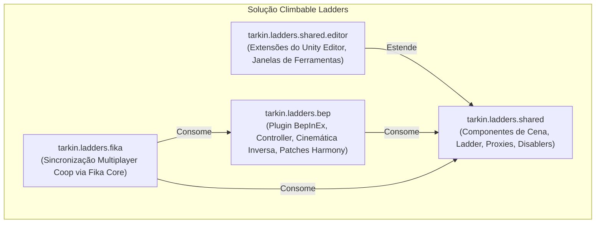
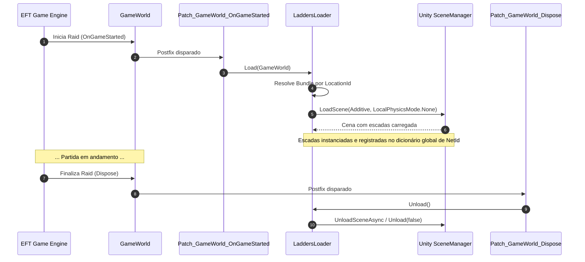

# Climbable Ladders — Visão Geral e Arquitetura

O mod **Climbable Ladders** (v1.0.3) implementa um sistema completo e interativo de escalada e transposição vertical de escadas para Escape From Tarkov / SPT 4.0. No jogo vanilla da Battlestate Games (BSG), escadas são elementos de cenário estáticos e intransponíveis; este mod introduz mecânicas de interação, transição de pose, animação procedural via Cinemática Inversa (FinalIK), simulação de física/estamina, áudio contextual e suporte a multiplayer cooperativo via Fika.

---

## 1. Princípios de Engenharia e Design

1. **Substituição de Geometria Estática por Interatividade Dinâmica:** Em vez de alterar destrutivamente os mapas do jogo vanilla, o mod injeta cenas Unity aditivas carregadas em tempo de execução contendo entidades interativas [Ladder](../modded/ladders.shared/Ladder.cs).
2. **Animação 100% Procedural e Adaptativa:** Não depende de animações pré-gravadas rígidas da BSG. Utiliza cálculo em tempo real de arcos de movimento de braços e pernas, adaptação de pegada de dedos ([ProceduralGrip](../modded/ladders.bep/ProceduralGrip.cs)) e posicionamento de degraus para acomodar qualquer espaçamento, altura e inclinação.
3. **Mecânicas Táticas Realistas:** A escalada consome estamina de forma dinâmica com base no peso total do inventário do operador, aplica penalidades de dor/dano a membros superiores fraturados e integra-se suavemente ao sistema de *Vaulting* nativo da BSG no topo da escada.
4. **Arquitetura Modular em 4 Camadas:** Separação estrita entre o cliente local BepInEx, componentes compartilhados, sincronização de rede Fika e extensões de Unity Editor.

---

## 2. Estrutura Modular da Solução (Projetos C#)

A solução [ladders.sln](../modded/ladders.sln) é dividida em 4 módulos independentes:

### Detalhamento dos Módulos:

| Projeto | Assembly / Namespace | Responsabilidade Principal |
|---|---|---|
| **`ladders.shared`** | `tarkin.ladders.shared.dll` | Definição da classe base [Ladder](../modded/ladders.shared/Ladder.cs), registro global de escadas por `NetId`, e manipuladores de geometria de mapa ([GameObjectDisablerByPath](../modded/ladders.shared/GameObjectDisablerByPath.cs) e [ProxyTransformModifierByPath](../modded/ladders.shared/ProxyTransformModifierByPath.cs)). |
| **`ladders.shared.editor`** | `tarkin.ladders.shared.editor.dll` | Ferramentas de desenvolvimento no Unity Editor ([LadderEditor](../modded/ladders.shared.editor/LadderEditor.cs) com Handles 3D no Scene View e [GameObjectDisablerByPathEditorWindow](../modded/ladders.shared.editor/GameObjectDisablerByPathEditorWindow.cs)). |
| **`ladders.bep`** | `tarkin.ladders.bep.dll` | Ponto de entrada do cliente BepInEx ([Plugin.cs](../modded/ladders.bep/Plugin.cs)), gerenciador de carregamento de AssetBundles ([LaddersLoader](../modded/ladders.bep/LaddersLoader.cs)), máquina de estados do jogador ([PlayerLadderController](../modded/ladders.bep/PlayerLadderController.cs)), rigging procedural de corpo ([ProceduralLadderBody](../modded/ladders.bep/ProceduralLadderBody.cs)) e Patches Harmony. |
| **`ladders.fika`** | `tarkin.ladders.fika.dll` | Módulo de sincronização cooperativa ([Plugin.cs](../modded/ladders.fika/Plugin.cs)), serializadores de pacotes de rede ([LadderStatePacket](../modded/ladders.fika/LadderStatePacket.cs), [BarAnglePacket](../modded/ladders.fika/BarAnglePacket.cs)), rastreador local ([MainPlayerTracker](../modded/ladders.fika/MainPlayerTracker.cs)) e controlador de réplica remota ([ObservedPlayerLadderController](../modded/ladders.fika/ObservedPlayerLadderController.cs)). |

---

## 3. Ciclo de Vida da Raid e Injeção de Cenas

O mod intercepta o ciclo de vida da raid através de Patches Harmony em `GameWorld`:

---

## 4. Mapeamento de Mapas e AssetBundles de Cenas

O [LaddersLoader](../modded/ladders.bep/LaddersLoader.cs) mantém uma tabela estática de correspondência entre o identificador de mapa da BSG (`LocationId`) e o arquivo de cena compilado:

| LocationId (EFT / SPT) | Nome do AssetBundle de Cena | Nome do Mapa / Localização |
|---|---|---|
| `factory4_day` / `factory4_night` | `factory_rework_ladders` | Factory (Rework) |
| `Sandbox` / `Sandbox_high` | `sandbox_ladders` | Ground Zero |
| `TarkovStreets` | `city_ladders` | Streets of Tarkov |
| `bigmap` | `custom_ladders` | Customs |
| `RezervBase` | `reserve_base_ladders` | Reserve |
| `Woods` | `woods_ladders` | Woods |
| `Shoreline` | `shoreline_ladders` | Shoreline |
| `Interchange` | `interchange_ladders` | Interchange |
| `Lighthouse` | `lighthouse_ladders` | Lighthouse |

Os bundles de cenas compilados residem na pasta `BepInEx/plugins/tarkin-ladders/` e são carregados de forma não intrusiva com `LoadSceneMode.Additive`.
