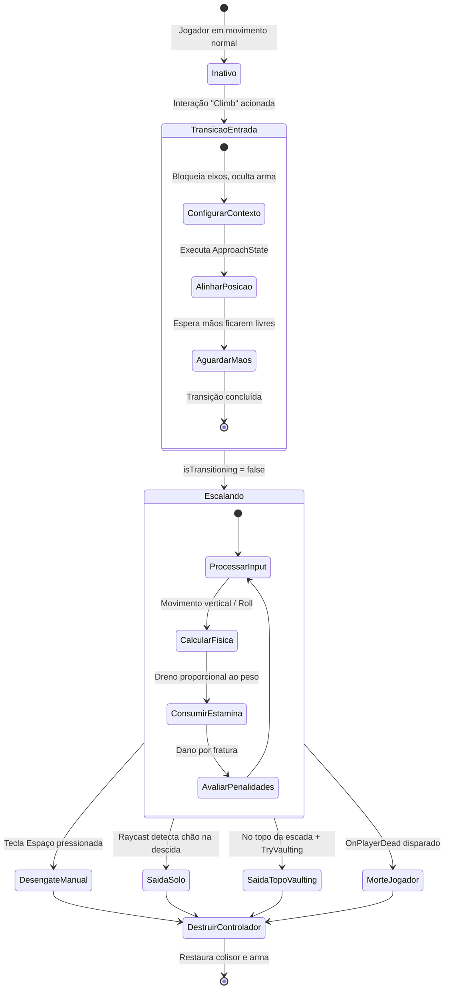
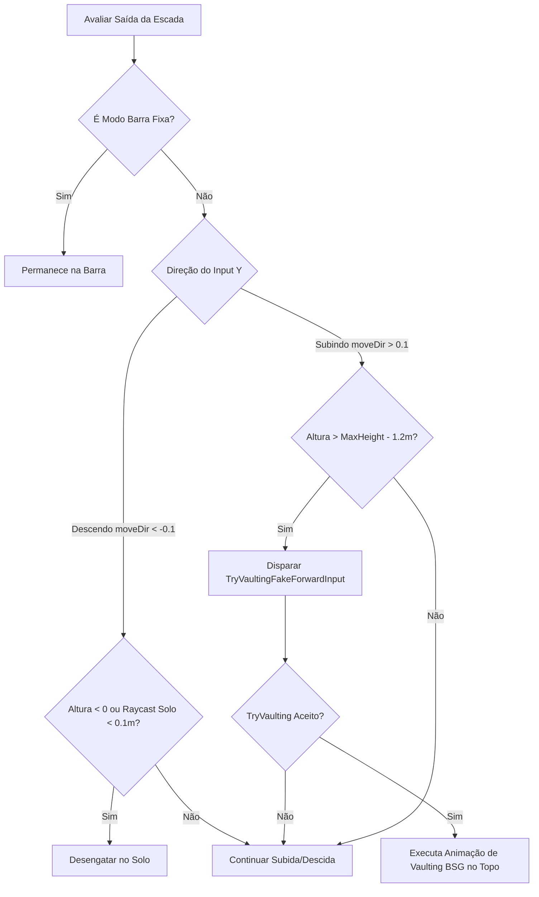

# Climbable Ladders — Controlador de Jogador e Máquina de Estados

O controle de movimento, cálculo de física e transições de estado do jogador durante a escalada são orquestrados pelo componente [PlayerLadderController](../modded/ladders.bep/PlayerLadderController.cs), anexado dinamicamente ao `GameObject` do `Player` quando a interação de escalada é iniciada.

---

## 1. Máquina de Estados e Fluxo de Transição

O ciclo de vida do controlador compreende quatro estados fundamentais:

---

## 2. Inicialização e Transição de Entrada (`Transition`)

Quando o jogador ativa a ação **"Climb"**, o método `Init(Ladder ladder)` executa as seguintes etapas:

1. **Supressão de Movimento Vanilla:** Define `player.MovementContext.IsAxesIgnored = true` e fixa a pose do jogador em `SetPoseLevel(1f)`.
2. **Retração de Arma:** Invoca `player.HideWeapon()`, o que automaticamente sinaliza `player.IsInBufferZone = true`, desarmando o operador.
3. **Ajuste de Colisor:** Reduz o raio do `CapsuleCollider` do `CharacterController` para **`0.25f`** (armazenando o raio original para restauração posterior), evitando que a cápsula colida lateralmente com estruturas ao redor da escada.
4. **Alinhamento Assíncrono (`ApproachState`):**
   - Calcula a posição mundial de contato na escada com afastamento seguro calculado por `CalculateArmSpace(ladder)`.
   - Cria uma instância de `InteractionParameters` com modo de rotação `ViewTargetWithZeroPitch`.
   - Sobrescreve o estado de movimento para `ApproachStateClass` até que o operador atinja com precisão a base de montagem.
   - Caso o jogador esteja muito abaixo do primeiro degrau, aciona um pulo corretivo com `player.Jump()`.
   - Aguarda até que as mãos estejam completamente desocupadas (`player.HandsIsEmpty == true`).

---

## 3. Modelo de Física e Cálculo de Movimento

Durante a escalada convencional (`IsBarMode == false`), a cada frame do `Update()`, a velocidade e posição vertical são calculadas:

### Fórmulas e Moduladores de Velocidade:

1. **Variação Senoidal por Degrau (*Rung Cadence*):**
   $$\text{rungPhase} = \frac{\text{currentHeight} \pmod{\text{RungSpacing}}}{\text{RungSpacing}}$$
   $$\text{rungSpeedFactor} = 1.0 - 0.25 \times \cos(2\pi \times \text{rungPhase})$$
   Isso simula o ritmo humano natural de subida, onde o corpo acelera no impulso e desacelera na pegada do próximo degrau.
2. **Influência do Peso do Inventário:**
   $$\text{weightFactor} = \text{Clamp01}\left(\frac{\text{TotalWeight} - 20\text{kg}}{60\text{kg} - 20\text{kg}}\right)$$
   - Reduz a velocidade de subida de $1.0\times$ (leve) até $0.5\times$ (muito pesado).
   - Aumenta o dreno de estamina de $1.0\times$ até $2.0\times$.
3. **Balanço Lateral e Inclinação de Tronco (*Sway & Tilt*):**
   - **Sway Lateral:** Deslocamento senoidal horizontal de amplitude $\pm 0.01\text{m}$.
   - **Tilt:** Inclinação angular suave de até $\pm 0.3\text{ rad}$ via `player.MovementContext.SetTilt(...)`, reagindo ao pé/mão de apoio.

---

## 4. Tabela de Constantes e Parâmetros de Escalada

| Parâmetro | Valor | Descrição |
|---|---|---|
| `BaseClimbSpeed` | `1.2f` | Velocidade base linear de subida (m/s). |
| `BaseArmSpace` | `0.49f` | Afastamento base do centro do corpo em relação ao plano da escada. |
| `CharacterControllerRadius` | `0.25f` | Raio do colisor da cápsula durante a escalada (vs padrão ~0.4f). |
| `RungSpeedVariation` | `0.25f` | Amplitude da variação senoidal de velocidade entre degraus. |
| `SideSwayAmount` | `0.01f` | Magnitude do balanço senoidal lateral (eixo X local). |
| `LeanSwayAmount` | `0.30f` | Magnitude da inclinação do tronco do operador durante a subida. |
| `ClimbStaminaDrainRate` | `2.0f` | Taxa de consumo de estamina por segundo em movimento. |
| `HoldStaminaDrainRate` | `0.1f` | Dreno mínimo de estamina estático para impedir regeneração parado na escada. |
| `PainDistanceThreshold` | `0.5f` | Distância percorrida (metros) para cada aplicação de penalidade por fratura. |
| `BrokenArmClimbDamage` | `2.0f` | Dano em HP aplicado ao braço fraturado a cada 0.5m escalado. |
| `RollSpeed` | `333.0f` | Aceleração de rotação aplicada pelo input no modo barra fixa. |
| `RollDeceleration` | `0.35f` | Fator de amortecimento e fricção angular na barra fixa. |

---

## 5. Penalidade por Membros Superiores Fraturados

O método `ApplyBrokenArmPenalty()` verifica as condições físicas do operador via `EPhysicalCondition.LeftArmDamaged` e `EPhysicalCondition.RightArmDamaged`:

- A cada **0.5 metros** escalados (`distanceSinceLastPainCheck >= 0.5f`), caso algum braço esteja avariado/fraturado:
  - Aplica **2 HP de dano** ao membro correspondente (`ApplyDamage(EBodyPart, 2f, DamageHelper.FallDamage)`).
  - Provoca recidiva de ferimento (`DoWoundRelapse`).
  - Se o jogador **não estiver sob efeito de analgésicos** (`!PhysicalConditionIs(EPhysicalCondition.OnPainkillers)`), força a execução de frase de dor do personagem (`player.Say(EPhraseTrigger.OnBeingHurt, demand: true)`).

---

## 6. Condições de Saída e Transição para Vaulting

O método `TryExit(float currentHeight, float moveDir)` avalia quando desengatar o jogador:

Para garantir que a transição no topo da escada seja natural, o método `TryVaultingFakeForwardInput()` simula temporariamente o vetor de input para frente (`new Vector2(0, 1f)`) e aciona diretamente o pipeline nativo de vaulting da BSG (`player.MovementContext.TryVaulting()`).

---

## 7. Modo Barra Fixa / Pull-up (`IsBarMode`)

Quando uma escada possui apenas 1 degrau (`ladder.RungCount == 1`), o controlador entra no modo **Bar Mode**:

- O operador pendura-se na barra com as duas mãos.
- O método `UpdateBarRoll()` calcula a física de um **pêndulo rígido**:
  - O centro de massa localiza-se na pélvis (`PlayerBones.Pelvis.Original`).
  - O pivô de rotação é o eixo X da barra (`ladder.transform.right`).
  - A gravidade gera aceleração angular: $\alpha_{\text{grav}} = \sin(\theta) \times (g \times 130 \times r)$.
  - O input horizontal ($A/D$ ou analógico) aplica torque direto (`input.x * RollSpeed`).
  - O ângulo resultante (`rollAngle`) é transmitido ao [ProceduralLadderBody](../modded/ladders.bep/ProceduralLadderBody.cs) e replicado via evento `OnBarAngleChanged`.
