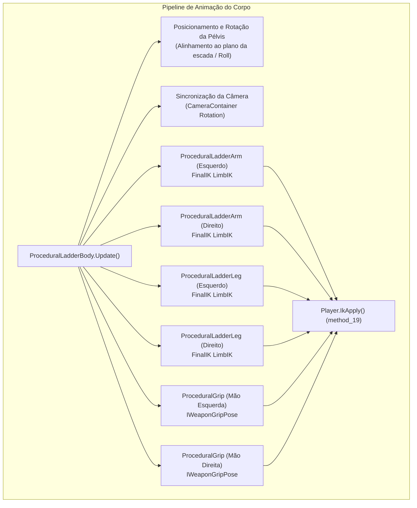
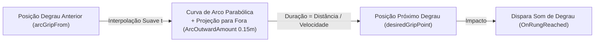
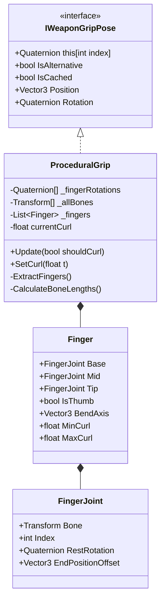

# Climbable Ladders — Cinemática Inversa e Animação Procedural

O sistema de animação do **Climbable Ladders** é 100% procedural, permitindo que qualquer modelo de personagem do Tarkov escale escadas de quaisquer dimensões, inclinações e distâncias de degraus sem depender de clipes de animação gravados. Isso é viabilizado pela integração com o **RootMotion FinalIK** e pelo subsistema customizado de rig de pegada nas mãos.

---

## 1. Arquitetura do Pipeline de Animação Procedural

O componente [ProceduralLadderBody](../modded/ladders.bep/ProceduralLadderBody.cs) é o maestro de animação do corpo do operador, atualizado a cada frame em `LateUpdate()`:

---

## 2. Cinemática de Membros (`ProceduralLadderLimb`)

A classe abstrata [ProceduralLadderLimb](../modded/ladders.bep/ProceduralLadderLimb.cs) padroniza a cinemática de braços e pernas.

### Algoritmo de Paridade e Seleção de Degraus:

1. **Cálculo de Altura Relativa do Membro:**
   $$\text{relativeHeight} = (\text{RootPosition} - \text{LowestRungWorldPos} + \vec{u}_{\text{up}} \times \text{HeightOffset}) \cdot \vec{u}_{\text{up}}$$
   $$\text{continuousIndex} = \frac{\text{relativeHeight}}{\text{RungSpacing}}$$
2. **Seleção Alternada por Paridade:**
   - Membro Esquerdo ($\text{parity} = 0$): busca índices de degraus pares ($0, 2, 4, \dots$).
   - Membro Direito ($\text{parity} = 1$): busca índices de degraus ímpares ($1, 3, 5, \dots$).
   $$\text{rungIndex} = \text{Clamp}\left(\text{RoundToInt}\left(\frac{\text{continuousIndex} - \text{parity}}{2}\right) \times 2 + \text{parity},\; 0,\; \text{RungCount} - 1\right)$$
3. **Ponto de Contato Desejado (*Grip Point*):**
   $$\text{desiredGrip} = \text{RungCenter} - \vec{u}_{\text{right}} \times (\text{sideSign} \times \text{clampedXOffset})$$

### Trajetória Parabólica em Arco (`InArc`):

Quando o membro detecta a necessidade de transicionar para um novo degrau (`rungIndex != currentRungIndex`), ele inicia uma curva espacial de arco suave:

- **Duração do Arco:** Calculada dinamicamente: $\text{arcDuration} = \max\left(0.01\text{s},\; \frac{\text{dist}}{\text{ArcSpeed} \times \text{speed} / 3}\right)$.
- **Curva de Elevação:** Projeta a mão para fora da escada usando $\text{outward} = 4t(1-t) \times 0.15\text{m}$.

---

## 3. Rigging e Deformação de Dedos Procedural (`ProceduralGrip`)

A classe [ProceduralGrip](../modded/ladders.bep/ProceduralGrip.cs) implementa a interface nativa de pegada de arma do Tarkov (`IWeaponGripPose` / `GInterface26` em SPT 4.0):

### Mecanismo de Pegada Dinâmica:

1. **Extração Automática da Hierarquia Óssea:** Varre os ossos da palma da mão do personagem buscando as cadeias de 5 dedos (`Digit11..13` até `Digit51..53`).
2. **Cálculo da Pose de Repouso (*Bind Pose*):** Constrói a rotação local de repouso através das matrizes inversas `bindposes` do `SkinnedMeshRenderer`.
3. **Curvatura Dinâmica (*Dynamic Curl*):**
   - Quando a mão está segurando o degrau (`!InArc`): fecha os dedos com alvo de curvatura **`0.7f`** a uma velocidade `_curlSpeed = 4f`.
   - Durante o arco de transição (`InArc == true`): relaxa e abre os dedos com alvo de curvatura **`0.2f`** a uma velocidade `_uncurlSpeed = 3f`.
4. **Alimentação dos `HandPosers` da BSG:** Aplica a pegada procedural nos componentes `player.HandPosers[0]` (esquerda) e `player.HandPosers[1]` (direita) com peso total (`weight = 1f`, `GripWeight = 1f`).

---

## 4. Conversão para o Sistema de Coordenadas do Tarkov Rig

O modelo de esqueleto (rig) de personagens da BSG utiliza convenções de eixos específicas para orientação dos ossos das mãos e pélvis. O método utilitário `ProceduralLadderLimb.ConvertToTarkovRig(Vector3 knuckleDir, Vector3 fingersDir)` realiza a conversão ortogonal:

$$\vec{v}_{\text{fingers}} = \text{ProjectOnPlane}(\vec{v}_{\text{fingers}}, \vec{v}_{\text{knuckles}})_{\text{norm}}$$
$$\vec{v}_{\text{rigFwd}} = \vec{v}_{\text{knuckles}} \times \vec{v}_{\text{fingers}}$$
$$\mathbf{Q}_{\text{target}} = \text{LookRotation}(\vec{v}_{\text{rigFwd}}, \vec{v}_{\text{knuckles}})$$

Isso garante que dedos, punhos e antebraços não sofram distorções ou torções anômalas durante a escalada.

---

## 5. Subsistema de Áudio Procedural e Detecção de Superfícies

Quando mãos ou pés atingem o degrau (`OnRungReached`), o mod dispara áudio contextual:

1. **Identificação Balística da Escada (`TryIdentifySurfaceSound`):**
   - Executa uma esfera de colisão sem alocação de GC (`Physics.OverlapSphereNonAlloc`) no ponto de contato no layer balístico (`1 << 12`).
   - Se interceptar um [BallisticCollider](../../../references/eft-decompiled/Assembly-CSharp/EFT/Ballistics/BallisticCollider.cs), extrai o tipo de superfície (`SurfaceSound`).
   - Fallback padrão caso não haja colisor balístico: `BaseBallistic.ESurfaceSound.MetalThin`.
2. **Disparo de Passos e Equipamento:**
   - Atualiza a superfície acústica do jogador via `player.method_76(hit: true, ladder.SurfaceSound)` (*UpdateSurfaceData*).
   - Executa o som de passo/impacto com `player.PlayStepSound()`.
   - No início do arco (`OnArcStarted`), reproduz o chacoalhar do colete e equipamentos táticos via `BaseVaultingAudioController.PlayGearSound()`.
