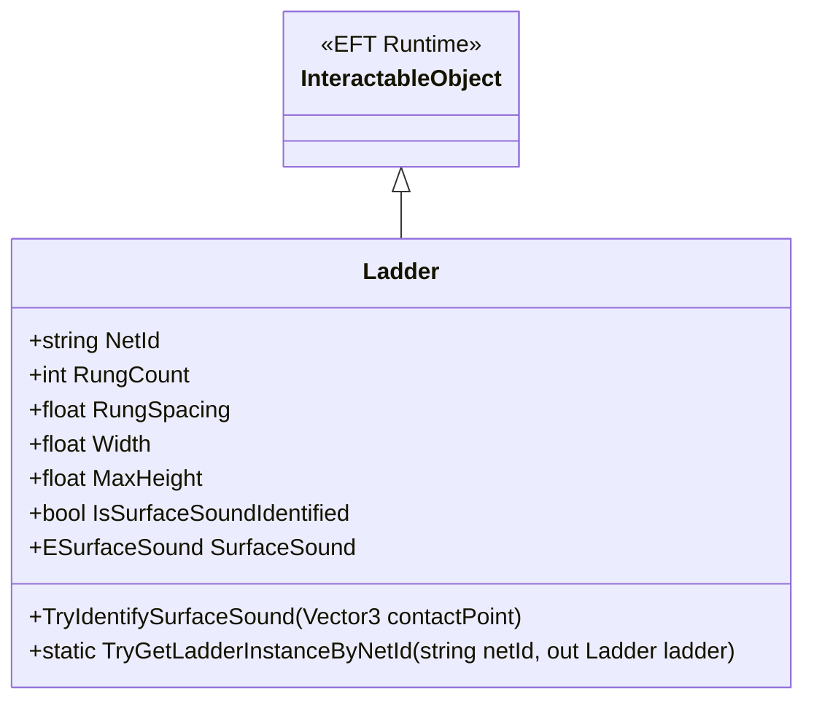
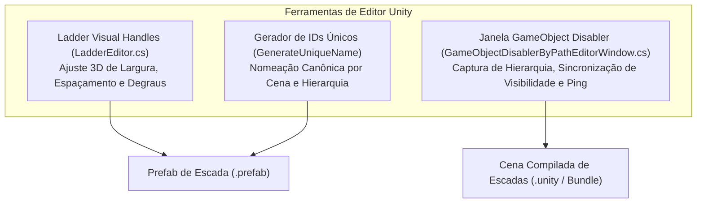

# Climbable Ladders — Infraestrutura de Cenas e Ferramentas de Edição

O mod **Climbable Ladders** emprega uma arquitetura baseada em cenas Unity aditivas para adicionar interatividade aos mapas sem editar arquivos de mapa originais da BSG. Esta seção detalha o componente de cena [Ladder](../modded/ladders.shared/Ladder.cs), os modificadores de geometria de mapa e o conjunto de ferramentas para o Unity Editor.

---

## 1. O Componente de Cena `Ladder`

A classe [Ladder](../modded/ladders.shared/Ladder.cs) representa a entidade física de uma escada no mundo 3D:

### Características e Propriedades do Componente:

| Propriedade / Campo | Tipo | Descrição |
|---|---|---|
| `NetId` | `string` | Identificador único de rede global da escada (corresponde ao `gameObject.name` gerado proceduralmente). |
| `RungCount` | `int` | Quantidade total de degraus (mínimo 1). Quando igual a 1, ativa o modo de barra fixa. |
| `RungSpacing` | `float` | Distância vertical entre o centro de dois degraus consecutivos (padrão: 0.5m). |
| `Width` | `float` | Largura útil da escada (padrão: 0.8m). |
| `MaxHeight` | `float` | Altura máxima total da escada ($\text{RungSpacing} \times \text{RungCount}$). |
| `SurfaceSound` | `ESurfaceSound` | Tipo de material acústico da escada (Metal, Madeira, Concreto) para efeitos de som. |

### Registro Global por `NetId`:
- No `Awake()`, toda escada registra-se em um dicionário estático: `registry[NetId] = this`.
- No `OnDestroy()`, remove-se do registro.
- O método estático `Ladder.TryGetLadderInstanceByNetId(netId, out ladder)` permite que o módulo de rede do Fika resolva instâncias de escadas instantaneamente ao receber pacotes de outros jogadores.

---

## 2. Modificadores de Geometria de Mapa

Em mapas vanilla de Escape From Tarkov, muitas escadas possuem colisores invisíveis de bloqueio ou objetos decorativos obstruindo o acesso. O mod resolve isso de maneira não destrutiva com dois componentes:

### 1. `GameObjectDisablerByPath`
O componente [GameObjectDisablerByPath](../modded/ladders.shared/GameObjectDisablerByPath.cs) desativa colisores e malhas indesejadas a partir de caminhos hierárquicos de cena:

- **Modos de Operação (`Mode`):**
  - `DisableTemporary`: Desativa o `GameObject` em `Start()` e restaura seu estado original em `OnDestroy()`.
  - `DisablePermanent`: Desativa permanentemente sem restaurar.
  - `Destroy`: Remove o objeto da memória do Unity com `Destroy()`.
- **Resolução de Caminhos Hierárquicos:**
  Varre todas as cenas ativas (`SceneManager.GetSceneAt(i)`), localiza as raízes e percorre a árvore de nós recursivamente (`FindChildrenRecursive`) resolvendo caminhos como `"Environment/Factory/Ladder_Blocker_Col"`.

### 2. `ProxyTransformModifierByPath`
O componente [ProxyTransformModifierByPath](../modded/ladders.shared/ProxyTransformModifierByPath.cs) permite reposicionar ou rotacionar geometrias originais do mapa para ajustá-las perfeitamente à nova escada interativa:

- **Modos:** `MoveTemporary` e `MovePermanent`.
- Espelha a posição local, rotação local e escala do objeto proxy diretamente no objeto alvo vanilla correspondente.

---

## 3. Ferramentas de Desenvolvimento para Unity Editor

O assembly `tarkin.ladders.shared.editor` fornece ferramentas de suporte para criação rápida de escadas no Unity:

### 1. `LadderEditor` (Handles 3D no Scene View)
A classe [LadderEditor](../modded/ladders.shared.editor/LadderEditor.cs) desenha manipuladores 3D interativos no Scene View do Unity:
- **Handle Amarelo (Largura):** Permite arrastar a lateral da escada para expandir ou contrair o `Width`.
- **Handle Ciano (Espaçamento):** Permite puxar a distância vertical entre degraus (`RungSpacing`).
- **Handle Magenta (Altura):** Permite puxar a altura total, recalculando automaticamente o `RungCount`.

### 2. `GameObjectDisablerByPathEditorWindow`
Acessível via menu `Mods > Ladders > GameObject DisablerByPath`, a janela [GameObjectDisablerByPathEditorWindow](../modded/ladders.shared.editor/GameObjectDisablerByPathEditorWindow.cs) oferece:
- **Captura em Lote de Seleção:** Botão *"Add Selected Object(s)"* extrai caminhos completos dos objetos selecionados na Hierarchy.
- **Sincronização de Visibilidade da Cena:** Botões *"Hide All"* e *"Show All"* para visualizar instantaneamente o impacto da remoção de obstáculos na cena.
- **Botão Ping:** Destaca e seleciona o objeto alvo diretamente na hierarquia da cena.

---

## 4. Relação de Prefabs e Cenas de Escadas do Mod

### Prefabs Principais em `ladders.shared/Prefabs/`:
- `horizontal bar.prefab` / `Horizontal_bar.prefab` — Barra fixa de exercícios / pull-ups.
- `kran_kozlovoi_closed.prefab` — Escadas de guindastes industriais.
- `ladder_bigmap_mazuto_oil...prefab` — Escada de tanques de óleo e mazuto de Customs.
- `Ladder_Fire_Escape_03.prefab` — Escadas de emergência contra incêndio externas.
- `ladder_TechnicalMall_sma...prefab` — Escadas técnicas de telhados do Interchange.
- `outdoor_storage.prefab` — Escadas de armazéns externos.
- `playground01.prefab` — Escadas e barras de parques infantis (Ground Zero).
- `Reserve_train_assembly_f...prefab` — Escadas de passarelas de manutenção de trens em Reserve.
- `RLS_Radio_Ladder_02.prefab` — Escada da torre de radar RLS.
- `stepladder_01_Update.prefab`, `Stepladder_02.prefab`, `Stepladder_03.prefab` — Escadas articuladas e móveis.
- `tare_FuelTank.prefab` e `Vagon_tank.prefab` — Escadas de vagões-tanque de combustível.
- `watchtower.prefab` — Escadas de torres de vigia.
