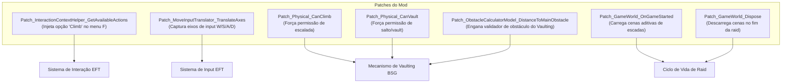

# Climbable Ladders — Patches Harmony e Integração com EFT

Para integrar a lógica de escalada com os sistemas proprietários de movimentação, física, menus de contexto e ciclo de vida do Escape From Tarkov, o mod utiliza a biblioteca **SPT.Reflection.Patching** (Harmony Patches / `ModulePatch`).

---

## 1. Mapeamento Geral dos Patches Harmony

---

## 2. Detalhamento dos Patches e Mecanismo de Injeção

### 1. Injeção da Ação de Escalada (`GetAvailableActions`)
- **Alvo:** [GetActionsClass.GetAvailableActions(GamePlayerOwner, GInterface177)](../../../references/eft-decompiled/Assembly-CSharp/GetActionsClass.cs)
- **Patch:** [Patch_InteractionContextHelper_GetAvailableActions.cs](../modded/ladders.bep/Patch_InteractionContextHelper_GetAvailableActions.cs)
- **Tipo:** `[PatchPrefix]`
- **Comportamento:**
  - Verifica se o objeto interativo é do tipo [Ladder](../modded/ladders.shared/Ladder.cs).
  - Se o jogador já estiver no estado de buffer de transição/escalada (`IsInBufferZone == true`), suprime a interação.
  - Avalia se o jogador está atrás da escada no solo (`Vector3.Dot(playerForward, ladderForward) > 0f && !aboveLadder`); se verdadeiro, bloqueia a interação traseira.
  - Constrói a estrutura de interação injetando o botão **"Climb"**, cujo callback instancia o [PlayerLadderController](../modded/ladders.bep/PlayerLadderController.cs) e dispara a escalada.

### 2. Captura de Input Sem Fricção (`TranslateAxes`)
- **Alvo:** [Class1728.TranslateAxes(ref float[] axes)](../../../references/eft-decompiled/Assembly-CSharp/Class1728.cs)
- **Patch:** [Patch_MoveInputTranslator_TranslateAxes.cs](../modded/ladders.bep/Patch_MoveInputTranslator_TranslateAxes.cs)
- **Tipo:** `[PatchPrefix]`
- **Comportamento:**
  - Mantém um sistema de publicação/inscrição (`Subscribe`/`Unsubscribe`) por `ProfileId` de jogador.
  - Captura os eixos de entrada analógica/teclado ($W/S$ para subida/descida e $A/D$ para rotação em barra fixa) antes de serem descartados pela flag `IsAxesIgnored = true`.

### 3. Habilitação de Vaulting no Topo da Escada
- **Alvos:** [PlayerPhysicalClass.CanClimb](../../../references/eft-decompiled/Assembly-CSharp/PlayerPhysicalClass.cs), [PlayerPhysicalClass.CanVault](../../../references/eft-decompiled/Assembly-CSharp/PlayerPhysicalClass.cs) e [ObstacleCalculatorModel.DistanceToMainObstacle](../../../references/eft-decompiled/Assembly-CSharp/GClass2711.cs)
- **Patches:** [Patch_Physical.cs](../modded/ladders.bep/Patch_Physical.cs) e [Patch_VaultingComponent.cs](../modded/ladders.bep/Patch_VaultingComponent.cs)
- **Tipo:** `[PatchPostfix]`
- **Comportamento:**
  - Quando `OverrideCanClimb` e `OverrideCanVault` estão ativos, forçam o subsistema físico do Tarkov a autorizar saltos mesmo com o personagem desarmado e suspenso verticalmente.
  - Em `DistanceToMainObstacle`, sobrescreve o cálculo de distância do modelo de obstáculos para `<= 0.499f` (o mínimo exigido pelo validador do jogo é 0.5f), permitindo que o método `TryVaulting()` da BSG inicie imediatamente a animação de transposição sobre a borda superior.

---

## 3. Tabela de Remapeamento de Obfuscação (SPT 4.0 / EFT 0.16.9)

O arquivo [GlobalUsings_EFTDeobfuscationRemap.cs](../modded/ladders.bep/GlobalUsings_EFTDeobfuscationRemap.cs) centraliza as diretivas `global using` que mapeiam os tipos ofuscados do cliente descompilado do EFT:

| Nome Conceitual / Amigável | Tipo Ofuscado EFT 0.16.9 (Assembly-CSharp) | Descrição / Função no Tarkov |
|---|---|---|
| `VaultingComponent` | `GClass2679` | Componente central de gerenciamento de vaulting do jogador. |
| `IVaultingModel` | `GInterface304` | Interface de parametrização de vaulting. |
| `VaultingModel` | `GClass2716` | Modelo de cálculo de parâmetros de transposição. |
| `IVaultingMove` | `GInterface282` | Interface do estado de movimento de transposição. |
| `BaseVaultingMoveModel` | `GClass2672` | Modelo base de movimentação de escalada/salto. |
| `ClimbMoveModel` | `GClass2673` | Modelo de subida vertical sobre obstáculos. |
| `VaultMoveModel` | `GClass2674` | Modelo de salto dinâmico sobre obstáculos baixos. |
| `IObstacleCalculatorModel` | `GInterface299` | Interface do calculador de obstáculos. |
| `ObstacleCalculatorModel` | `GClass2711` | Classe que avalia distância e altura de obstáculos. |
| `BaseVaultingAudioController` | `GClass2681` | Controlador de áudio de equipamentos e passos no vaulting. |
| `IInteractive` | `GInterface177` | Interface de objetos interativos no mundo (WorldInteractiveObject). |
| `InteractionContextHelper` | `GetActionsClass` | Classe utilitária que gera as ações disponíveis no menu F. |
| `AvailableInteractionState` | `ActionsReturnClass` | Estrutura de retorno com a lista de ações disponíveis. |
| `InteractionAction` | `ActionsTypesClass` | Definição de uma ação individual de menu de contexto. |
| `InteractionParameters` | `EFT.Interactive.WorldInteractiveObject.GStruct436` | Parâmetros de alinhamento e interação do jogador. |
| `ApproachState` | `ApproachStateClass` | Estado de movimentação do jogador para alinhamento em objetos. |
| `DamageHelper` | `GClass3051` | Utilitário de tipos de dano (FallDamage, etc.). |
| `DamageInfo` | `DamageInfoStruct` | Estrutura de informações de dano em partes do corpo. |
| `LayerMaskController` | `LayerMaskClass` | Camadas de colisão do jogo (TerrainLowPoly, etc.). |
| `MoveInputTranslator` | `Class1728` | Tradutor de vetores de entrada do teclado/mouse. |
| `IWeaponGripPose` | `GInterface26` | Interface de poses dinâmicas de dedos e empunhadura. |
