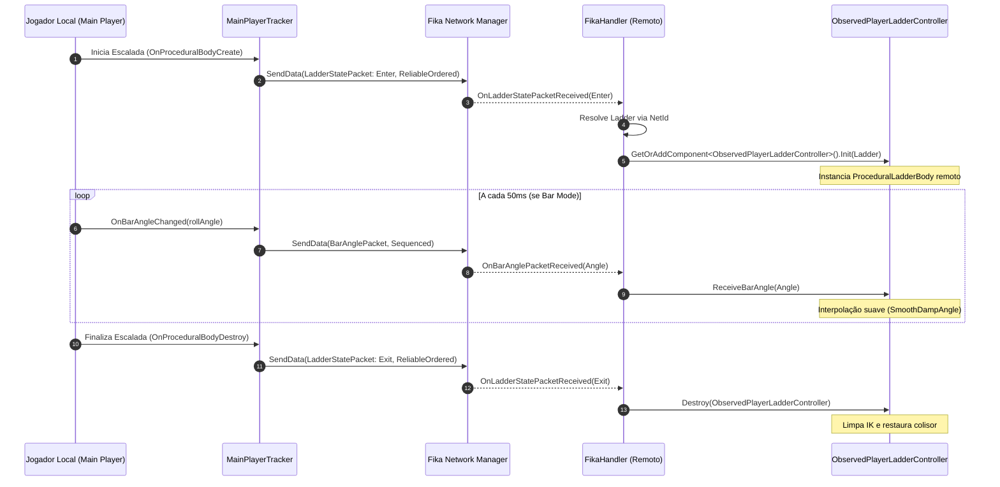
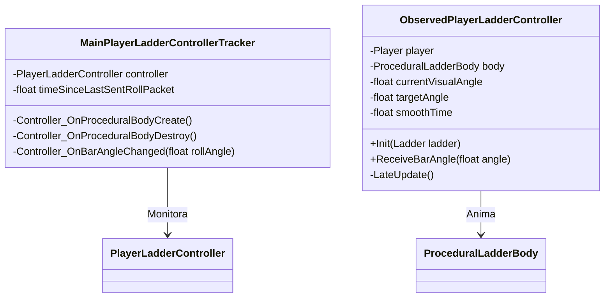

# Climbable Ladders — Suporte Multiplayer Coop (Fika)

O assembly [tarkin.ladders.fika](../modded/ladders.fika/Plugin.cs) estende o mod para fornecer suporte completo ao ambiente cooperativo multiplayer **Fika Core**, sincronizando em tempo real a entrada, saída, animação procedural e oscilação em barras fixas entre todos os operadores da partida.

---

## 1. Arquitetura de Rede e Sincronização

A integração de rede opera em um modelo cliente-servidor/P2P mediado pela infraestrutura LiteNetLib do Fika:

---

## 2. Pacotes de Rede Serializados

O mod define dois pacotes de rede estruturados que implementam a interface `INetSerializable`:

### 1. `LadderStatePacket`
- **Arquivo:** [LadderStatePacket.cs](../modded/ladders.fika/LadderStatePacket.cs)
- **Método de Entrega:** `DeliveryMethod.ReliableOrdered` (garante que nenhuma entrada ou saída seja perdida ou chegue fora de ordem).
- **Campos:**
  - `int PlayerId`: Identificador único do jogador na sessão coop.
  - `EStateType Type`: Enum de 1 byte (`Enter = 0`, `Exit = 1`).
  - `string LadderId`: Identificador `NetId` da escada no mapa.

### 2. `BarAnglePacket`
- **Arquivo:** [BarAnglePacket.cs](../modded/ladders.fika/BarAnglePacket.cs)
- **Método de Entrega:** `DeliveryMethod.Sequenced` (descarta pacotes atrasados em favor do estado mais recente).
- **Campos:**
  - `int PlayerId`: Identificador único do jogador.
  - `float Angle`: Ângulo instantâneo de rotação/balanço na barra fixa.
- **Taxa de Envio (*Throttle*):** Limitada a um intervalo mínimo de **`50ms`** (20 Hz) via `PacketSendCooldown` para evitar sobrecarga de largura de banda na rede.

---

## 3. Rastreamento e Replicação Remota

### Componentes de Rede:

1. **`MainPlayerLadderControllerTracker`:**
   Monitora eventos do [PlayerLadderController](../modded/ladders.bep/PlayerLadderController.cs) local. Inscreve-se nos callbacks `OnProceduralBodyCreate`, `OnProceduralBodyDestroy` e `OnBarAngleChanged` para empacotar e despachar os dados via `IFikaNetworkManager.SendData()`.
2. **`ObservedPlayerLadderController`:**
   Componente anexado aos clones de jogadores remotos (`ObservedPlayerView`). Instancia um [ProceduralLadderBody](../modded/ladders.bep/ProceduralLadderBody.cs) específico para o personagem remoto e interpola os ângulos de balanço em barra fixa com `Mathf.SmoothDampAngle` ($t_{\text{smooth}} = 0.1\text{s}$), eliminando tremores e lag de rede.
