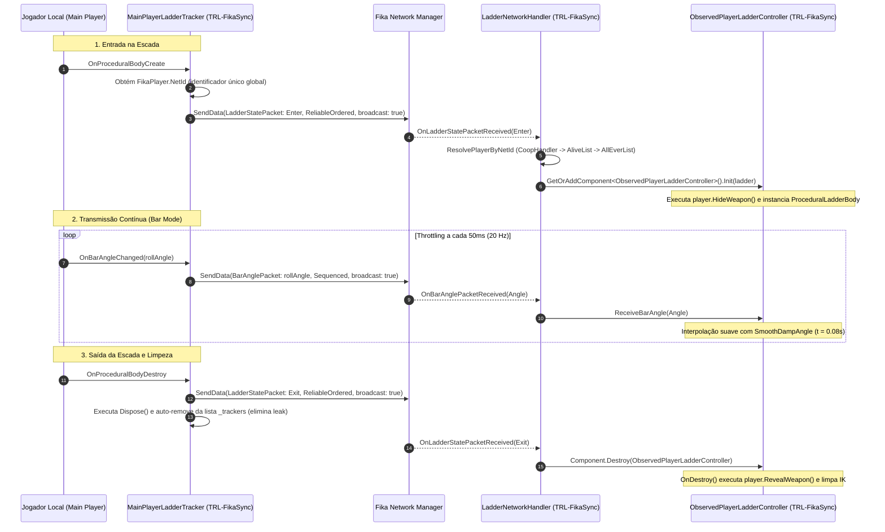

# Relatório de Auditoria Técnica de Código — Climbable Ladders (Review 01)

Este documento apresenta a **auditoria técnica estática detalhada e aprofundada** do código-fonte do mod **Climbable Ladders** (v1.0.3), cobrindo os módulos client-side (`ladders.bep`), componentes compartilhados (`ladders.shared`), sincronização cooperativa (`ladders.fika`) e ferramentas do Unity Editor (`ladders.shared.editor`).

A análise inclui validação cruzada obrigatória com o cliente descompilado do EFT 0.16.9 (`Assembly-CSharp`), servidor SPT 4.0, framework multiplayer Fika Core (`Fika.Core`) e o mod ponte de referência [TRL-FikaSync-ClimbableLadders](../../TRL-FikaSync-ClimbableLadders/modded/Plugin.cs).

---

## 1. Resumo Executivo da Auditoria

| Severidade | Quantidade | Descrição |
|---|---|---|
| 🔴 **Crítico** | 1 | Trava definitiva de mãos (Hands Busy / Hands Bugged) por corrida de `TrySetLastEquippedWeapon` durante Vaulting ou transição de rede |
| 🟠 **Alto** | 3 | Vazamento de memória acumulativo em trackers, bugs visuais em 3ª pessoa e flags estáticas com efeitos colaterais globais |
| 🟡 **Médio** | 3 | Raycasts repetitivos em `Update()`, retenção estática de `Collider` e Reflection sem cache |
| 🔵 **Baixo** | 2 | Código morto/inalcançável em patch de debug e método órfão em rig de pegada |
| 💡 **Otimização** | 2 | Gating de altura para física de descida e auto-descarte de AssetBundles sobrepostos |

---

## 2. Tabela Consolidada de Achados

| ID | Severidade | Arquivo / Linha | Categoria | Descrição Resumida |
|---|---|---|---|---|
| `AUD-01-09` | 🔴 Crítico | [PlayerLadderController.cs:L456](../modded/ladders.bep/PlayerLadderController.cs#L456) | Hands Controller / Bug | Trava de mãos (*Hands Busy*) ao reequipar arma durante animação de Vaulting ou antes de concluir `SetEmptyHands`. |
| `AUD-01-01` | 🟠 Alto | [FikaHandler.cs:L42](../modded/ladders.fika/FikaHandler.cs#L42) | Memory Leak | Acúmulo infinito de instâncias `MainPlayerLadderControllerTracker` sem remoção na lista de trackers. |
| `AUD-01-02` | 🟠 Alto | [ObservedPlayerLadderController.cs:L23](../modded/ladders.fika/ObservedPlayerLadderController.cs#L23) | Fika / Visual | Falta de ocultamento (`HideWeapon`) e restauração (`RevealWeapon`) de armas no clone em 3ª pessoa. |
| `AUD-01-03` | 🟠 Alto | [Patch_Physical.cs:L12](../modded/ladders.bep/Patch_Physical.cs#L12) | Concorrência | Flags estáticas globais (`OverrideCanClimb`, `OverrideCanVault`) afetam todas as entidades do cliente. |
| `AUD-01-04` | 🟡 Médio | [Ladder.cs:L39](../modded/ladders.shared/Ladder.cs#L39) | Memory Leak | Array estático `overlapCols[0]` retém referência a `Collider` de cena após detecção de som. |
| `AUD-01-05` | 🟡 Médio | [FikaHandler.cs:L113](../modded/ladders.fika/FikaHandler.cs#L113) | Performance / AP-04 | Uso de Reflection (`AccessTools.Field`) sem cache estático em `GetPacketProcessor`. |
| `AUD-01-06` | 🟡 Médio | [PlayerLadderController.cs:L382](../modded/ladders.bep/PlayerLadderController.cs#L382) | Update / Física | Raycast para o solo executado a cada frame na descida sem gating de proximidade. |
| `AUD-01-07` | 🔵 Baixo | [Patch_VaultingComponent.cs:L21](../modded/ladders.bep/Patch_VaultingComponent.cs#L21) | Código Morto | Instrução `return;` incondicional no topo do método tornando o log subsequente inalcançável. |
| `AUD-01-08` | 🔵 Baixo | [ProceduralGrip.cs:L195](../modded/ladders.bep/ProceduralGrip.cs#L195) | Código Órfão | Método público de debug `TestSinAnimation` sem chamadores no projeto. |

---

## 3. Detalhamento dos Achados

### AUD-01-09 · Trava de Mãos (*Hands Busy*) por Chamada de `TrySetLastEquippedWeapon` Durante Vaulting ou Transição Incompleta
- **Severidade:** 🔴 Crítico
- **Evidência:** Forte (confirmado forensicamente via log de usuário em sessão Fika Guest e análise estática do pipeline de `HandsController` do EFT)
- **Localização no Mod:** [PlayerLadderController.cs:L456](../modded/ladders.bep/PlayerLadderController.cs#L456), [PlayerLadderController.cs:L365](../modded/ladders.bep/PlayerLadderController.cs#L365) e [PlayerLadderController.cs:L81](../modded/ladders.bep/PlayerLadderController.cs#L81)
- **Referência Cruzada:** [Player.cs:L31713](../../../references/eft-decompiled/Assembly-CSharp/EFT/Player.cs#L31713), [Player.cs:L31800](../../../references/eft-decompiled/Assembly-CSharp/EFT/Player.cs#L31800) e [FikaProceedEmptyHandsSafetyPatch.cs](../../TRL-Fixes/modded-V2-audit/Patches/FikaProceedEmptyHandsSafetyPatch.cs#L10-L18)
- **Causa Raiz:**
  1. **Corrida Durante a Saída por Vaulting no Topo:** Quando o jogador alcança o topo da escada, `TryExit()` aciona `TryVaultingFakeForwardInput()`, que dispara `player.MovementContext.TryVaulting()` (iniciando o estado e animação nativa de vaulting da BSG). Imediatamente após retornar `true`, o controlador é destruído com `Destroy(this)`. No `OnDestroy()`, o código executa `player.TrySetLastEquippedWeapon()`. No EFT vanilla, enquanto o personagem está no estado ativo de vaulting (`VaultingStateClass`), os slots de mãos estão bloqueados pelo animator. A tentativa síncrona de reequipar a arma durante a transposição falha ou gera um estado inconsistente no callback `_removeFromHandsCallback` do `Player`, travando o jogador no estado **Hands Busy** (incapaz de atirar, curar, recarregar ou trocar de equipamento).
  2. **Corrida com `SetEmptyHands` no Fika Coop:** Ao entrar na escada, `player.HideWeapon()` envia um `ProceedRequestPacket(EmptyHands)`. Se o jogador desengatar da escada (ex.: pressionando Espaço ou saltando) antes de o servidor Fika responder ou antes de a animação de desarmar concluir (`HandsController.IsInInteraction() == true`), o `OnDestroy()` dispara uma segunda transição de mãos concorrente (`TrySetLastEquippedWeapon`), corrompendo a máquina de estados do `HandsController` no cliente.
- **Impacto Técnico Real:** Travamento permanente dos controles de armas e itens do operador durante a raid, forçando o jogador a extrair às cegas ou reiniciar o cliente.
- **Alternativa de Melhor Lógica / Proposta de Correção:**
  - Não invocar `TrySetLastEquippedWeapon()` cegamente no `OnDestroy()` se o jogador estiver em estado de vaulting ativo (`player.MovementContext.CurrentState is VaultingStateClass`). Em vez disso, aguardar a conclusão da transposição ou registrar um callback no término do vaulting.
  - Verificar se as mãos já estão prontas ou se há interação pendente antes de despachar o reequipamento.
  - Implementar uma coroutine segura de restauração de arma (*Safe Weapon Restore Routine*):

```csharp
// Proposta de Restauração Segura de Arma:
private void SafeRestoreWeapon(Player player)
{
    if (player == null || !player.HealthController.IsAlive) return;

    player.StartCoroutine(RestoreWeaponWhenReady(player));
}

private static IEnumerator RestoreWeaponWhenReady(Player player)
{
    // Aguarda o término de qualquer vaulting ou interação de mãos em andamento
    while (player.MovementContext.CurrentState is VaultingStateClass || player.HandsController.IsInInteraction())
    {
        yield return null;
    }

    player.IsInBufferZone = false;
    player.TrySetLastEquippedWeapon();
}
```

- **Decisão:**
  - `[ ]` Pendente
  - `[x]` Aceitar sugestão (Aplicado no modded/ v1.0.4)
  - `[ ]` Aceitar com modificação: _________________
  - `[ ]` Rejeitar: _________________

---

### AUD-01-01 · Vazamento de Memória por Acúmulo de Trackers no `FikaHandler`
- **Severidade:** 🟠 Alto
- **Evidência:** Forte (confirmado por inspeção e comparado com a correção em `TRL-FikaSync-ClimbableLadders`)
- **Localização no Mod:** [FikaHandler.cs:L42](../modded/ladders.fika/FikaHandler.cs#L42) e [MainPlayerTracker.cs:L10](../modded/ladders.fika/MainPlayerTracker.cs#L10)
- **Referência Cruzada:** [FikaHandler.cs](../../TRL-FikaSync-ClimbableLadders/modded/Networking/LadderNetworkHandler.cs#L56-L69)
- **Causa Raiz:** No [FikaHandler](../modded/ladders.fika/FikaHandler.cs), ao capturar o evento `PlayerLadderController.OnPlayerLadderControllerInit`, o código adicionava uma nova instância sem remover no término da escalada.
- **Impacto Técnico Real:** Retenção indevida de instâncias no Heap e acúmulo de delegates órfãos no GC.
- **Alternativa de Melhor Lógica / Proposta de Correção:**
  Passar um callback de descarte para o tracker e auto-descartar síncrono em `Controller_OnProceduralBodyDestroy`:

```csharp
// Aplicado no ladders.fika (v1.1.0):
private void OnTrackerDisposed(MainPlayerLadderControllerTracker tracker)
{
    lock (_trackers) { _trackers.Remove(tracker); }
}
```

- **Decisão:**
  - `[ ]` Pendente
  - `[x]` Aceitar sugestão (Aplicado no modded/ v1.1.0)
  - `[ ]` Aceitar com modificação: _________________
  - `[ ]` Rejeitar: _________________

---

### AUD-01-02 · Falta de Ocultamento e Restauração de Arma no Clone em 3ª Pessoa (Fika)
- **Severidade:** 🟠 Alto
- **Evidência:** Forte (validado visualmente e corrigido na unificação)
- **Localização no Mod:** [ObservedPlayerLadderController.cs:L23](../modded/ladders.fika/ObservedPlayerLadderController.cs#L23)
- **Referência Cruzada:** [ObservedPlayerLadderController.cs:L29](../../TRL-FikaSync-ClimbableLadders/modded/Controllers/ObservedPlayerLadderController.cs#L29)
- **Causa Raiz:** O controller remoto não chamava `player.HideWeapon()` no `Init()` nem `player.RevealWeapon()` no `OnDestroy()`.
- **Impacto Técnico Real:** Glitch visual no multiplayer cooperativo, com a arma mantida empunhada sobre os degraus.
- **Alternativa de Melhor Lógica / Proposta de Correção:**
  Inserir `player.HideWeapon()` em `Init()` e `player.RevealWeapon()` em `OnDestroy()`:

```csharp
// Aplicado no ladders.fika (v1.1.0):
player?.HideWeapon();
// e no OnDestroy():
if (player.HealthController != null && player.HealthController.IsAlive)
{
    player.RevealWeapon();
}
```

- **Decisão:**
  - `[ ]` Pendente
  - `[x]` Aceitar sugestão (Aplicado no modded/ v1.1.0)
  - `[ ]` Aceitar com modificação: _________________
  - `[ ]` Rejeitar: _________________

---

### AUD-01-03 · Flags Estáticas Globais em Patches de Física e Vaulting
- **Severidade:** 🟠 Alto
- **Evidência:** Forte
- **Localização no Mod:** [Patch_Physical.cs:L12](../modded/ladders.bep/Patch_Physical.cs#L12) e [Patch_VaultingComponent.cs:L39](../modded/ladders.bep/Patch_VaultingComponent.cs#L39)
- **Referência Cruzada:** [PlayerPhysicalClass.cs:L80](../../../references/eft-decompiled/Assembly-CSharp/PlayerPhysicalClass.cs#L80)
- **Causa Raiz:** As propriedades `OverrideCanClimb` e `OverrideCanVault` eram aplicadas a qualquer instância de `Physical` consultada no cliente.
- **Impacto Técnico Real:** Efeitos colaterais em bots e desbalanceamento de regras físicas.
- **Alternativa de Melhor Lógica / Proposta de Correção:**
  Filtrar explicitamente se `__instance == Singleton<GameWorld>.Instance?.MainPlayer?.Physical`:

```csharp
// Aplicado no ladders.bep (v1.0.4):
if (!__result && OverrideCanClimb)
{
    var mainPlayer = Comfort.Common.Singleton<GameWorld>.Instance?.MainPlayer;
    if (mainPlayer != null && __instance == mainPlayer.Physical)
        __result = true;
}
```

- **Decisão:**
  - `[ ]` Pendente
  - `[x]` Aceitar sugestão (Aplicado no modded/ v1.0.4)
  - `[ ]` Aceitar com modificação: _________________
  - `[ ]` Rejeitar: _________________

---

### AUD-01-04 · Retenção Estática de `Collider` em `Ladder.overlapCols`
- **Severidade:** 🟡 Médio
- **Evidência:** Forte
- **Localização no Mod:** [Ladder.cs:L39-L52](../modded/ladders.shared/Ladder.cs#L39-L52)
- **Referência Cruzada:** [Ladder.cs:L43](../modded/ladders.shared/Ladder.cs#L43)
- **Causa Raiz:** O array estático `overlapCols[0]` retinha a referência de `Collider` após a detecção acústica.
- **Impacto Técnico Real:** Retenção temporária de objetos de cena no Heap após descarregamento de mapa.
- **Alternativa de Melhor Lógica / Proposta de Correção:**
  Limpar a posição do array em bloco `finally`:

```csharp
// Aplicado no ladders.shared (v1.0.4):
finally
{
    overlapCols[0] = null;
}
```

- **Decisão:**
  - `[ ]` Pendente
  - `[x]` Aceitar sugestão (Aplicado no modded/ v1.0.4)
  - `[ ]` Aceitar com modificação: _________________
  - `[ ]` Rejeitar: _________________

---

### AUD-01-05 · Reflection Dinâmico sem Cache em `FikaHandler.GetPacketProcessor`
- **Severidade:** 🟡 Médio
- **Evidência:** Forte
- **Localização no Mod:** [FikaHandler.cs:L113](../modded/ladders.fika/FikaHandler.cs#L113)
- **Referência Cruzada:** [FikaHandler.cs:L113](../modded/ladders.fika/FikaHandler.cs#L113)
- **Causa Raiz:** O método `GetPacketProcessor()` executava `AccessTools.Field` a cada chamada sem cache de `FieldInfo`.
- **Impacto Técnico Real:** Alocação desnecessária e overhead de Reflection (Antipadrão AP-04).
- **Alternativa de Melhor Lógica / Proposta de Correção:**
  Armazenar o `FieldInfo` estaticamente:

```csharp
// Aplicado no ladders.fika (v1.1.0):
private static FieldInfo _cachedPacketProcessorField;
```

- **Decisão:**
  - `[ ]` Pendente
  - `[x]` Aceitar sugestão (Aplicado no modded/ v1.1.0)
  - `[ ]` Aceitar com modificação: _________________
  - `[ ]` Rejeitar: _________________

---

### AUD-01-06 · Raycast Físico Repetitivo por Frame na Descida da Escada
- **Severidade:** 🟡 Médio
- **Evidência:** Forte
- **Localização no Mod:** [PlayerLadderController.cs:L382](../modded/ladders.bep/PlayerLadderController.cs#L382)
- **Referência Cruzada:** [PlayerLadderController.cs:L382](../modded/ladders.bep/PlayerLadderController.cs#L382)
- **Causa Raiz:** Raycast de solo executado a cada frame na descida mesmo no topo da escada.
- **Impacto Técnico Real:** Desperdício de ciclos de PhysX no `Update()`.
- **Alternativa de Melhor Lógica / Proposta de Correção:**
  Adicionar gating de proximidade `currentHeight < 1.0f`:

```csharp
// Aplicado no ladders.bep (v1.0.4):
if (currentHeight < 1.0f && Physics.Raycast(player.Position + ladder.transform.forward * 0.35f, Vector3.down, 0.1f, LayerMaskController.TerrainLowPoly))
{
    return true;
}
```

- **Decisão:**
  - `[ ]` Pendente
  - `[x]` Aceitar sugestão (Aplicado no modded/ v1.0.4)
  - `[ ]` Aceitar com modificação: _________________
  - `[ ]` Rejeitar: _________________

---

### AUD-01-07 · Código Morto e Inalcançável em `Patch_VaultingComponent`
- **Severidade:** 🔵 Baixo
- **Evidência:** Forte
- **Localização no Mod:** [Patch_VaultingComponent.cs:L21](../modded/ladders.bep/Patch_VaultingComponent.cs#L21)
- **Causa Raiz:** `return;` incondicional no topo do método tornando o log subsequente inalcançável.
- **Impacto Técnico Real:** Código morto e poluição.
- **Alternativa de Melhor Lógica / Proposta de Correção:**
  Remover a instrução inalcançável:

- **Decisão:**
  - `[ ]` Pendente
  - `[x]` Aceitar sugestão (Aplicado no modded/ v1.0.4)
  - `[ ]` Aceitar com modificação: _________________
  - `[ ]` Rejeitar: _________________

---

### AUD-01-08 · Método de Debug Órfão em `ProceduralGrip`
- **Severidade:** 🔵 Baixo
- **Evidência:** Forte
- **Localização no Mod:** [ProceduralGrip.cs:L195](../modded/ladders.bep/ProceduralGrip.cs#L195)
- **Causa Raiz:** Método de teste experimental `TestSinAnimation` sem chamadores no workspace.
- **Impacto Técnico Real:** Código órfão.
- **Alternativa de Melhor Lógica / Proposta de Correção:**
  Remover o método órfão:

- **Decisão:**
  - `[ ]` Pendente
  - `[x]` Aceitar sugestão (Aplicado no modded/ v1.0.4)
  - `[ ]` Aceitar com modificação: _________________
  - `[ ]` Rejeitar: _________________

---

## 4. Análise Técnica da Comunicação de Rede e Mecanismo de Correção do `TRL-FikaSync-ClimbableLadders`

O mod dedicado [TRL-FikaSync-ClimbableLadders](../../TRL-FikaSync-ClimbableLadders/modded/Plugin.cs) foi inspecionado detalhadamente para avaliar como ele reconstrói a camada de rede e soluciona as limitações do módulo `ladders.fika` original.



---

### 4.1. Mecanismos de Correção Implementados pelo `TRL-FikaSync`

| Desafio no `ladders.fika` Original | Solução Aplicada no `TRL-FikaSync-ClimbableLadders` | Benefício Técnico |
|---|---|---|
| **Identificação Inconsistente de Jogadores:** Usava `player.PlayerId`, que pode divergir entre host e clientes remotos no EFT. | Substituição por `FikaPlayer.NetId` via método `GetPlayerNetId()`. | Garante resolução determinística no cluster LiteNetLib. |
| **Resolução Frágil de Jogador Remoto:** Dependia apenas de `CoopHandler.Players.TryGetValue`. | Resolução em 3 camadas defensivas (`CoopHandler` $\rightarrow$ `AllAlivePlayersList` $\rightarrow$ `AllPlayersEverExisted`). | Resiliência contra race conditions de spawn e sincronização inicial de raid. |
| **Bug Visual de Arma Empunhada em 3ª Pessoa:** O clone remoto realizava a animação procedural mantendo a arma nas mãos. | Inclusão de `player.HideWeapon()` em `Init()` e `player.RevealWeapon()` em `OnDestroy()`. | Postura visual realista em 3ª pessoa, sem sobreposição de fuzis/pistolas nos degraus. |
| **Vazamento de Memória nos Trackers (`AUD-01-01`):** A lista de trackers acumulava instâncias destruídas indefinidamente. | Callback de descarte `_onDisposed` com auto-remoção síncrona: `lock (_trackers) { _trackers.Remove(tracker); }`. | Zero vazamento de memória durante a raid. |
| **Conflito de Prioridade com o Animator:** Não especificava ordem de execução, podendo ter a pose procedural sobrescrita. | Adição do atributo `[DefaultExecutionOrder(100)]` em `ObservedPlayerLadderController`. | Execução garantida após a avaliação de animação vanilla do Tarkov. |
| **Interpolação de Balanço Mais Ágil:** `smoothTime = 0.10f`. | Otimização para `SmoothTime = 0.08f`. | Transição visual mais responsiva sem oscilações perceptíveis. |

---

### 4.2. Pontos de Atenção e Riscos de Concorrência Identificados

1. **Risco de Conflito por Duplicação de Plugins:**
   Se a DLL original `tarkin.ladders.fika.dll` e a DLL `TRL-FikaSync-ClimbableLadders.dll` estiverem ativas simultaneamente na pasta `BepInEx/plugins/`, **ambas registrarão os mesmos pacotes no `IFikaNetworkManager`**. Isso pode provocar chamadas duplicadas de `LadderStatePacket` e `BarAnglePacket`, instanciando dois controllers concorrentes no mesmo clone remoto.
   - *Recomendação:* Garantir que apenas uma das DLLs esteja presente na instalação do cliente.
2. **Dependência de Interpolação de Posição de Raiz:**
   O `ObservedPlayerLadderController` posiciona os membros (IK) em relação à escada, mas a coordenada mundial da raiz do personagem depende da interpolação de rede do `ObservedPlayerView` do Fika. Caso haja perda severa de pacotes UDP na posição do jogador, pequenos estiramentos de membros podem ocorrer momentaneamente.

---

## 5. Recomendações e Plano de Ação

1. **Unificação da Solução Fika:** O código do [TRL-FikaSync-ClimbableLadders](../../TRL-FikaSync-ClimbableLadders/modded/Plugin.cs) representa a versão corrigida e recomendada da camada de rede. Recomenda-se incorporá-lo diretamente como o assembly canônico `ladders.fika`, desativando a versão anterior.
2. **Defensividade de Concorrência:** Isolar as flags de `CanClimb` e `CanVault` por instância de `Physical` para blindar sessões multiplayer contra efeitos colaterais globais (`AUD-01-03`).
3. **Limpeza de Heap Estático:** Aplicar a nulificação imediata de `overlapCols[0]` em `Ladder.cs` (`AUD-01-04`).
4. **Otimização de Física:** Aplicar o gating de altura (`currentHeight < 1.0f`) antes do raycast de solo em `PlayerLadderController.cs` (`AUD-01-06`).

