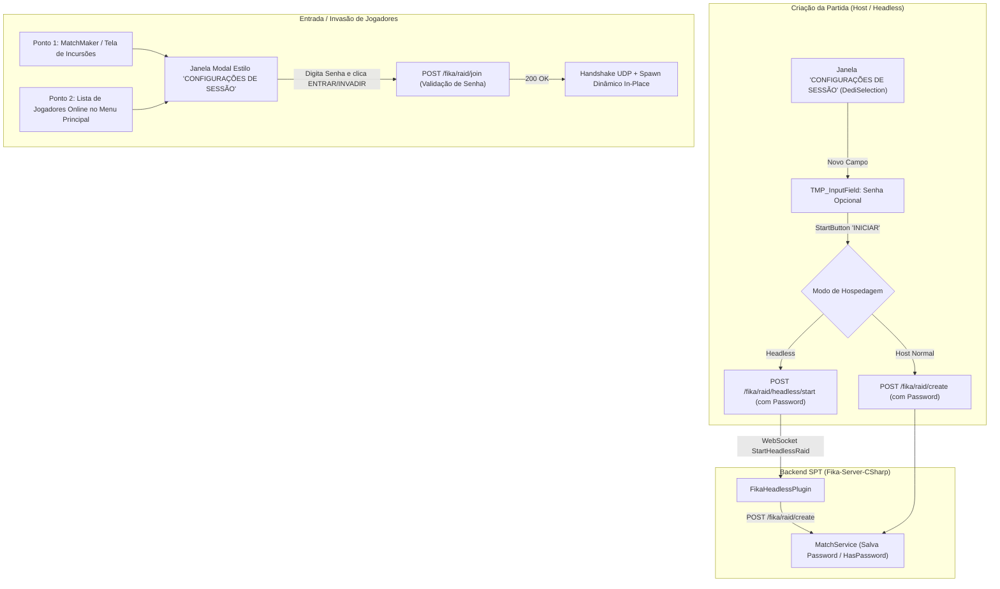
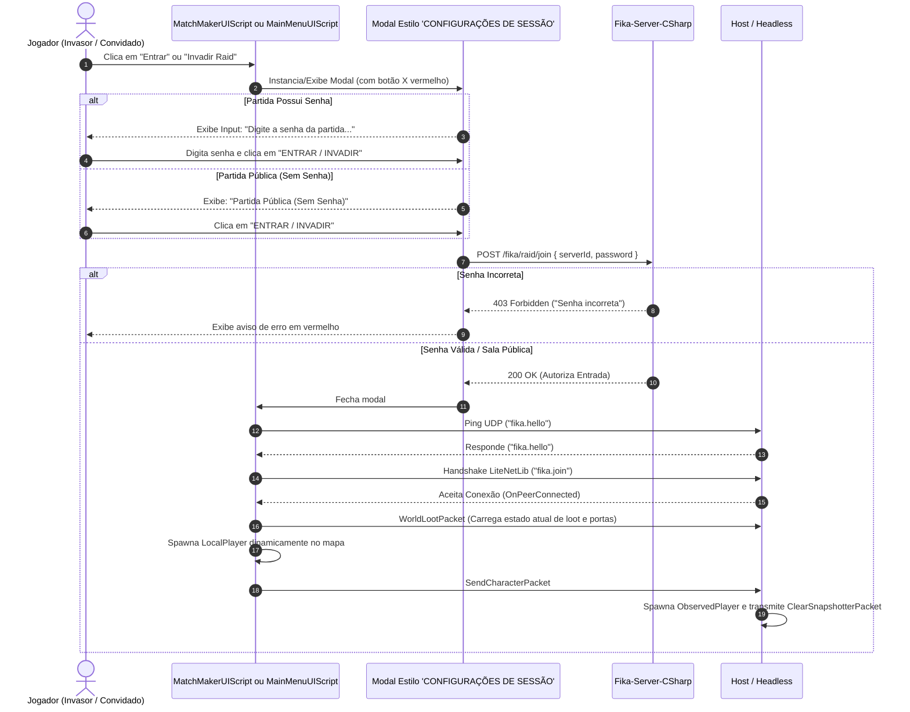

# 010 — Conexão em Raid em Andamento (Join In Progress / Invasão) e Sistema de Senha Opcional (Host & Headless) · Spec Técnica

**Mod:** FIKA  
**Target:** `mods/FIKA/modded-V2/`  
**Spec funcional:** [010-join-in-progress-senha-lobby-headless-01-spec.md](010-join-in-progress-senha-lobby-headless-01-spec.md)  
**Criado:** 2026-09-13  

> Fonte primária de verdade para qualquer assinatura, fórmula ou ponto de patch: [references/eft-decompiled/Assembly-CSharp/](../../../../references/eft-decompiled/Assembly-CSharp/). Toda referência ao código do EFT deve citar `arquivo.cs:linha`. Wiki SPT e fontes externas só como complemento.

## 1. Estratégia Técnica e Arquitetura de UI



### 1.1. Campo de Senha na Janela "CONFIGURAÇÕES DE SESSÃO" (`DediSelection`)
A janela `_fikaMatchMakerUi.DediSelection` ([`MatchMakerUIScript.cs:211`](file:///d:/Projetos/GITHUB%20TARKOV/tarkov-spt-4.0/mods/FIKA/modded-V2/Fika-Plugin/Fika.Core/UI/Custom/MatchMakerUIScript.cs#L211)) é o local nativo onde o anfitrião configura a sessão:
- Contém:
  - Título: **"CONFIGURAÇÕES DE SESSÃO"**
  - Botão fechar: `CloseButton` com `X` vermelho no canto superior direito.
  - Checkbox: "Usar Host Headless" (`DedicatedToggle`).
  - Dropdown: Seleção de instâncias Headless (`HeadlessSelection`).
  - Botão: **"INICIAR"** (`StartButton`).
- **Novo Elemento:** Inserção de um `TMP_InputField` estilizado no tema escuro do EFT logo abaixo das configurações de Headless e acima do botão "INICIAR".
  - Placeholder: *"Senha da Partida (Opcional)"*.
  - Funciona de forma unificada: se o anfitrião hospedar normal ou Headless, o valor desse campo é lido ao clicar em "INICIAR".

### 1.2. Janela Modal de Entrada / Invasão (Estilo "CONFIGURAÇÕES DE SESSÃO")
Para os jogadores que vão conectar-se a uma partida existente (pré-raid ou raid em andamento):
- Em vez de um popup genérico, instancia-se um componente modal com a **mesma identidade visual da janela de Configurações de Sessão**:
  - Moldura retangular escura com borda EFT.
  - Barra de título com botão `X` vermelho no canto superior direito.
  - Campo central com `TMP_InputField` (com caracteres mascarados para senha).
  - Botão inferior largo: **"ENTRAR"** (pré-raid) ou **"INVADIR"** (raid em andamento).
- **Dois Pontos de Chamada:**
  1. **Tela de Incursões / MatchMaker:** Ao clicar no botão de entrar de um servidor listado ([`MatchMakerUIScript.cs:525`](file:///d:/Projetos/GITHUB%20TARKOV/tarkov-spt-4.0/mods/FIKA/modded-V2/Fika-Plugin/Fika.Core/UI/Custom/MatchMakerUIScript.cs#L525)).
  2. **Menu Principal / Lista de Jogadores Online:** Ao clicar no botão "Entrar" de um jogador na lista de online players ([`MainMenuUIScript.cs:240`](file:///d:/Projetos/GITHUB%20TARKOV/tarkov-spt-4.0/mods/FIKA/modded-V2/Fika-Plugin/Fika.Core/UI/Custom/MainMenuUIScript.cs#L240)).

---

## 2. Pontos de Patch e Alvos de Código

| Alvo | Tipo | Arquivo | Motivo |
|---|---|---|---|
| [`MatchMakerUIScript.cs:211-340`](file:///d:/Projetos/GITHUB%20TARKOV/tarkov-spt-4.0/mods/FIKA/modded-V2/Fika-Plugin/Fika.Core/UI/Custom/MatchMakerUIScript.cs#L211) | UI Client | `Fika.Core` | Adicionar campo de senha na janela "CONFIGURAÇÕES DE SESSÃO" (`DediSelection`). |
| [`MatchMakerUIScript.cs:521-660`](file:///d:/Projetos/GITHUB%20TARKOV/tarkov-spt-4.0/mods/FIKA/modded-V2/Fika-Plugin/Fika.Core/UI/Custom/MatchMakerUIScript.cs#L521) | UI Client | `Fika.Core` | Habilitar botão "Invadir Raid" e abrir modal estilo "Configurações de Sessão" ao clicar. |
| [`MainMenuUIScript.cs:240-320`](file:///d:/Projetos/GITHUB%20TARKOV/tarkov-spt-4.0/mods/FIKA/modded-V2/Fika-Plugin/Fika.Core/UI/Custom/MainMenuUIScript.cs#L240) | UI Client | `Fika.Core` | Abrir modal estilo "Configurações de Sessão" ao clicar em entrar pela lista de jogadores online. |
| [`FikaServer.cs:815-860`](file:///d:/Projetos/GITHUB%20TARKOV/tarkov-spt-4.0/mods/FIKA/modded-V2/Fika-Plugin/Fika.Core/Networking/FikaServer.cs#L815) | Rede Client/Host | `Fika.Core` | Pinger UDP e `OnConnectionRequest`: autorizar invasão em raids ativas. |
| [`StartHeadlessRequest.cs:10`](file:///d:/Projetos/GITHUB%20TARKOV/tarkov-spt-4.0/mods/FIKA/modded-V2/Fika-Plugin/Fika.Core/Networking/Models/Headless/StartHeadlessRequest.cs#L10) | DTO Client | `Fika.Core` | Adicionar campo opcional `public string? Password`. |
| [`FikaHeadlessPlugin.cs:454-520`](file:///d:/Projetos/GITHUB%20TARKOV/tarkov-spt-4.0/mods/FIKA/modded-V2/Fika-Headless/Fika.Headless/FikaHeadlessPlugin.cs#L454) | Executável | `Fika.Headless` | `BeginFikaStartRaid`: propagar senha para `FikaBackendUtils.CreateMatch`. |
| [`StartHeadlessRequest.cs:9`](file:///d:/Projetos/GITHUB%20TARKOV/tarkov-spt-4.0/mods/FIKA/modded-V2/Fika-Server-CSharp/FikaServer/Models/Fika/Routes/Headless/StartHeadlessRequest.cs#L9) | DTO Server | `Fika-Server-CSharp` | Adicionar propriedade `Password` no DTO do servidor. |
| [`FikaRaidCreateRequestData.cs:10`](file:///d:/Projetos/GITHUB%20TARKOV/tarkov-spt-4.0/mods/FIKA/modded-V2/Fika-Server-CSharp/FikaServer/Models/Fika/Routes/Raid/Create/FikaRaidCreateRequestData.cs#L10) | DTO Server | `Fika-Server-CSharp` | Adicionar propriedade `Password` no registro de raid. |
| [`FikaMatch.cs:10`](file:///d:/Projetos/GITHUB%20TARKOV/tarkov-spt-4.0/mods/FIKA/modded-V2/Fika-Server-CSharp/FikaServer/Models/Fika/FikaMatch.cs#L10) | Model Server | `Fika-Server-CSharp` | Armazenar senha e expor `HasPassword => !string.IsNullOrEmpty(Password)`. |
| [`FikaRaidResponse.cs:7`](file:///d:/Projetos/GITHUB%20TARKOV/tarkov-spt-4.0/mods/FIKA/modded-V2/Fika-Server-CSharp/FikaServer/Models/Fika/Routes/Location/FikaRaidResponse.cs#L7) | DTO Server | `Fika-Server-CSharp` | Incluir campo `HasPassword` na listagem de servidores. |
| [`LocationController.cs:38`](file:///d:/Projetos/GITHUB%20TARKOV/tarkov-spt-4.0/mods/FIKA/modded-V2/Fika-Server-CSharp/FikaServer/Controllers/LocationController.cs#L38) | Controller Server | `Fika-Server-CSharp` | Preencher `HasPassword = match.HasPassword` no retorno de `/fika/location/raids`. |
| [`RaidController.cs:68`](file:///d:/Projetos/GITHUB%20TARKOV/tarkov-spt-4.0/mods/FIKA/modded-V2/Fika-Server-CSharp/FikaServer/Controllers/RaidController.cs#L68) | Controller Server | `Fika-Server-CSharp` | `HandleRaidJoin`: validar senha fornecida contra a senha da sessão. |

---

## 3. Diagrama de Sequência: Entrada / Invasão Unificada



---

## 4. Stubs de Interface C#

### 4.1. Campo de Senha em `MatchMakerUIScript` ("CONFIGURAÇÕES DE SESSÃO")
```csharp
// mods/FIKA/modded-V2/Fika-Plugin/Fika.Core/UI/Custom/MatchMakerUIScript.cs
// Dentro da inicialização da janela _fikaMatchMakerUi.DediSelection:
private TMP_InputField _hostPasswordInput;

private void SetupSessionSettingsPasswordInput()
{
    var dediTransform = _fikaMatchMakerUi.DediSelection.transform;
    
    // Criação do campo de senha aproveitando o visual nativo do EFT
    var inputGo = new GameObject("SessionPasswordInput", typeof(RectTransform), typeof(Image), typeof(TMP_InputField));
    inputGo.transform.SetParent(dediTransform, false);
    
    _hostPasswordInput = inputGo.GetComponent<TMP_InputField>();
    _hostPasswordInput.contentType = TMP_InputField.ContentType.Password;
    _hostPasswordInput.placeholder = CreatePlaceholderText("Senha da Partida (Opcional)");
    // Posicionamento entre a seleção de headless e o botão INICIAR
}
```

### 4.2. Modal de Entrada / Invasão Reutilizável
```csharp
// mods/FIKA/modded-V2/Fika-Plugin/Fika.Core/UI/Custom/JoinSessionModal.cs
public class JoinSessionModal : MonoBehaviour
{
    public TextMeshProUGUI TitleText;
    public Button CloseButton;
    public TMP_InputField PasswordInput;
    public Button ConfirmButton;
    public TextMeshProUGUI ConfirmButtonText;
    public TextMeshProUGUI InfoText;

    public void Show(string serverId, string hostName, bool hasPassword, bool isInProgress, Action<string> onConfirm)
    {
        gameObject.SetActive(true);
        TitleText.SetText(isInProgress ? "INVADIR RAID" : "ENTRAR EM RAID");
        ConfirmButtonText.SetText(isInProgress ? "INVADIR" : "ENTRAR");

        PasswordInput.gameObject.SetActive(hasPassword);
        PasswordInput.text = string.Empty;

        InfoText.gameObject.SetActive(!hasPassword);
        if (!hasPassword)
        {
            InfoText.SetText("Partida pública sem restrição de senha.");
        }

        CloseButton.onClick.RemoveAllListeners();
        CloseButton.onClick.AddListener(() => gameObject.SetActive(false));

        ConfirmButton.onClick.RemoveAllListeners();
        ConfirmButton.onClick.AddListener(() =>
        {
            var password = PasswordInput.text.Trim();
            onConfirm(password);
        });
    }
}
```

---

## 5. Arquivos Envolvidos na Entrega (Root: `mods/FIKA/modded-V2/`)

| Componente | Arquivo | Ação |
|---|---|---|
| `Fika.Core` | `UI/Custom/MatchMakerUIScript.cs` | Modificar (campo de senha em `DediSelection`, integração do modal ao clicar em entrar/invadir). |
| `Fika.Core` | `UI/Custom/MainMenuUIScript.cs` | Modificar (integração do modal estilo "Configurações de Sessão" ao clicar em entrar pela lista online). |
| `Fika.Core` | `UI/Models/LobbyEntry.cs` | Modificar (campo `HasPassword`). |
| `Fika.Core` | `Networking/Models/CreateMatchRequest.cs` | Modificar (campo `Password`). |
| `Fika.Core` | `Networking/Models/MatchJoinRequest.cs` | Modificar (campo `Password`). |
| `Fika.Core` | `Networking/Models/Headless/StartHeadlessRequest.cs` | Modificar (campo `Password`). |
| `Fika.Core` | `Main/Utils/FikaBackendUtils.cs` | Modificar (repassar senha em `CreateMatch` e `JoinMatch`). |
| `Fika.Core` | `Networking/FikaServer.cs` | Modificar (pinger UDP e handshake liberados para late-join). |
| `Fika.Headless` | `FikaHeadlessPlugin.cs` | Modificar (propagar `request.Password` para `CreateMatch`). |
| `Fika-Server-CSharp` | `Models/Fika/Routes/Headless/StartHeadlessRequest.cs` | Modificar (campo `Password`). |
| `Fika-Server-CSharp` | `Models/Fika/Routes/Raid/Create/FikaRaidCreateRequestData.cs` | Modificar (campo `Password`). |
| `Fika-Server-CSharp` | `Models/Fika/Routes/Raid/Join/FikaRaidJoinRequestData.cs` | Modificar (campo `Password`). |
| `Fika-Server-CSharp` | `Models/Fika/Routes/Location/FikaRaidResponse.cs` | Modificar (campo `HasPassword`). |
| `Fika-Server-CSharp` | `Models/Fika/FikaMatch.cs` | Modificar (campo `Password`, flag `HasPassword`). |
| `Fika-Server-CSharp` | `Controllers/LocationController.cs` | Modificar (preencher `HasPassword`). |
| `Fika-Server-CSharp` | `Controllers/RaidController.cs` | Modificar (validar senha no `HandleRaidJoin`). |
| `Fika-Server-CSharp` | `Services/MatchService.cs` | Modificar (armazenar `Password` na criação da partida). |
