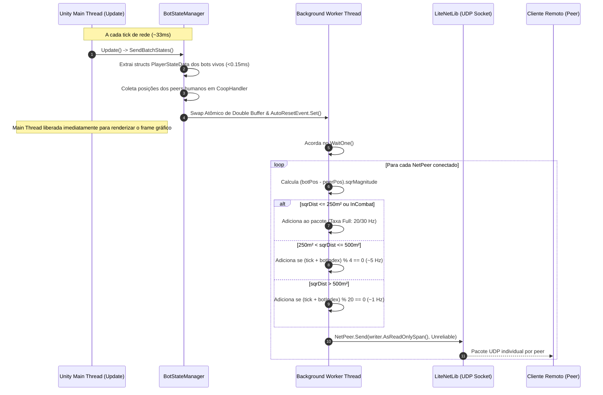

# 011 — Otimização de Rede do Host (AoI Culling & Multithreading) · Especificação Técnica

**Mod:** FIKA  
**Target / Fork:** `mods/FIKA/modded-V2/`  
**Spec Funcional:** [011-otimizacao-rede-host-aoi-multithreading-01-spec.md](011-otimizacao-rede-host-aoi-multithreading-01-spec.md)  
**Status:** Em Validação  
**Criado:** 2026-09-15  

---

## 1. Arquitetura do Gargalo e Solução

### 1.1 Diagrama de Separação de Threads (Snapshot Separation Pattern)



---

## 2. Estruturas de Dados e Zero-Alloc Double Buffering

Para garantir ausência total de coletas pelo Garbage Collector (Zero-Alloc GC) no caminho crítico de ticks:

```csharp
public struct BotSnapshotItem
{
    public PlayerStateData State;
    public bool InCombat;
}

public struct PeerSnapshotTarget
{
    public NetPeer Peer;
    public Vector3 Position;
    public bool HasPosition;
}

public sealed class StateSnapshotBuffer
{
    public double RemoteTime;
    public int BotCount;
    public readonly BotSnapshotItem[] Bots = new BotSnapshotItem[128];
    public int PeerCount;
    public readonly PeerSnapshotTarget[] Peers = new PeerSnapshotTarget[32];
}
```

### 2.1 Mecanismo de Troca Atômica
Dois buffers (`_frontBuffer` e `_backBuffer`) são pré-alocados na inicialização (`BotStateManager.Create`). A Main Thread preenche o `_frontBuffer`, adquire um lock leve sobre `_swapLock`, permuta as referências e aciona o `AutoResetEvent`. A thread de fundo lê o `_backBuffer` garantindo ausência de concorrência de leitura e escrita.

---

## 3. Detalhamento dos Componentes Alterados

### 3.1 `BotStateManager.cs`
- **Extração na Main Thread:**
  - Itera sobre `_bots`. Chama `bot.BotPacketSender.TryGetState(out var state)`.
  - Avalia se o bot está ativamente engajado:
    `item.InCombat = bot.AIData?.BotOwner?.Memory?.GoalEnemy != null;`
- **Processamento de AoI:**
  - Aplica o escalonamento balanceado de ticks:
    - Zona Tática: `sqrDist <= 62500f` ou `InCombat == true`.
    - Zona Periférica: `sqrDist <= 250000f` com filtro `(currentTick + (uint)b) % 4 == 0`.
    - Zona Morta: `sqrDist > 250000f` com filtro `(currentTick + (uint)b) % 20 == 0`.
- **Controle de MTU:**
  - Mantém o particionamento de pacotes UDP respeitando `_server.MaxMTU` (1024 bytes) por peer.

### 3.2 `FikaServer.cs`
- **Despacho por Peer:**
  - Implementa `SendStatesToPeer(NetPeer peer, NetDataWriter writer)` e `SendStatesToPeer(NetPeer peer, ReadOnlySpan<byte> data)` usando `peer.Send(..., DeliveryMethod.Unreliable)`.
- **Mapeamento de Peers O(1):**
  - Mantém `ConcurrentDictionary<NetPeer, FikaPlayer> _peerToPlayer`.
  - Registra a associação quando o cliente envia seu primeiro `PlayerState` (`FikaServer.cs:1034`).
  - Limpa no evento `OnPeerDisconnected`.
  - Fornece método `GetConnectedPeers(List<NetPeer> peers)` sem alocações.

### 3.3 `BotPacketSender.cs`
- Adiciona método de conveniência `TryGetState(out PlayerStateData state)` para extrair a struct `PlayerStateData` diretamente na Main Thread sem serialização em `NetDataWriter`.

### 3.4 `FikaConfig.cs`
- Adiciona 4 novas chaves BepInEx no ConfigurationManager (F12) sob a categoria `Network`:
  - `EnableAoICulling` (`bool`, padrão `true`)
  - `AoINearDistance` (`float`, padrão `250.0f`)
  - `AoIMidDistance` (`float`, padrão `500.0f`)
  - `EnableNetworkThreading` (`bool`, padrão `true`)

---

## 4. Análise de Compatibilidade de Protocolo

O cliente Tarkov/FIKA processa pacotes de estado em `FikaClient.cs:530-544`:
```csharp
case EPacketType.PlayerState:
    var remoteTime = reader.GetDouble();
    var localTime = NetworkTimeSync.NetworkTime;
    var remaining = reader.GetRemainingBytesSpan();
    var snapshots = MemoryMarshal.Cast<byte, PlayerStateData>(remaining);
    for (var i = 0; i < snapshots.Length; i++)
    {
        ref readonly var snapshot = ref snapshots[i];
        if (_coopHandler.Players.TryGetValue(snapshot.NetId, out var player))
        {
            var header = new PlayerStateSnapshot(in snapshot, remoteTime, localTime);
            player.Snapshotter.AddSnapshot(in header);
        }
    }
    break;
```
Como o cliente faz `MemoryMarshal.Cast<byte, PlayerStateData>(remaining)` sobre a fatia restante de bytes, **o cliente aceita qualquer quantidade de bots no pacote (de 0 a N)**. Quando um bot deixa de ser enviado em determinado tick (zona periférica ou morta), o componente `PlayerSnapshotter` no cliente mantém a interpolação suave entre os snapshots existentes. Nenhuma quebra ou divergência de estado ocorre.
