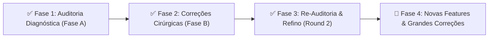
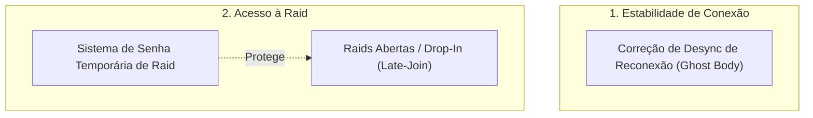
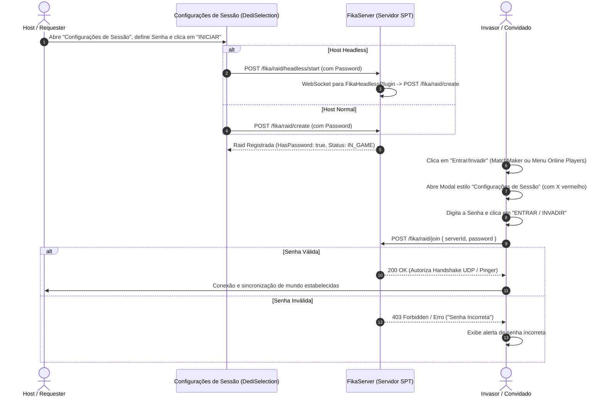

# Roteiro de Engenharia & Roadmap de Features — Project FIKA (SPT 4.0)

Este documento centraliza o status de execução das fases de engenharia do mod **FIKA** e detalha o planejamento arquitetural das **grandes features e correções complexas** mapeadas para o ecossistema.

---

## 🧭 Status Geral das Fases de Desenvolvimento

| Fase | Escopo Principal | Status | Documentação de Referência |
| :---: | :--- | :---: | :--- |
| **Fase 1** | Auditoria Estática Profunda das 8 Partições do código original | 🟢 **Concluída** | [`docs/original/relatorio-auditoria-codigo-01.md a 08.md`](./original/) |
| **Fase 2** | Aplicação das correções de memória, TRL-Fixes e compilação inicial | 🟢 **Concluída** | [`docs/modded/relatorio-correcao-01.md a 08.md`](./modded/) |
| **Fase 3** | Re-auditoria detalhada, limpeza de Singletons (AP-02) e FreeCam | 🟢 **Concluída** | [`docs/modded/relatorio-auditoria-codigo-01.md a 08.md`](./modded/) |
| **Fase 4** | Implementação das grandes features e correções de sincronização | 🔵 **Em Planejamento** | Especificadas em detalhe abaixo |

---

## 🚀 Especificação das Novas Features & Correções Complexas

---

### 1. 👻 Correção de Desync de Reconexão (Corpo Fantasma / Hitbox Estática no Ponto 1 vs. Posição no Ponto 2)

#### 1.1. Diagnóstico e Causa-Raiz
Quando um jogador conectado (Jogador B) sofre uma queda de conexão no **Ponto 1**:
1. O Host mantém o GameObject `ObservedPlayer` vivo no Ponto 1 para não perder o estado de raid do jogador. Os colliders físicos (`HitCollider` na Layer 12) continuam registrados no mundo de física do Host no Ponto 1.
2. Quando o Jogador B reconecta e avança até o **Ponto 2**:
   - O cliente local instancia seu `FikaPlayer` no Ponto 2 e transmite pacotes de movimento contínuos.
   - O Host recebe os pacotes, mas falha em re-vincular a nova sessão UDP (`NetPeer`) ao `ObservedPlayer` original ou o interpolador de movimento (`ObservedMovementContext`) perde o bind de transform.
   - **Efeito Crítico:** No Host e nos demais clientes, o corpo visual e físico permanece estático no Ponto 1. Como o `HealthController` é indexado pelo `ProfileId` compartilhado, quando bots ou jogadores atiram no corpo estático do Ponto 1, o Host calcula dano e envia o pacote de dano para o Jogador B, que está vivo no Ponto 2, causando morte inexplicável ou invisibilidade.

#### 1.2. Arquitetura da Solução Técnica
1. **Re-binding Atômico no Host (`FikaServer.Callbacks.cs` / `FikaHostWorld.cs`):**
   - Ao receber o pacote de handshake de reconexão de um `ProfileId` existente, buscar a instância ativa de `ObservedPlayer`.
   - Atualizar a referência de `NetPeerId` e reinicializar o canal de pacotes de movimento.
2. **Teleporte e Reset de Interpolação:**
   - Forçar o teleporte das coordenadas do `ObservedPlayer` para a posição atual informada pelo cliente reconectado (`Position = Ponto 2`).
   - Limpar buffers de histórico de interpolação em `ObservedMovementContext` para evitar transições elásticas ou travamentos visuais.
3. **Broadcast de Atualização de Entidade:**
   - Disparar um pacote de sincronização forçada de posição e estado (`PlayerSpawnPacket` / `ForceSyncPacket`) para todos os outros clientes da raid, forçando a re-renderização imediata no Ponto 2.

#### 1.3. Arquivos Alvo
- [`mods/FIKA/modded/Fika-Plugin/Fika.Core/Networking/FikaServer.Callbacks.cs`](file:///d:/Projetos/GITHUB%20TARKOV/tarkov-spt-4.0/mods/FIKA/modded/Fika-Plugin/Fika.Core/Networking/FikaServer.Callbacks.cs)
- [`mods/FIKA/modded/Fika-Plugin/Fika.Core/Main/HostClasses/FikaHostWorld.cs`](file:///d:/Projetos/GITHUB%20TARKOV/tarkov-spt-4.0/mods/FIKA/modded/Fika-Plugin/Fika.Core/Main/HostClasses/FikaHostWorld.cs)
- [`mods/FIKA/modded/Fika-Plugin/Fika.Core/Main/Players/ObservedPlayer.cs`](file:///d:/Projetos/GITHUB%20TARKOV/tarkov-spt-4.0/mods/FIKA/modded/Fika-Plugin/Fika.Core/Main/Players/ObservedPlayer.cs)
- [`mods/FIKA/modded/Fika-Plugin/Fika.Core/Main/ObservedClasses/ObservedMovementContext.cs`](file:///d:/Projetos/GITHUB%20TARKOV/tarkov-spt-4.0/mods/FIKA/modded/Fika-Plugin/Fika.Core/Main/ObservedClasses/ObservedMovementContext.cs)

---

### 2. 🚪 Raids Abertas / Suporte a Drop-In / Late-Join em Partidas em Andamento

#### 2.1. O Desafio Técnico (Ciclo Síncrono do EFT vs. Mundo Dinâmico)
Atualmente, conexões cooperativas só são permitidas antes do início da raid (fase de carregamento de mapa). Isso ocorre porque o Tarkov (`LocalGame` / `ClientGameWorld`) foi arquitetado originalmente pela BSG com carregamento procedural em lote antes do início do frame zero. Após o início da partida, o estado do mundo torna-se dinâmico e diverge do mapa base em disco.

#### 2.2. Arquitetura de "World State Snapshot Sync"
Para viabilizar que qualquer amigo entre em uma raid que já está em andamento sem desincronizar o mapa:

| Subsistema de Snapshot | Responsabilidade Técnica |
| :--- | :--- |
| **1. Estado de Interativos** | O Host serializa e envia o estado atual de todas as portas (`WorldInteractiveObject`), switches elétricos, portões e alarmes (abertos, trancados, chutados ou desativados). |
| **2. Delta de Loot do Mundo** | Transmissão do mapa de loot atualizado: supressão de itens que já foram coletados e instanciação dinâmica de itens dropados por jogadores durante a raid. |
| **3. Entidades Vivas & Corpos** | Criação dinâmica imediata no novo cliente de todos os bots vivos, PMCs ativos e cadáveres saqueáveis com seus respectivos inventários. |
| **4. Timer de Raid & Extrações** | Sincronização do tempo restante e do status individual de cada ponto de extração (`ExfiltrationPoint`). |
| **5. Injeção Dinâmica de Spawn** | O cliente executa o spawn de seu PMC local via injeção em ponto de spawn seguro sem disparar o pipeline de reinicialização completa de `GameWorld`. |

#### 2.3. Arquivos Alvo
- [`mods/FIKA/modded/Fika-Plugin/Fika.Core/Main/ClientClasses/FikaClientWorld.cs`](file:///d:/Projetos/GITHUB%20TARKOV/tarkov-spt-4.0/mods/FIKA/modded/Fika-Plugin/Fika.Core/Main/ClientClasses/FikaClientWorld.cs)
- [`mods/FIKA/modded/Fika-Plugin/Fika.Core/Main/HostClasses/FikaHostWorld.cs`](file:///d:/Projetos/GITHUB%20TARKOV/tarkov-spt-4.0/mods/FIKA/modded/Fika-Plugin/Fika.Core/Main/HostClasses/FikaHostWorld.cs)
- [`mods/FIKA/modded/Fika-Plugin/Fika.Core/Networking/Packets/World/`](file:///d:/Projetos/GITHUB%20TARKOV/tarkov-spt-4.0/mods/FIKA/modded/Fika-Plugin/Fika.Core/Networking/Packets/World/)

---

### 3. 🔒 Sistema de Senha Temporária para Raids e Invasão em Andamento (Item 010)

#### 3.1. Objetivo
Permitir que o Host configure uma senha opcional ao criar a partida (seja Host convencional de cliente ou via FIKA Headless), impedindo que invasores ou jogadores não autorizados entrem na partida, enquanto partidas sem senha permanecem totalmente públicas e abertas para entrada/invasão em andamento (Join In Progress).

#### 3.2. Interface e UX Unificada (Padrão "Configurações de Sessão")
1. **Criação de Partida (Host & Headless):**
   - O campo de senha é integrado diretamente na janela modal **"CONFIGURAÇÕES DE SESSÃO"** (`DediSelection`), ao lado da opção "Usar Host Headless" e do botão "INICIAR".
   - Campo opcional: se deixado em branco, a raid nasce pública (`HasPassword = false`); se preenchido, a raid nasce protegida por senha (`HasPassword = true`).
2. **Entrada de Jogadores (Pré-Raid ou Invasão em Andamento):**
   - Ao clicar em "Entrar" ou "Invadir", abre-se uma janela modal com a mesma identidade visual de "CONFIGURAÇÕES DE SESSÃO" (moldura escura, cabeçalho, botão `X` vermelho no canto superior direito e botão de ação embaixo).
   - Acionável por **dois pontos de entrada**:
     - Pela **Tela de Incursões / Server Browser** (`MatchMakerUIScript`).
     - Pelo botão de entrar na **Lista de Jogadores Online do Menu Principal** (`MainMenuUIScript`).
   - Se a partida tiver senha, a janela solicita a digitação da senha com campo mascarado antes de liberar a conexão.
   - Se a partida for aberta (sem senha), a janela permite confirmar a entrada/invasão direta.

#### 3.3. Fluxo de Autenticação e Autorização

#### 3.4. Arquivos Alvo (Fork `modded-V2`)
- [`mods/FIKA/modded-V2/Fika-Plugin/Fika.Core/UI/Custom/MatchMakerUIScript.cs`](file:///d:/Projetos/GITHUB%20TARKOV/tarkov-spt-4.0/mods/FIKA/modded-V2/Fika-Plugin/Fika.Core/UI/Custom/MatchMakerUIScript.cs)
- [`mods/FIKA/modded-V2/Fika-Plugin/Fika.Core/UI/Custom/MainMenuUIScript.cs`](file:///d:/Projetos/GITHUB%20TARKOV/tarkov-spt-4.0/mods/FIKA/modded-V2/Fika-Plugin/Fika.Core/UI/Custom/MainMenuUIScript.cs)
- [`mods/FIKA/modded-V2/Fika-Headless/Fika.Headless/FikaHeadlessPlugin.cs`](file:///d:/Projetos/GITHUB%20TARKOV/tarkov-spt-4.0/mods/FIKA/modded-V2/Fika-Headless/Fika.Headless/FikaHeadlessPlugin.cs)
- [`mods/FIKA/modded-V2/Fika-Server-CSharp/FikaServer/Controllers/RaidController.cs`](file:///d:/Projetos/GITHUB%20TARKOV/tarkov-spt-4.0/mods/FIKA/modded-V2/Fika-Server-CSharp/FikaServer/Controllers/RaidController.cs)
- [`mods/FIKA/backlog/010-join-in-progress-senha-lobby-headless/`](file:///d:/Projetos/GITHUB%20TARKOV/tarkov-spt-4.0/mods/FIKA/backlog/010-join-in-progress-senha-lobby-headless/)
