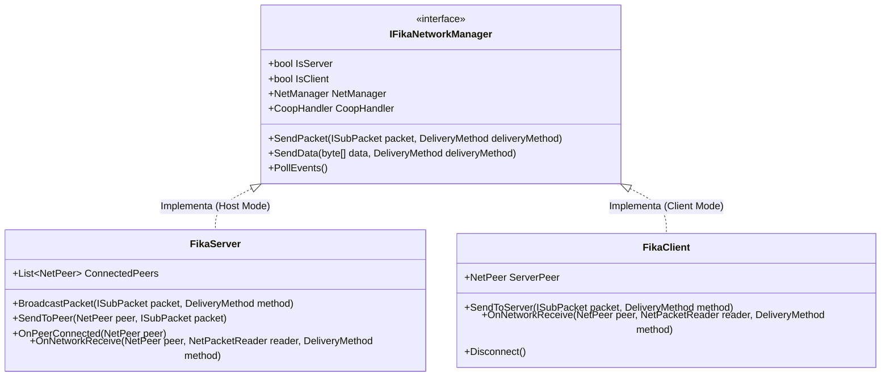
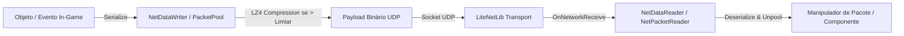
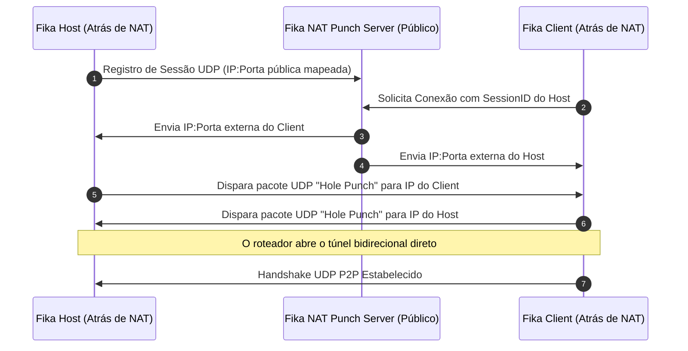

# FIKA — Arquitetura de Rede e Transporte UDP (LiteNetLib)

O subsistema de rede do **FIKA** é o coração da experiência multijogador, implementando um protocolo binário customizado de alta frequência e baixa latência baseado na biblioteca **LiteNetLib**, com suporte a roteamento P2P, multiplexação por canais, pooling de buffers e técnicas de perfuração NAT (NAT Punching).

---

## 1. Topologia de Transporte e Gerenciadores de Rede

A abstração central de comunicação reside na interface [`IFikaNetworkManager`](../../original/Fika-Plugin/Fika.Core/Networking/IFikaNetworkManager.cs), implementada por duas especializações concretas:

- **[`FikaServer`](../../original/Fika-Plugin/Fika.Core/Networking/FikaServer.cs):** Executa no jogador que hospeda a partida (ou no processo Headless). Mantém a lista de `ConnectedPeers`, arbitra o estado do mundo, despacha snapshots para todos os clientes e roteia mensagens peer-to-peer.
- **[`FikaClient`](../../original/Fika-Plugin/Fika.Core/Networking/FikaClient.cs):** Executa nos clientes conectados. Conecta-se diretamente ao `ServerPeer`, envia comandos de entrada locais e processa as atualizações de estado recebidas.

---

## 2. Métodos de Entrega e Canais de Transmissão

O protocolo do FIKA faz uso estratégico dos modos de entrega do LiteNetLib para balancear confiabilidade e taxa de quadros:

| Método de Entrega (`DeliveryMethod`) | Características de Transporte | Casos de Uso no FIKA |
| :--- | :--- | :--- |
| `Unreliable` | Pacotes podem ser perdidos ou chegar fora de ordem; latência mínima e zero retransmissões. | Dados contínuos de áudio de microfone / VOIP bruto. |
| `Sequenced` | Pacotes mais antigos que o último recebido são descartados automaticamente. | Sincronização contínua de posição, rotação e velocidade de jogadores (`PlayerSyncPacket`). |
| `ReliableUnordered` | Garantia de entrega com retransmissão, mas sem garantir ordem sequencial. | Notificações pontuais, confirmação de ping tático e eventos de HUD. |
| `ReliableOrdered` | Garantia estrita de entrega e ordem sequencial exata. | Operações de inventário estrito (`InventoryOperationHandler`), abertura/fechamento de portas, tiros e dano. |

---

## 3. Protocolo Binário e Serialização

O pipeline de serialização opera sobre as extensões [`EFTSerializationExtensions`](../../original/Fika-Plugin/Fika.Core/Networking/EFTSerializationExtensions.cs) e [`FikaSerializationExtensions`](../../original/Fika-Plugin/Fika.Core/Networking/FikaSerializationExtensions.cs), gravando tipos nativos da Unity e do EFT diretamente em streams de bytes otimizados:

### Técnicas de Otimização no Protocolo:
1. **Compressão Quantizada de Posição e Rotação:**
   - Vetores `Vector3` de posição são convertidos em floats/half-floats de precisão adaptativa.
   - Quaternions de rotação utilizam representação compacta de 3 componentes menores (*smallest three*), economizando 50% de banda em relação a 4 floats brutos.
2. **Compressão LZ4:**
   - Pacotes volumosos (como listas completas de loot no início de raid ou inventários complexos) são comprimidos via LZ4 antes do despacho UDP.

---

## 4. NAT Punching e Conectividade Sem Abertura de Portas

Para permitir conexões diretas entre jogadores mesmo atrás de roteadores com NAT restritivo ou CGNAT, o FIKA incorpora um cliente STUN/NAT Punching:

- **Mecanismos Suportados:**
  - **Port Forwarding Manual:** Escuta na porta padrão `25565/UDP`.
  - **UPnP Automático ([`Open.Nat`](../../original/Fika-Plugin/Fika.Core/Networking/Open.Nat/)):** Criação de mapeamento dinâmico no roteador do host via protocolo UPnP.
  - **Servidor Público de NAT Punch ([`NatPunchClient`](../../original/Fika-Plugin/Fika.Core/Networking/)):** Perfuração de NAT para roteadores Full Cone e Restricted Cone.
