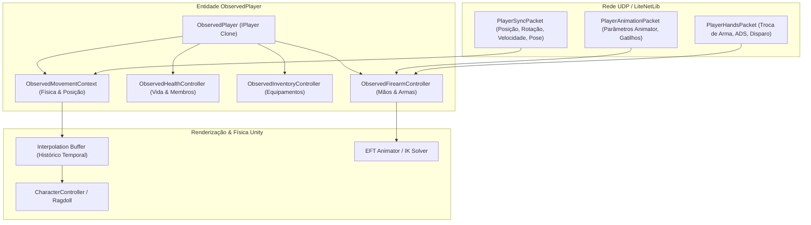
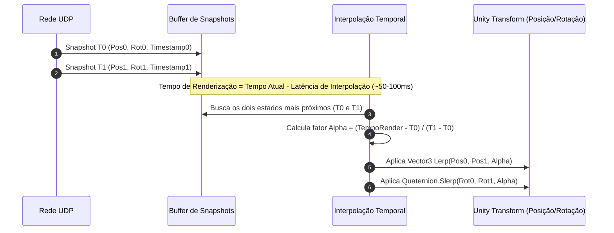

# FIKA — Sincronização de Jogadores e Interpolação

A replicação visual e física de jogadores humanos remotos e bots no cliente local é executada através de uma camada especializada de clones observados ([`ObservedPlayer`](../../original/Fika-Plugin/Fika.Core/Main/Players/ObservedPlayer.cs)) e algoritmos de interpolação temporal de movimento e animações.

---

## 1. Arquitetura de Replicação de Jogadores

Quando um jogador remoto entra na partida, o FIKA instancia uma representação local controlada por rede, desacoplada dos controladores de entrada da BSG:

### Principais Classes de Observação:
- [`ObservedPlayer`](../../original/Fika-Plugin/Fika.Core/Main/Players/ObservedPlayer.cs): Herda do modelo base de jogador do EFT, substituindo os fluxos de IA ou entrada de teclado/mouse por atualizações de rede.
- [`ObservedMovementContext`](../../original/Fika-Plugin/Fika.Core/Main/ObservedClasses/ObservedMovementContext.cs): Gerencia a postura (em pé, agachado, deitado), velocidade de caminhada, inclinação de tronco (*lean*) e transições de movimento.
- [`ObservedHealthController`](../../original/Fika-Plugin/Fika.Core/Main/ObservedClasses/ObservedHealthController.cs): Replica o estado de saúde, ferimentos e status corporais recebidos via rede.

---

## 2. Pipeline de Interpolação e Compensação de Jitter

Devido à natureza dos pacotes UDP entregues em intervalos variáveis (jitter de rede), o FIKA utiliza um buffer de estados com interpolação linear (`Lerp`) e esférica (`Slerp`):

### Parâmetros de Interpolação e Frequência:
- **Taxa de Envio (`SendRate`):**
  - `Low`: 10 atualizações por segundo (10 Hz) — uso mínimo de banda, indicado para conexões lentas.
  - `Medium`: 20 atualizações por segundo (20 Hz) — equilíbrio padrão.
  - `High`: 30 atualizações por segundo (30 Hz) — máxima fluidez e precisão de mira.
- **Suavização e Predição:**
  - Caso um pacote atrase além da janela de interpolação, o sistema utiliza a velocidade linear e angular reportada no último pacote para realizar **Dead Reckoning** (extrapolação de movimento), evitando paradas bruscas na animação do personagem.

---

## 3. Sincronização de Animações, Postura e Visada ADS

Para que ações complexas de combate sejam refletidas fielmente, o FIKA sincroniza:
1. **Pose do Operador:** Posição exata de agachamento (`PoseLevel`), passo lateral (*sidestep*) e inclinação de tronco (*tilt/lean*).
2. **Visada e Mira:** Estado de visada (`IsAiming`), zoom da luneta e alinhamento do tronco com o vetor de visão do jogador remoto.
3. **Controladores de Mãos ([`HandsControllers`](../../original/Fika-Plugin/Fika.Core/Main/ObservedClasses/HandsControllers/)):**
   - Transição de empunhadura primária, secundária e coldre.
   - Puxada de ferrolho, recargas táticas/emergenciais e inspeção de câmara.
