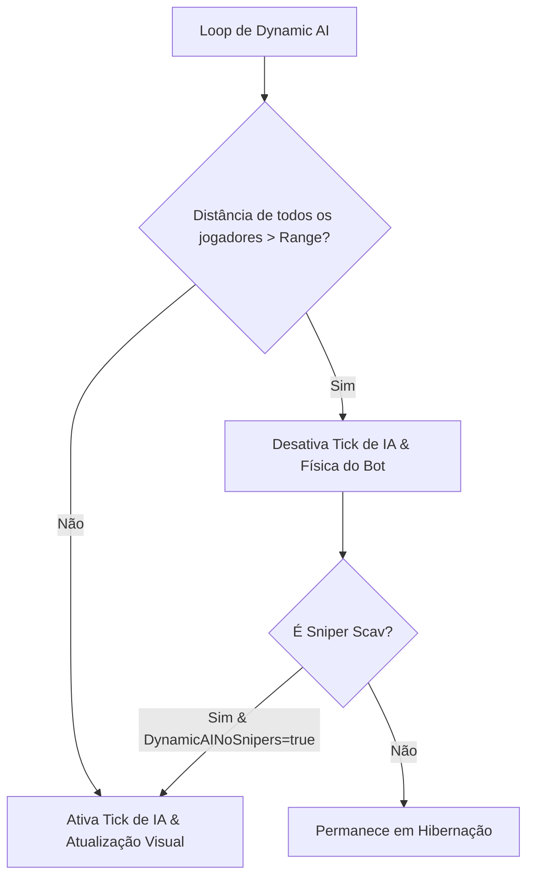

# FIKA — Sincronização de Bots, IA e Gerenciamento de Spawns

No modelo multiplayer do **FIKA**, a inteligência artificial dos bots (Scavs, PMCs IA, Chefes e Rogues) é executada com **autoridade exclusiva no Host** (ou no servidor Headless), enquanto os clientes recebem apenas os dados replicados como entidades observadas, garantindo coerência física e aliviando a CPU dos clientes.

---

## 1. Topologia de Autoridade de IA

```mermaid
graph TD
    subgraph Host_Process [Host da Partida / Headless Dedicado]
        EFT_BotController["EFT BotController / BotSpawner"]
        SAIN_BigBrain["SAIN / BigBrain / SPT Layers (Se instalado)"]
        FikaBot_Instance["FikaBot (Entidade Ativa de IA)"]
        BotPacketSender["BotPacketSender (Serialização de Ações)"]

        EFT_BotController --> FikaBot_Instance
        SAIN_BigBrain --> FikaBot_Instance
        FikaBot_Instance --> BotPacketSender
    end

    subgraph Client_Process [Clientes Remotos (Peers)]
        ObservedBot["ObservedPlayer (Bot como Clone Observado)"]
        ObservedBones["PlayerBones / Ragdoll / Hitboxes"]
        ClientHealth["ObservedHealthController (Dano Visual)"]

        ObservedBot --> ObservedBones
        ObservedBot --> ClientHealth
    end

    BotPacketSender ==>|UDP Sequenced / ReliableOrdered| ObservedBot
```

### Regras de Execução:
1. **Instanciação no Host ([`FikaBot`](../../original/Fika-Plugin/Fika.Core/Main/Players/FikaBot.cs)):**
   - O bot roda as árvores de comportamento da BSG (ou SAIN/BigBrain).
   - Movimentação, recarga, decisão de tiro e falas de voz são processadas no host e transmitidas aos clientes via [`BotPacketSender`](../../original/Fika-Plugin/Fika.Core/Main/PacketHandlers/).
2. **Representação nos Clientes:**
   - O cliente remoto não roda árvores de IA nem cálculos de pathfinding para os bots, tratando-os como entidades observadas idênticas a jogadores remotos.

---

## 2. Otimização de Performance: Dynamic AI e Culling

Para evitar quedas drásticas de framerate causadas pelo processamento de dezenas de bots simultâneos em mapas extensos, o FIKA disponibiliza mecanismos nativos de otimização:



| Configuração F12 | Padrão | Impacto em Performance / Gameplay |
| :--- | :--- | :--- |
| `Dynamic AI` | `false` | Desativa o processamento de bots fora do raio visual/auditivo de qualquer jogador humano. |
| `Dynamic AI Range` | `200m` | Raio métrico de ativação ao redor dos jogadores. |
| `Dynamic AI Rate` | `1s` | Intervalo de checagem da distância espacial entre bots e jogadores. |
| `Ignore Snipers` | `true` | Mantém Sniper Scavs sempre ativos para preservar a vigilância de longa distância. |

---

## 3. Gestão de Limites de Spawn e Despawn Forçado

Em sistemas com hardware modesto, o acúmulo descontrolado de bots gerados por mods de spawn dinâmico pode esgotar a CPU:

- **`Enforced Spawn Limits`:** Limita a contagem máxima de bots ativos simultâneos aos tetos padrões da BSG por mapa.
- **`Despawn Furthest`:** Ao atingir o limite máximo de bots e ocorrer uma nova solicitação de spawn, o FIKA despawna o bot comum mais distante de todos os jogadores para abrir espaço para o novo spawn, mantendo a raid ativa na vizinhança dos operadores.
- **`Despawn Only Scavs`:** Restringe o despawn forçado apenas a Scavs regulares, preservando PMCs de IA e Chefes.
- **`Max Bots {Map}`:** Permite configurar manualmente um teto de bots para cada mapa específico (Customs, Woods, Streets, etc.).
