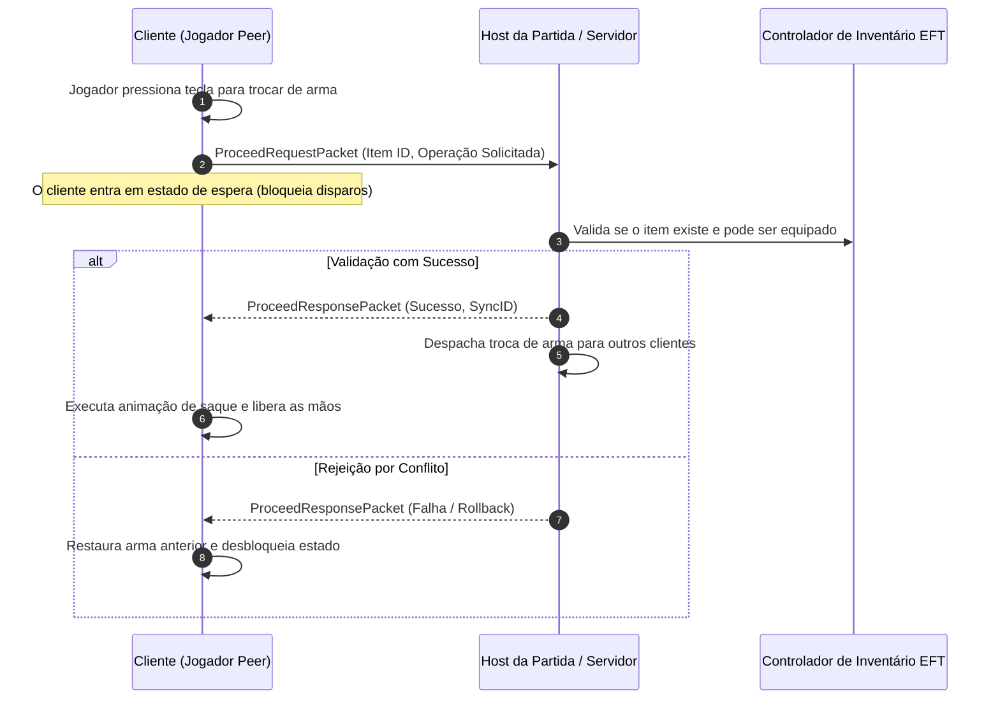
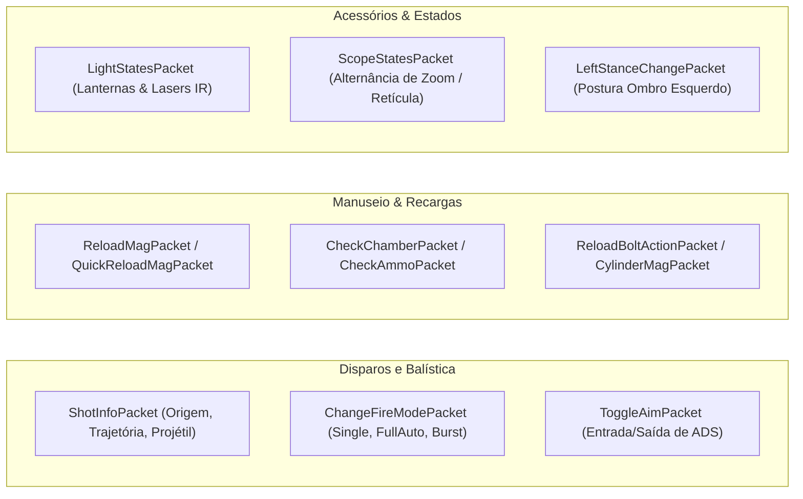
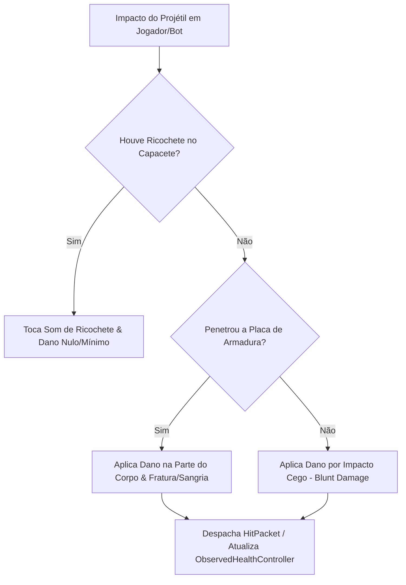

# FIKA — Inventário Estrito, Balística e Combate

A fidelidade tática do **FIKA** é assegurada por dois pilares fundamentais: o sistema de **Sincronização Estrita de Inventário** (*Strict Inventory Sync*), que elimina divergências de estado entre host e clientes, e a replicação de **Balística e Disparos**, garantindo registro de acertos e consistência de dano.

---

## 1. Sincronização Estrita de Inventário (`StrictInventorySync`)

O inventário no EFT é propenso a desincronizações graves (como mãos travadas em animações, armas invisíveis ou munições fantasmas). O FIKA resolve isso tornando todas as operações de item transacionais e autoritativas:

### Características Principais:
- **`Strict Inventory Sync = true` (Padrão e Recomendado):**
  - Todas as operações (`Proceed`, `MoveItem`, `SplitItem`, `ApplyMedkit`, `Eat/Drink`) necessitam de confirmação formal do host.
  - Previne duplicação de itens, falhas em recargas e mãos travadas (*busy hands bug*).
- **Tratamento de Itens Proibidos (`BlacklistedItems`):**
  - O host pode impor uma lista negra de itens (ex.: itens de desenvolvedor ou exploits) que não podem ser transferidos nem arremessados no chão.

---

## 2. Pipeline de Disparo, Recarga e Armas de Fogo

Todas as ações com armas de fogo são transmitidas através de pacotes de alta prioridade em [`Networking/Packets/FirearmController/`](../../original/Fika-Plugin/Fika.Core/Networking/Packets/FirearmController/):

### Registro de Tiros e Trajetória:
- Quando um jogador dispara, o [`ShotInfoPacket`](../../original/Fika-Plugin/Fika.Core/Networking/Packets/FirearmController/SubPackets/ShotInfoPacket.cs) replica a direção, velocidade inicial, tipo de cartucho e dispersão balística (*ShotSpread*).
- Os clientes remotos instanciam o projétil correspondente no motor balístico local para renderização de traçantes, som e faíscas de impacto.

---

## 3. Registro de Dano, Armaduras e Reações Corporais

O cálculo de dano e penetração de blindagem segue as tabelas de armaduras da BSG de forma sincronizada:

### Detalhes de Implementação:
- **`ApplyShot` em [`FikaBot`](../../original/Fika-Plugin/Fika.Core/Main/Players/FikaBot.cs#L211) e [`FikaPlayer`](../../original/Fika-Plugin/Fika.Core/Main/Players/FikaPlayer.cs):** Processa blindagens equipadas (`ProceedDamageThroughArmor`), material de impacto (`MaterialType`) e cálculo de pontos residuais de durabilidade das placas.
- **Dano Explosivo:** O método `ApplyExplosionDamageToArmor` decompõe o dano esférico por colisor, atualizando placas de blindagem atingidas por estilhaços de granadas.
