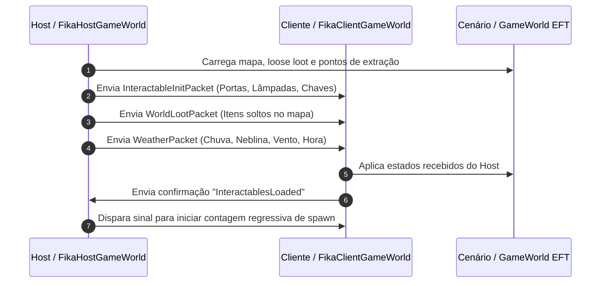
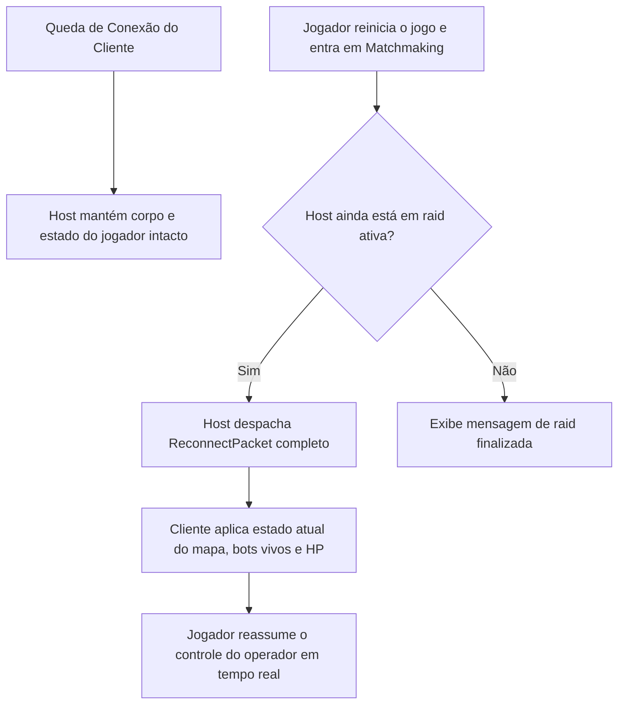

# FIKA — Ciclo de Vida de Raid e Interatividade de Mundo

Além de sincronizar jogadores e bots, o **FIKA** estende o motor do EFT para criar um ambiente dinâmico totalmente compartilhado entre todos os membros do esquadrão, incluindo a inicialização sincronizada de raid, objetos interativos do cenário, clima em tempo real, extrações cooperativas e suporte à reconexão.

---

## 1. Inicialização do Mundo e Handshake de Ingress

Ao iniciar uma incursão cooperativa, o carregamento dos elementos do mapa ocorre em etapas coordenadas entre o Host ([`FikaHostGameWorld`](../../original/Fika-Plugin/Fika.Core/Main/HostClasses/FikaHostGameWorld.cs)) e os Clientes ([`FikaClientGameWorld`](../../original/Fika-Plugin/Fika.Core/Main/ClientClasses/FikaClientGameWorld.cs)):

---

## 2. Sincronização de Objetos Interativos e Física do Cenário

O módulo [`Networking/Packets/World/`](../../original/Fika-Plugin/Fika.Core/Networking/Packets/World/) replica eventos físicos do ambiente para todos os clientes:

| Elemento Interativo | Pacote / Mecanismo | Comportamento Sincronizado |
| :--- | :--- | :--- |
| **Portas & Trincas** | `DoorPacket` / `InteractablePacket` | Estados: Aberta, Fechada, Trancada, Destrancada com chave, Chutada (*Breach*). |
| **Lâmpadas & Interruptores** | `LampPacket` / `InteractablePacket` | Acendimento/apagamento de luzes e destruição física de lâmpadas por tiros. |
| **Janelas Quebradas** | `WindowPacket` | Quebra de vidros balísticos e barulho acústico sincronizado. |
| **Airdrops Dinâmicos** | [`AirdropUpdatePacket`](../../original/Fika-Plugin/Fika.Core/Networking/Packets/World/AirdropUpdatePacket.cs) | Trajetória do avião cargueiro, queda da caixa com paraquedas e inventário do contêiner. |
| **Veículo BTR** | [`BTRInteractionPacket`](../../original/Fika-Plugin/Fika.Core/Networking/Packets/World/BTRInteractionPacket.cs) | Movimentação do BTR, serviços de táxi, entrega de itens para o stash e cobertura de fogo. |
| **Transits entre Mapas** | [`SyncTransitControllersPacket`](../../original/Fika-Plugin/Fika.Core/Networking/Packets/World/SyncTransitControllersPacket.cs) | Transição contínua de todo o grupo de um mapa para outro (ex: Streets → Labs). |

---

## 3. Clima Dinâmico e Iluminação

O EFT calcula fatores climáticos que afetam a visibilidade dos bots e a audição de passos. No FIKA:
- O host é a autoridade meteorológica primária.
- As mudanças de velocidade do vento, intensidade de chuva, nuvens e neblina volumétrica são despachadas para manter a atmosfera idêntica entre todos os jogadores.

---

## 4. Sistema de Reconexão em Raid (`ReconnectPacket`)

Caso um cliente sofra oscilação de rede ou queda do jogo durante a partida:

- O [`ReconnectPacket`](../../original/Fika-Plugin/Fika.Core/Networking/Packets/World/ReconnectPacket.cs) retransmite a posição atualizada de todos os bots vivos, jogadores aliados, portas alteradas e itens já saqueados, restaurando a sessão sem necessidade de reiniciar a raid inteira.
