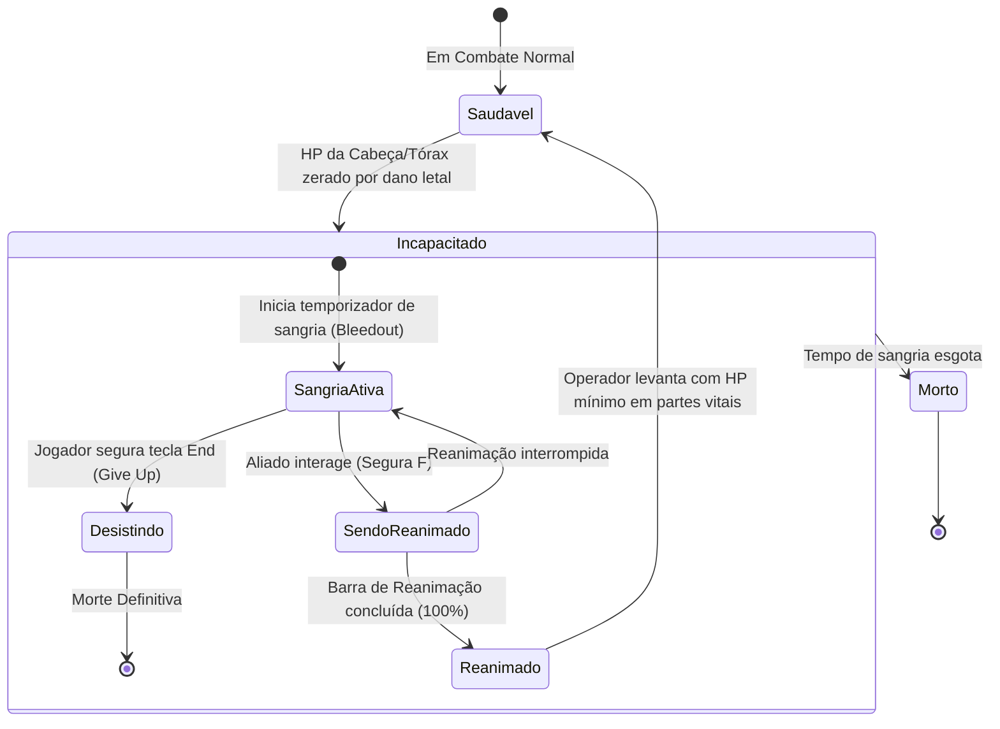
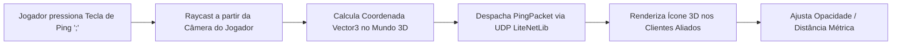

# FIKA — Sistemas Auxiliares: Revival, Pings 3D e HUD

Para transformar a experiência tática e enriquecer o trabalho em equipe, o **FIKA** introduz mecânicas cooperativas avançadas integradas à interface do usuário (HUD) e ao ciclo de vida dos operadores: o sistema de **Reanimação de Aliados** (*Revival System*), **Marcação Tática Tridimensional** (*Ping System*) e **Placas Flutuantes de Identificação** (*Name Plates*).

---

## 1. Sistema de Reanimação e Estado Incapacitado (Revival)

Ao sofrer dano letal, caso o módulo de revival esteja ativo no servidor, o jogador não morre instantaneamente, entrando no estado **Downed** (Incapacitado):

### Detalhes Técnicos do Revival:
- **Patches no `HealthController` ([`ClientHealthController_Kill_Patch.cs`](../../original/Fika-Plugin/Fika.Core/Main/Patches/Revival/ClientHealthController_Kill_Patch.cs)):**
  - Intercepta a chamada de morte (`Kill`) da BSG. Se o jogador for elegível para reanimação, o método previne a transição para ragdoll e ativa a animação de incapacitação no solo.
- **Menu de Ações de Interação ([`GetActionsClass_GetAvailableActions_Patch.cs`](../../original/Fika-Plugin/Fika.Core/Main/Patches/Revival/GetActionsClass_GetAvailableActions_Patch.cs)):**
  - Adiciona a ação contextual *"Reviver {Nome}"* quando um aliado se aproxima do operador incapacitado.
- **Tecla de Desistência (`GiveUpKey`):**
  - Padrão `End`. Permite ao jogador incapacitado encerrar voluntariamente a partida e entrar como espectador.

---

## 2. Sistema de Pings Táticos 3D

Permite que membros do esquadrão apontem locais de interesse, perigos e itens no espaço tridimensional:

### Características e Configurações:
- **Projeção em Lunetas PiP (`PingUseOpticZoom`):** O marcador é reposicionado na visão das lentes ópticas Picture-in-Picture.
- **Escala Adaptativa por Distância (`PingScaleWithDistance`):** Evita que o marcador fique minúsculo a longas distâncias ou gigante em combates a curta distância (CQB).
- **Feedback Sonoro e Gestual:** Toca um som de notificação configurável (`PingSound`) e opcionalmente executa a animação do braço esquerdo apontando para o local (`PlayPingAnimation`).

---

## 3. Placas de Nome (Name Plates) e HUD Tático

Exibe identificadores visuais sobre a cabeça dos companheiros de equipe:

| Recurso / Flag F12 | Descrição e Funcionamento |
| :--- | :--- |
| `Show Player Name Plates` | Ativa a renderização de placas com apelido e facção (USEC/BEAR). |
| `Show HP% instead of bar` | Alterna entre uma barra gráfica colorida e a porcentagem numérica de vida restante. |
| `Show Effects` | Exibe ícones de status negativos (sangramento leve/pesado, fratura, dor, desidratação). |
| `Use Occlusion` | Executa raycast contra a geometria do mapa para ocultar a placa quando o aliado estiver totalmente encoberto por paredes ou construções sólidas. |
| `Opacity in ADS` | Reduz a transparência das placas para 75% (configurável) ao puxar a mira da arma, desobstruindo a visão do alvo. |
| `Hide Name Plate in Optic` | Oculta totalmente as placas ao enquadrar alvos através de miras de alta magnificação. |

---

## 4. Chat In-Game e Menu de Jogadores Online

- **Chat de Texto ([`FikaChatUIScript.cs`](../../original/Fika-Plugin/Fika.Core/UI/Custom/FikaChatUIScript.cs)):** Janela de mensagens rápidas in-game ativada por tecla de atalho (`RightControl`), permitindo coordenação mesmo sem VOIP.
- **Lista de Jogadores Online ([`MainMenuUIScript.cs`](../../original/Fika-Plugin/Fika.Core/UI/Custom/MainMenuUIScript.cs)):** Painel lateral no menu principal exibindo o status de amigos em tempo real (No Menu, No Esconderijo, Em Incursão).
