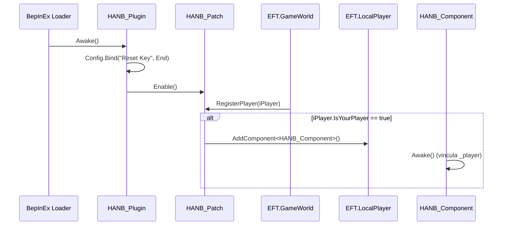

# HandsAreNotBusy — Visão Geral e Arquitetura

O mod **HandsAreNotBusy (HANB)** tem como objetivo primordial contornar o bug crítico nativo do Escape From Tarkov onde o controlador de mãos do jogador (`HandsController`) fica travado em estado ocupado (*Hands are busy*), impedindo disparar, recarregar, curar ou alternar armas.

---

## 1. Arquitetura e Componentes

O mod é composto por três classes essenciais:

1. **[`HANB_Plugin.cs`](../original/HANB_Plugin.cs):**
   - Herda de `BaseUnityPlugin` com GUID `com.lacyway.hanb`.
   - Inicializa as configurações BepInEx (tecla de atalho `Reset Key`, padrão `KeyCode.End`).
   - Registra e ativa o patch Harmony [`HANB_Patch`](../original/HANB_Patch.cs).

2. **[`HANB_Patch.cs`](../original/HANB_Patch.cs):**
   - Herda de `ModulePatch` do SPT (`SPT.Reflection.Patching`).
   - Alvo: `GameWorld.RegisterPlayer(IPlayer iPlayer)`.
   - Intercepta o registro de jogadores no mundo. Se `iPlayer.IsYourPlayer` for verdadeiro, anexa o componente MonoBehaviour [`HANB_Component`](../original/HANB_Component.cs) ao `GameObject` do jogador local (`MainPlayer`).

3. **[`HANB_Component.cs`](../original/HANB_Component.cs):**
   - MonoBehaviour com ciclo de vida `Update()`.
   - Monitora se a tecla configurada foi pressionada (`HANB_Plugin.ResetKey.Value.IsDown()`).
   - Executa a rotina `FixHandsController`.

---

## 2. Diagrama de Inicialização

---

## 3. Configurações Expostas

Todas as propriedades F12 estão documentadas no catálogo canônico [`../PROPRIEDADES.md`](../PROPRIEDADES.md).
