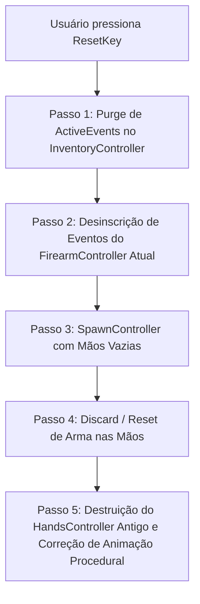

# HandsAreNotBusy — Mecanismo de Recuperação de Mãos

O método central do mod é o `FixHandsController(Player player)` implementado em [`HANB_Component.cs:50-118`](../original/HANB_Component.cs#L50-L118). Este documento disseca a sequência de operações realizadas quando o usuário aciona a tecla de recuperação.

---

## 1. Pipeline de Execução do `FixHandsController`

Quando o atalho `ResetKey` é pressionado, o componente executa um processo em 5 etapas cirúrgicas:



---

## 2. Detalhamento de Cada Etapa

### Passo 1: Purge de Operações e Eventos Ativos (`List_0`)
O `InventoryController` do EFT mantém uma lista interna de eventos pendentes (`List_0`). Se uma animação for interrompida de forma abrupta, os eventos ficam órfãos na lista, travando todo o inventário com a mensagem de validação:
`Cannot apply item because it is currently being modified` (`GClass1561`).

O HANB itera sobre todos os eventos em `inventoryController.List_0` e os expurga:
```csharp
int length = inventoryController.List_0.Count;
if (length > 0)
{
    GEventArgs1[] args = new GEventArgs1[length];
    inventoryController.List_0.CopyTo(args);
    foreach (GEventArgs1 queuedEvent in args)
    {
        inventoryController.RemoveActiveEvent(queuedEvent);
    }
    HANB_Plugin.HANB_Logger.LogInfo($"Cleared {length} stuck inventory operations.");
}
```

### Passo 2: Desinscrição de Delegates Físicos e de Movimento
Se o controlador atual for um `FirearmController`, ele desassocia os ouvintes de troca de estado de corrida e movimento, além de remover a calculadora balística:
```csharp
if (handsController is FirearmController currentFirearmController)
{
    player.MovementContext.OnStateChanged -= currentFirearmController.method_17;
    player.Physical.OnSprintStateChangedEvent -= currentFirearmController.method_16;
    currentFirearmController.RemoveBallisticCalculator();
}
```

### Passo 3: Criação Forçada de Novo Controlador de Mãos
Invoca `player.SpawnController(player.method_162())` para forçar o EFT a instanciar um novo controlador de mãos limpo, capturando exceções defensivamente.

### Passo 4: Re-equipamento da Arma
Invoca `InteractionsHandlerClass.Discard` forçado sobre a última arma/faca equipada, zera o status de processo (`player.ProcessStatus = EProcessStatus.None`) e executa `player.TrySetLastEquippedWeapon()`.

### Passo 5: Destruição do Controlador Antigo e Sincronização de IK
Destrói a instância anterior do `handsController` e reconecta o campo `_firearmAnimationData` da classe `ProceduralWeaponAnimation` para prevenir exceções de referência nula (`NullReferenceException`) na renderização de primeira pessoa.
