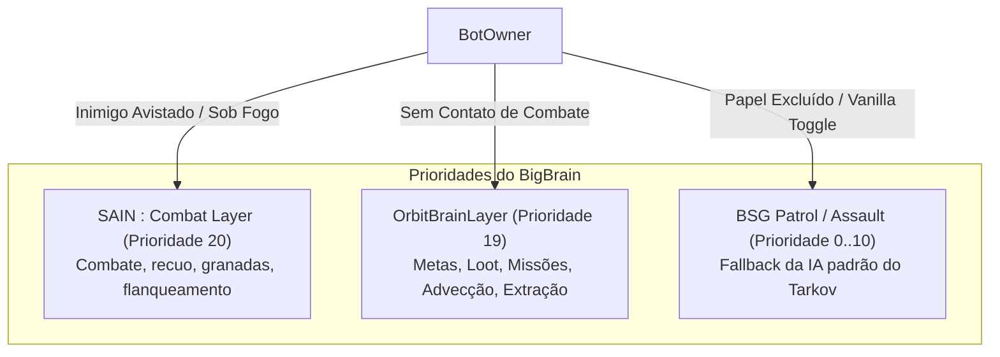
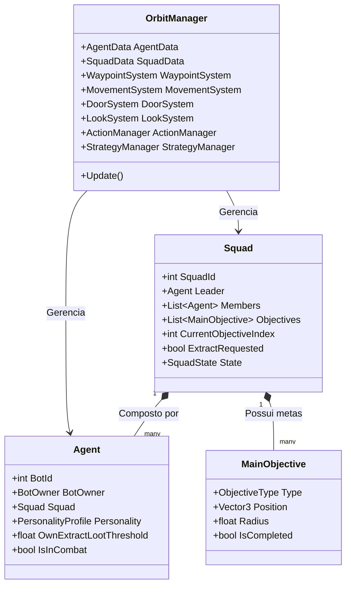
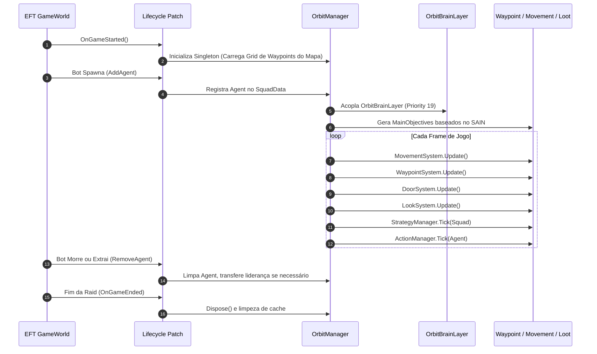

# ORBIT — Visão Geral e Arquitetura

O **ORBIT** (*Objective-driven Raid Bot Intelligence Tactics*) é um mod client-side (C# / BepInEx) para Escape From Tarkov / SPT 4.0 projetado para substituir a IA estática e passiva de patrulha por um comportamento tático e estratégico orgânico com propósito real em cada raid.

---

## 1. Princípios Arquiteturais

1. **Camada Coerente Unificada:** Em vez de ter múltiplos mods independentes brigando pelo controle do bot (ex.: *QuestingBots*, *LootingBots* e *Phobos* competindo por caminhos e prioridades de IA), o ORBIT unifica objetivos de missão, caça PvP, saque inteligente e navegação em um único framework orientado a metas.
2. **Coexistência Harmônica com o SAIN:** O ORBIT opera prioritariamente no estado de **fora de combate** (navegação, patrulha, busca de loot, progressão de missões). Quando ocorre contato visual ou troca de tiros, o **SAIN** assume a liderança total do combate em prioridade mais alta.
3. **Dinâmica em Esquadrão:** A IA não atua de forma isolada; líderes tomam decisões globais de rota enquanto membros se espalham taticamente (*splinter*), cobrem ângulos e fornecem suporte mútuo (*Squad Rally*).

---

## 2. Diagrama de Integração de Camadas (BigBrain & SAIN)

O ORBIT registra sua camada personalizada `OrbitBrainLayer` através do **BigBrain** com **Prioridade 19**:

- **Prioridade 20 (SAIN Combat Layer):** Quando o bot detecta um inimigo ou entra em combate direto, o SAIN ganha precedência total.
- **Prioridade 19 (OrbitBrainLayer):** Quando o bot está livre de combate, o ORBIT comanda o movimento, o saque, as missões e a navegação.
- **Prioridade < 19 (BSG Vanilla):** Camadas padrão da BSG que só são executadas se o ORBIT for explicitamente desativado para aquela facção/role.

---

## 3. Modelo de Entidades e Componentes (ECS)

O ORBIT implementa um modelo interno leve de entidades gerenciado pela classe central [OrbitManager](file:///d:/Projetos/GITHUB%20TARKOV/tarkov-spt-4.0/mods/ORBIT/original/Orbit/Core/OrbitManager.cs):

### Principais Estruturas:

- **[Agent](file:///d:/Projetos/GITHUB%20TARKOV/tarkov-spt-4.0/mods/ORBIT/original/Orbit/Entities/Agent.cs):** Representa um bot individual (`BotOwner`). Contém perfil de personalidade do SAIN, contadores de loot acumulado, estado de ferimentos e controle de sprint.
- **[Squad](file:///d:/Projetos/GITHUB%20TARKOV/tarkov-spt-4.0/mods/ORBIT/original/Orbit/Entities/Squad.cs):** Agrupa bots que compartilham o mesmo grupo (ou bots solo tratados como esquadrão unitário). Mantém a lista de objetivos principais (`MainObjectives`), líder ativo e status de extração.
- **[MainObjective](file:///d:/Projetos/GITHUB%20TARKOV/tarkov-spt-4.0/mods/ORBIT/original/Orbit/Entities/MainObjective.cs):** Cada meta sorteada para o esquadrão (`Quest`, `Kills` ou `LootValue`).

---

## 4. Ciclo de Vida em Raid

---

## 5. Principais Subsistemas do ORBIT

| Subsistema | Classe Principal | Responsabilidade |
|---|---|---|
| **Orquestrador Central** | [OrbitManager.cs](file:///d:/Projetos/GITHUB%20TARKOV/tarkov-spt-4.0/mods/ORBIT/original/Orbit/Core/OrbitManager.cs) | Inicialização, loop por frame, sincronização de dados e ECS. |
| **Camada Cerebral** | [OrbitBrainLayer.cs](file:///d:/Projetos/GITHUB%20TARKOV/tarkov-spt-4.0/mods/ORBIT/original/Orbit/Brain/OrbitBrainLayer.cs) | Camada BigBrain (Prioridade 19) que cede controle ao SAIN em combate. |
| **Grid de Waypoints e Advecção** | [WaypointSystem.cs](file:///d:/Projetos/GITHUB%20TARKOV/tarkov-spt-4.0/mods/ORBIT/original/Orbit/Systems/WaypointSystem.cs) | Rede de nós do mapa, campo de força vetorial (atração/repulsão) e convergência. |
| **Movimentação Orgânica** | [MovementSystem.cs](file:///d:/Projetos/GITHUB%20TARKOV/tarkov-spt-4.0/mods/ORBIT/original/Orbit/Systems/MovementSystem.cs) | Controle de rota, aceleração suave, sprint e prevenção de enroscos (*unstuck*). |
| **Looting & Gear Swap** | [OrbitLootHandler.cs](file:///d:/Projetos/GITHUB%20TARKOV/tarkov-spt-4.0/mods/ORBIT/original/Orbit/Looting/OrbitLootHandler.cs) | Saque de caixas/corpos e troca inteligente de armas e armaduras em tempo real. |
| **Portas e Bloqueios** | [DoorSystem.cs](file:///d:/Projetos/GITHUB%20TARKOV/tarkov-spt-4.0/mods/ORBIT/original/Orbit/Systems/DoorSystem.cs) | Abertura, arrombamento com chave mestra e gestão de portas trancadas. |
| **Look Tático** | [LookSystem.cs](file:///d:/Projetos/GITHUB%20TARKOV/tarkov-spt-4.0/mods/ORBIT/original/Orbit/Systems/LookSystem.cs) | Olhar realista para esquinas, portas e alvos de interesse durante a patrulha. |
| **Personalidades SAIN** | [SainPersonality.cs](file:///d:/Projetos/GITHUB%20TARKOV/tarkov-spt-4.0/mods/ORBIT/original/Orbit/Sain/SainPersonality.cs) | Mapeamento dinâmico de traços do SAIN para parâmetros estratégicos do ORBIT. |
