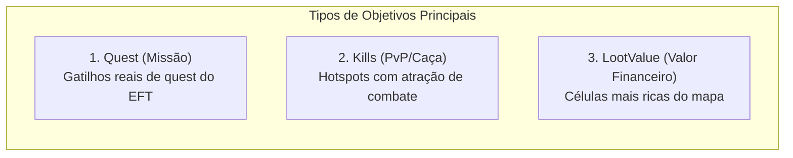
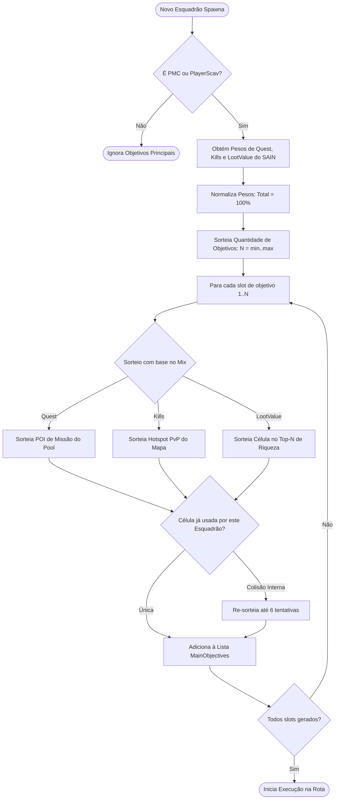
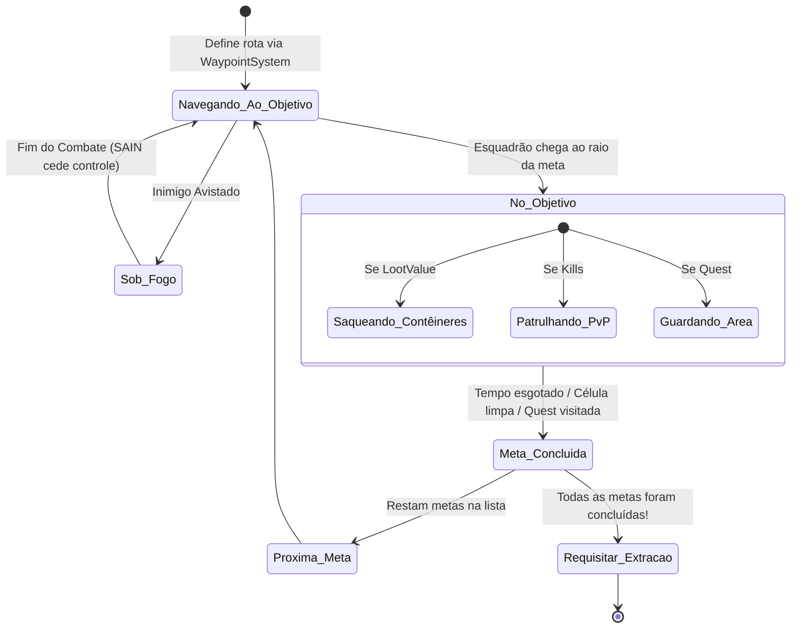

# ORBIT — Sistema de Objetivos e Metas (*Main Objectives*)

O sistema de **Objetivos Principais** (*Main Objectives*) é o coração do ORBIT. Ele garante que cada esquadrão de bots gerado no mapa possua uma lista ordenada de propósitos para cumprir durante a raid, simulando o comportamento de jogadores humanos que entram na partida com metas claras (fazer quests, caçar PvP ou encher a mochila de loot valioso).

---

## 1. Quem Recebe Objetivos?

- **PMCs:** Recebem uma lista de 1 a 5 metas (definidas pelo arquétipo do **SAIN**).
- **PlayerScavs:** Recebem objetivos configuráveis (com forte foco em `LootValue` e sobrevivência).
- **Bots Scavs Regulares / Bosses / Raiders:** Não recebem objetivos principais; permanecem operando pelo sistema de advecção/patrulha local, a menos que tenham opções de roaming ativadas.

---

## 2. Os 3 Tipos de Objetivos

### 1. `Quest` (Missões do EFT)
- **Origem:** Extraído dinamicamente dos gatilhos `TriggerWithId` do mapa (pontos onde jogadores precisam pegar itens, plantar marcadores ou investigar áreas).
- **Comportamento:** O esquadrão traça rota até o POI da missão. Ao chegar, o líder e os membros cobrem a área por um período de guarda (*POI Guard Duration*) e podem inspecionar contêineres próximos.

### 2. `Kills` (Caça em Hotspots PvP)
- **Origem:** Âncoras extraídas das zonas de advecção com força positiva (*Positive-Force Zones*), que representam áreas centrais de conflito no mapa (Dormitórios em Customs, Resort em Shoreline, D-2 em Reserve, etc.).
- **Comportamento:** O esquadrão ruma para o hotspot e entra em modo de patrulha agressiva (*Kills Roam*), espalhando-se em um raio de dispersão (`Roam splinter radius`) por um tempo determinado (`KillsRoamDuration`) à procura de alvos.

### 3. `LootValue` (Saque de Alta Densidade)
- **Origem:** O mapa é discretizado em uma grade de células 2D. O sistema calcula a densidade de valor de cada célula com base nos contêineres e itens soltos presentes.
- **Comportamento:** O esquadrão navega até a célula rica escolhida e inicia uma limpeza metódica sala a sala.
- **Timeout de Segurança:** Possui um temporizador de limite (`LootValue timeout`, padrão 300s) para evitar que o esquadrão fique indefinidamente preso em uma mesma sala se o loot acabar ou for inacessível.

---

## 3. Geração e Normalização de Pesos

Ao instanciar o esquadrão, a classe [MainObjectiveBuilder.cs](file:///d:/Projetos/GITHUB%20TARKOV/tarkov-spt-4.0/mods/ORBIT/original/Orbit/Sain/MainObjectiveBuilder.cs) executa o seguinte fluxo:

---

## 4. Gestão de Andares e Deslocamento Vertical

Para evitar que os bots fiquem oscilando em escadas ou correndo de cima para baixo sem limpar salas:

- **`SameFloorLootYTolerance` (Padrão 2.5m):** Qualquer item ou contêiner dentro de ±2.5 metros verticais é considerado no "mesmo andar", priorizando a limpeza completa do piso atual.
- **`CrossFloorSplinterChance` (Padrão 10%):** Probabilidade controlada de um membro do esquadrão decidir investigar o andar superior ou inferior enquanto o líder limpa o andar atual, gerando transições orgânicas entre pavimentos.

---

## 5. Máquina de Estados da Estratégia de Objetivos

A execução das metas é coordenada por [GotoObjectiveStrategy.cs](file:///d:/Projetos/GITHUB%20TARKOV/tarkov-spt-4.0/mods/ORBIT/original/Orbit/Tasks/Strategies/GotoObjectiveStrategy.cs):

Quando a opção `Extract when all mains done` está ativada, a conclusão do último objetivo principal da lista faz com que o esquadrão solicite imediatamente rota de fuga para a extração mais próxima.
