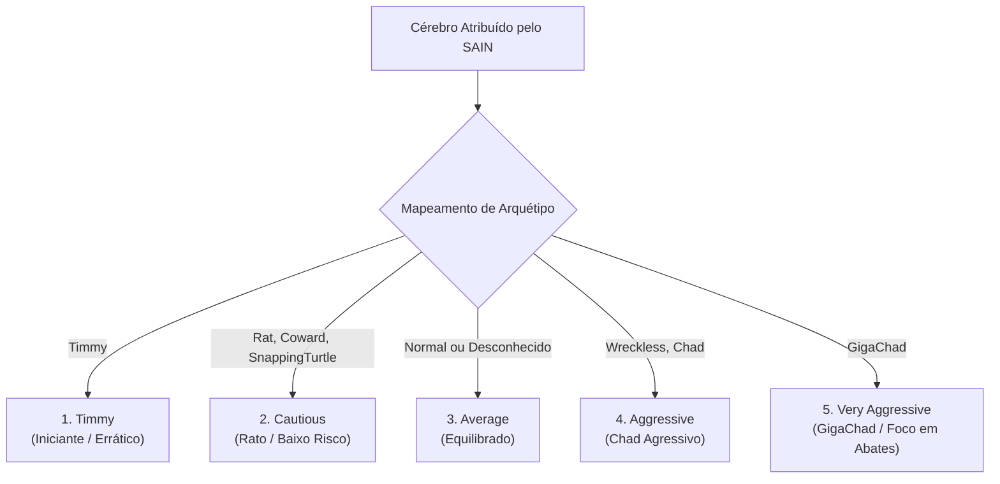

# ORBIT — Personalidades SAIN e Arquétipos

O ORBIT integra-se diretamente ao mod **SAIN** (*Solarint's AI Modifications*), lendo a personalidade atribuída a cada bot PMC via reflexão ([SainPersonality.cs](file:///d:/Projetos/GITHUB%20TARKOV/tarkov-spt-4.0/mods/ORBIT/original/Orbit/Sain/SainPersonality.cs)) e mapeando-a para um dos **5 Arquétipos Estratégicos** do ORBIT.

Dessa forma, a atitude de combate definida pelo SAIN (um Chad agressivo versus um Rat cauteloso) se reflete fielmente na estratégia global de raid do bot.

---

## 1. Mapeamento de Cérebros do SAIN

---

## 2. Comparativo dos 5 Arquétipos

| Parâmetro / Comportamento | 09.1 Timmy | 09.2 Cautious (Rat) | 09.3 Average | 09.4 Aggressive (Chad) | 09.5 Very Aggressive (GigaChad) |
|---|---|---|---|---|---|
| **Mix de Missões — Quest %** | 29% | 23% | 34% | 18% | 6% |
| **Mix de Missões — Kills %** | 29% | 6% | 33% | 64% | 83% |
| **Mix de Missões — LootValue %** | 42% | 71% | 33% | 18% | 11% |
| **Qtd. de Objetivos Principais** | 1 a 2 | 2 a 4 | 1 a 5 | 2 a 4 | 2 a 5 |
| **Limite de Loot p/ Extração (₽)** | 100k a 300k | 200k a 500k | 500k a 1M | 1M a 1.5M | 1.5M a 3M |
| **Cobertura de Saque (% da sala)** | 30% a 50% | 85% a 95% | 65% a 75% | 50% a 60% | 30% a 45% |
| **Propensão a Correr (Sprint)** | 0% (Nunca) | 20% | 50% | 80% | 100% (Sempre) |
| **Chance de Destrancar Portas** | 10% | 10% | 30% | 45% | 60% |
| **Valor Mínimo de Item (Mini-Loot)** | 0 ₽ (Pega tudo) | 5.000 ₽ | 10.000 ₽ | 15.000 ₽ | 20.000 ₽ |
| **Raio de Varredura de Loot (m)** | 10 m | 15 m | 10 m | 8 m | 5 m |
| **Raio de Dispersão dos Membros** | 30 m | 18 m (Agrupados) | 30 m | 39 m | 45 m (Muito espalhados) |
| **Duração de Patrulha em Kills (s)** | 30 a 150 s | 30 a 150 s | 60 a 300 s | 90 a 450 s | 150 a 750 s |
| **Filtro das Melhores Células de Loot** | Top 10 | Top 10 | Top 10 | Top 5 | Top 3 (Força encontros PvP) |

---

## 3. Detalhamento dos Perfis

### 1. Timmy (O Iniciante)
- **Perfil Psicológico:** Inseguro, inexperiente e desorientado.
- **Comportamentos Especiais:**
  - `Timmy: erratic extras`: Possui **20% de chance de errar a sala** e navegar para uma célula incorreta adjacente.
  - Possui **5% de chance de ignorar a lista de bloqueio** (*blacklist*) e revisitar áreas já limpas.
  - Não corre (sprint = 0%) a menos que seja forçado por combate.
  - Pega qualquer item sem critério de valor (filtro de mini-loot = 0 ₽).

### 2. Cautious / Rat (O Rato)
- **Perfil Psicológico:** Focado em sobrevivência máxima e lucro silencioso.
- **Comportamentos Especiais:**
  - Dedica **71% de seu foco ao LootValue** e praticamente evita caçar PvP (Kills = 6%).
  - Realiza varredura quase perfeita das salas (**85% a 95% de cobertura de contêineres**).
  - Mantém o esquadrão muito próximo e protegido (raio de dispersão de apenas 18m).
  - Extrai cedo da raid assim que junta uma quantia modesta de rublos (200k a 500k ₽).

### 3. Average (O Equilibrado)
- **Perfil Psicológico:** Jogador padrão de Tarkov que equilibra quests, loot e combate.
- **Comportamentos Especiais:**
  - Distribuição praticamente uniforme de metas (34% Quest, 33% Kills, 33% LootValue).
  - Comportamento de fallback caso o bot possua um cérebro personalizado não categorizado ou caso o SAIN esteja desativado.

### 4. Aggressive / Chad (O Caçador)
- **Perfil Psicológico:** Confiante, busca confrontos e avança rapidamente.
- **Comportamentos Especiais:**
  - Foco maciço em combate (**64% Kills**), patrulhando hotspots por longos períodos (até 7.5 minutos).
  - Corre frequentemente pelo mapa (80% sprint).
  - Ignora itens baratos (< 15.000 ₽) para não perder tempo enchendo a mochila com lixo.
  - Arromba portas trancadas com frequência (45%) para buscar inimigos ou itens raros.

### 5. Very Aggressive / GigaChad (O Predador de Hotspots)
- **Perfil Psicológico:** Ultra-agressivo, quer o controle total do mapa e a eliminação de todos os jogadores.
- **Comportamentos Especiais:**
  - Foco quase exclusivo em eliminações (**83% Kills**).
  - Busca as **Top 3 células mais ricas do mapa inteiro**, garantindo que convergirá para os pontos onde os jogadores reais costumam ir.
  - Corre a 100% da velocidade permitida.
  - Só para para saquear itens de valor extremo (> 20.000 ₽) ou armas de alto calibre.
  - Permanece em patrulha de combate por até 12.5 minutos contínuos.

---

## 4. Estrutura do `PersonalityProfile`

O objeto [PersonalityProfile.cs](file:///d:/Projetos/GITHUB%20TARKOV/tarkov-spt-4.0/mods/ORBIT/original/Orbit/Sain/PersonalityProfile.cs) é gerado uma única vez na criação do esquadrão a partir do cérebro do líder. Todos os membros do esquadrão compartilham esse perfil para manter coerência tática de grupo sem custo adicional de processamento.
