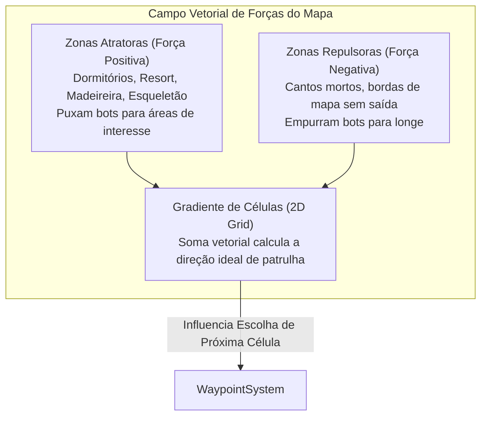
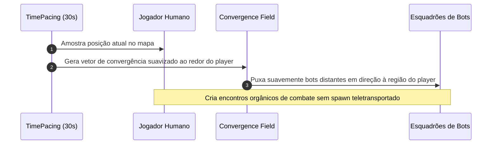
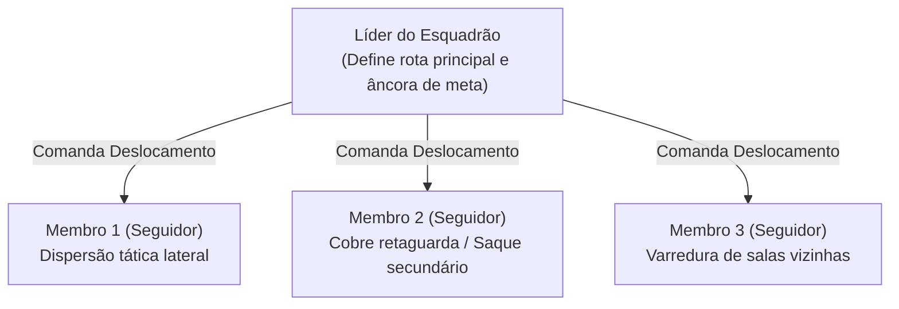
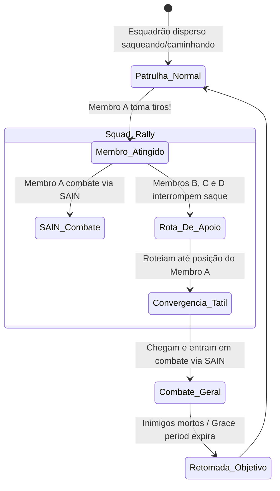

# ORBIT — Movimentação, Advecção e Esquadrões

A movimentação e a navegação dos bots no ORBIT são geridas por dois subsistemas interligados de alto desempenho: o [WaypointSystem.cs](file:///d:/Projetos/GITHUB%20TARKOV/tarkov-spt-4.0/mods/ORBIT/original/Orbit/Systems/WaypointSystem.cs) (que gerencia a grade de células e os campos de força vetoriais) e o [MovementSystem.cs](file:///d:/Projetos/GITHUB%20TARKOV/tarkov-spt-4.0/mods/ORBIT/original/Orbit/Systems/MovementSystem.cs) (que executa a movimentação frame a frame sobre o NavMesh).

---

## 1. O Campo de Força de Advecção (*Advection Field*)

Em vez de usar rotas pré-gravadas rígidas, o ORBIT modela cada mapa do Tarkov com um **campo vetorial contínuo de forças (Advecção)** inspirado em mecânica dos fluidos:

- **Atratores (Força > 0):** Criam uma "gravidade" natural que guia os bots gradualmente em direção aos centros nevrálgicos de conflito e saque do mapa.
- **Repulsores (Força < 0):** Evitam que os bots fiquem presos em áreas isoladas, trilhos de trem sem saída ou bordas do mapa.
- **Parâmetros F12 Ajustáveis:**
  - `Zone radius scale`: Multiplica o raio de influência de cada zona.
  - `Zone force scale`: Intensidade da força aplicada.
  - `Zone falloff scale`: Taxa de decaimento da força com a distância.

---

## 2. Convergência com Jogadores Humanos (*Player Convergence*)

O ORBIT possui um sistema de atração dinâmica em direção a jogadores humanos vivos (`Player convergence`):

- **Funcionamento:** A cada 30 segundos, o sistema projeta uma onda de atração sutil sobre a grade ao redor dos jogadores humanos.
- **Naturalidade:** Os bots não recebem *wallhack* ou teletransporte; eles apenas tendem a escolher rotas e células na direção geral do jogador, aumentando a densidade de ação sem quebrar a imersão.

---

## 3. Dinâmica Tática de Esquadrão

- **Liderança:** O líder do esquadrão seleciona a próxima célula ou objetivo principal.
- **Dispersão dos Membros (*Follower Splinter Radius*):** Os companheiros de equipe não andam em fila indiana colados nas costas do líder. Eles calculam posições de cobertura e pontos de saque secundários em um raio configurável (18m para Rats até 45m para GigaChads).
- **Troca de Liderança Dinâmica:** Se o líder for eliminado, o segundo membro vivo assume a liderança do esquadrão imediatamente, herdando a lista de objetivos.

---

## 4. Reagrupamento de Combate (*Squad Rally*)

Quando qualquer integrante do esquadrão sofre tiros ou entra em combate direto:

- **Comportamento:** O ORBIT emite um chamado tático (*Combat Caller*). Os companheiros de equipe que estavam fora do combate interrompem o saque de caixas e convergem para a posição do membro sob fogo para prestar suporte.
- **Tolerância de Chamada (`Combat caller grace`, padrão 5s):** Mantém a assistência ativa por alguns segundos após o último disparo para garantir que o flanco esteja seguro.

---

## 5. Resolução Assíncrona de Caminhos e Desobstrução (*Stuck Remediation*)

Para garantir 0% de queda de FPS e evitar bots travados:

1. **Cálculos NavMesh Assíncronos (`NavJobExecutor`):** Todas as rotas de longa distância são calculadas em segundo plano sem congelar a thread principal do Unity.
2. **Soft Unstuck (Desobstrução Leve):** Se o bot parar por mais de 2 segundos diante de um obstáculo, o sistema aciona saltos (*jump/vault*), agachamentos e abertura de portas.
3. **Hard Unstuck (Desobstrução Severa):** Se o bot permanecer preso por mais de 10 tentativas e estiver **fora da visão direta de jogadores humanos**, o ORBIT reposiciona suavemente o bot para o último nó seguro do NavMesh (*LastGoodCastPoint*).
