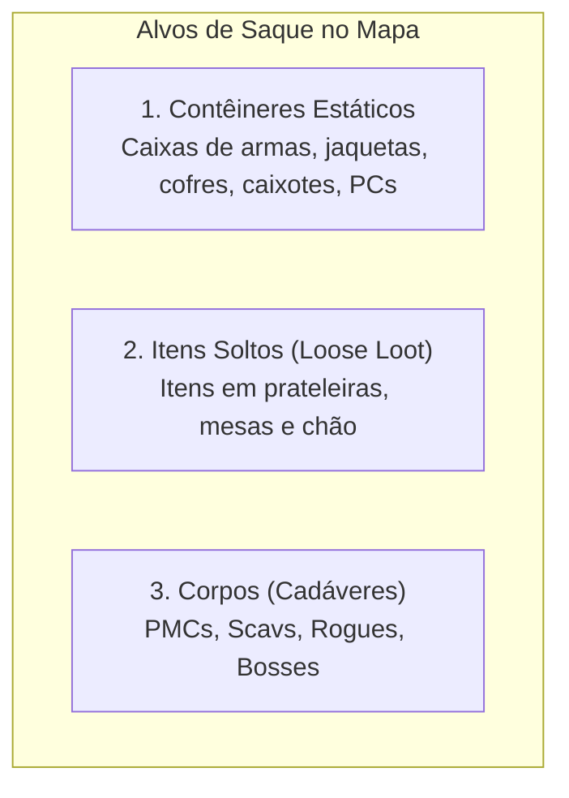
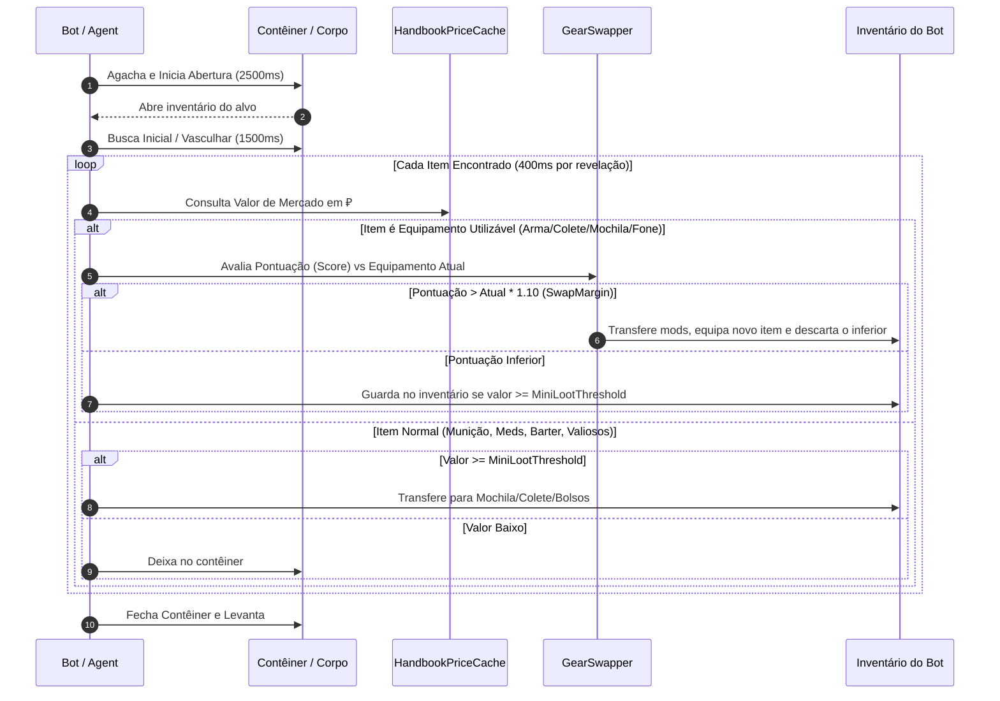

# ORBIT — Sistema de Coleta (*Looting*) e Troca de Equipamentos

O sistema de saque do ORBIT ([OrbitLootHandler.cs](file:///d:/Projetos/GITHUB%20TARKOV/tarkov-spt-4.0/mods/ORBIT/original/Orbit/Looting/OrbitLootHandler.cs)) foi completamente reformulado sobre as APIs nativas da BSG, eliminando travamentos de inventário e implementando um mecanismo dinâmico e inteligente de **avaliação e troca de equipamentos** (*Gear Swap*).

---

## 1. Categorias de Saque Suportadas



### Regras de Descoberta de Corpos
- **`CorpseRequiresSightOrSquadKill` (Padrão: LIGADO):** Um bot só saqueia um corpo se o seu esquadrão tiver sido responsável pela eliminação ou se o corpo tiver entrado na sua linha de visão direta. Isso impede o comportamento artificial de bots atravessando o mapa para saquear corpos ocultos.
- **`DetectDistance` (Padrão: 80m):** Distância máxima para que itens soltos ou caixas sejam identificados pelo líder do esquadrão.

---

## 2. Pipeline e Animações Realistas

O ORBIT simula o tempo real que um jogador leva para abrir, inspecionar e transferir itens:



- **Watchdog de Inatividade (30s):** Se uma transação assíncrona do Unity/EFT travar, o watchdog cancela automaticamente a sessão de saque e libera o bot para retomar a movimentação.

---

## 3. Arquitetura de Troca de Equipamentos (*Gear Swap*)

O ORBIT não equipa itens aleatoriamente. Cada categoria possui um avaliador (*Scorer*) dedicado que calcula uma pontuação numérica para o item atual versus o candidato.

A troca só é autorizada se o item candidato for **pelo menos 10% superior** ao item equipado (`SwapMargin = 1.10f`), evitando trocas desnecessárias entre itens equivalentes.

```mermaid
graph TD
    subgraph Avaliadores_de_Equipamento [Módulos de Avaliação (Scorers)]
        WS["WeaponScorer<br>Calibre, Dano, Ergonomia, Recuo, Miras Óticas, Silenciador"]
        AS["ArmorScorer<br>Classe de Blindagem (1..6), Durabilidade %, Material"]
        RS["RigScorer<br>Qtd. de Slots, Capacidade de Tambor, Blindagem Integrada"]
        BS["BackpackScorer<br>Espaço Interno Total vs Eficiência de Células"]
        HS["HeadsetScorer<br>Compressão Acústica e Ganho de Áudio"]
    end
```

### 1. Armas ([WeaponSwapper.cs](file:///d:/Projetos/GITHUB%20TARKOV/tarkov-spt-4.0/mods/ORBIT/original/Orbit/Looting/WeaponSwap/WeaponSwapper.cs) e [WeaponScorer.cs](file:///d:/Projetos/GITHUB%20TARKOV/tarkov-spt-4.0/mods/ORBIT/original/Orbit/Looting/WeaponSwap/WeaponScorer.cs))
- Analisa se a arma possui mira telescópica, empunhadura tática, laser/lanterna e supressor.
- Avalia o calibre e a disponibilidade de munição compatível no corpo/contêiner.
- Antes de descartar a arma antiga, o sistema tenta transferir os melhores acessórios para a mochila do bot.

### 2. Armaduras de Tronco ([ArmorSwapper.cs](file:///d:/Projetos/GITHUB%20TARKOV/tarkov-spt-4.0/mods/ORBIT/original/Orbit/Looting/WeaponSwap/ArmorSwapper.cs))
- Compara a classe de proteção (ex.: Classe 5 vs Classe 3).
- Avalia a durabilidade restante (uma armadura Classe 5 destruída com 5/60 HP não substituirá uma Classe 4 intacta).

### 3. Coletes Táticos (*Rigs*) ([RigSwapper.cs](file:///d:/Projetos/GITHUB%20TARKOV/tarkov-spt-4.0/mods/ORBIT/original/Orbit/Looting/WeaponSwap/RigSwapper.cs))
- Transfere automaticamente todos os pentes de munição e kits médicos do colete antigo para o novo antes de efetuar a troca, garantindo que o bot não fique sem munição em combate.

### 4. Mochilas e Fones ([BackpackSwapper.cs](file:///d:/Projetos/GITHUB%20TARKOV/tarkov-spt-4.0/mods/ORBIT/original/Orbit/Looting/WeaponSwap/BackpackSwapper.cs) e [HeadsetSwapper.cs](file:///d:/Projetos/GITHUB%20TARKOV/tarkov-spt-4.0/mods/ORBIT/original/Orbit/Looting/WeaponSwap/HeadsetSwapper.cs))
- Mochilas maiores substituem mochilas menores; o conteúdo interno da mochila antiga é transferido em cascata para a nova.

---

## 4. Cache de Preços do Handbook

O cálculo do valor de cada item utiliza o [HandbookPriceCache.cs](file:///d:/Projetos/GITHUB%20TARKOV/tarkov-spt-4.0/mods/ORBIT/original/Orbit/Looting/HandbookPriceCache.cs), que indexa todos os valores base do Tarkov no carregamento da partida, permitindo consultas instantâneas em O(1) sem gargalos de CPU.
