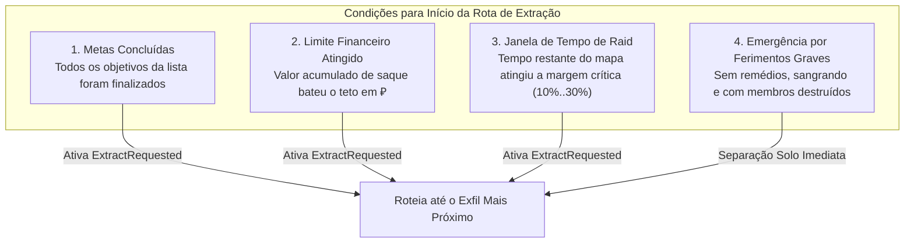
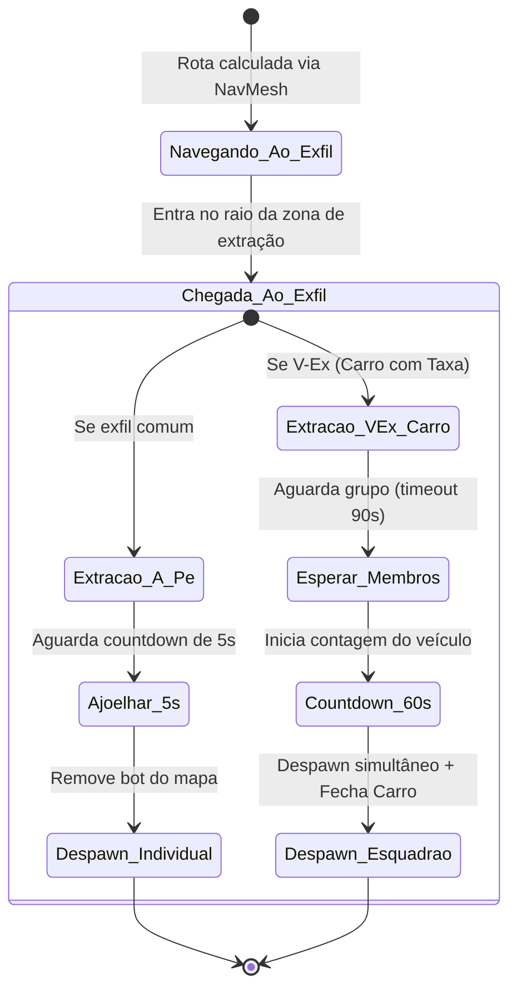

# ORBIT — Sistema de Extração Tático e Emergência

No Tarkov vanilla, os bots nunca extraem das raids, permanecendo até a morte ou até o término do tempo. No **ORBIT**, os bots tratam a extração como o clímax natural de sua incursão, gerenciado por [GotoObjectiveStrategy.cs](file:///d:/Projetos/GITHUB%20TARKOV/tarkov-spt-4.0/mods/ORBIT/original/Orbit/Tasks/Strategies/GotoObjectiveStrategy.cs) e [ExtractAction.cs](file:///d:/Projetos/GITHUB%20TARKOV/tarkov-spt-4.0/mods/ORBIT/original/Orbit/Tasks/Actions/ExtractAction.cs).

---

## 1. Quem Possui Lógica de Extração?

- **PMCs e PlayerScavs:** Sim, possuem gatilhos completos de extração programada e emergencial.
- **Scavs Bots / Bosses / Cultistas / Raiders:** Não extraem por padrão (a menos que explicitamente alterado em configurações avançadas de facção).

---

## 2. Os 4 Gatilhos Primários de Extração

### 1. Conclusão de Todos os Objetivos (`Extract when all mains done`)
Quando o esquadrão conclui a última missão (`Quest`), limpa a última sala (`LootValue`) ou conclui a patrulha de combate (`Kills`), o líder altera o status do grupo para `ExtractRequested` e seleciona o ponto de extração aberto mais próximo.

### 2. Limite de Valor em Saque (`ExtractAtLootValue`)
O esquadrão soma o valor estimado dos inventários de todos os membros vivos a cada intervalo. Ao ultrapassar o limite financeiro configurado pelo perfil do SAIN (ex.: 200k–500k ₽ para *Rats*, 1.5M–3M ₽ para *GigaChads*), o grupo decide encerrar a incursão para garantir os lucros.

### 3. Janela de Tempo da Partida (`Time extract window %`)
Evita que os bots sejam eliminados por perda de conexão ou tempo expirado (*MIA*). Cada esquadrão sorteia uma porcentagem do tempo total da raid (ex.: entre 10% e 30% do tempo restante). Quando o relógio da raid atinge essa marca, o esquadrão aborta objetivos pendentes e marcha para a saída.

### 4. Extração de Emergência por Ferimentos (`Emergency extract when wounded`)
- Se um PMC ou PlayerScav sofrer sangramentos pesados (*Heavy Bleeding*), fraturas ou danos críticos e **não possuir mais medicamentos válidos** (curativos, torniquetes, cirurgias CMS/Surv12), ele se separa do esquadrão e corre desesperadamente para a extração mais próxima para salvar seu equipamento.
- **Mecanismo de Recuperação:** Se no trajeto o bot encontrar itens médicos em um corpo ou o sangramento estancar, ele cancela o pânico de emergência e tenta se reagrupar ao esquadrão.

---

## 3. Extração Solo vs em Esquadrão

- **`Solo extract on own loot threshold (%)` (Padrão: 50%):** Quando um membro individual atinge seu limite pessoal de loot antes do resto do grupo, há uma chance configurável dele se despedir do esquadrão e extrair sozinho, enquanto o líder e os demais continuam a raid.

---

## 4. Tipos de Extração e Execução em Raid

### 1. Extrações a Pé (Standard Foot Exfil)
Ao alcançar a área de extração, o bot assume a postura agachada por **5 segundos** (simulando a barra de contagem do jogador) e é removido de forma segura do mapa através da API nativa da BSG (`BotLeaveData.RemoveFromMap`).

### 2. Extrações de Veículo / Carro Pago (V-Ex / Shared Timer)
O ORBIT implementa suporte completo a extrações com carro (ex.: Carro dos Dormitórios em Customs ou Usina em Interchange):
- O primeiro bot a chegar inicia a espera pelos companheiros de esquadrão (com tolerância máxima de 90s para evitar travamento por companheiros mortos a caminho).
- Uma vez reunidos, dispara a contagem regressiva oficial de **60 segundos**.
- Ao término dos 60 segundos, todos os bots presentes são extraídos simultaneamente e o V-Ex muda de estado para `NotPresent`, impedindo que outros jogadores usem o carro que acabou de "partir".
