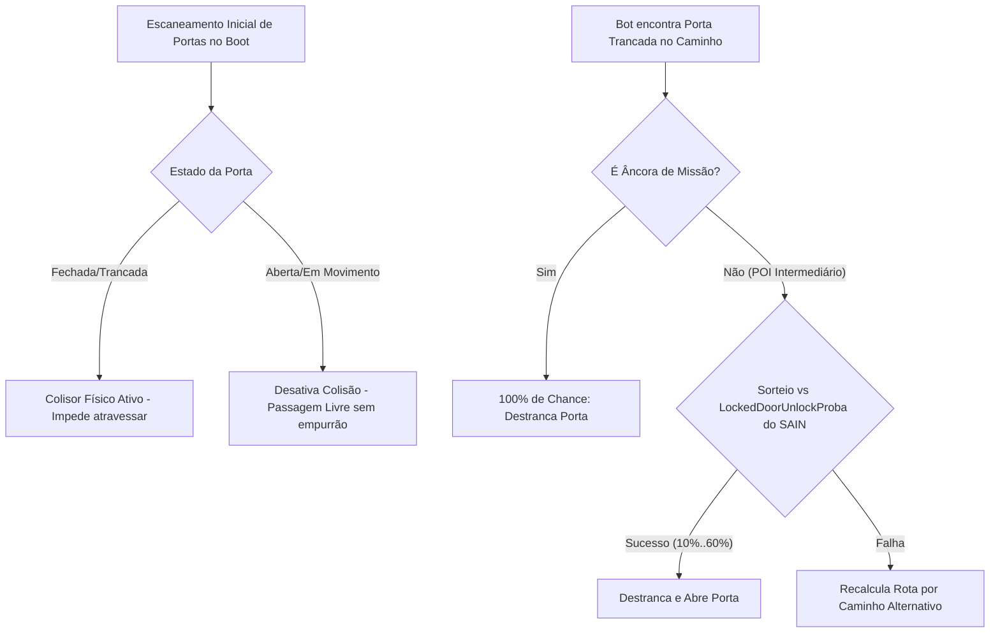
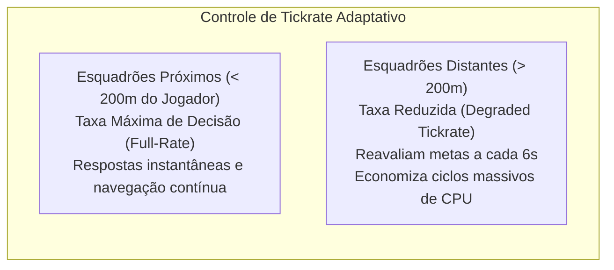

# ORBIT — Sistemas Auxiliares, Portas e Performance

Além dos sistemas principais de navegação, metas e saque, o ORBIT contém um conjunto refinado de subsistemas de suporte responsáveis pela interação com o cenário, estética dos movimentos, suporte a facções customizadas e otimização extrema de desempenho de CPU.

---

## 1. Sistema de Portas e Arrombamento (*DoorSystem*)

O [DoorSystem.cs](file:///d:/Projetos/GITHUB%20TARKOV/tarkov-spt-4.0/mods/ORBIT/original/Orbit/Systems/DoorSystem.cs) e o [DoorNavMesh.cs](file:///d:/Projetos/GITHUB%20TARKOV/tarkov-spt-4.0/mods/ORBIT/original/Orbit/Helpers/DoorNavMesh.cs) gerenciam a interação física dos bots com todas as portas do mapa:

- **Física Realista de Portas:** Resolve o antigo problema onde bots atravessavam portas fechadas ou eram arremessados longe por portas girando.
- **Destrancamento Orgânico:** Dependendo da personalidade do SAIN (10% para Rats/Timmys até 60% para GigaChads), bots conseguem destrancar portas trancadas para investigar salas ricas. Se a porta for o objetivo principal de uma missão, a chance é de 100%.

---

## 2. Sistema de Olhar Tático (*LookSystem*)

O [LookSystem.cs](file:///d:/Projetos/GITHUB%20TARKOV/tarkov-spt-4.0/mods/ORBIT/original/Orbit/Systems/LookSystem.cs) assegura que os bots mantenham uma postura de observação realista e humana:

- **Look-Ahead em Curvas:** Ao navegar por corredores e esquinas, a cabeça do bot gira suavemente em direção ao próximo nó do caminho antes mesmo do corpo virar, evitando a sensação de "robô duro".
- **Varredura em Elipse de Guarda (`RandomDirectionInEllipse`):** Quando um esquadrão está cobrindo um ponto ou esperando colegas de equipe, os bots realizam varreduras de ângulo suave em cones tridimensionais, simulando a vigilância de setores reais.

---

## 3. Otimização de Performance e Tickrate Adaptativo

Para manter taxas elevadas de quadros por segundo (FPS) mesmo em mapas densos com 30+ bots ativos:

- **`Full-rate distance` (Padrão 200m):** Esquadrões no raio de visão ou proximidade auditiva do jogador rodam sem qualquer redução.
- **`Far decision interval` (Padrão 6s):** Esquadrões no outro lado do mapa mantêm suas animações e movimentação linear, mas espaçam a tomada de novas decisões complexas para intervalos de 6 segundos, liberando ciclos preciosos da CPU para o combate imediato do jogador.
- **`Performance logging`:** Registra a cada 30 segundos métricas de FPS, tempos de coleta de lixo (*Garbage Collection*) e número de entidades ativas.

---

## 4. Patches Especiais de Integração

| Patch | Arquivo Fonte | Funcionalidade |
|---|---|---|
| **Airdrop Landing** | [AirdropLandedPatch.cs](file:///d:/Projetos/GITHUB%20TARKOV/tarkov-spt-4.0/mods/ORBIT/original/Orbit/Patches/AirdropLandedPatch.cs) | Detecta quando uma caixa de suprimentos aéreos toca o solo e gera instantaneamente um POI de alto valor no grid, atraindo esquadrões próximos para disputar o drop. |
| **Registro de Cadáveres** | [CorpseRegistrationPatch.cs](file:///d:/Projetos/GITHUB%20TARKOV/tarkov-spt-4.0/mods/ORBIT/original/Orbit/Patches/CorpseRegistrationPatch.cs) | Notifica o `WaypointSystem` no momento exato em que um personagem morre, criando um ponto de interesse de saque no mapa. |
| **Correções de Movimento** | [MovementFixes.cs](file:///d:/Projetos/GITHUB%20TARKOV/tarkov-spt-4.0/mods/ORBIT/original/Orbit/Patches/MovementFixes.cs) | Ajusta transições de postura, sprints e prevenção de travamentos na malha de navegação. |
| **Interceptação de Resgate** | [RescueInterceptPatch.cs](file:///d:/Projetos/GITHUB%20TARKOV/tarkov-spt-4.0/mods/ORBIT/original/Orbit/Patches/RescueInterceptPatch.cs) | Intercepta comandos de teletransporte forçado da BSG quando os bots estão navegando sob rotas válidas do ORBIT. |

---

## 5. Suporte a Facções Especiais e Mods de Terceiros

O ORBIT permite assumir o controle estratégico de bots provenientes de outros mods ou restaurar a inteligência original da BSG por facção através do menu F12:

- **Assumir Controle de Facções de Mods:**
  - `Take over ISB bots` (Padrão: Ligado)
  - `Take over UNTAR bots` (Padrão: Desligado)
  - `Take over RUAF bots` (Padrão: Desligado)
  - `Take over Black Division bots` (Padrão: Desligado)
  - `Take over Combine Soldiers bots` (Padrão: Desligado)
- **Desativar ORBIT por Facção (Usar Cérebro Vanilla BSG):**
  - `Vanilla scavs (RESTART)`
  - `Vanilla goons (RESTART)`
  - `Vanilla cultists (RESTART)`
  - `Vanilla raiders (RESTART)`
  - `Vanilla bloodhounds (RESTART)`
