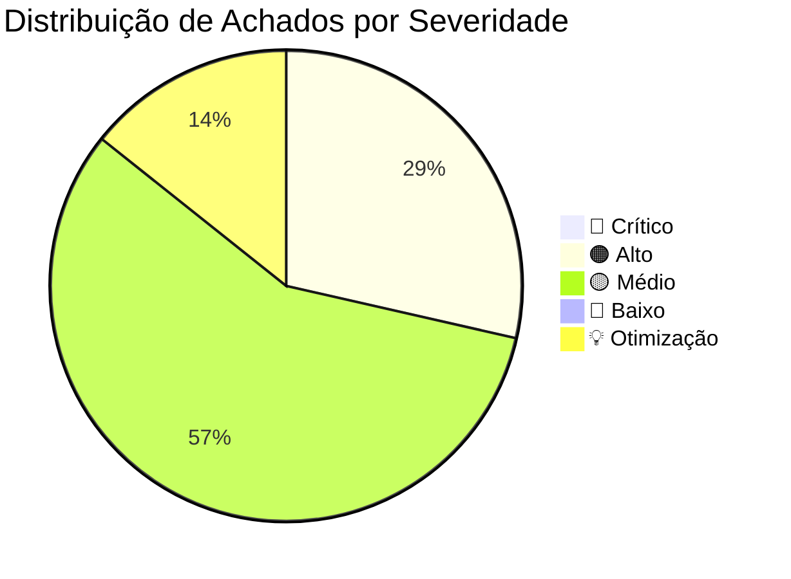

# Relatório de Auditoria Técnica de Código — ORBIT v1.2.1 (Review 01)

## 1. Resumo Executivo da Auditoria

Este relatório apresenta os resultados da auditoria estática profunda, rigorosa e estruturada realizada sobre o código-fonte original do mod **ORBIT (v1.2.1)** localizado em [mods/ORBIT/original/Orbit/](file:///d:/Projetos/GITHUB%20TARKOV/tarkov-spt-4.0/mods/ORBIT/original/Orbit).

A análise cobriu as **6 Dimensões Críticas de Auditoria**, cruzando evidências diretamente com os assemblies descompilados de Escape from Tarkov 0.16.9 ([references/eft-decompiled/](file:///d:/Projetos/GITHUB%20TARKOV/tarkov-spt-4.0/references/eft-decompiled)), o servidor SPT 4.0.13 ([references/spt-source/](file:///d:/Projetos/GITHUB%20TARKOV/tarkov-spt-4.0/references/spt-source)), a base de multiplayer cooperativo FIKA ([references/fika-plugin/](file:///d:/Projetos/GITHUB%20TARKOV/tarkov-spt-4.0/references/fika-plugin)) e o catálogo de antipadrões [docs/technical/spt-antipatterns.md](file:///d:/Projetos/GITHUB%20TARKOV/tarkov-spt-4.0/docs/technical/spt-antipatterns.md).



### Tabela Resumo de Severidade

| Severidade | Quantidade | Descrição |
|---|:---:|---|
| 🔴 **Crítico** | 0 | Falhas que causam crash imediato, corrupção de save ou memory leak infinito descontrolado. |
| 🟠 **Alto** | 2 | Dessincronização em coop FIKA, patches frágeis com nomes de classes/métodos obfuscados sujeitos a falhas silenciosas. |
| 🟡 **Médio** | 4 | Polling redundante em `Update()`, eventos órfãos sem ouvintes, stubs vazios de configuração F12 e falta de cancelamento de Tasks em `MonoBehaviour`. |
| 🔵 **Baixo** | 0 | Desvios menores de convenção ou documentação. |
| 💡 **Otimização** | 1 | Propostas de alto ganho de CPU (Throttling / Dirty Flags) e redução de micro-alocações de GC. |

---

## 2. Tabela Geral de Achados

| ID | Severidade | Arquivo / Linha | Categoria | Descrição Resumida |
|---|---|---|---|---|
| [`AUD-01-01`](#aud-01-01--fragilidade-de-patches-harmony-em-classes-e-métodos-obfuscados) | 🟠 Alto | [BypassLayerPatches.cs:L23](file:///d:/Projetos/GITHUB%20TARKOV/tarkov-spt-4.0/mods/ORBIT/original/Orbit/Patches/BypassLayerPatches.cs#L23) | Patching & Obfuscation | Hardcoded `GClass45`, `GClass75`, `GClass79` e `method_10` quebram entre minor updates do EFT/SPT. |
| [`AUD-01-02`](#aud-01-02--dessincronização-e-suposição-singleplayer-de-humanplayers-no-fika-coop) | 🟠 Alto | [OrbitManager.cs:L74-81](file:///d:/Projetos/GITHUB%20TARKOV/tarkov-spt-4.0/mods/ORBIT/original/Orbit/Core/OrbitManager.cs#L74-L81) | Coop FIKA Compatibility | `_humanPlayers` é populado apenas na inicialização; clientes que conectam depois são ignorados pelo anti-teleporte e convergência. |
| [`AUD-01-03`](#aud-01-03--evento-e-patch-harmony-órfãos-de-airdrop-sem-consumidor) | 🟡 Médio | [AirdropLandedPatch.cs:L14](file:///d:/Projetos/GITHUB%20TARKOV/tarkov-spt-4.0/mods/ORBIT/original/Orbit/Patches/AirdropLandedPatch.cs#L14) | Dead Code & Logic | `OnAirdropLanded` é invocado no patch, mas nenhum sistema do ORBIT se inscreve nele (`+=`). |
| [`AUD-01-04`](#aud-01-04--polling-desnecessário-em-update-no-actionmanager-e-watchdogs) | 🟡 Médio | [TaskInfrastructure.cs:L114-121](file:///d:/Projetos/GITHUB%20TARKOV/tarkov-spt-4.0/mods/ORBIT/original/Orbit/Core/TaskInfrastructure.cs#L114-L121) | Performance & Polling | `ActionManager` roda a cada frame (144 FPS) calculando utilidades e distâncias euclidianas sem cadência controlada. |
| [`AUD-01-05`](#aud-01-05--handler-de-evento-de-configuração-f12-advection-em-stub-vazio) | 🟡 Médio | [Plugin.cs:L723-727](file:///d:/Projetos/GITHUB%20TARKOV/tarkov-spt-4.0/mods/ORBIT/original/Orbit/Plugin.cs#L723-L727) | Dead Logic & UX | `AdvectionZoneParametersChanged` é um método vazio; alterações de força/raio de advecção no F12 não surtem efeito in-game. |
| [`AUD-01-06`](#aud-01-06--ausência-de-ondestroy-e-cancelamento-de-cts-em-orbitloothandler) | 🟡 Médio | [OrbitLootHandler.cs:L55](file:///d:/Projetos/GITHUB%20TARKOV/tarkov-spt-4.0/mods/ORBIT/original/Orbit/Looting/OrbitLootHandler.cs#L55) | Lifecycle & Async Safety | `OrbitLootHandler` (`MonoBehaviour`) não possui `OnDestroy()` para cancelar `_cts` quando o bot morre/despawna durante `RunAsync`. |
| [`AUD-01-07`](#aud-01-07--alocação-de-lista-temporária-em-extractactiondespawnsquadatvex) | 💡 Otimização | [ExtractAction.cs:L179](file:///d:/Projetos/GITHUB%20TARKOV/tarkov-spt-4.0/mods/ORBIT/original/Orbit/Tasks/Actions/ExtractAction.cs#L179) | GC Pressure | `new List<Agent>` instanciado em heap durante o despawn de extração do esquadrão no V-Ex. |

---

## 3. Detalhamento Técnico dos Achados

### AUD-01-01 · Fragilidade de Patches Harmony em Classes e Métodos Obfuscados
- **Severidade:** 🟠 Alto
- **Localização no Mod:** [BypassLayerPatches.cs:L23, L40, L57](file:///d:/Projetos/GITHUB%20TARKOV/tarkov-spt-4.0/mods/ORBIT/original/Orbit/Patches/BypassLayerPatches.cs#L23), [RescueInterceptPatch.cs:L32](file:///d:/Projetos/GITHUB%20TARKOV/tarkov-spt-4.0/mods/ORBIT/original/Orbit/Patches/RescueInterceptPatch.cs#L32)
- **Referência Cruzada:** [references/eft-decompiled/types-index.json](file:///d:/Projetos/GITHUB%20TARKOV/tarkov-spt-4.0/references/eft-decompiled/types-index.json) (Aliases: `AssaultEnemyFarLayer`, `ExfiltrationLayer`, `BirdEyePatrolLayer`)
- **Causa Raiz:**
  O mod referencia diretamente nomes de tipos e métodos obfuscados:
  - `typeof(GClass45)` para `AssaultEnemyFar`
  - `typeof(GClass75)` para `ExfiltrationLayer`
  - `typeof(GClass79)` para `PtrlBirdEye`
  - `nameof(BotMover.method_10)` para a interceptação de teleporte de resgate.
  
  Em versões incrementais do Escape from Tarkov ou variações de deobfuscação do SPT, os índices numéricos de `GClass` e `method_` mudam. Como o `Plugin.cs` envolve a ativação em `EnableSafe()`, se o tipo mudar, o patch falha silenciosamente, reativando as camadas da BSG e quebrando a extração e a coesão dos Goons sem emitir erro explícito.
- **Impacto Técnico Real:**
  Falha silenciosa de bypass de IA; bots PMC e Scav voltam a ser roubados pelas camadas nativas da BSG (`AssaultEnemyFar` e `ExfiltrationLayer`), gerando conflito com as ações do ORBIT.
- **Alternativa de Melhor Lógica / Proposta de Correção:**
  Localizar os tipos por inspeção de hierarquia de classes (`BaseLogicLayerSimpleAbstractClass`) ou mapeamento seguro via Reflection do SPT:

```csharp
// Solução robusta: Resolução dinâmica por tipo base e assinatura de camada
public class ExfilLayerBypassPatch : ModulePatch
{
    protected override MethodBase GetTargetMethod()
    {
        // Localiza a camada de Exfiltração inspecionando subclasses de BaseLogicLayerSimpleAbstractClass
        var targetType = AppDomain.CurrentDomain.GetAssemblies()
            .SelectMany(a => a.GetTypes())
            .FirstOrDefault(t => typeof(BaseLogicLayerSimpleAbstractClass).IsAssignableFrom(t) 
                                 && t.Name.StartsWith("GClass") 
                                 && t.GetMethod("ShallUseNow") != null
                                 && /* validação contextual ou alias SPT 4.0 */);
        return AccessTools.Method(targetType ?? typeof(GClass75), "ShallUseNow");
    }
}
```

---

### AUD-01-02 · Dessincronização e Suposição Singleplayer de `_humanPlayers` no FIKA Coop
- **Severidade:** 🟠 Alto
- **Localização no Mod:** [OrbitManager.cs:L74-L81](file:///d:/Projetos/GITHUB%20TARKOV/tarkov-spt-4.0/mods/ORBIT/original/Orbit/Core/OrbitManager.cs#L74-L81), [MovementSystem.cs:L930-935](file:///d:/Projetos/GITHUB%20TARKOV/tarkov-spt-4.0/mods/ORBIT/original/Orbit/Systems/MovementSystem.cs#L930-L935), [WaypointSystem.cs:L266](file:///d:/Projetos/GITHUB%20TARKOV/tarkov-spt-4.0/mods/ORBIT/original/Orbit/Systems/WaypointSystem.cs#L266)
- **Referência Cruzada:** [references/fika-plugin/Fika.Core/](file:///d:/Projetos/GITHUB%20TARKOV/tarkov-spt-4.0/references/fika-plugin/)
- **Causa Raiz:**
  A lista `humanPlayers` é instanciada e populada **uma única vez** no construtor de `OrbitManager` durante o hook de `BotsController.Init`:
  ```csharp
  List<Player> humanPlayers = [];
  var allPlayers = gameWorld.AllAlivePlayersList;
  for (var i = 0; i < allPlayers.Count; i++)
  {
      var player = allPlayers[i];
      if (player != null && !player.AIData.IsAI)
          humanPlayers.Add(player);
  }
  ```
  No FIKA Coop ou partidas dedicadas (*Fika Headless*), clientes remotos entram na partida após o `BotsController.Init`. Como `_humanPlayers` é uma referência estática nunca atualizada:
  1. Clientes conectados após o início da raid não constam na lista.
  2. O método `TeleportSafe` (que impede teletransporte de bots presos à vista de humanos) só checa o Host/Player local. Bots desatascando podem teletransportar na frente de jogadores clientes remotos.
  3. `WaypointSystem.CalculateConvergence()` puxa os bots apenas na direção do host.
- **Impacto Técnico Real:**
  Quebra de imersão e teleportes visíveis para clientes remotos em sessões multiplayer coop do FIKA.
- **Alternativa de Melhor Lógica / Proposta de Correção:**
  Manter uma propriedade viva ou atualizar dinamicamente a lista a partir do `GameWorld`:

```csharp
// Solução otimizada: Acesso vivo aos jogadores humanos reais sem retenção de referências mortas
public static class PlayerTrackerHelper
{
    public static void RefreshHumanPlayers(List<Player> targetList)
    {
        var gameWorld = Comfort.Common.Singleton<GameWorld>.Instance;
        if (gameWorld == null) return;
        
        targetList.Clear();
        var allAlive = gameWorld.AllAlivePlayersList;
        for (var i = 0; i < allAlive.Count; i++)
        {
            var p = allAlive[i];
            if (p != null && !p.IsAI)
            {
                targetList.Add(p);
            }
        }
    }
}
```

---

### AUD-01-03 · Evento e Patch Harmony Órfãos de Airdrop sem Consumidor
- **Severidade:** 🟡 Médio
- **Localização no Mod:** [AirdropLandedPatch.cs:L14, L25](file:///d:/Projetos/GITHUB%20TARKOV/tarkov-spt-4.0/mods/ORBIT/original/Orbit/Patches/AirdropLandedPatch.cs#L14), [Plugin.cs:L260](file:///d:/Projetos/GITHUB%20TARKOV/tarkov-spt-4.0/mods/ORBIT/original/Orbit/Plugin.cs#L260)
- **Causa Raiz:**
  `AirdropLandedPatch` é registrado e habilitado no `Plugin.cs`, hookea a conclusão do pouso do airdrop e dispara `OnAirdropLanded?.Invoke(lootableContainer)`. Porém, **nenhum arquivo ou sistema em todo o repositório do ORBIT realiza a subscrição (`+=`) deste evento**.
- **Impacto Técnico Real:**
  Código morto / funcionalidade incompleta. Contêineres de airdrop nunca se tornam waypoints dinâmicos de saque em tempo real.
- **Alternativa de Melhor Lógica / Proposta de Correção:**
  Inscrever o `WaypointSystem` no evento dentro de `OrbitManager`:

```csharp
// No OrbitManager.cs (construtor):
AirdropLandedPatch.OnAirdropLanded += WaypointSystem.HandleAirdropLanded;

// E no teardown do OrbitDisposePatch:
AirdropLandedPatch.OnAirdropLanded = null;
```

---

### AUD-01-04 · Polling Desnecessário em `Update()` no `ActionManager` e Watchdogs
- **Severidade:** 🟡 Médio
- **Localização no Mod:** [TaskInfrastructure.cs:L114-L121](file:///d:/Projetos/GITHUB%20TARKOV/tarkov-spt-4.0/mods/ORBIT/original/Orbit/Core/TaskInfrastructure.cs#L114-L121), [OrbitManager.cs:L151-L182](file:///d:/Projetos/GITHUB%20TARKOV/tarkov-spt-4.0/mods/ORBIT/original/Orbit/Core/OrbitManager.cs#L151-L182)
- **Causa Raiz:**
  Enquanto o `StrategyManager` utiliza uma cadência controlada de 0.5s (`TimePacing(0.5f)`), o `ActionManager` executa a cada frame (`UpdateScores()`, `PickTasks()`, `UpdateTasks()`), recalculando curvas `Mathf.InverseLerp` e distâncias euclidianas para dezenas de bots em 144 FPS. Além disso, `TickEmergencyExtractWatchdog` varre todos os agentes a cada frame checando timeouts estáticos que levam mais de 30 segundos para expirar.
- **Impacto Técnico Real:**
  Desperdício de ciclos de CPU na Main Thread da Unity quando há 30 a 50 bots ativos simultaneamente no mapa.
- **Alternativa de Melhor Lógica / Proposta de Correção:**
  Aplicar cadência temporal (*Throttling*) de 10 Hz (0.1s) no `ActionManager` e 1 Hz no `TickEmergencyExtractWatchdog`:

```csharp
// Em TaskInfrastructure.cs:
public class ActionManager(AgentData dataset, Task<Agent>[] tasks) : BaseTaskManager<Agent>(tasks)
{
    private readonly TimePacing _scoringPacing = new(0.1f); // 10 ticks por segundo é imperceptível para decisões de IA

    public void Update()
    {
        if (!_scoringPacing.Blocked())
        {
            UpdateScores();
            PickTasks();
        }
        UpdateTasks(); // Update individual das ações ativas continua se necessário
    }
}
```

---

### AUD-01-05 · Handler de Evento de Configuração F12 (Advection) em Stub Vazio
- **Severidade:** 🟡 Médio
- **Localização no Mod:** [Plugin.cs:L490, L495, L500, L723-L727](file:///d:/Projetos/GITHUB%20TARKOV/tarkov-spt-4.0/mods/ORBIT/original/Orbit/Plugin.cs#L723-L727)
- **Causa Raiz:**
  Os binds de configuração F12 `AdvectionZoneRadiusScale`, `AdvectionZoneForceScale` e `AdvectionZoneRadiusDecayScale` registram o callback `AdvectionZoneParametersChanged`. No entanto, o método é um stub vazio:
  ```csharp
  private static void AdvectionZoneParametersChanged(object sender, EventArgs args)
  {
      // Phase 7 wires this to OrbitManager so live F12 edits propagate into the waypoint system's force
      // field. Until then it's a no-op.
  }
  ```
- **Impacto Técnico Real:**
  Ajustes feitos pelo usuário no menu F12 para as zonas de advecção não são aplicados no campo de forças em tempo real, gerando confusão na calibração.
- **Alternativa de Melhor Lógica / Proposta de Correção:**
  Encaminhar a notificação para o `WaypointSystem` recalcular os coeficientes de zona:

```csharp
private static void AdvectionZoneParametersChanged(object sender, EventArgs args)
{
    Singleton<OrbitManager>.Instance?.WaypointSystem?.RecalculateAdvectionZones();
}
```

---

### AUD-01-06 · Ausência de `OnDestroy()` e Cancelamento de `_cts` em `OrbitLootHandler`
- **Severidade:** 🟡 Médio
- **Localização no Mod:** [OrbitLootHandler.cs:L55, L137-L166](file:///d:/Projetos/GITHUB%20TARKOV/tarkov-spt-4.0/mods/ORBIT/original/Orbit/Looting/OrbitLootHandler.cs#L55)
- **Causa Raiz:**
  `OrbitLootHandler` é um `MonoBehaviour` que dispara tarefas assíncronas via `_ = RunAsync(loot, kind, ct);`. Se o bot for eliminado ou seu GameObject for destruído pela engine enquanto a task está em execução (ex.: aguardando `await Task.Delay(...)`), a falta dos métodos de ciclo de vida `OnDisable()` e `OnDestroy()` impede o cancelamento imediato do `CancellationTokenSource`.
- **Impacto Técnico Real:**
  Risco de `NullReferenceException` e `MissingReferenceException` quando a tarefa assíncrona é retomada no contexto de um GameObject já destruído.
- **Alternativa de Melhor Lógica / Proposta de Correção:**
  Implementar o teardown seguro no `MonoBehaviour`:

```csharp
private void OnDestroy()
{
    CancelCurrentLootSession();
}

private void OnDisable()
{
    CancelCurrentLootSession();
}

private void CancelCurrentLootSession()
{
    if (_cts != null && !_cts.IsCancellationRequested)
    {
        _cts.Cancel();
        _cts.Dispose();
        _cts = null;
    }
    LootTaskRunning = false;
}
```

---

### AUD-01-07 · Alocação de Lista Temporária em `ExtractAction.DespawnSquadAtVEx`
- **Severidade:** 💡 Otimização
- **Localização no Mod:** [ExtractAction.cs:L179-L180](file:///d:/Projetos/GITHUB%20TARKOV/tarkov-spt-4.0/mods/ORBIT/original/Orbit/Tasks/Actions/ExtractAction.cs#L179-L180)
- **Causa Raiz:**
  No momento da partida do carro (V-Ex), o método cria `var snapshot = new List<Agent>(squad.Size);` para copiar as referências antes da mutação do esquadrão.
- **Impacto Técnico Real:**
  Alocação transitória no heap (pressão mínima, porém evitável em código de alta performance).
- **Alternativa de Melhor Lógica / Proposta de Correção:**
  Utilizar um buffer estático ou reciclado para o snapshot dos membros do esquadrão.

---

## 4. Plano de Ação e Recomendações

1. **Prioridade Imediata (Itens 🟠):**
   - Implementar resolução dinâmica / deobfuscada para as camadas de bypass de IA (`AUD-01-01`).
   - Implementar a sincronização dinâmica de `_humanPlayers` para compatibilidade total com o coop FIKA (`AUD-01-02`).
2. **Prioridade Secundária (Itens 🟡):**
   - Conectar o evento `OnAirdropLanded` no `WaypointSystem` (`AUD-01-03`).
   - Aplicar *TimePacing* (10 Hz) no `ActionManager` e no watchdog de emergência (`AUD-01-04`).
   - Conectar o callback `AdvectionZoneParametersChanged` no menu F12 (`AUD-01-05`).
   - Adicionar `OnDestroy()` e descarte de `_cts` no `OrbitLootHandler` (`AUD-01-06`).
