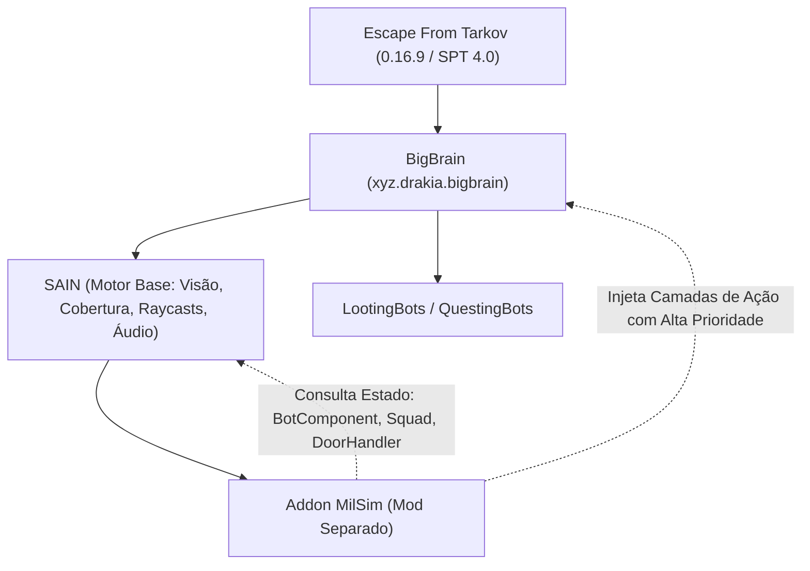

# 🗺️ SAIN — Roadmap do Addon de Imersão Militar Tática (MilSim)

Este documento define a visão, a arquitetura e as entregas do futuro **Addon de IA Militar Tática (MilSim)**, projetado para operar em conjunto com o SAIN como um mod independente no BepInEx, garantindo fácil manutenção, isolamento de código e sobrevida entre atualizações do SPT.

---

## 🏛️ Decisão de Arquitetura: Modelo de Addon Desacoplado

* **Manutenibilidade:** O SAIN permanece como base limpa e estável. As mecânicas táticas avançadas residem em seu próprio mod.
* **Injeção Não-Invasiva:** Utilização do `BigBrain` para registrar *Brain Layers* de alta prioridade (`BreachAndClearLayer`, `BoundingOverwatchLayer`, `AirdropContestedLayer`, `DoorNavigationLayer`) que assumem o bot apenas durante os eventos táticos coordenados.
* **Prevenção de Conflitos Internos:** Bloqueio de reações espúrias do SAIN (como fuga em pânico de granadas arremessadas pelo próprio bot ou gatilhos falsos de *unstuck* durante a espera em cobertura).

---

## 🛡️ Pilares de Desenvolvimento do Addon

### 1. Invasão Coordenada de Cômodos (*Breach & Clear*)
- [ ] **Identificação de Cômodos por Portas (`Door`):** Utilização de objetos interativos de porta como delimitador topológico entre corredores e aposentos fechados.
- [ ] **Posicionamento de Umbral (*Stack / Threshold Position*):** Posicionamento do bot na lateral externa da porta, protegido da "linha fatal" do vão.
- [ ] **Lançamento Preciso no Vão da Porta:** Cálculo de vetor balístico mirando no centro geométrico da abertura da porta com trajetória plana (ângulo de 5° a 15°).
- [ ] **Priorização de Granadas:**
  - *Flashbang (Zarya / Stun):* Prioritária para invasão rápida de quartos e salas com confirmação ou suspeita de alvo próximo.
  - *Fragmentação (Frag):* Utilizada para neutralizar alvos entrincheirados em cobertura dura.
- [ ] **Máquina de Estado de Espera (*Hold for Detonation*):** O bot mantém a posição em cobertura aguardando o evento de explosão (`OnGrenadeExplosive`), suprimindo temporariamente decisões de fuga ou busca desordenada.
- [ ] **Invasão Imediata (*Dynamic Push*):** Disparo de avanço agressivo para dentro do cômodo imediatamente após a detonação, aproveitando a janela de atordoamento/desorientação do inimigo.

### 2. Tática de Esquadrão Real (*Bounding Overwatch / Fogo e Movimento*)
- [ ] **Avanço Coordenado (*Leapfrog / Bounding*):** Enquanto 1 ou mais bots do esquadrão mantêm supressão contínua no setor inimigo, outros membros avançam para a próxima linha de cobertura.
- [ ] **Espaçamento Tático de Esquadrão:** Manutenção de distâncias táticas de dispersão para prevenir baixas múltiplas por granadas ou rajadas em linha.
- [ ] **Cobertura de Setores e Retaguarda:** Alocação de membros sem linha de tiro para vigiar flancos expostos e retaguarda.

### 3. Reação Humana ao Fogo e Supressão Pesada
- [ ] **Prioridade de Sobrevivência:** Transição imediata para cobertura sólida ou postura deitada (*prone*) ao sofrer fogo concentrado, evitando trocas de tiro expostas.
- [ ] **Choque de Supressão (*Suppression Flinch*):** Penalidade temporária na velocidade de aquisição de mira e dispersão de disparos ao receber tiros rasantes.
- [ ] **Disciplina de Reexposição:** Redução drástica na frequência com que o bot repete o mesmo ângulo de observação (*re-peeking*) após ser alvejado.

### 4. Ponto de Interesse e Disputa Agressiva por Airdrop (*Airdrop Contested Zone & Looting*)
- [ ] **Detecção de Eventos de Airdrop:** Escuta de eventos do jogo para acionamento de sinalizadores (`Flare`), passagem de avião de suprimentos e aterrissagem da caixa (`AirdropBox` / `AirdropPoint` / `SynchronizableObject`).
- [ ] **Criação Dinâmica de Hotspot de Alto Interesse:** Registro da coordenada de pouso da caixa como um Ponto de Interesse (POI) de altíssima prioridade para bots (PMCs e Scavs) num raio amplo (ex: 150m–300m).
- [ ] **Aproximação Tática e Estabelecimento de Perímetro:** Bots não correm a descoberto diretamente para o loot; esquadrões se movem em formação de cerco, varrem a área contra emboscadores e estabelecem posições defensivas ao redor da fumaça do sinalizador.
- [ ] **Disputa e Coleta Sob Tensão:** Concorrência hostil entre grupos pelo controle da caixa. Enquanto um bot realiza a busca e extração de itens de alto valor, membros aliados cobrem os ângulos de aproximação, transformando o Airdrop em uma zona de combate de alto risco para o jogador.

### 5. Navegação Físico-Espacial e Eliminação de Bugs de Portas (*Door Navigation & Anti-Stuck*)
- [ ] **Mitigação de Atravessamento Fantasma de Portas:** Pausar o avanço vetorial do `NavMeshAgent` durante a animação de rotação da porta e condicionar a liberação de travessia ao alcance de pelo menos 70% do ângulo total de abertura (`door.Angle >= door.OpenAngle * 0.7f`), impedindo que bots em alta velocidade atravessem a madeira sólida antes da abertura visual.
- [ ] **Recuo Tático em Portas "Pull" (*Backstep / Side-Step on Pull*):** Utilizar `DoorOpener.IsDoorPullOpen()` para identificar quando a folha da porta gira em direção ao bot. Ao acionar a maçaneta em portas *Pull*, aplicar automaticamente um recuo tático de 1.0m a 1.5m para trás e para o lado oposto da dobradiça, aguardando o fim do arco de giro antes de avançar para o vão e eliminando a armadilha de cunha atrás da porta.
- [ ] **Avanço Direto em Portas "Push" e Chutes (*Breach*):** Manter o avanço contínuo sem recuo quando a porta abrir para dentro do cômodo ou for arrombada com chute (*KickOpen*), preservando a agressividade e o ritmo tático.

---

## 🔒 Diretrizes de Preservação e Integração
- **Comunicação / VOIP do Jogador:** O subsistema de voz, gritos e detecção de áudio do jogador (`PlayerComponent` / `EnemyTalkClass`) é preservado integralmente, garantindo total compatibilidade com sistemas de VOIP customizados.
- **Parametrização Flexível:** Parâmetros de visão, reflexos e tempos de reação continuarão configuráveis via presets e interface in-game (F6).
