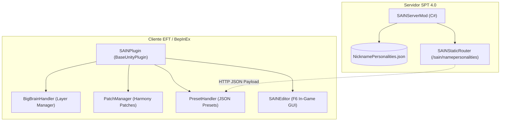
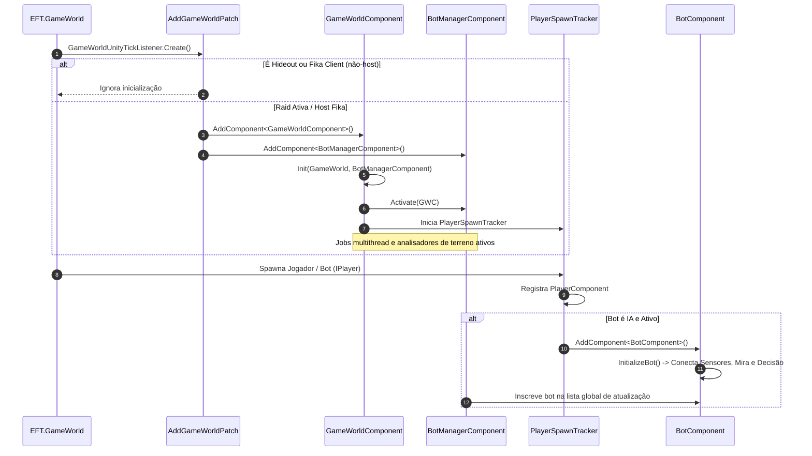
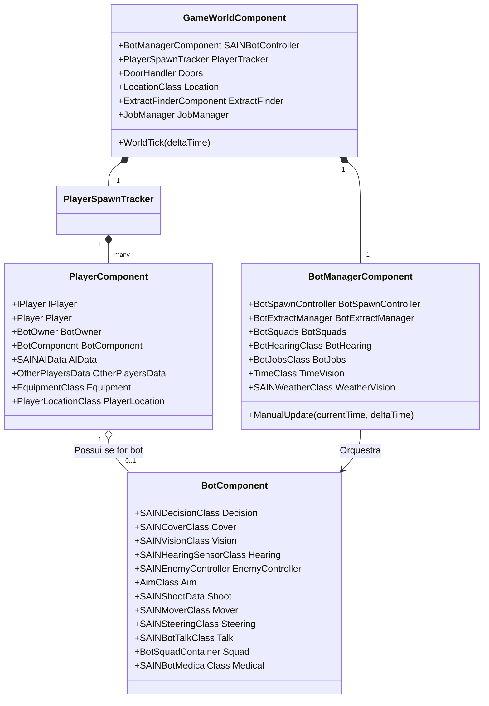

# SAIN — Visão Geral e Arquitetura

O **SAIN** (*Solarint's AI Modifications*) é a infraestrutura de inteligência artificial de referência para Escape From Tarkov no ecossistema SPT 4.0. Ele substitui os comportamentos rígidos e pré-programados da BSG por uma arquitetura avançada de tomada de decisão dinâmica, percepção sensorial realista (visão e audição humanas), cobertura tática por raycast, gerenciamento de recuo e balística adaptativa, e coordenação de esquadrões orientada a objetivos.

Na versão **v4.5.0**, o mod consolida uma série de otimizações de hot path (eliminação de reflection no loop físico, zero alocações de GC em friendly fire, suavização inercial de mira e teardown defensivo em transições de raid).

---

## 1. Topologia e Componentes do Mod

O SAIN opera como uma solução híbrida **Client-Server**:
- **Client Mod (C# / BepInEx):** Localizado em [`mods/SAIN/modded/SAIN/`](../../modded/SAIN/), é o motor central de IA que injeta componentes Unity, subsistemas de sensores, analisadores de terreno e patches Harmony no processo do cliente Tarkov.
- **Server Mod (C# / SPT 4.0 Server):** Localizado em [`mods/SAIN/modded/SAINServerMod/`](../../modded/SAINServerMod/), é responsável por fornecer rotas HTTP e sincronização de dados de perfil (como apelidos associados a personalidades de IA).

---

## 2. Ciclo de Vida em Raid (Lifecycle e Inicialização)

O ciclo de vida do SAIN durante uma raid inicia-se no carregamento do mapa via patch Harmony no inicializador do mundo de jogo da BSG:

### Principais Classes de Inicialização:
- [`SAINPlugin`](../../modded/SAIN/SAINPlugin.cs): Ponto de entrada do BepInEx, inicializa o gerenciador de patches [`PatchManager`](../../modded/SAIN/Plugin/PatchManager.cs), carrega os presets [`PresetHandler`](../../modded/SAIN/Preset/PresetHandler.cs) e conecta o [`BigBrainHandler`](../../modded/SAIN/Plugin/BigBrainHandler.cs).
- [`AddGameWorldPatch`](../../modded/SAIN/Patches/GameWorld/AddGameWorldPatch.cs): Hook no método `GameWorldUnityTickListener.Create` que anexa os componentes raiz [`GameWorldComponent`](../../modded/SAIN/Components/GameWorldComponent.cs) e [`BotManagerComponent`](../../modded/SAIN/Components/BotManagerComponent.cs).
- [`PlayerSpawnTracker`](../../modded/SAIN/Classes/PlayerManager/Players/PlayerSpawnTracker.cs): Monitora a entrada e saída de qualquer jogador humano ou bot na raid, instanciando seu respectivo [`PlayerComponent`](../../modded/SAIN/Components/PlayerComponent.cs) e removendo bots mortos de listas ativas para evitar vazamentos de memória.

---

## 3. Hierarquia de Componentes (Modelo de Objetos)

A estrutura interna do SAIN organiza a inteligência individual e coletiva dos bots através de uma árvore modular de controladores:

---

## 4. Integração com o BigBrain e Gerenciamento de Camadas

O SAIN utiliza a biblioteca **BigBrain** para injetar camadas de comportamento customizadas diretamente na árvore de decisões da BSG (`BotOwner.Brain`).

### Tabela de Prioridades das Camadas SAIN:

| Camada | Classe C# | Prioridade Padrão | Finalidade Principal |
|---|---|---|---|
| **Debug Layer** | [`DebugLayer`](../../modded/SAIN/Layers/Debug/DebugLayer.cs) | `99` | Testes manuais, forçar rotinas de rastreamento e animações |
| **Avoid Threat Layer** | [`SAINAvoidThreatLayer`](../../modded/SAIN/Layers/SAINAvoidThreatLayer.cs) | `80` | Fuga emergencial de granadas em voo ou áreas sob perigo mortal imediato |
| **Combat Squad Layer** | [`CombatSquadLayer`](../../modded/SAIN/Layers/Combat/Squad/CombatSquadLayer.cs) | `70` (configurável) | Ações táticas coordenadas quando em esquadrão (supressão, avanço cruzado) |
| **Combat Solo Layer** | [`CombatSoloLayer`](../../modded/SAIN/Layers/Combat/Solo/CombatSoloLayer.cs) | `69` (configurável) | Combate individual, busca de abrigo, flanqueamento, rush e trocas de tiro |
| **Extract Layer** | [`ExtractLayer`](../../modded/SAIN/Layers/Extract/ExtractLayer.cs) | `22` (configurável) | Rota de fuga e exfiltração de PMCs/Scavs conforme regras de raid |

### Camadas Nativas da BSG Removidas / Suprimidas:
Para evitar conflito entre a IA vanilla e o SAIN, o [`BigBrainHandler`](../../modded/SAIN/Plugin/BigBrainHandler.cs) suprime ativamente camadas como:
- `AdvAssaultTarget`, `AssaultEnemyFar`, `AssaultHaveEnemy`, `PushAndSup`, `Pursuit` (lógica de agressão vanilla da BSG).
- `Hit`, `Simple Target`, `Enemy Building`, `Assault Building`, `PmcBear`, `PmcUsec`.

---

## 5. Arquitetura Multithread e Otimização (Unity Jobs)

Para manter alto desempenho mesmo em mapas densos como *Streets of Tarkov*, o SAIN delega tarefas pesadas de raycasting para o Unity C# Job System através do [`JobManager`](../../modded/SAIN/Classes/BotManager/Jobs/JobManager.cs):

- **[`EnemyPathVisibilityRaycastJob`](../../modded/SAIN/Classes/BotManager/Jobs/EnemyPathVisibilityRaycastJob.cs):** Processa visibilidade paralela ao longo de caminhos NavMesh.
- **[`FlashlightRaycastJob`](../../modded/SAIN/Classes/BotManager/Jobs/FlashlightRaycastJob.cs):** Calcula feixes de lanternas e cones de iluminação sobre alvos.
- **[`VisionRaycastJob`](../../modded/SAIN/Classes/BotManager/Jobs/VisionRaycastJob.cs):** Executa bateladas de checagens de linha de visão (LoS) entre múltiplos bots e alvos simultaneamente.
- **[`RaycastJob`](../../modded/SAIN/Types/Jobs/RaycastJob.cs):** Otimizado na v4.5.0 para normalização vetorial e amplitude real em listas de pontos sem truncamento de distância.
- **[`TimeClass`](../../modded/SAIN/Classes/BotManager/TimeClass.cs) e [`SAINWeatherClass`](../../modded/SAIN/Classes/BotManager/SAINWeatherClass.cs):** Atualizam periodicamente matrizes de iluminação solar/lunar e oclusão por chuva/névoa em taxa constante de 1 segundo.

---

## 6. Compatibilidade e Suporte Cooperativo (FIKA)

No modo cooperativo **FIKA**, o SAIN implementa verificações dedicadas no [`AddGameWorldPatch`](../../modded/SAIN/Patches/GameWorld/AddGameWorldPatch.cs) e [`ModDetection`](../../modded/SAIN/Plugin/ModDetection.cs):
1. **Instância Host / Servidor:** Executa todos os cálculos de IA, sensores, decisões de combate e movimentação dos bots.
2. **Instância Cliente:** Detecta que o jogador é um cliente através de `ModDetection.FikaInterop.IsClient()` e ignora a criação do `GameWorldComponent` local, evitando desincronização de decisões e consumo redundante de CPU.
3. **Otimização de Hot Path (v4.5.0):** As propriedades de verificação do Fika são compiladas uma única vez na inicialização como delegados `Func<bool>`, eliminando chamadas de reflexão a 60–144Hz durante o tick do mundo.
