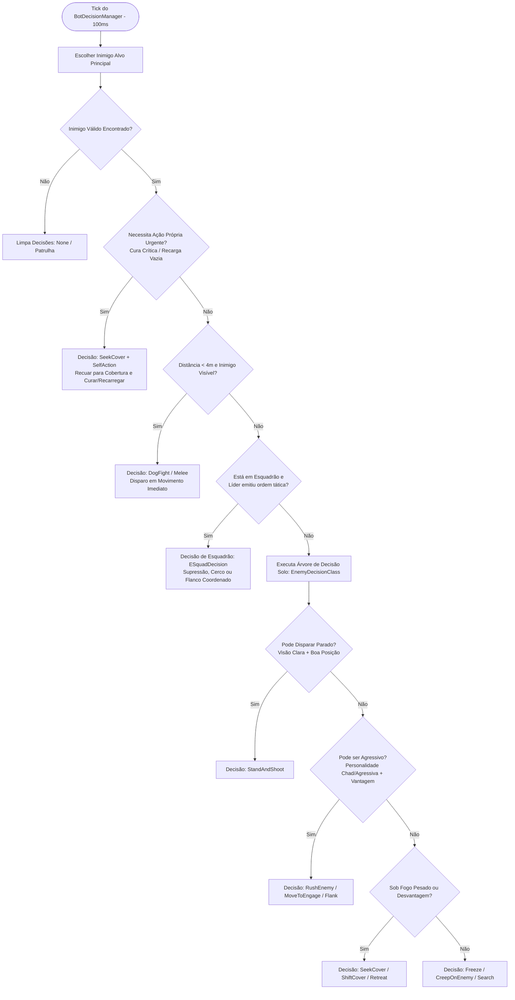
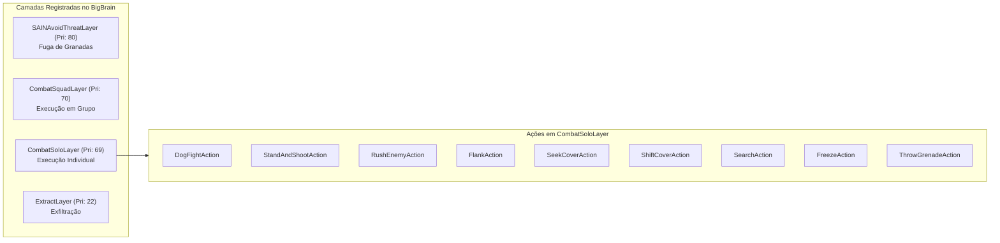

# SAIN — Máquinas de Estado e Tomada de Decisão

O cérebro tático do **SAIN** substitui a lógica puramente reativa e monolítica da BSG por uma **máquina de estados hierárquica e desacoplada**. O sistema avalia constantemente ameaças, estado de saúde, contagem de munição, linha de visão, informações de esquadrão e perfis de personalidade para determinar a ação tática ideal com alta responsividade (ciclo de avaliação a **10 Hz / 100ms**).

Na versão **v4.5.0**, a tomada de decisões foi blindada contra falhas críticas no ataque corpo-a-corpo do Tagilla contra humanos, eliminações de mutações em coleções de inimigos de dogfight e null-safety em decisões coordenadas de esquadrão.

---

## 1. Arquitetura da Tomada de Decisão

A tomada de decisão é centralizada na classe [`SAINDecisionClass`](../../modded/SAIN/Classes/Bot/Decision/SAINDecisionClass.cs) e orquestrada pelo [`BotDecisionManager`](../../modded/SAIN/Classes/Bot/Decision/BotDecisionManager.cs). Ela processa decisões em três eixos concorrentes:
1. **Decisão Própria / Auto-Preservação (`ESelfActionType`):** Recarga, estancamento de sangramento, cirurgia ou uso de analgésicos.
2. **Decisão Coletiva de Esquadrão (`ESquadDecision`):** Supressão coordenada, avanço em pinça, cobertura mútua ou busca compartilhada.
3. **Decisão Individual de Combate (`ECombatDecision`):** Combate corpo a corpo, busca de cobertura, flanqueamento, rush agressivo ou recuo.

---

## 2. Camadas BigBrain e Executores de Ação

As decisões tomadas pelo [`BotDecisionManager`](../../modded/SAIN/Classes/Bot/Decision/BotDecisionManager.cs) são mapeadas para as camadas ativas do BigBrain:

---

## 3. Catálogo Completo de Decisões de Combate (`ECombatDecision`)

Mapeadas no enum [`ECombatDecision`](../../modded/SAIN/SAINEnum.cs):

| Decisão | Descrição e Condição de Ativação | Ação Executada |
|---|---|---|
| `None` | Sem ameaça imediata de combate ativo. | O bot retorna ao estado de patrulha ou camada de menor prioridade. |
| `DogFight` | Inimigo extremamente próximo (< 4–8m), com linha de visão aberta ou em corrida para cima do bot. | Dispara em movimento contínuo enquanto se desloca lateralmente. Na v4.5.0, a seleção de alvos opera via busca linear sem alocações e sem mutar `KnownEnemies`. |
| `StandAndShoot` | Inimigo visível, bot em boa postura e com vantagem balística momentânea. | Mantém a posição com mira firme, compensando o recuo e descarregando rajadas controladas. |
| `RushEnemy` | Inimigo em recarga, ferido, correndo de costas ou o bot possui personalidade agressiva (*GigaChad/Chad*). | Avança com sprint direto em direção à posição do alvo para forçar um confronto letal a curta distância. |
| `MoveToEngage` | Inimigo detectado mas parcialmente obstruído ou fora de alcance efetivo de tiro. | Avança taticamente de cobertura em cobertura reduzindo a distância até linha de tiro livre. |
| `SeekCover` | Bot sofreu dano substancial, está sem munição ou sob fogo supressivo pesado. | Corre em sprint para o ponto de cobertura (`CoverPoint`) mais seguro calculado pelo CoverFinder. |
| `ShiftCover` | A cobertura atual foi comprometida (o inimigo flanqueou ou granada foi arremessada perto). | Desloca-se dinamicamente para uma cobertura secundária adjacente sem se expor à linha de fogo. |
| `Flank` | Inimigo fixado em uma posição defensiva conhecida e bot possui rota lateral viável. | Executa uma manobra de contorno angular largo utilizando o NavMesh fora da linha de visão do alvo. |
| `Search` | Inimigo perdeu o contato visual há mais de 5–10 segundos mas sua última posição é conhecida. | Rastreia a última posição vista/ouvida com arma empunhada e checagem de cantos (*corner slicing*). |
| `Freeze` | Inimigo próximo mas incerto da localização exata do bot (tática comum em *Rats/Cowards*). | Permanece totalmente imóvel e em silêncio absoluto aguardando o inimigo passar ou cometer um erro. |
| `CreepOnEnemy` | Bot detectou passos do inimigo a média distância e decide aproximar-se furtivamente. | Caminha agachado na velocidade mínima para suprimir ruído de passos até obter linha de tiro. |
| `AvoidGrenade` | Granada inimiga pousou dentro do raio de perigo (< 10m). | Foge em sprint na direção oposta ao vetor da explosão. |
| `MeleeAttack` | Bot sem munição em armas de fogo ou boss Tagilla com seu martelo ativado. | Investida direta em sprint armado com arma branca (corrigido na v4.5.0 para operar com segurança contra jogadores humanos). |
| `Retreat` | Sem munição em nenhum carregador ou saúde crítica generalizada sem cura. | Fuga em debandada total para longe da zona de engajamento. |

---

## 4. Catálogo de Decisões de Esquadrão (`ESquadDecision`)

Mapeadas no enum [`ESquadDecision`](../../modded/SAIN/SAINEnum.cs) e gerenciadas pelo [`SquadDecisionClass`](../../modded/SAIN/Classes/Bot/Decision/SquadDecisionClass.cs):

| Decisão de Esquadrão | Comportamento dos Membros |
|---|---|
| `Suppress` | Membros designados realizam disparos contínuos de supressão contra a cobertura do inimigo. |
| `PushSuppressedEnemy` | Enquanto uma fração do esquadrão suprime, os atacantes designados avançam velozmente pelo flanco. |
| `Surround` | O esquadrão divide-se em arcos angulares opostos para criar linhas de tiro cruzadas contra o alvo. |
| `Regroup` | Membros dispersos ou feridos convergem para a posição do líder do esquadrão. |
| `SpreadOut` | Bots se afastam quando muito aglomerados para evitar baixas múltiplas por granadas ou rajadas. |
| `Help` | Um companheiro de esquadrão sob fogo pesado emite chamado de socorro; bots próximos interrompem tarefas e convergem. |
| `GroupSearch` | Busca tática coordenada onde o líder investiga o ponto central enquanto alas cobrem a retaguarda e janelas. |
| `BoundingRetreat` | Recuo coordenado com cobertura mútua (*leap-frogging* defensivo). |

---

## 5. Catálogo de Ações Próprias (`ESelfActionType`)

Mapeadas no enum [`ESelfActionType`](../../modded/SAIN/SAINEnum.cs) e avaliadas pelo [`SelfActionDecisionClass`](../../modded/SAIN/Classes/Bot/Decision/SelfActionDecisionClass.cs):

| Ação | Prioridade | Condição de Execução |
|---|---|---|
| `Surgery` | Alta | Membro com fratura ou parte do corpo zerada (*blacked out*) quando seguro em cobertura. |
| `FirstAid` | Alta | Sangramento grave/leve ativo ou HP geral abaixo do limiar de segurança. |
| `Stims` | Média | Uso de injetores (morfina, propital, SJ6) para regeneração rápida ou aumento de vigor antes de investidas. |
| `Reload` | Média/Alta | Carregador vazio ou com menos de 30–50% de balas quando fora de linha direta de tiro. |

---

## 6. Histerese e Estabilidade de Decisão

Para evitar o fenômeno de oscilação rápida (*decision flutter* — onde o bot fica travado alternando entre atirar e correr), o [`BotDecisionManager`](../../modded/SAIN/Classes/Bot/Decision/BotDecisionManager.cs) aplica:
- **Intervalo de Reavaliação Mínimo:** 100ms entre pulsos de verificação.
- **Hold Timers:** Decisões como `SeekCover` e `RushEnemy` exigem tempo mínimo de persistência ou confirmação de transição antes de serem abortadas.
- **Continuidade de Movimento para Cobertura:** O método `ContinueMoveToCover()` assegura que, se um bot já estiver a caminho de um abrigo válido, ele não cancelará a corrida a menos que seja forçado por perigo imediato de morte.
