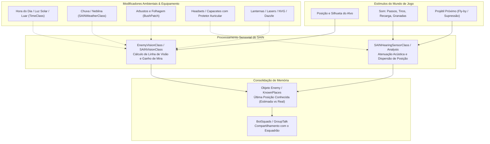
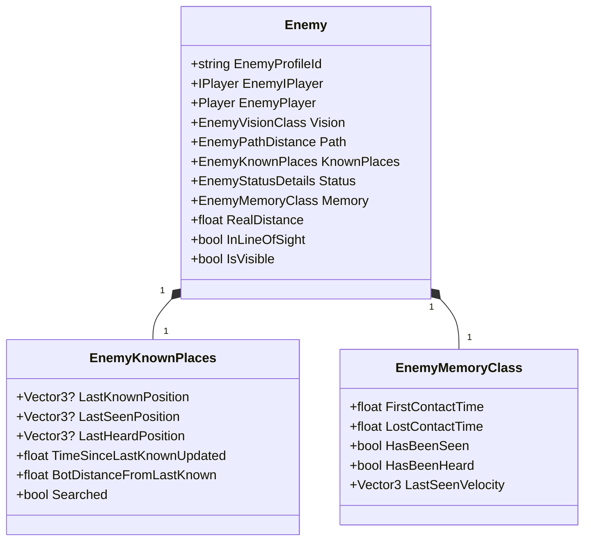

# SAIN — Sistema Sensorial: Visão, Audição e Memória

O SAIN elimina por completo a "visão através de paredes" (*wallhack/ESP*) e as reações sobrenaturais da IA vanilla da BSG. Em seu lugar, introduz um **modelo perceptual bio-inspirado** onde cada bot possui limitações humanas de tempo de reação, acuidade visual dependente de iluminação e folhagem, audição espacial baseada em oclusão acústica e memória de curto/médio prazo para estimativa posicional de alvos.

Na versão **v4.5.0**, os sensores foram aprimorados com cálculo vetorial otimizado de ofuscamento por lanternas (*Dazzle*), desinscrição estrita de eventos acústicos de impacto de bala e diferenciação precisa de sons de recarga de armas versus consumo de itens médicos/alimentos.

---

## 1. Pipeline Sensorial Integrado

Todos os estímulos do ambiente são filtrados e ponderados antes de serem consolidados na memória do bot:

---

## 2. Subsistema de Percepção Visual

A visão é gerida centralmente por [`SAINVisionClass`](../../modded/SAIN/Classes/Bot/Sense/SAINVisionClass.cs) e pelo componente por inimigo [`EnemyVisionClass`](../../modded/SAIN/Classes/Bot/EnemyClasses/Vision/EnemyVisionClass.cs).

### Fatores de Modificação da Visão:

| Fator | Classe / Módulo | Descrição do Efeito |
|---|---|---|
| **Hora do Dia (Dia / Noite)** | [`TimeClass`](../../modded/SAIN/Classes/BotManager/TimeClass.cs) | Ajusta a distância de visibilidade máxima baseada na curva solar e fase lunar. |
| **Clima e Neblina** | [`SAINWeatherClass`](../../modded/SAIN/Classes/BotManager/SAINWeatherClass.cs) | Chuva forte e neblina densa reduzem a distância máxima e a velocidade de ganho de mira (*GainSight*). |
| **Folhagem e Arbustos** | [`VisionPatches.cs`](../../modded/SAIN/Patches/VisionPatches.cs) | Bloqueia a linha de visão quando o alvo está oculto por vegetação densa, evitando tiros através de mato fechado. |
| **Lanternas e Lasers** | [`FlashLightDazzleClass`](../../modded/SAIN/Classes/Bot/Sense/FlashLightDazzleClass.cs) | Lanternas táticas apontadas diretamente para o rosto do bot ofuscam sua visão (*Dazzle*), aumentando drasticamente seu tempo de reação. Na v4.5.0, a amplitude e normalização vetorial foram otimizadas sem recálculo redundante de magnitude. |
| **Óculos de Visão Noturna (NVG)** | [`LightNVGSettings`](../../modded/SAIN/Preset/GlobalSettings/Categories/Look/LightNVGSettings.cs) | Bots com NVG ativo recuperam a acuidade visual diurna durante a noite. |
| **Partes do Corpo Visíveis** | `EnemyPartsClass` | Checa individualmente cabeça, tórax, braços e pernas; alvos expondo apenas a cabeça demoram mais para serem detectados. |

### Cálculo de Tempo de Reação (*GainSight*):
O tempo necessário para que um bot confirme visualmente um alvo é calculado por:
$$\text{TempoReação} = \text{BaseReação} \times \text{ModDistância} \times \text{ModIluminação} \times \text{ModMovimento} \times \text{ModPersonalidade}$$

---

## 3. Subsistema de Percepção Auditiva

A audição é processada por [`SAINHearingSensorClass`](../../modded/SAIN/Classes/Bot/Sense/Hearing/SAINHearingSensorClass.cs), que intercepta todos os eventos sonoros gerados por jogadores e bots na raid via [`BotHearingPatches`](../../modded/SAIN/Patches/BotHearing/BotHearingPatches.cs).

### Moduladores e Tipos de Som Detectados:

| Tipo de Som ([`SAINSoundType`](../../modded/SAIN/SAINEnum.cs)) | Raio Base Típico | Efeito de Atenuação Acústica |
|---|---|---|
| `Shot` (Tiro Não Silenciado) | 120–250m | Audível em quase todo o setor; alerta esquadrões distantes. |
| `SuppressedShot` (Tiro Silenciado) | 25–60m | Redução drástica do alcance de detecção. |
| `Sprint` (Corrida) | 35–50m | Ponto de dispersão baixo; bot localiza a direção com precisão. |
| `FootStep` (Passos Normais) | 15–25m | Audível em ambientes fechados; bloqueado por paredes espessas. |
| `Prone` / `Looting` / `Reload` | 5–12m | Sons sutis que denunciam ações vulneráveis do inimigo (na v4.5.0, `SAINSoundTypeHandler` discrimina recargas reais de itens consumíveis). |
| `GrenadePin` / `GrenadeDraw` | 10–18m | Aciona alerta imediato de perigo de granada. |
| `BulletImpact` / Fly-By | 10m do projétil | Aciona o estado de *Under Fire* (com desinscrição segura no `HearingInputClass.Dispose()`). |

### Dispersão Auditiva (*Hearing Dispersion*):
Diferente da IA vanilla que conhece as coordenadas $(X, Y, Z)$ exatas de onde veio o som, o SAIN aplica a classe [`HearingDispersionClass`](../../modded/SAIN/Classes/Bot/Sense/Hearing/HearingDispersionClass.cs):
- Adiciona um erro angular e de profundidade proporcional à distância do emissor.
- Bots não atiram diretamente no som: eles investigam ou miram em um cone estimado de probabilidade posicional.

---

## 4. Memória Tática e Rastreamento de Alvos (`SAINEnemy`)

Cada bot mantém uma instância de [`Enemy`](../../modded/SAIN/Classes/Bot/EnemyClasses/Enemy.cs) para cada oponente identificado:

### Funcionalidades de Memória:
- **Estimativa Preditiva de Posição:** Ao perder a linha de visão, o SAIN projeta o vetor de velocidade (`LastSeenVelocity`) do alvo por 1 a 3 segundos para estimar para onde ele correu.
- **Decaimento Temporal de Informação:** Se um inimigo não for visto nem ouvido após um longo período (ex.: 60–120s), o status de perigo é rebaixado e a posição é marcada como `Searched`.
- **Rastreamento de Esquadrão:** Quando um membro do grupo confirma a posição de um inimigo, essa coordenada é retransmitida via rádio para os colegas de esquadrão com um atraso realista de comunicação.
