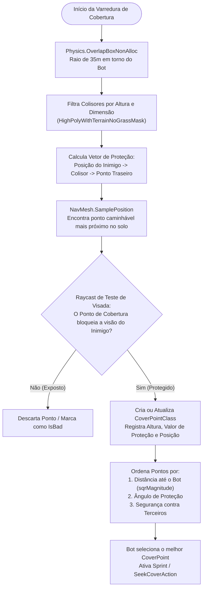
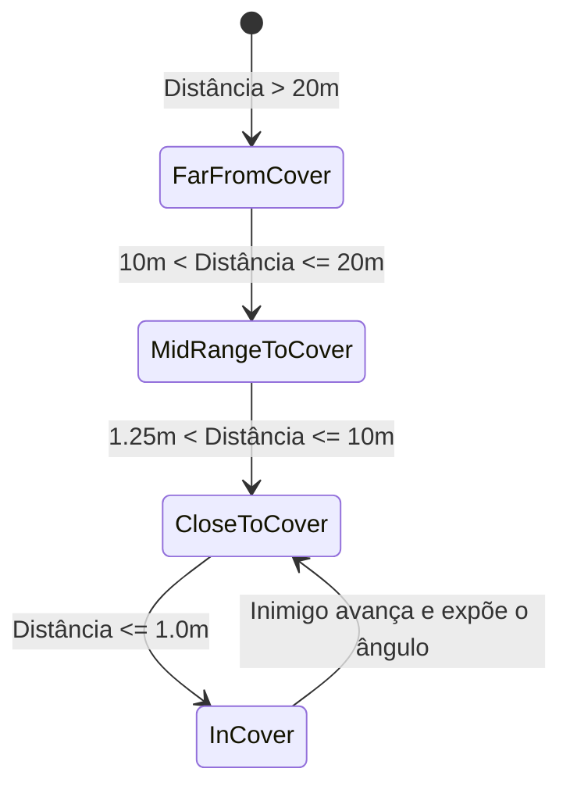

# SAIN — Sistema de Cobertura: CoverFinder e Posicionamento

Diferente do Tarkov vanilla — onde bots frequentemente utilizam pontos de abrigo estáticos fixos no mapa ou ficam expostos em campo aberto —, o **SAIN** introduz o [`CoverFinderComponent`](../../modded/SAIN/Components/CoverFinderComponent.cs), um sistema de **descoberta dinâmica de coberturas em tempo real** baseado em varredura volumétrica de colensores (*colliders*), projeção vetorial contra a posição do inimigo e checagem de NavMesh.

Na versão **v4.5.0**, o subsistema de cobertura foi corrigido em suas projeções vetoriais de proteção e triagem de distâncias ao quadrado, e o controlador de inclinação (*Lean*) teve suas alocações de LINQ substituídas por pattern matching direto em C#.

---

## 1. Pipeline de Descoberta e Avaliação de Coberturas

O algoritmo do CoverFinder roda em corrotinas otimizadas com frequência de **10 Hz** via [`CoverAnalyzer`](../../modded/SAIN/Classes/Coverfinder/CoverAnalyzer.cs):

---

## 2. Estrutura do Ponto de Cobertura (`CoverPoint`)

Mapeada em [`CoverPoint.cs`](../../modded/SAIN/Classes/Coverfinder/CoverPoint.cs):

| Atributo | Tipo | Descrição |
|---|---|---|
| `CoverPosition` | `Vector3` | Posição exata no NavMesh onde o bot deve posicionar os pés. |
| `ProtectionDirection` | `Vector3` | Vetor unitário normal que indica para qual direção a proteção é efetiva contra projéteis (corrigido na v4.5.0 para projeção vetorial precisa). |
| `Height` | `float` | Altura do obstáculo; determina se o bot pode ficar em pé ou deve agachar/deitar. |
| `Value` | `float` | Índice composto de volume e robustez da cobertura ($X + Y + Z$). |
| `IsInUse` | `bool` | Flag que impede que múltiplos bots do mesmo esquadrão disputem o mesmo metro de abrigo. |
| `TimeSinceUpdated` | `float` | Idade da última validação por raycast; coberturas obsoletas são recalculadas. |

### Estados de Proximidade da Cobertura ([`CoverStatus`](../../modded/SAIN/SAINEnum.cs)):

---

## 3. Direção e Orientação do Olhar (*Steering Priority*)

O controle da rotação da cabeça e do tronco do bot enquanto ele se desloca ou espera em cobertura é governado por [`SAINSteeringClass`](../../modded/SAIN/Classes/Bot/Steering/SAINSteeringClass.cs) conforme a seguinte hierarquia de prioridades:

| Prioridade | Estado ([`ESteerPriority`](../../modded/SAIN/Classes/Bot/Steering/SteerPriorityClass.cs)) | Comportamento de Visada |
|---|---|---|
| **1 (Crítica)** | `EnemyVisible` | Trava o olhar diretamente no centro de massa / cabeça do inimigo visível. |
| **2** | `Aiming` / `ManualShooting` | Alinha o cano da arma ao ponto preditivo de disparo. |
| **3** | `UnderFire` | Vira instantaneamente para a origem de projéteis passando perto (*fly-by*). |
| **4** | `LastHit` | Mira na direção de onde o último tiro causou dano físico ao bot. |
| **5** | `HeardThreat` | Vira para o vetor angular do som de perigo mais recente (passos, recarga, tiro). |
| **6** | `EnemyLastKnown` | Mantém a mira firme na esquina ou porta onde o inimigo foi visto pela última vez. |
| **7** | `RunningPath` | Quando em sprint de fuga longa, olha para a frente do caminho de navegação. |
| **8 (Base)** | `RandomLook` | Varia suavemente o ângulo de observação em setores não cobertos por aliados. |

---

## 4. Sistema Dinâmico de Inclinação (*Lean & Peeking*)

O SAIN introduz mecânicas de inclinação de tronco adaptativas ([`LeanClass`](../../modded/SAIN/Classes/Bot/Mover/LeanClass.cs)):
- **Peeking Tático:** Em vez de sair andando de peito aberto por uma porta ou esquina, o bot aproxima-se da borda do colisor e inclina o tronco (`Lean Left` ou `Lean Right`) para obter linha de visão momentânea.
- **Otimização sem Alocações (v4.5.0):** As decisões de combate incompatíveis com inclinação (`Retreat`, `RunAway`, `MeleeAttack`) utilizam pattern matching nativo em vez de coleções estáticas e consultas LINQ.
- **Disparo Inclinado:** Se o inimigo estiver visível apenas através da fresta da inclinação, o bot sustenta o lean enquanto dispara e recolhe o tronco imediatamente caso sofra retorno de fogo.
- **Troca de Postura (Agachado / Em Pé):** Se a altura da cobertura for inferior a 1.2m, o bot agacha automaticamente para esconder a cabeça atrás do obstáculo durante a recarga ou aplicação de kits médicos.
