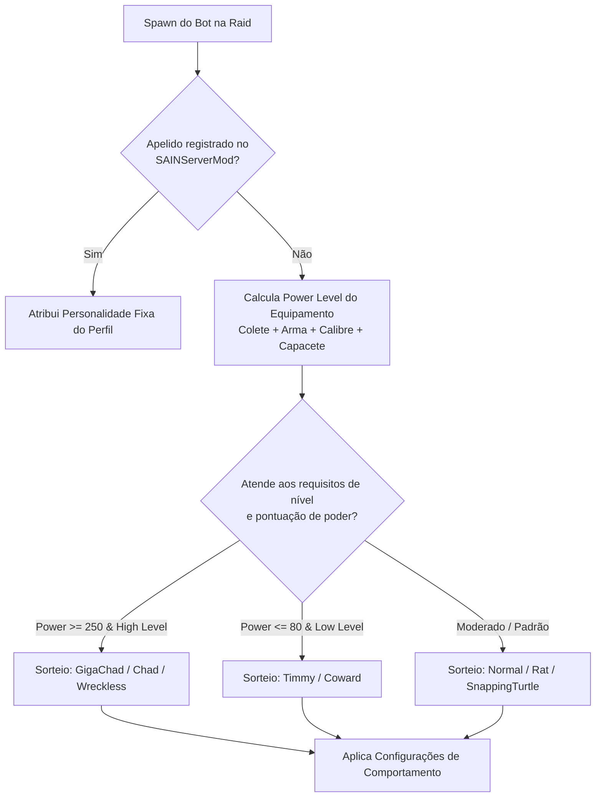
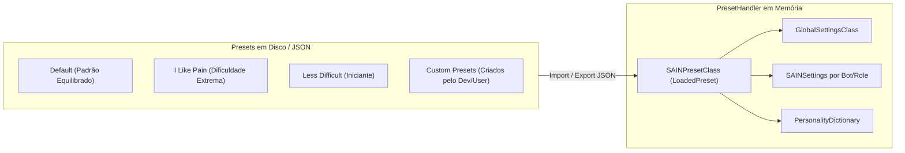

# SAIN — Personalidades e Sistema de Presets

Para criar variedade orgânica nos confrontos — evitando que todos os bots ajam como cópias idênticas —, o **SAIN** introduz um sofisticado sistema de **Personalidades de IA** ([`EPersonality`](../../modded/SAIN/Models/Preset/Personalities/EPersonality.cs)) e **Personalidades de Esquadrão** ([`ESquadPersonality`](../../modded/SAIN/Models/Enums/ESquadPersonality.cs)). Além disso, o mod fornece um **Editor Gráfico In-Game (F6)** completo e suporte a **Presets em JSON** com hot-reloading em tempo real.

Na versão **v4.5.0**, o gerenciador de personalidades foi aprimorado com reset dinâmico de dicionário (`.Clear()`), o editor IMGUI teve seu rastreador de edição desacoplado do ciclo de renderização e a desserialização de presets JSON ganhou logs explícitos de diagnóstico.

---

## 1. Atribuição Dinâmica de Personalidades

Ao nascer (*spawn*), cada bot é avaliado pelo [`PersonalityManagerClass`](../../modded/SAIN/Preset/Personalities/BasePersonality/PersonalityManagerClass.cs) com base no seu nível de poder de equipamento (*Power Level*), nível de jogador (*Player Level*), papel (*Role*) e apelido (*Nickname* do servidor SPT):

---

## 2. Catálogo de Arquétipos de Personalidade (`EPersonality`)

Configurações padrão definidas em [`PersonalityDefaultsClass`](../../modded/SAIN/Preset/Personalities/BasePersonality/PersonalityDefaultsClass.cs):

| Personalidade | Perfil Tático | Comportamento Principal | Agressão e Portas | Linhas de Voz (Taunt) |
|---|---|---|---|---|
| `GigaChad` | Hiper-agressivo / Veterano | Avança com sprint direto, persegue tiros distantes, flanqueia em alta velocidade. | Chuta todas as portas (`KickOpenAllDoors = true`), agressão máxima. | Provocações constantes e frequentes (`TauntChance = 45%`). |
| `Chad` | Agressivo Tático | Busca engajamentos rápidos, salta coberturas, empurra oponentes recarregando. | Agressão alta, abre/chuta portas com frequência. | Provoca ao avistar o alvo. |
| `Wreckless` | Imprudente / Fanático | Investida implacável sem medo da morte; ignora coberturas profundas. | Agressão extrema, avança mesmo ferido. | Gritos de guerra e gargalhadas sob fogo. |
| `SnappingTurtle` | Defensivo / Ângulo Fixo | Mantém posições fortificadas, segura ângulos em portas e aguarda o avanço do jogador. | Agressão baixa; contra-ataca brutalmente se for empurrado (*pushed*). | Furtivo, quase não provoca. |
| `Rat` | Furtivo / Emboscador | Prefere o silêncio, anda agachado, congela ao ouvir passos e ataca pelas costas. | Evita confrontos diretos em campo aberto; atira e se esconde. | Silêncio rádio absoluto. |
| `Timmy` | Iniciante / Hesitante | Tempo de reação lento, hesita em atirar, erra rajadas e entra em pânico sob fogo. | Corre em direções aleatórias quando ferido. | Gritos de dor e pânico frequentes. |
| `Coward` | Covarde / Sobrevivente | Foge ao primeiro sinal de dano ou inferioridade numérica; busca extração cedo. | Fuga constante para longe do som de tiros. | Pedidos desesperados de socorro. |
| `Normal` | Equilibrado | Combate padrão do SAIN com uso balanceado de cobertura, recuo e avanço. | Moderado; adapta-se à situação de combate. | Comunicação tática equilibrada. |

---

## 3. Personalidades de Esquadrão (`ESquadPersonality`)

Além da personalidade individual de cada bot, grupos coordenados recebem um arquétipo tático coletivo ([`ESquadPersonality`](../../modded/SAIN/Models/Enums/ESquadPersonality.cs)):
- **`GigaChads`:** O esquadrão avança sincronizado em formação de ataque contínuo, cobrindo os flancos enquanto o líder abre caminho.
- **`Elite`:** Comunicação precisa, supressão coordenada e avanço alternado (*bounding overwatch*).
- **`Rats`:** O esquadrão inteiro congela ao ouvir um ruído e prepara uma emboscada em cruz.
- **`TimmyTeam6`:** Desorganização de grupo, bots disparam assustados e bloqueiam a passagem uns dos outros em portas.

---

## 4. Sistema de Presets e Dificuldade

O gerenciamento de configurações é centralizado no [`PresetHandler`](../../modded/SAIN/Preset/PresetHandler.cs) e gravado em formato JSON na pasta `BepInEx/plugins/SAIN/Presets/`:

---

## 5. Editor Gráfico In-Game (F6 / `SAINEditor`)

O SAIN inclui uma interface gráfica Unity completa ([`SAINEditor`](../../modded/SAIN/Preset/Editor/SAINEditor.cs)) acessível via atalho de teclado **F6**:
- **Desacoplamento de Atualização (v4.5.0):** O rastreador de modificações [`ConfigEditingTracker`](../../modded/SAIN/Plugin/ConfigEditingTracker.cs) é acionado exclusivamente via `ManualUpdate()` (ciclo de frame normal), eliminando reexecuções redundantes e inconsistências visuais durante múltiplos passes de renderização `OnGUI()`.
- **Ajustes em Tempo Real:** Permite alterar multiplicadores de visão, audição, dispersão de recuo e agressividade sem reiniciar o jogo.
- **Visualização de Debug e Gizmos:** Permite ativar a renderização de linhas de visão (LoS), pontos de cobertura (`CoverPoint Gizmos`) e esferas de dispersão de som em tempo real durante a raid.
- **Exportação de Presets Customizados:** Permite criar novos perfis de dificuldade e compartilhá-los entre jogadores com validação de formato JSON e tratamento explícito de exceções.
