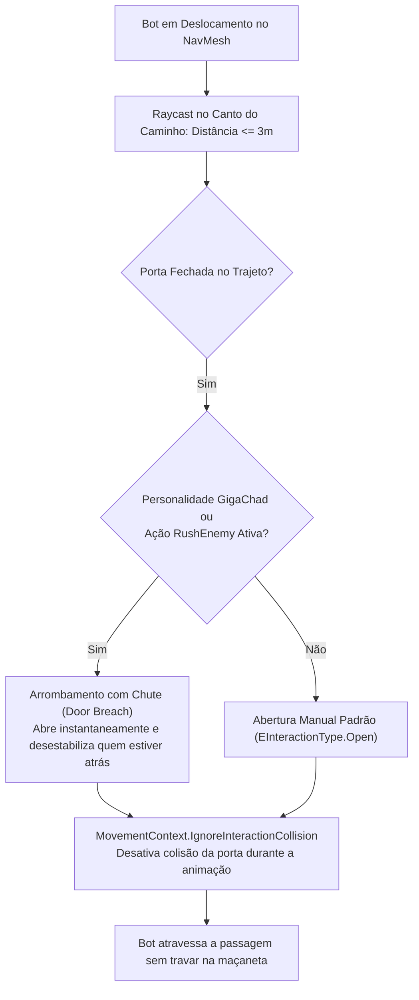
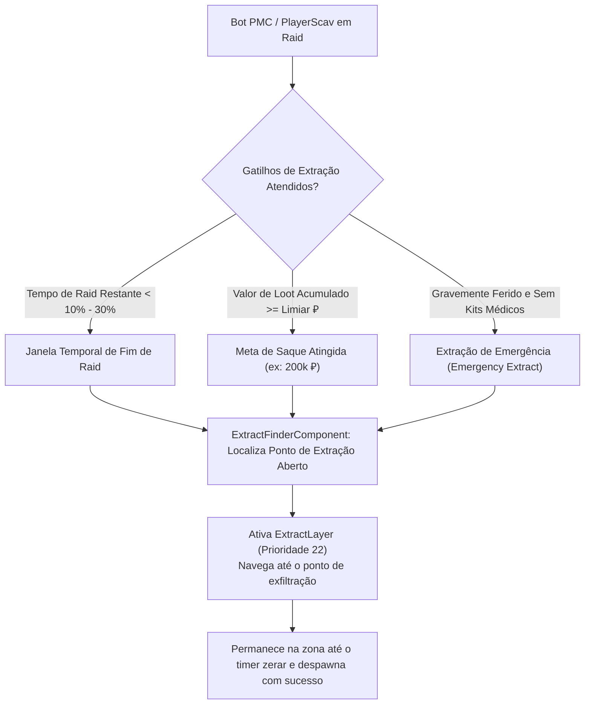

# SAIN — Sistemas Auxiliares: Portas, Médico, Extração e Patches

Além dos subsistemas centrais de combate e percepção, o **SAIN** integra uma suíte completa de controladores auxiliares que cuidam da física e transição de portas, auto-cura e cirurgia tática sob cobertura, rotinas de exfiltração em raid, multithreading com Unity Jobs e um extenso catálogo de **Patches Harmony** que harmonizam o comportamento do cliente Tarkov.

Na versão **v4.5.0**, o subsistema de portas e extração foi blindado com checagens defensivas de colisão, eliminação de reflexão em patches de pose/movimento e correção na validação de raio de exfiltração por distâncias quadráticas.

---

## 1. Gestão e Arrombamento de Portas (`DoorOpener`)

O manuseio de portas em Tarkov frequentemente gerava travamento de bots (*doorway jamming*). O SAIN soluciona isso através de [`DoorOpener`](../../modded/SAIN/Classes/Bot/Doors/DoorOpener.cs) e [`DoorHandler`](../../modded/SAIN/Classes/PlayerManager/Doors/DoorHandler.cs):

Na v4.5.0, a limpeza de interação em `DoorOpener.Clear()` valida defensivamente a presença de colisor e contexto de movimento antes de restaurar o estado físico.

---

## 2. Medicina de Campo e Auto-Preservação (`SAINBotMedicalClass`)

A sobrevivência e auto-recuperação dos bots é gerenciada por [`SAINBotMedicalClass`](../../modded/SAIN/Classes/Bot/Medical/SAINBotMedicalClass.cs):

| Condição Médica | Prioridade | Item Utilizado | Comportamento de Execução |
|---|---|---|---|
| **Sangramento Grave / Leve** | Crítica (1) | Torniquetes (Esmarch, CAT, CALOK-B) / Bandagens | Aplica imediatamente assim que atinge cobertura mínima para evitar morte por hemorragia. |
| **Membro Destruído (*Blacked*)** | Alta (2) | Kits Cirúrgicos (CMS, Surv12) | Executa cirurgia de campo apenas quando em cobertura segura (`CoverStatus.InCover`). |
| **HP Geral Baixo (< 40%)** | Média-Alta (3) | Kits Médicos (Salewa, IFAK, Grizzly, Medkit) | Cura tórax e cabeça prioritariamente antes de membros periféricos. |
| **Dor / Fraturas / Vigor Baixo** | Média (4) | Analgésicos e Injetores (Morfina, Ibuprofeno, Propital) | Utilizado antes de investidas (*pushes*) para manter mobilidade total sob fogo. |

---

## 3. Sistema de Extração de Bots (`BotExtractManager`)

O SAIN permite que PMCs e PlayerScavs concluam seu ciclo de raid e extraiam do mapa de forma orgânica através de [`BotExtractManager`](../../modded/SAIN/Classes/BotManager/BotExtractManager.cs) e da camada [`ExtractLayer`](../../modded/SAIN/Layers/Extract/ExtractLayer.cs):

Na v4.5.0, a ação [`ExtractAction.cs`](../../modded/SAIN/Layers/Extract/ExtractAction.cs) compara os limites mínimo e máximo de proximidade utilizando distâncias ao quadrado (`_minExtractDistSqr` e `_maxExtractDistSqr`), corrigindo a janela de permanência no colisor de extração.

---

## 4. Otimização Multithread com Unity Jobs (`JobManager`)

Para evitar congelamentos de quadros (*frame drops*) durante raids com muitos bots ativos, tarefas assíncronas de raycast são processadas em paralelo via [`JobManager`](../../modded/SAIN/Classes/BotManager/Jobs/JobManager.cs):
- **[`VisionRaycastJob`](../../modded/SAIN/Classes/BotManager/Jobs/VisionRaycastJob.cs):** Varredura paralela de linhas de visada direta entre bots e todos os jogadores vivos.
- **[`FlashlightRaycastJob`](../../modded/SAIN/Classes/BotManager/Jobs/FlashlightRaycastJob.cs):** Checagem volumétrica de cones de iluminação de lanternas sobre alvos para ofuscamento (*dazzle*).
- **[`EnemyPathVisibilityRaycastJob`](../../modded/SAIN/Classes/BotManager/Jobs/EnemyPathVisibilityRaycastJob.cs):** Avalia se cantos ao longo da rota NavMesh do inimigo são visíveis para antecipação de mira.

---

## 5. Catálogo Completo de Patches Harmony (`SAIN.Patches`)

Todos os hooks injetados no runtime do EFT são organizados por domínio funcional:

| Domínio / Arquivo | Classe Patch | Alvo BSG / Método | Função Técnica |
|---|---|---|---|
| **GameWorld** | [`AddGameWorldPatch`](../../modded/SAIN/Patches/GameWorld/AddGameWorldPatch.cs) | `GameWorldUnityTickListener.Create` | Inicializa `GameWorldComponent` e `BotManagerComponent` no carregamento da raid. |
| **GameWorld** | [`ActivateBotComponentPatch`](../../modded/SAIN/Patches/GameWorld/ActivateBotComponentPatch.cs) | `BotOwner.Activate` | Anexa e inicializa o `BotComponent` no bot ativo. |
| **GameWorld** | [`AddBotComponentPatch`](../../modded/SAIN/Patches/GameWorld/AddBotComponentPatch.cs) | `BotOwner.PreActivate` | Registro seguro no `BotSpawnController.Instance`. |
| **GameWorld** | [`WorldTickPatch`](../../modded/SAIN/Patches/GameWorld/WorldTickPatch.cs) | `GameWorld.DoWorldTick` | Conecta a atualização de taxa fixa do SAIN ao tick do mundo. |
| **Aim** | [`BodyPartToShootPatch`](../../modded/SAIN/Patches/Aim/BodyPartToShootPatch.cs) | `BotAimingData.GetBodyPartToShoot` | Substitui o sorteio vanilla de partes do corpo pelo direcionador balístico do SAIN. |
| **Shoot** | [`RateofFirePatch`](../../modded/SAIN/Patches/Shoot/RateofFirePatch.cs) | `BotWeaponManager.Shoot` | Controla cadência de tiro e rajadas conforme distância e tipo de arma. |
| **Shoot** | [`GrenadePatches`](../../modded/SAIN/Patches/Shoot/GrenadePatches.cs) | `BotGrenadeController.Throw` | Corrige trajetórias de granadas e evita rebotes em obstáculos próximos. |
| **Hearing** | [`HearingSensorPatch`](../../modded/SAIN/Patches/BotHearing/HearingSensorPatch.cs) | `BotHearingSensor.OnSoundHeard` | Intercepta o pipeline nativo de áudio para aplicar oclusão e dispersão acústica. |
| **Hearing** | [`BulletImpactPatch`](../../modded/SAIN/Patches/BotHearing/BulletImpactPatch.cs) | `EftBulletClass.Hit` | Dispara eventos de *Under Fire* para bots próximos ao impacto de projéteis. |
| **Vision** | [`VisionPatches`](../../modded/SAIN/Patches/VisionPatches.cs) | `LookSensor.IsVisible` | Aplica os filtros de iluminação, clima, vegetação densa e ofuscamento por lanterna. |
| **Movement** | [`MovementPatches`](../../modded/SAIN/Patches/MovementPatches.cs) | `BotMover.SetPose / SetSpeed` | Força transições suaves de postura sem uso de reflexão no hot path (`MovementContext.IsBot`). |
| **Talk** | [`TalkPatches`](../../modded/SAIN/Patches/TalkPatches.cs) | `BotTalk.Say` | Suprime falas em emboscada e injeta diálogos contextuais de combate do SAIN. |
