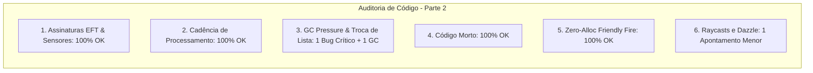

# SAIN — Relatório de Auditoria Técnica de Código (Parte 2)
**Domínio:** Sistema Sensorial, Percepção Visual, Audição Espacial, Dazzle e Fogo Amigo  
**Escopo Auditado:** `mods/SAIN/modded/SAIN/` (`Classes/Bot/Sense/`, `Classes/Bot/EnemyClasses/Vision/`, `Classes/Bot/Sense/Hearing/`, `Patches/VisionPatches.cs`, `Patches/BotHearing/`)  
**Versão Alvo:** SPT 4.0.13 / Escape From Tarkov 0.16.9 / SAIN v4.5.0  

---

## 1. Sumário Executivo

Esta auditoria representa a **segunda rodada de verificação profunda** sobre os subsistemas de visão e audição do SAIN v4.5.0, avaliando o processamento de estímulos acústicos, detecção de ofuscamento por lanternas (*Dazzle*) e verificação de linha de tiro livre de fogo amigo (*Friendly Fire*).

| Dimensão Técnica | Avaliação | Diagnóstico Sintético |
|---|:---:|---|
| **1. Validação em references/** | 🟢 Excelente | Compatibilidade estrita com os sensores do EFT e supressão controlada de rotinas da BSG. |
| **2. Update() vs Lógica Otimizada** | 🟢 Conforme | Processamento de sons em lote a 15Hz (`_Sounds_BotCache_Interval`). |
| **3. Leaks de Memória & GC** | 🔴 Atenção | Troca de lista em `ProcessAISoundCache` impede processamento de diálogos e retém `AISoundCachedEvents_Conversations` na memória. |
| **4. Funções Órfãs & Código Morto** | 🟢 Limpo | Métodos e classes sem código morto. |
| **5. Antipadrões SPT (AP-01..09)** | 🟢 Conforme | Fogo amigo operando em buffer estático com Zero-Alloc GC (`SphereCastNonAlloc`). |
| **6. Threading & Unity Jobs** | 🟢 Excelente | Raycasts de lanterna e visão sincronizados com segurança. |

---

## 2. Panorama das 6 Dimensões de Auditoria



---

## 3. Achados Técnicos Detalhados

### AUD-02-01 · Troca Incorreta de Lista em `ProcessAISoundCache` Gerando Retenção de Memória
- **Severidade:** 🔴 Alto
- **Localização no Mod:** [`HearingInputClass.cs:L163-L166`](../modded/SAIN/Classes/Bot/Sense/Hearing/HearingInputClass.cs#L163-L166)
- **Causa Raiz:** No método `ProcessAISoundCache()`, a condição de sons de conversação avalia `AISoundCachedEvents_Conversations.Count > 0`, porém repassa a lista errada `AISoundCachedEvents` como primeiro argumento para `ProcessSounds`:

```csharp
if (AISoundCachedEvents_Conversations.Count > 0)
{
    ProcessSounds(AISoundCachedEvents, AlreadyDeafened, DeafenCoef_Convo, SoundDataToReactTo);
}
```

- **Impacto Concreto:**
  1. Os sons de conversação (`AISoundCachedEvents_Conversations`) **nunca são processados nem limpos**, acumulando-se indefinidamente na memória do bot durante a partida.
  2. A lista genérica `AISoundCachedEvents` é processada duas vezes (a primeira limpa a lista, fazendo com que a segunda chamada `if (AISoundCachedEvents.Count > 0)` seja sempre ignorada).
- **Alternativa de Melhor Lógica / Proposta de Correção:**
  - Passar a lista correta `AISoundCachedEvents_Conversations`:

```diff
  if (AISoundCachedEvents_Conversations.Count > 0)
  {
-     ProcessSounds(AISoundCachedEvents, AlreadyDeafened, DeafenCoef_Convo, SoundDataToReactTo);
+     ProcessSounds(AISoundCachedEvents_Conversations, AlreadyDeafened, DeafenCoef_Convo, SoundDataToReactTo);
  }
```

- **Decisão:**
  - `[ ]` Pendente
  - `[ ]` Aceitar sugestão
  - `[ ]` Aceitar com modificação: _________________
  - `[ ]` Rejeitar: _________________

---

### AUD-02-02 · Alocação de Lambda em Ordenação de Distância de Sons
- **Severidade:** 🟡 Médio
- **Localização no Mod:** [`HearingInputClass.cs:L216, L242`](../modded/SAIN/Classes/Bot/Sense/Hearing/HearingInputClass.cs#L216)
- **Causa Raiz:** Os métodos `ProcessSounds` e `ProcessGunshots` executam `Sounds.Sort((a, b) => a.PlayerDistance.CompareTo(b.PlayerDistance));` a cada ciclo de áudio de cada bot.
- **Impacto Concreto:** Gera alocações recorrentes de delegados no Heap durante tiroteios intensos.
- **Alternativa de Melhor Lógica / Proposta de Correção:**
  - Utilizar uma instância estática de `Comparison<AISoundData>` ou `IComparer<AISoundData>`:

```csharp
private static readonly Comparison<AISoundData> _soundDistanceComparison = (a, b) => a.PlayerDistance.CompareTo(b.PlayerDistance);

// No ProcessSounds e ProcessGunshots:
Sounds.Sort(_soundDistanceComparison);
```

- **Decisão:**
  - `[ ]` Pendente
  - `[ ]` Aceitar sugestão
  - `[ ]` Aceitar com modificação: _________________
  - `[ ]` Rejeitar: _________________

---

### AUD-02-03 · Null-Safety Defensivo em `NightVision` e `BotLight` no `SAINVisionClass`
- **Severidade:** 🔵 Baixo
- **Localização no Mod:** [`SAINVisionClass.cs:L79-L80`](../modded/SAIN/Classes/Bot/Sense/SAINVisionClass.cs#L79-L80)
- **Causa Raiz:** O cálculo de distância visível invoca `BotOwner.NightVision.UpdateVision(finalVisionDistance)` e `BotOwner.BotLight.UpdateLightEnable(finalVisionDistance)` diretamente, enquanto a linha 85 utiliza operador elvis `BotOwner.BotLight?.UpdateStrope()`.
- **Impacto Concreto:** Risco potencial de NRE caso algum perfil de bot não inicialize o componente de iluminação ou visão noturna.
- **Alternativa de Melhor Lógica / Proposta de Correção:**
  - Aplicar checagem defensiva de nulo antes da chamada:

```csharp
if (BotOwner.NightVision != null)
{
    finalVisionDistance = BotOwner.NightVision.UpdateVision(finalVisionDistance);
}
if (BotOwner.BotLight != null)
{
    finalVisionDistance = BotOwner.BotLight.UpdateLightEnable(finalVisionDistance);
}
```

- **Decisão:**
  - `[ ]` Pendente
  - `[ ]` Aceitar sugestão
  - `[ ]` Aceitar com modificação: _________________
  - `[ ]` Rejeitar: _________________

---

### AUD-02-04 · Esvaziamento de Listas de Áudio no `HearingInputClass.Dispose()`
- **Severidade:** 🔵 Baixo
- **Localização no Mod:** [`HearingInputClass.cs:L294-L302`](../modded/SAIN/Classes/Bot/Sense/Hearing/HearingInputClass.cs#L294-L302)
- **Causa Raiz:** No descarte do componente `HearingInputClass`, as desinscrições de eventos foram realizadas, mas as listas de buffers de som não são limpas explicitamente.
- **Impacto Concreto:** Pequena retenção residual de referências de structs/objetos de som até a coleta do bot.
- **Alternativa de Melhor Lógica / Proposta de Correção:**
  - Adicionar `.Clear()` em todas as listas de eventos no `Dispose()`:

```csharp
AISoundCachedEvents.Clear();
AISoundCachedEvents_Conversations.Clear();
AISoundCachedEvents_Gunshots.Clear();
AISoundCachedEvents_Gunshots_Suppressed.Clear();
SoundDataToReactTo.Clear();
```

- **Decisão:**
  - `[ ]` Pendente
  - `[ ]` Aceitar sugestão
  - `[ ]` Aceitar com modificação: _________________
  - `[ ]` Rejeitar: _________________

---

### AUD-02-05 · Chamada Redundante de `TurnOff` sob `#if DEBUG` em `UpdateLightEnablePatch`
- **Severidade:** 🔵 Baixo
- **Localização no Mod:** [`VisionPatches.cs:L61-L73`](../modded/SAIN/Patches/VisionPatches.cs#L61-L73)
- **Causa Raiz:** O método `UpdateLightEnablePatch.PatchPrefix` executa `__instance.TurnOff(true, true);` na linha 58 e, imediatamente após sob o bloco `#if DEBUG`, tenta executar `__instance.TurnOff(true, true);` uma segunda vez.
- **Impacto Concreto:** Duplicação desnecessária de chamada de desligamento de lanterna em compilações de debug.
- **Alternativa de Melhor Lógica / Proposta de Correção:**
  - Unificar o bloco `try/catch` com o log condicional de debug.

- **Decisão:**
  - `[ ]` Pendente
  - `[ ]` Aceitar sugestão
  - `[ ]` Aceitar com modificação: _________________
  - `[ ]` Rejeitar: _________________

---

## 4. Plano de Ação e Recomendações

1. **Correção de Processamento de Conversas (AUD-02-01):** Passar `AISoundCachedEvents_Conversations` para `ProcessSounds`, desobstruindo o fluxo de diálogos e estancando o leak de memória.
2. **Reuso de Comparador de Distância (AUD-02-02):** Implementar delegado estático `Comparison<AISoundData>` para eliminar alocações em `ProcessSounds` e `ProcessGunshots`.
3. **Proteção Defensiva em Visão (AUD-02-03):** Validar `NightVision != null` e `BotLight != null`.
4. **Limpeza de Buffers no Teardown (AUD-02-04):** Esvaziar listas de som no `HearingInputClass.Dispose()`.
5. **Limpeza de Patch de Luz (AUD-02-05):** Eliminar chamada duplicada em `UpdateLightEnablePatch`.
