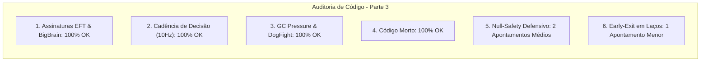

# SAIN — Relatório de Auditoria Técnica de Código (Parte 3)
**Domínio:** Máquinas de Estado, Tomada de Decisão, Camadas BigBrain e Esquadrões  
**Escopo Auditado:** `mods/SAIN/modded/SAIN/` (`Classes/Bot/Decision/`, `Classes/BotManager/BotSquads.cs`, `Classes/BotManager/Squad.cs`, `Classes/Bot/Talk/`, `Layers/Combat/`)  
**Versão Alvo:** SPT 4.0.13 / Escape From Tarkov 0.16.9 / SAIN v4.5.0  

---

## 1. Sumário Executivo

Esta auditoria representa a **segunda rodada de verificação profunda** sobre os subsistemas de inteligência tática do SAIN v4.5.0, inspecionando o motor de decisão (`BotDecisionManager`), sincronização de esquadrão, respostas a gestos vocais e camadas BigBrain.

| Dimensão Técnica | Avaliação | Diagnóstico Sintético |
|---|:---:|---|
| **1. Validação em references/** | 🟢 Excelente | Compatibilidade perfeita com as chamadas de animação e estados de bot do EFT 0.16.9. |
| **2. Update() vs Lógica Otimizada** | 🟢 Conforme | Decisões avaliadas em cadência desacoplada de 10Hz (100ms). |
| **3. Leaks de Memória & GC** | 🟢 Conforme | Buscas em DogFight operando em O(N) sem mutação e teardown de esquadrões ativo. |
| **4. Funções Órfãs & Código Morto** | 🟢 Limpo | Métodos e ações de combate 100% integrados às camadas ativas. |
| **5. Antipadrões SPT (AP-01..09)** | 🟡 Atenção | Acessos diretos a `HandsController` e `GoalEnemy` em rotinas de fala e socorro de esquadrão sem null-check. |
| **6. Threading & Concorrência** | 🟢 Conforme | Decisões executadas de forma determinística na thread principal da Unity. |

---

## 2. Panorama das 6 Dimensões de Auditoria



---

## 3. Achados Técnicos Detalhados

### AUD-03-01 · Ausência de Operador Nulo-Seguro em `Player.HandsController` no `SAINBotTalkClass`
- **Severidade:** 🟡 Médio
- **Localização no Mod:** [`SAINBotTalkClass.cs:L110-L117`](../modded/SAIN/Classes/Bot/Talk/SAINBotTalkClass.cs#L110-L117)
- **Causa Raiz:** No método `checkTalk()`, ao confirmar ordens com gestos de OK ou Não para o líder do esquadrão, as chamadas `Player.HandsController.ShowGesture(...)` são feitas diretamente sem checagem de nulo:

```csharp
if (TalkPack.Value.phraseInfo.Phrase == EPhraseTrigger.Roger)
{
    Player.HandsController.ShowGesture(EInteraction.OkGesture);
}
else
{
    Player.HandsController.ShowGesture(EInteraction.NoGesture);
}
```

- **Impacto Concreto:** Se o bot estiver operando inventário, aplicando torniquete/cirurgia ou trocando de arma no exato milissegundo do comando, `HandsController` pode ser nulo, causando `NullReferenceException` e interrompendo o ciclo de fala.
- **Alternativa de Melhor Lógica / Proposta de Correção:**
  - Utilizar operador nulo-seguro `?.`:

```csharp
if (TalkPack.Value.phraseInfo.Phrase == EPhraseTrigger.Roger)
{
    Player.HandsController?.ShowGesture(EInteraction.OkGesture);
}
else
{
    Player.HandsController?.ShowGesture(EInteraction.NoGesture);
}
```

- **Decisão:**
  - `[ ]` Pendente
  - `[ ]` Aceitar sugestão
  - `[ ]` Aceitar com modificação: _________________
  - `[ ]` Rejeitar: _________________

---

### AUD-03-02 · Ausência de Null-Check Defensivo em `member.GoalEnemy` no `shallHelp`
- **Severidade:** 🟡 Médio
- **Localização no Mod:** [`SquadDecisionClass.cs:L228-L240`](../modded/SAIN/Classes/Bot/Decision/SquadDecisionClass.cs#L228-L240)
- **Causa Raiz:** O método `shallHelp(BotComponent member)` assume que `member.GoalEnemy` está sempre instanciado (`float distance = member.GoalEnemy.Path.PathLength;`).
- **Impacto Concreto:** Caso o inimigo de um aliado tenha sido abatido no frame de decisão anterior e sua referência tenha sido limpa, o acesso direto a `member.GoalEnemy.Path` lança NRE.
- **Alternativa de Melhor Lógica / Proposta de Correção:**
  - Adicionar guarda defensiva no topo do método:

```csharp
private bool shallHelp(BotComponent member)
{
    var goalEnemy = member?.GoalEnemy;
    if (goalEnemy == null)
    {
        return false;
    }

    float distance = goalEnemy.Path.PathLength;
    bool visible = goalEnemy.IsVisible;

    if (Bot.Decision.CurrentSquadDecision == ESquadDecision.Help && goalEnemy.Seen)
    {
        return distance < SquadDecision_EndHelpFriendDist
            && goalEnemy.TimeSinceSeen < SquadDecision_EndHelp_FriendsEnemySeenRecentTime;
    }
    return distance < SquadDecision_StartHelpFriendDist && visible;
}
```

- **Decisão:**
  - `[ ]` Pendente
  - `[ ]` Aceitar sugestão
  - `[ ]` Aceitar com modificação: _________________
  - `[ ]` Rejeitar: _________________

---

### AUD-03-03 · Early-Exit em Laço de Contato com Atiradores não-Zumbis
- **Severidade:** 🟢 Menor
- **Localização no Mod:** [`BotDecisionManager.cs:L137-L147`](../modded/SAIN/Classes/Bot/Decision/BotDecisionManager.cs#L137-L147)
- **Causa Raiz:** Na checagem `if (enemy != null && enemy.IsZombie)`, o laço `foreach (var knownEnemy in Bot.EnemyController.KnownEnemies)` percorre todos os inimigos conhecidos mesmo após já ter encontrado um atirador ativo.
- **Impacto Concreto:** Itera desnecessariamente sobre toda a lista de inimigos.
- **Alternativa de Melhor Lógica / Proposta de Correção:**
  - Adicionar `break;` imediatamente após definir `hasShooterContact = true;`.

- **Decisão:**
  - `[ ]` Pendente
  - `[ ]` Aceitar sugestão
  - `[ ]` Aceitar com modificação: _________________
  - `[ ]` Rejeitar: _________________

---

## 4. Plano de Ação e Recomendações

1. **Proteção em Gestos Vocais (AUD-03-01):** Aplicar `Player.HandsController?.ShowGesture(...)` em `SAINBotTalkClass`.
2. **Robustez em Decisões de Socorro (AUD-03-02):** Validar nulidade de `member?.GoalEnemy` em `SquadDecisionClass.shallHelp`.
3. **Micro-Otimização de Laço (AUD-03-03):** Incluir `break` no laço de detecção de atiradores em `BotDecisionManager`.
