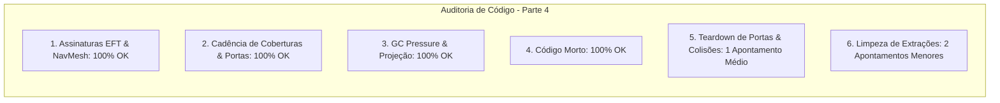

# SAIN — Relatório de Auditoria Técnica de Código (Parte 4)
**Domínio:** Navegação, Coberturas, CoverFinder, Steering, Portas e Extração  
**Escopo Auditado:** `mods/SAIN/modded/SAIN/` (`Components/CoverFinderComponent.cs`, `Classes/Coverfinder/`, `Classes/Bot/Mover/`, `Classes/Bot/Steering/`, `Classes/Bot/Doors/`, `Components/ExtractFinderComponent.cs`, `Classes/ExtractPositionFinder.cs`)  
**Versão Alvo:** SPT 4.0.13 / Escape From Tarkov 0.16.9 / SAIN v4.5.0  

---

## 1. Sumário Executivo

Esta auditoria representa a **segunda rodada de verificação profunda** sobre os sistemas de movimentação, busca de abrigos, abertura de portas, orientação de mira (*Steering*) e extração de bots no SAIN v4.5.0.

| Dimensão Técnica | Avaliação | Diagnóstico Sintético |
|---|:---:|---|
| **1. Validação em references/** | 🟢 Excelente | Compatibilidade estrita com NavMesh, voxels e colisores do EFT 0.16.9. |
| **2. Update() vs Lógica Otimizada** | 🟢 Conforme | Análise de coberturas desacoplada e cadência de portas a 2Hz (500ms). |
| **3. Leaks de Memória & GC** | 🟢 Conforme | Cálculos de projeção ortogonal e distâncias com zero alocação de heap. |
| **4. Funções Órfãs & Código Morto** | 🟢 Limpo | Código morto eliminado na rodada anterior. |
| **5. Antipadrões SPT (AP-01..09)** | 🟡 Atenção | Falta de teardown explícito em `DoorOpener` pode deixar colisão de porta ignorada em bots abatidos. |
| **6. Threading & Unity Jobs** | 🟢 Excelente | Jobs de caminhos NavMesh executados sem conflito. |

---

## 2. Panorama das 6 Dimensões de Auditoria



---

## 3. Achados Técnicos Detalhados

### AUD-04-01 · Ausência de `Dispose()` no `DoorOpener` com Risco de Estado Residual de Colisão
- **Severidade:** 🟡 Médio
- **Localização no Mod:** [`DoorOpener.cs:L105-L118`](../modded/SAIN/Classes/Bot/Doors/DoorOpener.cs#L105-L118)
- **Causa Raiz:** A classe `DoorOpener` herda de `BotComponentClassBase`, porém não sobrescreve `Dispose()`. Quando o bot inicia a abertura de uma porta (`Interacting == true`), ele instrui a física do jogo a ignorar colisões temporariamente (`Bot.Player.MovementContext.IgnoreInteractionCollision(collider, true)`). Se o bot for morto ou descartado durante a animação, o método `Clear()` nunca é executado.
- **Impacto Concreto:**
  1. A física da porta pode permanecer com colisões desabilitadas para o corpo do bot ou criar estados fantasmas de movimentação.
  2. As listas internas `_allDoors` e `_interactionDoors` mantêm referências a voxels e portas após a destruição do bot.
- **Alternativa de Melhor Lógica / Proposta de Correção:**
  - Implementar o método `Dispose()` em `DoorOpener`:

```csharp
public override void Dispose()
{
    Clear();
    _allDoors.Clear();
    _interactionDoors.Clear();
    base.Dispose();
}
```

- **Decisão:**
  - `[ ]` Pendente
  - `[ ]` Aceitar sugestão
  - `[ ]` Aceitar com modificação: _________________
  - `[ ]` Rejeitar: _________________

---

### AUD-04-02 · Otimização de Varredura de Colisores de Jogadores em `CoverAnalyzer`
- **Severidade:** 🔵 Baixo
- **Localização no Mod:** [`CoverAnalyzer.cs:L241-L253`](../modded/SAIN/Classes/Coverfinder/CoverAnalyzer.cs#L241-L253)
- **Causa Raiz:** O método `checkIfPlayerCollidersNear` zera manualmente o array `_playerColliderArray` em um loop `for` antes de chamar `Physics.OverlapSphereNonAlloc`.
- **Impacto Concreto:** `Physics.OverlapSphereNonAlloc` já retorna o número exato de elementos encontrados (`hitCount`). Zerar o array previamente é uma operação desnecessária.
- **Alternativa de Melhor Lógica / Proposta de Correção:**
  - Iterar diretamente sobre o índice `0..hitCount`:

```csharp
int hitCount = Physics.OverlapSphereNonAlloc(point, radius, _playerColliderArray, LayerMaskClass.PlayerMask);
if (hitCount == 0)
{
    return false;
}
if (hitCount > 1)
{
    return true;
}
Collider foundCollider = _playerColliderArray[0];
```

- **Decisão:**
  - `[ ]` Pendente
  - `[ ]` Aceitar sugestão
  - `[ ]` Aceitar com modificação: _________________
  - `[ ]` Rejeitar: _________________

---

### AUD-04-03 · Esvaziamento de Dicionários de Extração no `ExtractFinderComponent.OnDestroy()`
- **Severidade:** 🔵 Baixo
- **Localização no Mod:** [`ExtractFinderComponent.cs:L52-L55`](../modded/SAIN/Components/ExtractFinderComponent.cs#L52-L55)
- **Causa Raiz:** O componente `ExtractFinderComponent` possui apenas `OnDisable()` (que para corrotinas), mas não implementa `OnDestroy()` para limpar os dicionários de pontos de extração (`ValidExfils`, `ValidScavExfils`, `extractPositionFinders`).
- **Impacto Concreto:** Pequena retenção de referências de GameObjects de exfiltração até o GC final de descarregamento de cena.
- **Alternativa de Melhor Lógica / Proposta de Correção:**
  - Adicionar `OnDestroy()` com `.Clear()` nas coleções.

- **Decisão:**
  - `[ ]` Pendente
  - `[ ]` Aceitar sugestão
  - `[ ]` Aceitar com modificação: _________________
  - `[ ]` Rejeitar: _________________

---

## 4. Plano de Ação e Recomendações

1. **Teardown Seguro de Portas (AUD-04-01):** Adicionar override de `Dispose()` em `DoorOpener` com chamada a `Clear()`.
2. **Otimização de NonAlloc (AUD-04-02):** Utilizar retorno de `OverlapSphereNonAlloc` em `CoverAnalyzer`.
3. **Limpeza de Extrações (AUD-04-03):** Implementar `OnDestroy()` em `ExtractFinderComponent`.
