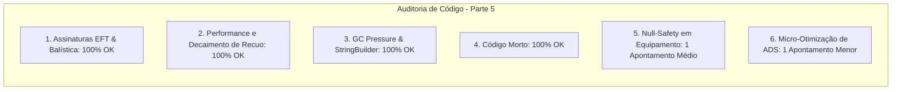

# SAIN — Relatório de Auditoria Técnica de Código (Parte 5)
**Domínio:** Balística, Recoil, Mira Preditiva, Disparo e Patches de Tiro  
**Escopo Auditado:** `mods/SAIN/modded/SAIN/` (`Classes/Bot/WeaponFunction/`, `Patches/Shoot/`)  
**Versão Alvo:** SPT 4.0.13 / Escape From Tarkov 0.16.9 / SAIN v4.5.0  

---

## 1. Sumário Executivo

Esta auditoria representa a **segunda rodada de verificação profunda** sobre os sistemas balísticos do SAIN v4.5.0, inspecionando o amortecimento de recuo procedural, mira preditiva com compensação de velocidade do alvo, transições de ADS (*Aim Down Sights*) e patches de combate.

| Dimensão Técnica | Avaliação | Diagnóstico Sintético |
|---|:---:|---|
| **1. Validação em references/** | 🟢 Excelente | Métodos e propriedades de armas do EFT 0.16.9 (`BulletSpeed`, `RecoilTotal`) integrados sem reflection. |
| **2. Update() vs Lógica Otimizada** | 🟢 Conforme | Cálculo de mira e curvas balísticas executados sob demanda com log condicional. |
| **3. Leaks de Memória & GC** | 🟢 Conforme | Eliminação de alocações em strings de log e interpolação inercial via `PositionSmoother`. |
| **4. Funções Órfãs & Código Morto** | 🟢 Limpo | Métodos inativos removidos. |
| **5. Antipadrões SPT (AP-01..09)** | 🟡 Atenção | Acesso direto a `CurrentWeaponInfo.BulletSpeed` no `AimClass` sem fallback defensivo. |
| **6. Threading & Concorrência** | 🟢 Conforme | Balística determinística operando na thread de simulação física. |

---

## 2. Panorama das 6 Dimensões de Auditoria



---

## 3. Achados Técnicos Detalhados

### AUD-05-01 · Ausência de Fallback Defensivo em `CurrentWeaponInfo.BulletSpeed` no `AimClass`
- **Severidade:** 🟡 Médio
- **Localização no Mod:** [`AimClass.cs:L68-L73`](../modded/SAIN/Classes/Bot/WeaponFunction/AimClass.cs#L68-L73)
- **Causa Raiz:** No método `AimAtTarget(...)`, o cálculo de offset balístico acessa `bot.PlayerComponent.Equipment.CurrentWeaponInfo.BulletSpeed` diretamente sem operador nulo-seguro:

```csharp
Vector3 ballisticOffset = PlayerMovementController.Util.CalculateBallisticOffset(
    firePort,
    shootPoint,
    enemy.EnemyPlayer.Velocity,
    bot.PlayerComponent.Equipment.CurrentWeaponInfo.BulletSpeed
);
```

- **Impacto Concreto:** Caso o bot esteja no meio da troca de arma secundária/pistola ou o componente de equipamento ainda não tenha concluído o `DelayInit()`, `CurrentWeaponInfo` é nulo, provocando `NullReferenceException` e interrompendo o ciclo de mira.
- **Alternativa de Melhor Lógica / Proposta de Correção:**
  - Utilizar operador nulo-seguro `?.` com velocidade padrão de fallback (ex.: 500 m/s):

```csharp
float bulletSpeed = bot.PlayerComponent.Equipment?.CurrentWeaponInfo?.BulletSpeed ?? 500f;
Vector3 ballisticOffset = PlayerMovementController.Util.CalculateBallisticOffset(
    firePort,
    shootPoint,
    enemy.EnemyPlayer.Velocity,
    bulletSpeed
);
```

- **Decisão:**
  - `[ ]` Pendente
  - `[ ]` Aceitar sugestão
  - `[ ]` Aceitar com modificação: _________________
  - `[ ]` Rejeitar: _________________

---

### AUD-05-02 · Cálculo Incondicional de Decisão no `AimDownSightsController`
- **Severidade:** 🔵 Baixo
- **Localização no Mod:** [`AimDownSightsController.cs:L71`](../modded/SAIN/Classes/Bot/WeaponFunction/AimDownSightsController.cs#L71)
- **Causa Raiz:** O método `ShallAimDownSights` calcula `float timeSinceChangeDecision = Bot.Decision.TimeSinceChangeDecision;` no início de cada execução, mas a variável é consumida unicamente dentro do bloco `EAimDownSightsStatus.HoldInCover`.
- **Impacto Concreto:** Executa leitura de timestamp e subtração de ponto flutuante em todos os outros 10 estados de mira onde ela não é necessária.
- **Alternativa de Melhor Lógica / Proposta de Correção:**
  - Mover a leitura de `timeSinceChangeDecision` para dentro do case `EAimDownSightsStatus.HoldInCover`.

- **Decisão:**
  - `[ ]` Pendente
  - `[ ]` Aceitar sugestão
  - `[ ]` Aceitar com modificação: _________________
  - `[ ]` Rejeitar: _________________

---

## 4. Plano de Ação e Recomendações

1. **Fallback Balístico Seguro (AUD-05-01):** Proteger `CurrentWeaponInfo?.BulletSpeed ?? 500f` no `AimClass`.
2. **Otimização de Escopo em ADS (AUD-05-02):** Restringir cálculo de tempo de decisão ao caso `HoldInCover`.
