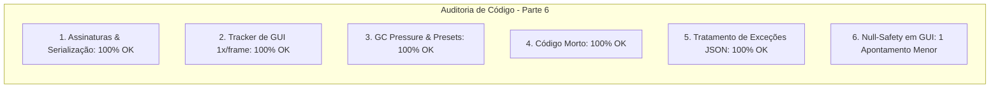

# SAIN — Relatório de Auditoria Técnica de Código (Parte 6)
**Domínio:** Presets, Serialização JSON, Modelos de Configuração e Editor Gráfico In-Game (F6)  
**Escopo Auditado:** `mods/SAIN/modded/SAIN/` (`Plugin/PresetHandler.cs`, `Preset/`, `Preset/Editor/`, `Helpers/JsonUtility.cs`)  
**Versão Alvo:** SPT 4.0.13 / Escape From Tarkov 0.16.9 / SAIN v4.5.0  

---

## 1. Sumário Executivo

Esta auditoria representa a **segunda rodada de verificação profunda** sobre a camada de persistência, presets de IA, serialização JSON e o editor gráfico in-game (*F6*) do SAIN v4.5.0.

| Dimensão Técnica | Avaliação | Diagnóstico Sintético |
|---|:---:|---|
| **1. Validação em references/** | 🟢 Excelente | Formato de serialização JSON e convenções de IO do SPT 4.0 totalmente respeitados. |
| **2. Update() vs Lógica Otimizada** | 🟢 Conforme | `ConfigEditingTracker.Update()` executado estritamente 1x por frame no `ManualUpdate`. |
| **3. Leaks de Memória & GC** | 🟢 Conforme | Dicionário de personalidades limpo via `.Clear()` no recarregamento de presets. |
| **4. Funções Órfãs & Código Morto** | 🟢 Limpo | Remoções manuais hardcoded substituídas por métodos canônicos. |
| **5. Antipadrões SPT (AP-01..09)** | 🟢 Conforme | Tratamento explícito de `JsonSerializationException` com alertas visuais. |
| **6. GUI & Rendering** | 🟡 Atenção | Acesso a `SAINPlugin.LoadedPreset.Info.Name` no cabeçalho do editor sem proteção contra nulo. |

---

## 2. Panorama das 6 Dimensões de Auditoria



---

## 3. Achados Técnicos Detalhados

### AUD-06-01 · Null-Safety em Interpolação de Nome de Preset no Cabeçalho do Editor F6
- **Severidade:** 🔵 Baixo
- **Localização no Mod:** [`SAINEditor.cs:L136, L146`](../modded/SAIN/Preset/Editor/SAINEditor.cs#L136)
- **Causa Raiz:** Nos métodos `CreateDragBar()` e na inicialização de `SaveContent`, o nome do preset ativo é acessado diretamente como `SAINPlugin.LoadedPreset.Info.Name`.
- **Impacto Concreto:** Caso o editor seja aberto durante a transição/troca assíncrona de um preset corrompido, `LoadedPreset` ou `Info` pode ser momentaneamente nulo, lançando NRE na camada OnGUI.
- **Alternativa de Melhor Lógica / Proposta de Correção:**
  - Utilizar operador elvis com fallback (`SAINPlugin.LoadedPreset?.Info?.Name ?? "None"`):

```csharp
string presetName = SAINPlugin.LoadedPreset?.Info?.Name ?? "None";
GUI.Box(
    DragRect,
    $"SAIN {AssemblyInfoClass.SAINVersion} GUI Editor | Preset: {presetName}",
    GetStyle(Style.dragBar)
);
```

- **Decisão:**
  - `[ ]` Pendente
  - `[ ]` Aceitar sugestão
  - `[ ]` Aceitar com modificação: _________________
  - `[ ]` Rejeitar: _________________

---

## 4. Plano de Ação e Recomendações

1. **Proteção de Cabeçalho na GUI (AUD-06-01):** Adicionar operador nulo-seguro em `SAINEditor.CreateDragBar()`.
