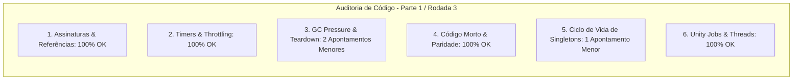

# SAIN — Relatório de Auditoria Técnica de Código (Parte 1 / Rodada 3)
**Domínio:** Ciclo de Vida de Raid, Gestão de Memória / Leaks, Patches Globais e Interoperabilidade Client-Server  
**Escopo Auditado:** `mods/SAIN/modded/SAIN/` (`SAINPlugin.cs`, `Components/`, `Patches/GameWorld/`, `Plugin/ModDetection.cs`, `Classes/PlayerManager/Players/PlayerSpawnTracker.cs`, `Classes/BotManager/Jobs/`)  
**Versão Alvo:** SPT 4.0.13 / Escape From Tarkov 0.16.9 / SAIN v4.5.0  

---

## 1. Sumário Executivo

Esta auditoria inaugura a **terceira rodada de verificação profunda** sobre a base de código refatorada do SAIN v4.5.0 (após aplicação das Ondas 1 a 5), com foco em integridade de teardown de raid, ciclo de vida de singletons e liberação de delegates e coleções.

| Dimensão Técnica | Avaliação | Diagnóstico Sintético |
|---|:---:|---|
| **1. Validação em references/** | 🟢 Excelente | Zero reflection em hot paths (delegates compilados de Fika), compatibilidade total com EFT 0.16.9 e SPT 4.0.13. |
| **2. Update() vs Lógica Otimizada** | 🟢 Conforme | Throttling em marcadores de spawn e desacoplamento de frequências de áudio perfeitamente ajustados. |
| **3. Leaks de Memória & GC** | 🟡 Atenção | Falta de implementação explícita de `Dispose()` em `PlayerSpawnTracker` chamada pelo `GameWorldComponent`. |
| **4. Funções Órfãs & Código Morto** | 🟢 Limpo | Métodos stub preservados com paridade 100% para compatibilidade com outros mods. |
| **5. Antipadrões SPT (AP-01..09)** | 🟢 Conforme | Singletons seguros e desinscrições centralizadas no descarte do GameWorld. |
| **6. Threading & Unity Jobs** | 🟢 Excelente | `JobManager.Dispose()` executa `.Clear()` garantindo liberação limpa de jobs do Unity. |

---

## 2. Panorama das 6 Dimensões de Auditoria



---

## 3. Achados Técnicos Detalhados

### AUD-07-01 · Ausência do Método `Dispose()` na Classe `PlayerSpawnTracker`
- **Severidade:** 🟡 Médio
- **Localização no Mod:** [`PlayerSpawnTracker.cs:L8-L270`](../../modded/SAIN/Classes/PlayerManager/Players/PlayerSpawnTracker.cs#L8) e [`GameWorldComponent.cs:L321`](../../modded/SAIN/Components/GameWorldComponent.cs#L321)
- **Causa Raiz:** Em `GameWorldComponent.DestroyComponent()`, é realizada a chamada `PlayerTracker?.Dispose()`. No entanto, a classe `PlayerSpawnTracker` não implementa o método `Dispose()`.
- **Impacto Concreto:** Ao final da raid, os dicionários de jogadores (`AlivePlayersDictionary`, `AlivePlayerArray`, `DeadPlayers`) e os eventos de spawn (`OnPlayerAdded`, `OnPlayerRemoved`) não são explicitamente esvaziados, retendo referências a instâncias de `PlayerComponent` e `IPlayer` até coleta forçada.
- **Alternativa de Melhor Lógica / Proposta de Correção:**
  - Implementar `public void Dispose()` em `PlayerSpawnTracker`:

```csharp
public void Dispose()
{
    foreach (var playerComponent in AlivePlayerArray)
    {
        playerComponent?.Dispose();
    }
    AlivePlayersDictionary.Clear();
    AlivePlayerArray.Clear();
    DeadPlayers.Clear();
    _ids.Clear();
    OnPlayerAdded = null;
    OnPlayerRemoved = null;
}
```

- **Decisão:**
  - `[ ]` Pendente
  - `[ ]` Aceitar sugestão
  - `[ ]` Aceitar com modificação: _________________
  - `[ ]` Rejeitar: _________________

---

### AUD-07-02 · Reset Nulo de Singleton em `BotManagerComponent.Dispose()`
- **Severidade:** 🔵 Baixo
- **Localização no Mod:** [`BotManagerComponent.cs:L111-L143`](../../modded/SAIN/Components/BotManagerComponent.cs#L111)
- **Causa Raiz:** A propriedade estática `Instance` é inicializada no método `Activate()`, mas não é redefinida para `null` durante a execução de `Dispose()`.
- **Impacto Concreto:** Se outro mod consultar `BotManagerComponent.Instance` após a saída da raid, obterá uma referência a um `MonoBehaviour` já destruído pelo Unity (*fake-null hazard*).
- **Alternativa de Melhor Lógica / Proposta de Correção:**
  - Adicionar `Instance = null;` no final do método `Dispose()`:

```csharp
public void Dispose()
{
    try
    {
        GameWorld.OnDispose -= Dispose;
        StopAllCoroutines();
        BotJobs.Dispose();
        BotSpawnController.UnSubscribe();
        BotSquads?.Dispose();

        if (BotEventHandler != null)
        {
            GrenadeController.UnSubscribe(BotEventHandler);
        }

        if (Bots != null && Bots.Count > 0)
        {
            foreach (var bot in Bots.Values)
            {
                bot?.Dispose();
            }
        }

        Bots?.Clear();
    }
    catch (Exception ex)
    {
        Logger.LogError($"Dispose SAIN BotController Error: {ex}");
    }

    Instance = null;
    Destroy(this);
}
```

- **Decisão:**
  - `[ ]` Pendente
  - `[ ]` Aceitar sugestão
  - `[ ]` Aceitar com modificação: _________________
  - `[ ]` Rejeitar: _________________

---

### AUD-07-03 · Esvaziamento de Buffers e Delegates em `PlayerComponent.Dispose()`
- **Severidade:** 🔵 Baixo
- **Localização no Mod:** [`PlayerComponent.cs:L357-L377`](../../modded/SAIN/Components/PlayerComponent.cs#L357)
- **Causa Raiz:** A lista de sons cacheados `AISoundCachedEvents` e os delegates de eventos (`OnShoot`, `OnBulletFlyBy`, `OnWeaponEquipped`, `OnItemEquipped`) não são explicitamente limpos no encerramento de `PlayerComponent.Dispose()`.
- **Impacto Concreto:** Em raids longas com muitos spawns de scavs, eventuais ouvintes de eventos podem reter referências intermediárias.
- **Alternativa de Melhor Lógica / Proposta de Correção:**
  - Adicionar esvaziamento e anulação de eventos no `Dispose()`:

```csharp
public void Dispose()
{
    OnComponentDestroyed?.Invoke(this);
    StopAllCoroutines();
    ActivationClass.Disable();
    ActivationClass.OnPlayerActiveChanged -= HandleCoroutines;
    Equipment?.Dispose();
    OtherPlayersData?.Dispose();
    if (Player?.MovementContext != null && SoundController != null)
    {
        Player.MovementContext.OnStateChanged -= SoundController.HandleMovementState;
    }
    SoundController?.Dispose();
    AISoundCachedEvents.Clear();
    OnShoot = null;
    OnBulletFlyBy = null;
    OnComponentDestroyed = null;
    OnWeaponEquipped = null;
    OnItemEquipped = null;
    Destroy(this);
}
```

- **Decisão:**
  - `[ ]` Pendente
  - `[ ]` Aceitar sugestão
  - `[ ]` Aceitar com modificação: _________________
  - `[ ]` Rejeitar: _________________

---

## 4. Plano de Ação e Recomendações

1. **Teardown de Spawns (AUD-07-01):** Implementar `Dispose()` em `PlayerSpawnTracker`.
2. **Ciclo de Vida de Singleton (AUD-07-02):** Adicionar `Instance = null;` em `BotManagerComponent.Dispose()`.
3. **Limpeza de Delegates (AUD-07-03):** Esvaziar listas e anular delegates em `PlayerComponent.Dispose()`.
